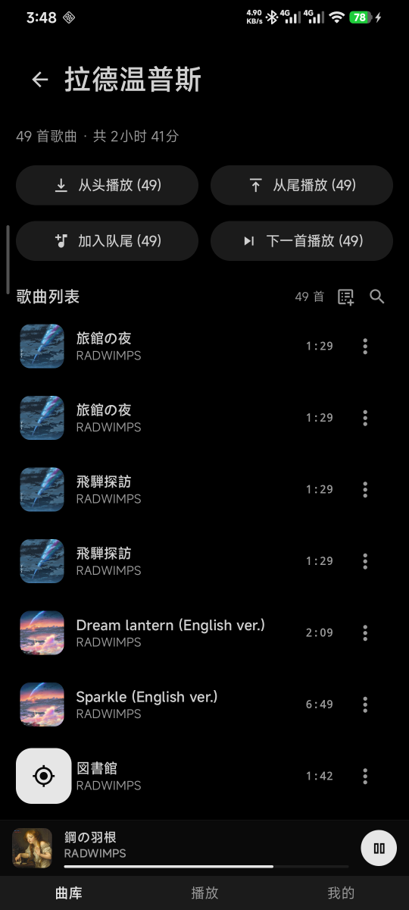
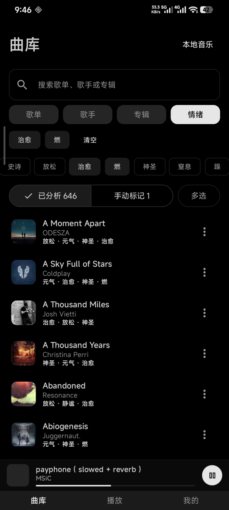
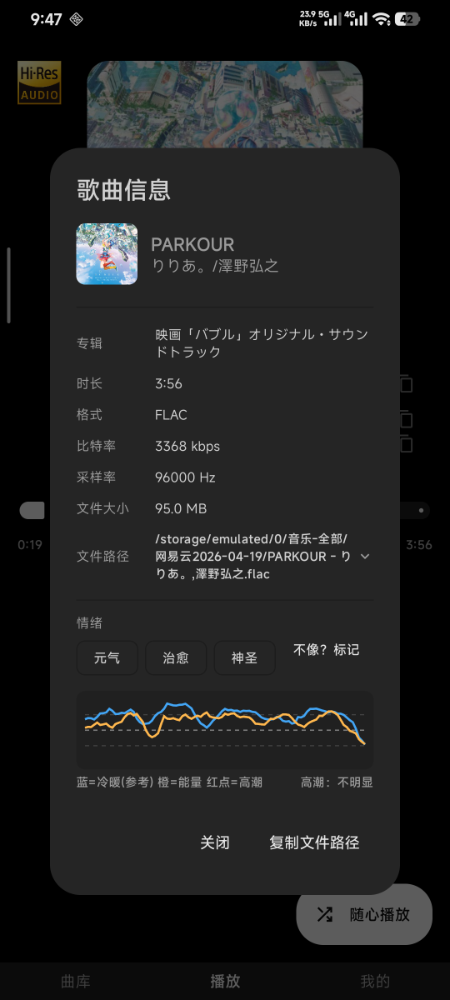
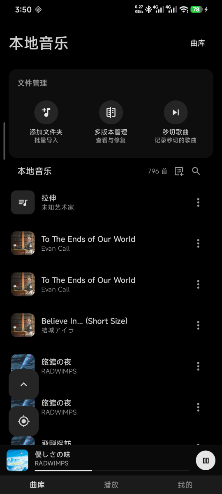
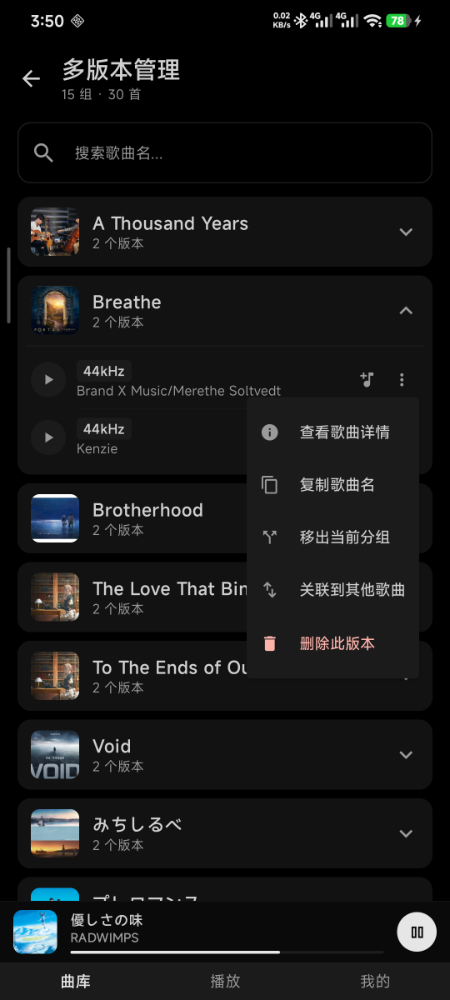
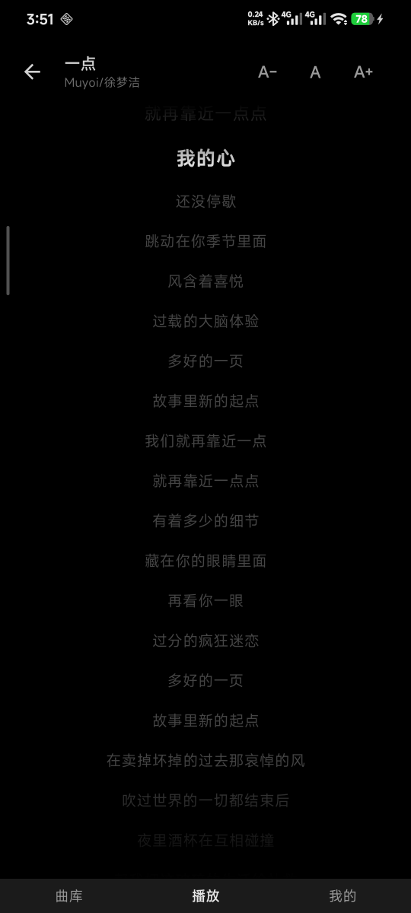
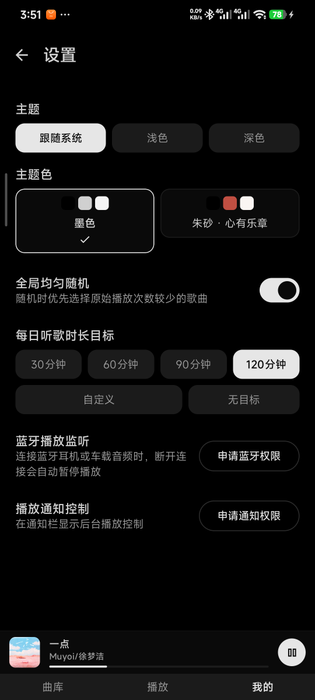
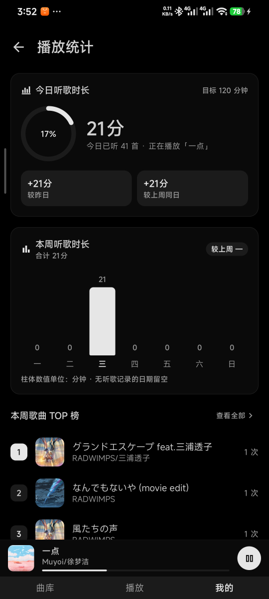
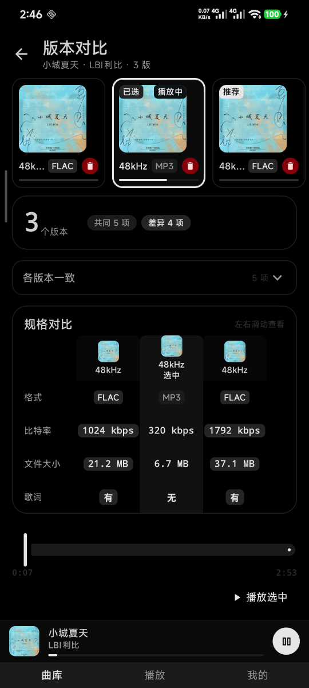
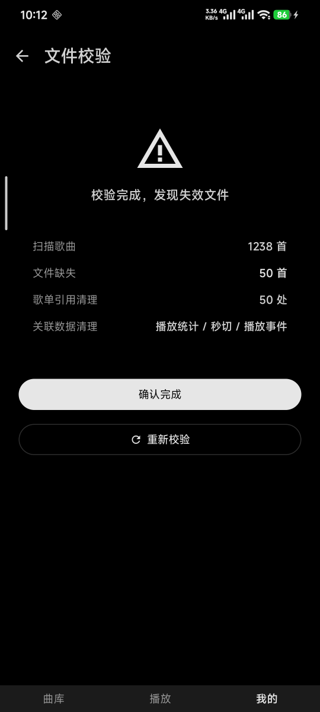

# Melody in Heart

> 一款纯本地、无广告的 Android 音乐播放器
> 基于 **Jetpack Compose + Material3 + Media3 + Hilt** 构建
---

## 功能简介

### 播放与队列

- **多种播放模式**：顺序、倒序、随机，一键循环切换，均支持首尾循环。
- **完整播放队列**：支持「加入播放队列」「下一首播放」、按队列项移除；歌单可整单追加到队尾（允许重复歌曲）。
- **随心播放**：一键生成随机队列开始播放。
- **无限随机播放**：保留当前播放队列，接近队尾时自动补充新歌；全库覆盖后循环重复，播放永不间断。
- **全局均匀随机**：随机选歌时优先选择原始播放次数较少的歌曲，减少反复听到热门歌的概率。
- **关联播放**：将播放队列设置为当前歌曲关联歌手、专辑的歌曲队列。
- **多渠道一致控制**：播放页、通知栏、锁屏、蓝牙耳机按键的上一首 / 下一首行为完全一致。
- **窗口化队列**：数百首大曲库下，播放器只持有当前歌曲附近的轻量窗口，UI 仍展示完整队列。
- **播放状态持久化**：进程被杀后自动恢复当前歌曲、播放进度、队列、播放模式与无限随机状态。

### 曲库与歌单

- **本地音乐导入**：扫描本地音乐文件，或通过系统文件夹选择器（SAF）批量添加。
- **歌单管理**：创建、重命名、删除歌单；整单「下一首播放」或「加入队尾」。
- **艺术家 / 专辑浏览**：按艺术家、专辑整理曲库，支持批量播放与加入歌单。
- **多版本管理**：自动识别同名歌曲的不同采样率版本（如 44.1kHz / 96kHz），分组关联后可一键切换版本。
- **歌曲信息**：查看格式、比特率、采样率、文件大小与文件路径。

### 歌词

- **歌词展示**：解析本地歌词文件，跟随播放进度同步滚动高亮。
- **点击跳转**：点击带时间戳的歌词行即可跳转到对应播放位置。
- **字号调整**：可调整歌词字号大小。

### 播放统计

- **时长统计**：今日 / 本周听歌时长、历史柱状图，以及较昨日、较上周同日的对比。
- **听歌目标**：自定义每日听歌时长目标（预设 30 / 60 / 90 / 120 分钟或自由输入）。
- **歌曲 TOP 榜**：按周 / 按月查看播放次数排行。
- **秒切歌曲**：自动记录播放没几秒就切走的歌曲，播放次数加 1 后自动移出列表。

### 个性化与体验

- **定时关闭**：自定义时长或「播完最后一曲」，到点自动暂停。
- **主题**：跟随系统 / 浅色 / 深色三种模式，搭配单色或朱红主题色。
- **蓝牙播放监听**：连接蓝牙耳机或车载音频时，断开连接自动暂停播放。
- **通知栏播放控制**：后台播放时在通知栏展示媒体控制（需授予通知权限）。

### 隐私与性能

- **纯本地运行**：歌曲与数据全部保存在本机，无广告、无网络依赖、无账号体系。
- **数据安全**：播放记录、队列等数据仅存于本地（Room + DataStore），应用不收集任何个人信息。
- **启动优化**：内置 Baseline Profile，显著加快冷启动与列表滚动。
- **轻量体积**：release 仅打包 arm64-v8a，APK 约 7 MB。

---

## 实际使用截图

|                                          |                                          |                                          |                                          |
|:----------------------------------------:|:----------------------------------------:|:----------------------------------------:|:----------------------------------------:|
|   |   |   |   |
|   |   |   |   |
|   |  |  |  |
|  |  |  |                                          |

---

## 核心文档

全部文档已归入 `docs/` 目录，入口见 [文档索引](docs/README.md)：

- [播放队列架构](docs/architecture/PLAYBACK_QUEUE_ARCHITECTURE.md)：播放队列、窗口化同步和系统控制一致性说明
- [播放状态机](docs/architecture/PLAYBACK_STATE_MACHINE.md)：Media3 与 UI/持久化状态机说明
- [产品化重构审计](docs/refactor/PRODUCT_REFACTOR_AUDIT.md)：本轮产品化重构完成度与剩余风险清单

---

*Kotlin · Jetpack Compose · ExoPlayer · MVVM · 离线优先 · 无广告 · 无网络依赖*
