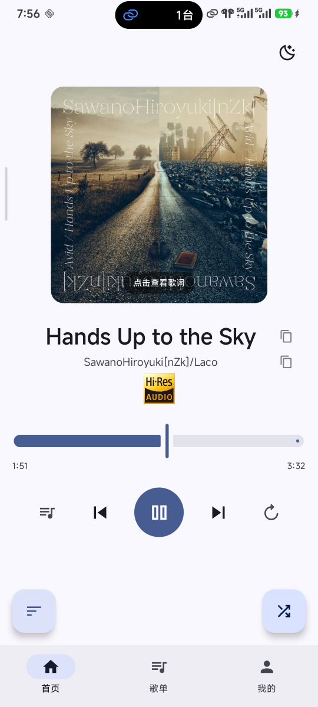
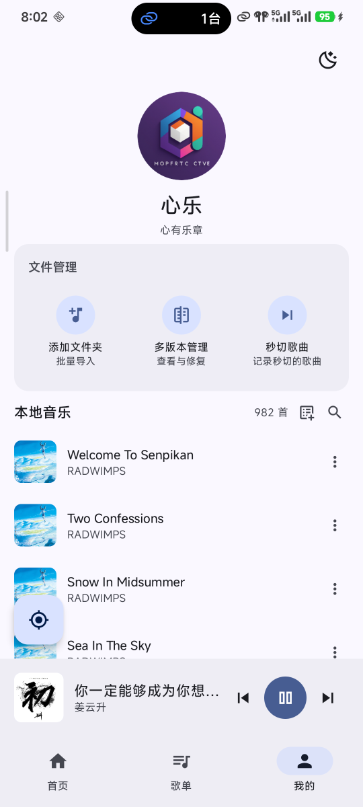
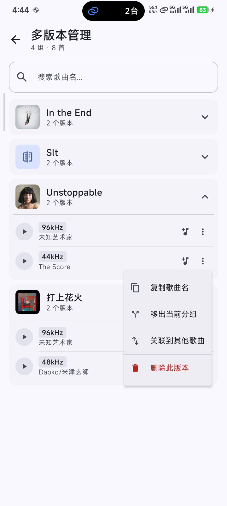
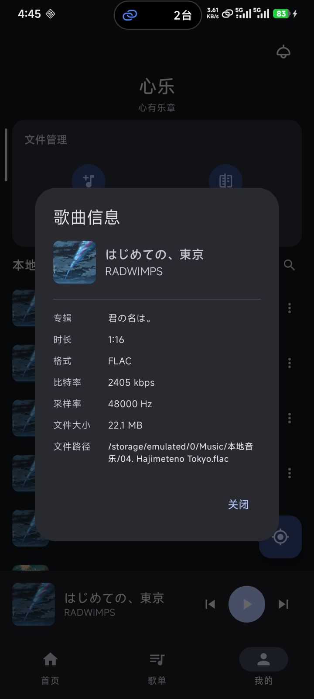
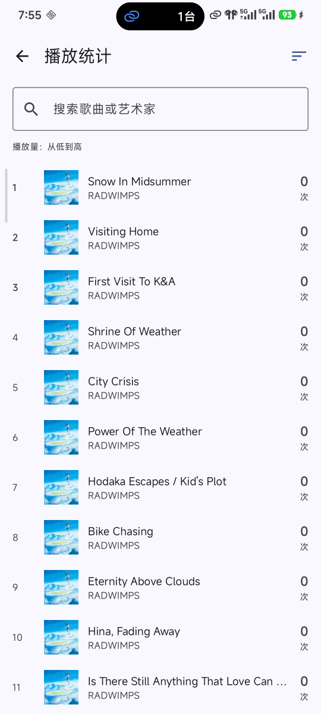

# Melody in Heart

> 一款纯本地、无广告的 Android 音乐播放器  
> 基于 **Jetpack Compose + Material3 + Media3 + Hilt** 构建的多模块产品型应用

⚠️ 该项目使用 [WorkBuddy](https://www.codebuddy.cn/work/) 辅助开发！
---

## 当前状态

- 已完成产品化重构主线：多模块拆分、Hilt 装配、Navigation Compose 路由化、Room/DataStore 持久化升级、播放器窗口化队列、release/benchmark 基线和架构校验任务。
- 当前代码基线适合继续长期维护，但仍保留分阶段迁移痕迹：部分 legacy SharedPreferences/JSON 读取仍用于历史数据恢复，`MusicRepository` 内部也还可以继续拆薄。
- 功能层面已保持本地播放、歌单、歌词、播放恢复、秒切、统计、多版本管理可用；系统媒体键、权限拒绝提示、宏基准指标还需要继续做真机或模拟器验收。

## 功能概览

### 🎵 播放控制
- 播放 / 暂停 / 上一首 / 下一首
- 可拖动进度条，显示当前时间和总时长；播放中默认约 `500ms` 刷新 UI 进度，拖动时使用本地 UI 状态即时反馈
- **播放队列**：任意歌曲来源均可构建独立队列，UI 保留完整业务队列，Media3 侧使用窗口化队列同步，详见 [PLAYBACK_QUEUE_ARCHITECTURE.md](PLAYBACK_QUEUE_ARCHITECTURE.md)
- **三种播放模式**：顺序 / 倒序 / 随机（首页切换按钮）
- **上下文播放**：从歌单点击 → 以歌单为队列；从本地音乐点击 → 以全库为队列
- **批量入队**：歌单详情页支持整单加入队尾（允许重复追加）和整单插入到当前歌曲后面
- **无限播放**：开启后保留当前队列，不替换正在播放的列表；当播放器接近队尾时自动随机补充歌曲，并尽量循环覆盖本地可播放歌曲
- **全局均匀随机**：可在设置页开启，随机时优先选择原始播放次数较少的歌曲；关闭后保持普通随机逻辑
- 非首页时底部迷你播放栏持续可见，点击返回主界面
- 支持底部拖出**播放队列面板**，查看并按队列项移除歌曲；同一首歌可在队列中出现多次

### 🖼️ 专辑封面
- 自动从 MediaStore 读取专辑封面
- SAF 导入文件从音频元数据提取内嵌封面（缓存为 JPEG）
- 无封面时优雅降级为占位图标

### 📝 歌词
- **内嵌歌词**：MP3 ID3v2 USLT（非同步）/ SYLT（同步带时间戳）
- **内嵌歌词**：FLAC Vorbis Comment `LYRICS=` 字段
- **外部 LRC 文件**：导入文件夹时递归扫描音频与 `.lrc`，按同目录 + 同 basename 建立关联；播放时优先读取已关联的 `lrcUri`，再回退到内嵌歌词和 legacy 运行时搜索
- 歌词视图实时高亮当前行，自动滚动，点击任意处返回封面

### 📚 歌单管理
- 创建 / 删除 / 重命名歌单
- 添加 / 移除歌曲，支持从头播放、从尾播放、整单加入队尾、整单下一首播放
- Room 持久化歌单、歌曲交叉引用和分组覆盖；历史 JSON 数据会在迁移期自动读取并导入
- 歌单列表展示，支持快速定位到当前播放歌曲（FAB）

### 📁 文件导入
- **添加文件夹**：SAF `OpenDocumentTree`，递归扫描音频和同目录歌词文件，支持 1000+ 文件批量导入
- 支持格式：`mp3` `flac` `wav` `m4a` `ogg` `aac` `opus` `wma`
- 持久化 URI 权限，重启后自动恢复

### 🔍 搜索与多选
- 本地音乐列表实时搜索（标题 + 艺术家）
- 多选模式批量将歌曲添加到歌单

### 📊 播放统计
- 后台线程独立计时，只在播放过程中计时
- **原始播放次数**：歌曲开始播放即计数，用于播放次数统计页和全局均匀随机
- **有效播放次数**：歌曲播放时长超过总时长的 90%，或播放超过 5 分钟，即计入有效播放次数
- **入口**：我的页提供播放次数和有效播放次数排行榜，支持搜索

### 🎼 多版本歌曲管理
- 同名歌曲自动分组，列表中合并展示
- 首页版本选择器：按**采样率**区分同名歌曲，下拉切换（保持播放进度）
- **多版本管理页面**（我的 → 多版本管理）：
  - 按歌曲名分组展示全部多版本歌曲
  - 支持播放、加入队列、删除、复制歌曲名、移出分组、关联到其他歌曲
  - FAB 快速定位当前播放歌曲
  - 搜索过滤

### ⚡ 秒切歌曲
- **自动检测**：播放时长小于 5 秒累计超过 2 次的歌曲自动添加到秒切列表
- **秒切歌单**：手动一键同步到"秒切歌曲"歌单（覆盖模式）
- **播放统计**：秒切歌曲播放次数加1后自动从列表移除
- **文件管理**：支持删除本地歌曲文件，带确认对话框

### 🔔 通知与系统集成
- **通知栏播放控制**：由 Media3 `MediaSessionService` 维护媒体通知，显示封面 / 标题 / 艺术家并支持上一首 / 暂停 / 下一首
- **耳机线控**：通过 Media3 `MediaSession` / `MediaController` 接入播放 / 暂停 / 上一首 / 下一首媒体按键
- **后台播放服务**：播放核心由 `AppMediaSessionService` 持有，UI 通过 `MediaController` 连接和同步状态
- **顶部 Toast 通知**：自定义 ToastHost，多条堆积，2 秒自动消失，可手动关闭

### 💾 数据持久化与状态恢复
- Room：歌曲、歌单、歌单交叉引用、播放统计、秒切歌曲、短播放计数、分组覆盖、迁移状态
- DataStore：主题、全局均匀随机、蓝牙监听/通知开关、播放状态快照
- legacy SharedPreferences / JSON 读取仍保留在迁移链路中，用于旧版本数据恢复
- 应用重启后自动恢复播放队列、播放模式、当前歌曲和播放位置（暂停状态，不自动播放）
- 播放中会定期保存轻量播放快照，降低系统直接结束进程时丢失最近进度的概率
- 从系统任务管理清除应用时，播放服务会在可用生命周期回调中保存 ExoPlayer 当前歌曲和进度；若系统直接杀进程，则恢复到最近一次定期保存的状态

### 🎨 界面
- 亮色 / 暗色主题一键切换，设置持久化
- 设置页支持开启/关闭全局均匀随机；开关默认开启，重启后保持
- Android 12+ 支持**动态取色（Dynamic Color）**
- 适配大屏 / 折叠屏（NavigationSuiteScaffold 自动切换导航样式）
- 首页歌曲名 / 艺术家名旁提供**一键复制**按钮

---

## 技术栈

| 类别 | 技术 |
|------|------|
| 语言 | Kotlin |
| UI | Jetpack Compose + Material3 |
| 架构 | 多模块产品架构（`app -> feature -> domain -> data/player/core`）+ ViewModel/StateFlow |
| 依赖注入 | Hilt |
| 播放器 | Media3 ExoPlayer 1.9.0 |
| 解码扩展 | Jellyfin Media3 FFmpeg Decoder |
| 系统集成 | Media3 MediaSessionService + MediaController |
| 图片加载 | Coil |
| 文件访问 | SAF（Storage Access Framework）+ DocumentFile |
| 数据持久化 | Room + Preferences DataStore（兼容 legacy SharedPreferences/JSON 迁移） |
| 元数据提取 | MediaMetadataRetriever + 手动解析 ID3v2 / Vorbis Comment |
| 导航 | Navigation Compose + NavigationSuiteScaffold（自适应） |
| 质量保障 | KSP + Spotless + Macrobenchmark + `verifyProductArchitecture` |
| 最低 SDK | Android 13（API 33） |
| 目标 SDK | Android 16（API 36） |

---

## 项目结构

```
:app
├── MelodyApplication.kt            # @HiltAndroidApp
├── MainActivity.kt                 # 应用入口
└── app/
    ├── AppRoot / AppScaffold / AppNavHost
    ├── permissions/                # 按需权限申请协调
    ├── player/                     # 队列面板 host、媒体元数据 VM
    ├── theme/                      # 主题设置 VM
    └── di/                         # Hilt modules

:core:model
├── Song / Playlist / PlayQueue / Lyrics / SongInfo
└── 播放模式、歌词模型等核心数据结构

:core:common
├── AppLog / AppLogger / PerformanceTrace
└── CoroutineDispatchers / Result / 时间格式化等通用能力

:core:ui
├── MusicplayerTheme
├── ToastHost
└── LyricsView / 公共 Compose 组件

:domain
├── repository/                     # SongRepository 等接口
└── playback/                       # Queue planner / state synchronizer / 策略模型

:data
├── local/                          # Room database / dao / migration / schemas
├── repository/                     # MusicRepository / PlayerSettingsRepository / 元数据仓储
├── util/                           # 音频元数据、封面、歌词解析
└── di/                             # Room / DataStore / Repository Hilt modules

:player
├── data/player/                    # AppMediaSessionService / PlaybackController / PlaybackStateStore
└── player/window/                  # PlaybackWindowPlanner / ControllerWindowSynchronizer

:feature:home / :feature:playlist / :feature:user / :feature:lyrics / :feature:player / :feature:settings
└── 各页面 Route / Screen / ViewModel / facade

:benchmark
└── Macrobenchmark 冷启动基准
```

---

## 核心文档

- [PLAYBACK_QUEUE_ARCHITECTURE.md](PLAYBACK_QUEUE_ARCHITECTURE.md)：播放队列、窗口化同步和系统控制一致性说明
- [PLAYBACK_STATE_MACHINE.md](PLAYBACK_STATE_MACHINE.md)：Media3 与 UI/持久化状态机说明
- [PRODUCT_REFACTOR_AUDIT.md](PRODUCT_REFACTOR_AUDIT.md)：本轮产品化重构完成度与剩余风险清单

## 权限

| 权限 | 用途 |
|------|------|
| `READ_MEDIA_AUDIO`（Android 13+） | 扫描设备音乐库 |
| `POST_NOTIFICATIONS`（Android 13+） | 通知栏播放控制 |
| `FOREGROUND_SERVICE` | 后台播放服务 |
| `FOREGROUND_SERVICE_MEDIA_PLAYBACK` | Android 14+ 媒体播放前台服务类型 |
| `BLUETOOTH_CONNECT` | 读取蓝牙音频设备连接状态 |

> SAF 文件选择器本身无需额外权限，`OpenDocumentTree` 提供的 URI 支持持久化读取。

---

## 应用展示

### 首页



### 我的



### 歌曲多版本管理



### 歌曲详情



### 歌词


### 播放统计



---

## 版本

**当前版本：2.0.1**（versionCode 17）

---

*Kotlin · Jetpack Compose · ExoPlayer · MVVM · 离线优先 · 无广告 · 无网络依赖*
