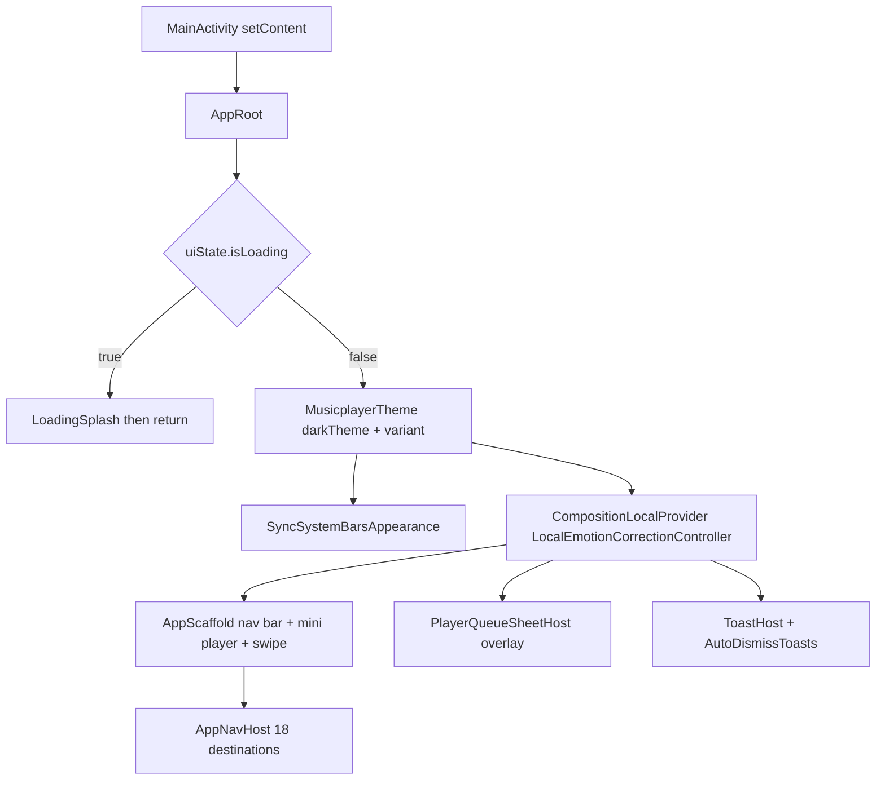
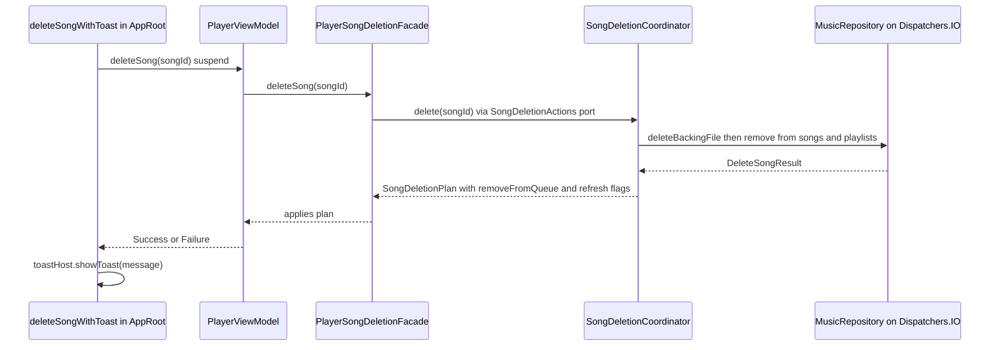

# App Shell, Navigation, and Cross-Module Wiring

The `:app` module is the **application shell**. It owns `MainActivity`/`MelodyApplication` entry, the composition root `AppRoot`, the adaptive frame `AppScaffold`, the Navigation Compose host `AppNavHost`, the `AppRoutes`/`AppDestinations` route table, `PermissionCoordinator`, theme state (`SettingsViewModel` → `MusicplayerTheme`), the queue-sheet and toast overlays, and the app-scoped ViewModels shared across pages. Feature modules (`:feature:*`) never depend on each other and never depend on `:data`/`:player`; every cross-feature jump and every route assembly happens here. `verifyProductArchitecture` (root `build.gradle.kts`) actively bans feature-to-feature Gradle deps and forbids resurrecting the old `AppOverlayHost` routing.

*Composition structure of the shell: the loading gate short-circuits everything; once loaded, the theme, the emotion-correction CompositionLocal, the scaffold frame, the queue sheet, and the toast host wrap the NavHost.*

## Composition root: `AppRoot`

`MainActivity` (`@AndroidEntryPoint`) calls `enableEdgeToEdge()` and `setContent { AppRoot() }`. `AppRoot` is where all cross-page singletons are created and threaded downward.

### The Activity-scope ViewModel assembly constraint

`AppRoot` instantiates six ViewModels with `viewModel()` defaults and passes them into `AppNavHost` as parameters: `PlayerViewModel`, `SettingsViewModel`, `AppMediaMetadataViewModel`, `PlaylistResumeViewModel`, `EmotionViewModel`, and `MoodTimeSlotViewModel`.

> **Invariant (2026-09-04 crash regression):** these Hilt ViewModels **must be created at the top level of `AppRoot`** (Activity scope). Calling `viewModel()` *inside* a `NavHost composable { }` block falls back to the non-Hilt `SavedStateViewModelFactory`, which tries reflective empty-constructor construction and crashes for `@HiltViewModel` classes that need injected dependencies. The source comment on `moodTimeSlotViewModel` records this regression explicitly; `SettingsViewModel` and `EmotionViewModel` follow the same pattern.

This constraint matters for anyone adding a new page: create the ViewModel in `AppRoot`, add a parameter to `AppNavHost`, and consume it inside the route. Never re-resolve it inside the destination composable.

### Loading splash gate

`PlayerUiState.isLoading` defaults to `true` so the first frame is a splash, not an empty Home. While it is true, `AppRoot` renders only the full-screen black `LoadingSplash` ("启动中...") and `return`s — the `MusicplayerTheme` block, `ToastHost`, `AppScaffold`, and `AppNavHost` are not composed at all until startup loading completes. Error toasts (`uiState.errorMessage` → toast + `playerViewModel.clearError()`) are also gated behind loading.

### Theme pipeline and `MusicplayerTheme`

- `SettingsViewModel` (Activity-scoped `@HiltViewModel`) exposes persisted `StateFlow`s from `PlayerSettingsRepository`: `themeMode` (`SYSTEM` default), `themeVariant` (`MONO` default), `lyricFontScale` (`1f` default), all `stateIn(WhileSubscribed(5_000))`, with `setThemeMode/setThemeVariant/setLyricFontScale` write-throughs.
- `AppRoot` derives `isDarkTheme` from `themeMode` (`SYSTEM` → `isSystemInDarkTheme()`), passes `darkTheme` + `variant` into `MusicplayerTheme`, and syncs status-bar icon appearance via `WindowCompat.getInsetsController(...).isAppearanceLightStatusBars = !darkTheme`.
- `MusicplayerTheme` (in `:core:ui`) maps the four `ThemePalette`s — `mono-light`, `mono-dark` (OLED `#000000`), `vermilion-day`, `vermilion-night` — into Material3 `ColorScheme` via `paletteToColorScheme` (`primary = accent`, `surface`/`background = bg0`, `outlineVariant = out1`, …), exactly matching the token tables in `docs/ui-design/DESIGN_SYSTEM.md`. Dynamic color is deliberately off; the theme also provides `LocalContentColor = onSurface` so uncolored text follows the theme.

Theme variants come from `ThemeVariant` (`MONO` "墨色", `VERMILION` "朱砂 · 心有乐章"); the Settings route toasts each switch ("已切换为墨色主题", "已切换为朱砂 · 心有乐章主题", …).

### Toast host and attribution toasts

The shell owns a single `rememberToastHost()` and renders `ToastHost` (top-center, status-bar inset) plus `AutoDismissToasts(durationMs = 2000L)` above the NavHost. `ToastHostState.showToast` keeps **only the latest** toast (it clears the entry list), so attribution messages replace rather than queue.

Attribution toasts are the shell's user-facing explanation layer:

- Mood-slot attribution (design doc §4.5): when lucky play or infinite play starts under an active mood time slot, `playerViewModel.currentMoodSlotName()` is shown as `已按「{slotName}」为你随机播放` / `已按「{slotName}」开启无限随机播放`, answering "why was this song chosen".
- SAF import results (`✓ 已添加 N 首歌曲` / `未在该文件夹中找到音乐文件`), deletion results, queue mutations ("已从播放队列移除"), theme switches, emotion actions, and Settings toggles all flow through the same host.

### Suspend delete chain (M-3)

`deleteSongWithToast(songId)` launches on the shell's `rememberCoroutineScope` because `PlayerViewModel.deleteSong` is `suspend`:

*M-3 (review 2026-09-03): the whole chain is suspending. `MusicRepository.deleteSong` performs the SAF `DocumentFile` cross-process delete inside `withContext(Dispatchers.IO)` and only then removes the song from songs/playlists, persists, and deletes its emotion rows, so the main thread is never blocked by ContentProvider calls (no ANR). `DeleteSongResult.Success/Failure` map directly to toasts.*

### Queue sheet overlay

`PlayerQueueSheetHost` renders `PlayQueueSheet` above the scaffold, driven by local `showQueueSheet` state with a `BackHandler`. Song clicks play the queue index and dismiss; removal/clear emit confirmation toasts. Routes open it via the `onShowQueue` action (e.g. `HomeRouteActions.onQueueClick`).

## Permission coordination

`rememberPermissionCoordinator(onFolderSelected, onPermissionDenied)` (in `app/permissions/`) builds the single `PermissionCoordinator` handed to routes:

- **SAF folder import** — `requestAudioFolderAccess()` launches a custom `PersistableOpenDocumentTree` contract (an `OpenDocumentTree` that adds `FLAG_GRANT_PERSISTABLE_URI_PERMISSION | READ | WRITE`, so the tree URI permission survives app restarts). The result URI goes to `onFolderSelected` → `playerViewModel.importFolder(uri) { count -> toast }`.
- **Runtime permissions** — `requestNotificationPermission(onGranted)` / `requestBluetoothConnectPermission(onGranted)` consult `RuntimePermissionPolicy`; if already granted (`ContextCompat`) `onGranted` runs immediately, otherwise a `RuntimePermissionRequest` (denied message + continuation) is stashed and the system dialog launches. Grant resumes the continuation; denial routes the spec's `deniedMessage` to the shared toast.
- **SDK gating** — `RuntimePermissionPolicy.notificationPermission()` returns `POST_NOTIFICATIONS` only on Tiramisu+ (message "需要通知权限才能在后台显示播放控制"); `bluetoothConnectPermission()` returns `BLUETOOTH_CONNECT` only on S+ ("需要蓝牙权限才能识别蓝牙播放设备"). A `null` spec (older OS) short-circuits to `onGranted`. `RuntimePermissionPolicyTest` pins both cutoffs and messages.

Settings wires grants to player features: `onRequestBluetoothPermission` → `initializeBluetoothPlayback()`; `onRequestNotificationPermission` → `setPlaybackNotificationEnabled(true)` — with success toasts. This honors the architectural rule (enforced by `verifyProductArchitecture`) that **Bluetooth monitoring and notification requests must be user-triggered from Settings, never at startup**.

## Route table and bottom-tab mapping

### `AppRoutes` constants (`navigation/AppRoutes.kt`)

| Constant | Pattern | Notes |
|---|---|---|
| `HOME` | `home` | start destination, full-screen player |
| `PLAYLIST` | `playlist` | library tab |
| `PLAYLIST_DETAIL` | `playlist/{playlistId}` | `NavType.IntType` arg |
| `ARTIST_DETAIL` / `ALBUM_DETAIL` | `artist/{artistName}` / `album/{albumName}` | built via helpers that `Uri.encode` |
| `USER` | `user` | profile tab |
| `SETTINGS` | `settings` | theme/toggles/permission rows |
| `PLAYBACK_STATS` | `playback-stats` | stats overview |
| `RAW_PLAY_STATS` / `EFFECTIVE_PLAY_STATS` | `play-stats/raw` / `play-stats/effective` | ranked count sub-pages |
| `SONG_TOP_LIST_FULL` | `song-top-list?period={period}` | `period` = `week`/`month`, default `week`; helper `songTopList(period)` |
| `VERSION_MANAGEMENT` | `version-management` | same-name version groups |
| `VERSION_COMPARISON` | `version-comparison/{groupId}` | helper `versionComparison(groupId)` |
| `QUICK_SKIP_SONGS` | `quick-skip-songs` | instant-skip list |
| `EMOTION_ANALYSIS` | `emotion-analysis` | scan status + failure rows |
| `MOOD_TIME_SLOT` | `mood-time-slot` | contextual lucky-play config |
| `LYRICS` | `lyrics` | full-screen lyrics |

Parameterized routes are always built through the `AppRoutes` helper functions, never string-concatenated at call sites.

### `AppDestinations` mapping

`AppDestinations` is the three-entry bottom tab enum — `PLAYLIST` (曲库), `HOME` (播放), `USER` (我的) — in that ordinal order. `fromRoute(route)` maps every sub-page to its owning tab: Settings, playback stats (all sub-pages), song top list, emotion analysis, and mood time slot → `USER`; playlist detail, `artist/…`, `album/…`, version management/comparison, quick-skip → `PLAYLIST`; everything else (Home, lyrics) → `HOME`. This single mapping drives:

1. **Bottom-bar highlight sync** — a `LaunchedEffect(activeRoute)` recomputes `currentDestination` on every back-stack change, so returning from a child page can't leave a stale tab highlighted.
2. **Tab transitions** — `AppNavHost`'s `enterTransition`/`exitTransition` compare `tabOrdinal(initialState)` vs `tabOrdinal(targetState)` (also `AppDestinations.fromRoute`): forward slides the new page in from the right, backward from the left (300 ms tween + fade); same-tab routes get `EnterTransition.None`, and pop transitions are disabled. Navigating between two children of the same tab therefore animates as "no transition".
3. **Edge swipe paging** — `AppScaffold` consumes horizontal drags (96 dp threshold) and moves to `AppDestinations.entries[ordinal ± 1]`; it is disabled on the lyrics route (`swipeEnabled = activeRoute != AppRoutes.LYRICS`) to avoid accidental tab switches while reading.

Tab destinations navigate with the standard bottom-nav recipe: `popUpTo(startDestination) { saveState = true }`, `launchSingleTop`, `restoreState = true`.

## `AppNavHost`: the only place routes are wired

Each feature module exposes exactly `XxxRoute` (public composable taking `XxxRouteState` + `XxxRouteActions` + callback lambdas such as `showToast`/`loadSongInfo`) plus an internal `XxxScreen`. `AppNavHost` instantiates the states/actions and renders the Route; no feature renders another feature's UI. The repetitive derivation is factored into two mapper files:

- **`AppRouteStateMappers.kt`** — pure, side-effect-free functions (`playlistRouteState`, `userRouteState`, `playStatsRouteState`, `playbackStatsRouteState`, `songTopListRouteState`, `resolveResumeSong`, `flatGroupedSongs`) turning `PlayerUiState` + stats snapshots into feature states; documented as independently testable.
- **`AppRouteActionMappers.kt`** — action assemblers (`playlistRouteActions`, `userRouteActions`, `playStatsRouteActions`, `playbackStatsRouteActions`, `songTopListRouteActions`) binding navigation (`navController.navigate(AppRoutes.X)`) and playback calls; keeping `AppNavHost` down to route table + transitions.

### Hoisted shared library grouping (M-7)

`sharedLibrarySongs = remember(uiState.songs) { flatGroupedSongs(uiState, playerViewModel) }` computes the O(n) grouped-and-flattened library **once at NavHost level**, keyed by the songs list instance. Playlist, playlist detail, artist, album, stats, top list, and version routes receive `precomputedLibrarySongs`; the mappers fall back to internal computation only for legacy callers/tests. Before this hoist, every route recomputed the grouping on each recomposition (~1100+ song libraries made tab switches janky).

### Narrow position/sleep-timer streams (M-6)

`PlayerViewModel.positionMs` (~500 ms updates) and `sleepTimerRemainingMs` (1 s ticks) are narrow `StateFlow`s deliberately **not** part of the main `uiState`. Only the pages that need them subscribe — `HomeRoute` (position + sleep timer), `LyricsRoute` (position), `VersionComparisonRoute` (position for its seek bar) — so each tick recomposes just the progress UI instead of the whole shell. This was the fix for the M-6 review finding that per-second sleep-timer writes to the main state flow recomposed `AppRoot` entirely.

### Queue scope strategy and playlist-resume settling

All "click a song" actions go through `PlayerViewModel.playWith(song, SongPlaybackStrategy)`: `SongPlaybackStrategy.single()` queues only the clicked song (stats pages, local-music single click), while `scope(list)` queues the displayed group (playlist/artist/album/top list/quick-skip/version group) and starts sequential playback from the clicked song, replacing any existing queue.

`PlaylistResumeViewModel.switchSource(newSource, currentSongId)` maintains which playlist playback is attributed to, settling (recording) the previous source inside one repository transaction. The library page settles with `null` source on every click; playlist detail passes the playlist id only when the clicked song is actually in it, and "resume playing" (`onResumePlaylist`) plays the resolved song with the playlist scope, then `clear(playlistId)` hides the banner. `resolveResumeSong` filters a stale record to `null` when the song left the playlist or its `uri` is gone (unplayable), covered by `ResolveResumeSongTest`.

### Representative page wiring

- **HOME** — local `remember` state for the "more" dialogs (`songForInfo`/`songInfo`, add-to-playlist, delete confirm). `songInfo` loads via `LaunchedEffect` with `runCatching` because the underlying `loadSongInfo` bridges to Room with `runBlocking`; a DB exception must not crash the coroutine. Lucky play/infinite play add mood attribution toasts and settle the playlist source.
- **USER** — refreshes emotion status on entry (`emotionViewModel.refresh()`), loads `PlaybackStatsSnapshot` via `produceState` with `runCatching` fallback to `EMPTY` (C-2: the Room runBlocking bridge can throw), and feeds the mood entry card `nowMinuteOfDay` from a 30-second refresh loop (minute precision is enough for the "生效中" badge).
- **MOOD_TIME_SLOT** — collects `configs`/`moodTimeSlotEnabled`/`tagCounts`/`librarySize` from the Activity-scoped `MoodTimeSlotViewModel`; `loadStats()` snapshots tag counts + library size on `Dispatchers.IO` once per page entry (on failure the chip badges degrade to zero instead of blocking config). Edit/add dialog state is local (`editingSlot`/`showAddDialog`); saving goes through `save(config) { success, message -> }` so overlap/zero-length validation errors surface as toasts. The `MoodSlotEditDialog` receives tag counts and the manual-only tag list (`鬼畜`, `沙雕`, `戏谑`, `荒诞`), matching the six-screen mock in `docs/ui-design/mood-time-slot.html` built on the same four-theme tokens.
- **SETTINGS** — `SettingsRouteState` is assembled from theme flows + `uiState` (uniform random, daily goal); actions call the persisted settings writers and the permission coordinator as described above.

## CompositionLocal: site-wide emotion correction ("不像？标记")

`:core:ui` defines `LocalEmotionCorrectionController: ProvidableCompositionLocal<EmotionCorrectionController?>` (default `null`) with a single `suspend fun save(songId, words): Boolean`. `AppRoot` provides it once, above the entire scaffold:

- The controller delegates to `AppMediaMetadataViewModel.saveEmotionCorrection(songId, words)`: empty `words` means "restore auto tags" (`clearCorrection`, requires an existing row); otherwise `EmotionGroup.avgOfWords` resolves the word set to V-A anchor coordinates and `saveCorrection` persists it. Repository read/write bridges run on `Dispatchers.Default` to keep the `runBlocking(IO)` bridges off the main thread.
- On success the controller refreshes `EmotionViewModel`; on failure (unanalyzed song / invalid word set) it toasts "这首歌还没完成分析".
- Because the provider sits at the shell root, **any page that renders `SongInfoDialog`/`SongEmotionSection`** (library, artist, album, local music, player, detail pages) automatically gains the "不像？标记" capability — `SongEmotionSection` shows its calibrate button only when `LocalEmotionCorrectionController.current != null`, so no callback threading through feature props is needed.

The emotion-analysis page uses the same controller with an extra subtlety: `onCalibrateSong` reads the controller via the CompositionLocal (it must be read in composable context), runs the save in `navCoroutineScope`, and on success **increments a local `calibrationVersion`** before refreshing. Manual marks do not change the failure fingerprint (`attempts`/`failedAt` unchanged), so the `failedRows` `produceState` — keyed on the fingerprint + songs + `calibrationVersion` — would otherwise never requery and the row would only update after leaving the page (2026-09-04 regression). Failed songs may be marked even without an analysis row: the repository creates a user-only record whose tags come solely from the user.

## State, lifecycle, and failure semantics summary

- **Startup**: `isLoading = true` → splash only; loading done → themed shell with toast host; errors during operation surface as toasts and are cleared immediately.
- **Permission flows**: pre-check grants skip the dialog; in-flight requests hold exactly one pending continuation; denial shows the policy's message; SDK-inapplicable requests succeed silently.
- **Navigation**: state save/restore on tab switches; per-tab-ordinal transitions; `navigateUp` for all back actions; parameterized routes always via helpers with URI encoding.
- **Data-bridge failures**: every direct repository call reached from composition (`loadSongInfo`, stats snapshots, tag counts, calibrated tags) is wrapped in `runCatching` with a safe default, because the Room `runBlocking` bridge throws rather than returning null.
- **Mood playback**: the player resolves the active slot from volatile `moodSlotConfigsCache`/`moodEmotionTagsCache` snapshots (`refreshMoodSlotCache()` at startup) and falls back to full-library random when the tag-filtered pool is empty. Note the wiring seam: `MoodTimeSlotViewModel.onConfigsChanged` and `PlayerRuntime.refreshMoodSlots()` exist so the config page can force a player-side cache refresh after save/delete, but **no caller currently assigns/invokes them** — after changing configs, the player snapshot refreshes only at next startup, so config pages should be validated against stale-slot behavior.

## Extension points

Adding a page means, in order: (1) add the `AppRoutes` constant (and helper for parameterized routes); (2) map it to a tab in `AppDestinations.fromRoute` if it is a child page; (3) create the feature's `XxxRoute/XxxScreen/State/Actions` if new; (4) create any new ViewModel in `AppRoot` (Activity scope!) and thread it into `AppNavHost`; (5) add the `composable(...)` block in `AppNavHost`, deriving state through the mappers and binding actions through the action assemblers; (6) run `verifyProductArchitecture` — it fails on feature-to-feature deps, `:data`/`:player` leaks, missing Route/Screen pairs, and any reintroduction of overlay routing.

## Focused tests

- `app/src/test/.../permissions/RuntimePermissionPolicyTest.kt` — SDK cutoffs and denied messages for notification/Bluetooth specs.
- `app/src/test/.../ResolveResumeSongTest.kt` — `resolveResumeSong` semantics: playable song in playlist resolves; not-in-playlist, unplayable (`uri == null`), and null-record cases return null.
- The state mappers are documented as pure functions so route-state derivation can be unit-tested without a NavHost.
