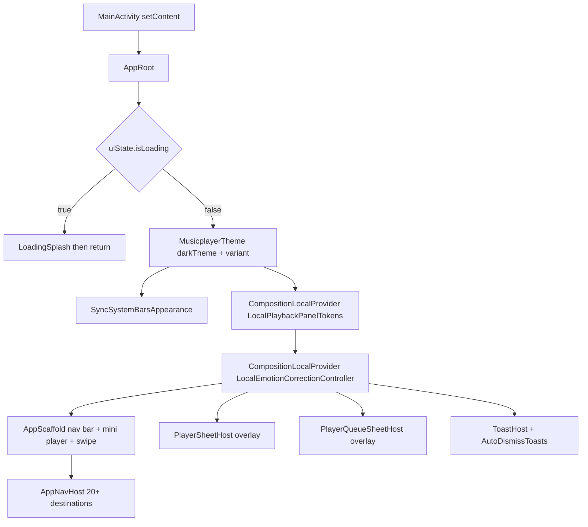
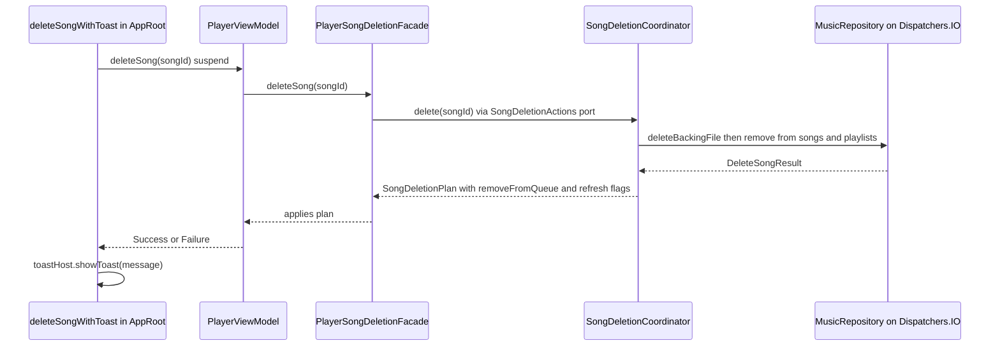

# App Shell, Navigation, and Cross-Module Wiring

The `:app` module is the **application shell**. It owns `MainActivity`/`MelodyApplication` entry, the composition root `AppRoot`, the adaptive frame `AppScaffold`, the Navigation Compose host `AppNavHost`, the `AppRoutes` route table, the runtime `AppShell` (derived from a skin description, replacing the removed compile-time `AppDestinations` enum), the skin switcher, `PermissionCoordinator`, theme state (`SettingsViewModel` → `MusicplayerTheme`), the player-sheet/queue-sheet and toast overlays, and the app-scoped ViewModels shared across pages. Feature modules (`:feature:*`) never depend on each other and never depend on `:data`/`:player`; every cross-feature jump and every route assembly happens here. `verifyProductArchitecture` (root `build.gradle.kts`) actively bans feature-to-feature Gradle deps and forbids resurrecting the old `AppOverlayHost` routing.


```mermaid
flowchart TD
    MA["MainActivity setContent"] --> AR["AppRoot"]
    AR --> GATE{"uiState.isLoading"}
    GATE -->|true| SPLASH["LoadingSplash then return"]
    GATE -->|false| THEME["MusicplayerTheme darkTheme + variant"]
    THEME --> BARS["SyncSystemBarsAppearance"]
    THEME --> TOKENS["CompositionLocalProvider LocalPlaybackPanelTokens"]
    TOKENS --> PROVIDER["CompositionLocalProvider LocalEmotionCorrectionController"]
    PROVIDER --> SCAFFOLD["AppScaffold nav bar + mini player + swipe"]
    SCAFFOLD --> NAVHOST["AppNavHost 20+ destinations"]
    PROVIDER --> SHEET["PlayerSheetHost overlay"]
    PROVIDER --> QUEUE["PlayerQueueSheetHost overlay"]
    PROVIDER --> TOASTS["ToastHost + AutoDismissToasts"]
```

*Composition structure of the shell: the loading gate short-circuits everything; once loaded, the theme, the panel-token and emotion-correction CompositionLocals, the scaffold frame, the player-sheet/queue-sheet overlays, and the toast host wrap the NavHost.*

```mermaid
flowchart TD
    SKIN["Skin description core.skin.Skin"] --> RESOLVER["SkinShellResolver.resolve / resolveById"]
    RESOLVER --> APPSHELL["AppShell tabs startRoute miniPlayer playerEntry ..."]
    STORE["SkinSwitcherStore activeId + grid flag"] --> AR2["AppRoot: currentSkinId + gridLayoutEnabled"]
    AR2 -->|resolveById(currentSkinId).withGridLayout| APPSHELL
    APPSHELL --> NAVHOST2["AppNavHost startDestination + transitions"]
    APPSHELL --> SCAFFOLD2["AppScaffold bottom nav + mini player + swipe"]
    APPSHELL --> ROUTES["RouteAffinity owningTopLevelRoute maps sub-pages"]
    ROUTES --> NAVHOST2
```

*Runtime-shell path: `SkinShellResolver` maps a `:core:skin` description to an `AppShell`; `AppRoot` resolves the persisted skin id and grid switch into the shell, which drives the NavHost's start route/transitions and the scaffold's nav bar/mini-player/swipe. `RouteAffinity.owningTopLevelRoute` replaces the old `AppDestinations.fromRoute` mapping.*

## The runtime `AppShell` (P2, replaces `AppDestinations`)

Before P2 the bottom bar was the compile-time enum `AppDestinations` (fixed 3 tabs), the start destination was hard-coded `AppRoutes.HOME`, and the mini-player visibility was a hard-coded `!= HOME` check in `AppScaffold`. P2 removed `AppDestinations` and turned those three fixed facts into data: the runtime `cn.com.dcsgo.mihx.app.shell.AppShell` (documented in `PLUGIN_SHELL_DESIGN.md` §P2, and the handoff docs `P1_SKIN_MODEL_HANDOFF.md` / `P2_NAV_SHELL_HANDOFF.md`).

```kotlin
data class AppShell(
    val tabs: List<AppTab>,          // bottom-bar items, order = display order
    val startRoute: String,          // start page (was hard-coded AppRoutes.HOME)
    val miniPlayer: Boolean,         // whether this skeleton uses a persistent mini bar
    val playerEntry: PlayerEntry,    // TAB or SHEET (P3: player is a global drawer in SHEET)
    val myPageSectionOrder: List<String> = emptyList(),   // L2 "我的" page section order
    val librarySongListTemplate: SongListTemplate = SongListTemplate.DEFAULT, // L3 row template
)
```

Key properties of the shell:

- **`AppShell.withGridLayout(enabled)`** — a global, skin-independent switch extracted as a function so the "switch → shell" mapping is unit-testable. `enabled = true` forces `SongListTemplate.GRID` (two-column artist/album grid) for both built-in skins, ignoring the description's `songList.template`; `false` keeps the skin's own resolution (both built-ins default to list rows). User decision 2026-09-30 promoted grid from a style to a switch.
- **`RouteAffinity.owningTopLevelRoute(route)`** — the pure-function successor carrying the old `AppDestinations.fromRoute` mapping semantics verbatim. It maps every sub-page to its owning top-level route: the USER children set (`user`, `skin-switcher`, `settings`, `playback-stats`, `file-check`, raw/effective play stats, `song-top-list`, `emotion-analysis`, `mood-time-slot`) → `AppRoutes.USER`; PLAYLIST children (`playlist`, `version-management`, `quick-skip-songs`) plus the PLAYLIST prefixes (`playlist/`, `artist/`, `album/`, `version-comparison/`) → `AppRoutes.PLAYLIST`; everything else (Home, lyrics) → `AppRoutes.HOME` as the fallback. Because the conclusion is now a runtime route string (not an enum constant), the tab count is variable (2/3/5-item bars all work).
- **`List<AppTab>.indexOfRoute(route)`** resolves the owning tab ordinal: empty → 0; otherwise `owningTopLevelRoute` → exact match, degrading to exact-route self-match then 0 when the skeleton omits the owning route (e.g. a two-page sheet skeleton with the player out of the bar). `tabAt(index)` returns `getOrNull` so swipe paging can check the boundary.
- **`shouldShowMiniPlayer(shell, activeRoute, hasCurrentSong)`** — a pure, JVM-testable policy: `hasCurrentSong && shell.miniPlayer && RouteAffinity.owningTopLevelRoute(activeRoute) != shell.playerRoute`. Mirrored `shouldShowLuckyPlayEntry` (2026-10-01) shows a "随心播放" entry bar when the skeleton is a drawer (`playerEntry == SHEET`), no current song, and not on the player route — the two conditions are mutually exclusive and together cover every drawer state.
- The DefaultShell `= pre-refactor behavior verbatim`, deliberately built from Kotlin constants (not runtime skin parsing) so nothing on the startup path can fail to bring up the app. `DefaultShellTest` asserts both paths (constant shell vs `resolve(DefaultSkin.skin())`) agree; `DefaultShellConsistencyTest` asserts `playerRoute` falls back to the literal `"home"` matching `AppRoutes.HOME`.

## `SkinShellResolver` (app-layer bridge) and the skin switcher

`cn.com.dcsgo.mihx.app.shell.SkinShellResolver` is the `:app`-layer bridge between `:core:skin` descriptions and the host's concrete runtime things (routes, drawables). This split keeps the shell free of skin/render knowledge and keeps resource-id/route knowledge out of `:core:skin` (which would reverse the module dependency direction and trip the architecture gate).

- **`knownSkins`** = `listOf(DefaultSkin.skin(), DefaultSkin.minimalSheetSkin())` — the built-in default three-tab skeleton and the minimal two-tab + player-as-global-drawer skeleton. These are the only selectable skins.
- **`resolveById(id)`** — fail-safe: an unknown id returns `DefaultShell.shell` rather than crashing (startup must always work; fail-*closed* applies only to import). **`resolve(skin)`** maps description page keys (`library`/`player`/`me`) to `AppRoutes.PLAYLIST`/`HOME`/`USER`, drops unrecognized bottom-bar targets instead of crashing, defaults the start route to `HOME`, and errors fall back to `DefaultShell.shell`.
- **`resolveMyPageSectionOrder`** — maps `pages.me.sections` `part` names to `feature:user` `UserSections` keys, keeping the old P5 literal `"customSkin"` mapped to `UserSections.SKIN_SWITCHER` (visual compatibility for already-delivered skin zips), then filters to known keys.
- **`resolveLibrarySongListTemplate`** — finds the first `part == "songList"` section in `pages.library` and reads its `template` prop, defaulting to `DEFAULT`. `SkipLight-resolver` `fromId` tolerates unknown values by defaulting.

**`SkinSwitcherRoute`** (route `AppRoutes.SKIN_SWITCHER = "skin-switcher"`) is an independent page that replaced the P5 user custom-skin import (CustomSkinSection / UserSkinRoute / UserSkinStore / SkinIdDeriver all removed). It lists only the built-in skeletons from `knownSkins`, exposes only two panel knobs (cover size default 252, cover corner default 20) delivered live via `LocalPlaybackPanelTokens`, and the grid-layout global switch. **`SkinSwitcherStore`** persists to a single `skin_switcher` SharedPreferences file: `active_id`, per-skinId `panel_cover_size_<id>`/`panel_cover_corner_<id>` overrides, and the global `grid_layout` flag. Overrides are keyed by skinId so switching skins loads that skin's own overrides without cross-pollution.

In `AppRoot`: `currentSkinId` is initialized from `SkinSwitcherStore.activeId()` gated by membership in `knownSkins` (an old prefs id for a now-decommissioned skin falls back to `DEFAULT_SKIN_ID`); `onSkinSelected` writes prefs and swaps the panel overrides; `shell = remember(currentSkinId, gridLayoutEnabled) { SkinShellResolver.resolveById(currentSkinId).withGridLayout(gridLayoutEnabled) }`.

## Composition root: `AppRoot`

`MainActivity` (`@AndroidEntryPoint`) calls `enableEdgeToEdge()` and `setContent { AppRoot() }`. `AppRoot` is where all cross-page singletons are created and threaded downward.

### The Activity-scope ViewModel assembly constraint

`AppRoot` instantiates six ViewModels with `viewModel()` defaults and passes them into `AppNavHost` as parameters: `PlayerViewModel`, `SettingsViewModel`, `AppMediaMetadataViewModel`, `PlaylistResumeViewModel`, `EmotionViewModel`, and `MoodTimeSlotViewModel`.

> **Invariant (2026-09-04 crash regression):** these Hilt ViewModels **must be created at the top level of `AppRoot`** (Activity scope). Calling `viewModel()` *inside* a `NavHost composable { }` block falls back to the non-Hilt `SavedStateViewModelFactory`, which tries reflective empty-constructor construction and crashes for `@HiltViewModel` classes that need injected dependencies. The source comment on `moodTimeSlotViewModel` records this regression explicitly; `SettingsViewModel` and `EmotionViewModel` follow the same pattern.

This constraint matters for anyone adding a new page: create the ViewModel in `AppRoot`, add a parameter to `AppNavHost`, and consume it inside the route. Never re-resolve it inside the destination composable.

### Loading splash gate and system bars

`PlayerUiState.isLoading` defaults to `true` so the first frame is a splash, not an empty Home. While it is true, `AppRoot` renders only the full-screen black `LoadingSplash` ("启动中...") and `return`s — the `MusicplayerTheme` block, `ToastHost`, `AppScaffold`, and `AppNavHost` are not composed at all until startup loading completes. Error toasts (`uiState.errorMessage` → toast + `playerViewModel.clearError()`) are also gated behind loading. `SyncSystemBarsAppearance` uses `WindowCompat.getInsetsController(...).isAppearanceLightStatusBars = !darkTheme` in a `SideEffect`.

A `LaunchedEffect(screenOrientationMode)` applies the persisted screen orientation to the Activity (`SENSOR_AUTO` → `SCREEN_ORIENTATION_UNSPECIFIED`, `LANDSCAPE` → `SENSOR_LANDSCAPE`, `PORTRAIT` → `SENSOR_PORTRAIT`).

### Theme pipeline and `MusicplayerTheme`

- `SettingsViewModel` (Activity-scoped `@HiltViewModel`) exposes persisted `StateFlow`s from `PlayerSettingsRepository`: `themeMode` (`SYSTEM` default), `themeVariant` (`MONO` default), `screenOrientationMode` (`SENSOR_AUTO` default), `lyricFontScale` (`1f` default), all `stateIn(WhileSubscribed(5_000))`, with write-through setters launching in `viewModelScope`.
- `AppRoot` derives `isDarkTheme` from `themeMode` (`SYSTEM` → `isSystemInDarkTheme()`, `LIGHT` → false, `DARK` → true), passes `darkTheme` + `variant` into `MusicplayerTheme`, and syncs status-bar icon appearance.
- `MusicplayerTheme` (in `:core:ui`) maps `ThemeTokens.builtin(variant, dark)` — **16 palettes** (eight variants × day/night) — into Material3 `ColorScheme` via `tokensToColorScheme`. Dynamic color is deliberately off (`dynamicColor = false`, brand colors win), and `LocalContentColor` is explicitly provided as `colorScheme.onSurface` so uncolored text follows the theme.

Theme variants come from `ThemeVariant` (**eight entries**): `MONO` "墨色", `VERMILION` "朱砂 · 心有乐章", `INDIGO` "靛蓝静夜", `SAGE` "苔藓森野", `AMBER` "琥珀暖忆", `SKY` "天空澄明", `FRESH` "新叶青翠", `SUNRISE` "晨光霞粉". `ThemeVariant.entries` drives the Settings color card automatically; `feature/settings` `ThemeVariantCard` carries the swatch color branches per variant. Settings toasts each switch ("已切换为墨色主题", "已切换为朱砂 · 心有乐章主题", … through SUNRISE). Token definitions: `MONO × 明暗` (dark is OLED pure black), `VERMILION × 昼夜`, plus INDIGO/SAGE/AMBER/SKY/FRESH/SUNRISE each with day/night presets.

### Toast host and attribution toasts

The shell owns a single `rememberToastHost()` and renders `ToastHost` (top-center, status-bar inset) plus `AutoDismissToasts(durationMs = 2000L)` above the NavHost. `ToastHostState.showToast` keeps **only the latest** toast (it clears the entry list), so attribution messages replace rather than queue. Both the player sheet and queue sheet receive the same `toastHost` so only the focused window-drawing owner renders toasts (no double toast, no occlusion).

Attribution toasts are the shell's user-facing explanation layer:

- Mood-slot attribution (design doc §4.5): when lucky play or infinite play starts under an active mood time slot, `playerViewModel.currentMoodSlotName()` is shown as `已按「{slotName}」为你随机播放` / `已按「{slotName}」开启无限随机播放`, answering "why was this song chosen"; both also settle the playlist source via `playlistResumeViewModel.switchSource(null, …)`.
- SAF import results (`✓ 已添加 N 首歌曲` / `未在该文件夹中找到音乐文件`), deletion results, queue mutations ("已从播放队列移除"), theme switches, emotion actions, and Settings toggles all flow through the same host.

### Suspend delete chain (M-3)

`deleteSongWithToast(songId)` launches on the shell's `rememberCoroutineScope` because `PlayerViewModel.deleteSong` is `suspend`:


```mermaid
sequenceDiagram
    participant CB as deleteSongWithToast in AppRoot
    participant PVM as PlayerViewModel
    participant FCD as PlayerSongDeletionFacade
    participant CO as SongDeletionCoordinator
    participant REPO as MusicRepository on Dispatchers.IO
    CB->>PVM: deleteSong(songId) suspend
    PVM->>FCD: deleteSong(songId)
    FCD->>CO: delete(songId) via SongDeletionActions port
    CO->>REPO: deleteBackingFile then remove from songs and playlists
    REPO-->>CO: DeleteSongResult
    CO-->>FCD: SongDeletionPlan with removeFromQueue and refresh flags
    FCD-->>PVM: applies plan
    PVM-->>CB: Success or Failure
    CB->>CB: toastHost.showToast(message)
```

*M-3 (review 2026-09-03): the whole chain is suspending. `MusicRepository.deleteSong` runs entirely inside `withContext(Dispatchers.IO)` — it performs the SAF `DocumentFile` cross-process delete via `deleteBackingFile`, then removes the song from songs/playlists, persists both, and deletes the emotion rows (incl. the ~4KB embedding) — so the main thread is never blocked by ContentProvider calls (no ANR). `DeleteSongResult.Success/Failure` map directly to toasts.*

### Player sheet and queue sheet overlays

- **`PlayerSheetHost`** (P3) renders the global player drawer, only reachable when the skeleton declares `playerEntry == SHEET` (default skeleton keeps `TAB` and the drawer never opens). It shares the same `NowPlayingSurface` as the TAB route to avoid two drifting implementations. Since 2026-09-30 the drawer embeds lyrics: `onDismiss` first closes in-drawer lyrics (`showLyricsInSheet`), then the drawer; tapping the cover no longer jumps the standalone lyrics route. From the drawer, artist/album navigation closes the drawer and navigates to those detail routes.
- **`PlayerQueueSheetHost`** renders `PlayQueueSheet` above the scaffold, driven by shell-local `showQueueSheet` state with a `BackHandler` in `AppRoot`. Song clicks play the queue index and dismiss; removal/clear emit confirmation toasts.

## Permission coordination

`rememberPermissionCoordinator(onFolderSelected, onPermissionDenied)` (in `app/permissions/`) builds the single `PermissionCoordinator` handed to routes:

- **SAF folder import** — `requestAudioFolderAccess()` **silently requests `READ_MEDIA_AUDIO` only to accelerate scanning, and ALWAYS launches the folder picker regardless of grant/deny** (`onDenied` also launches, with no denied toast for the audio path). It launches the custom `PersistableOpenDocumentTree` contract (an `OpenDocumentTree` that adds `FLAG_GRANT_PERSISTABLE_URI_PERMISSION | READ | WRITE`, so the tree URI permission survives app restarts). The result URI goes to `onFolderSelected` → `playerViewModel.importFolder(uri) { count -> toast }`.
- **Runtime permissions** — `requestNotificationPermission(onGranted)` / `requestBluetoothConnectPermission(onGranted)` consult `RuntimePermissionPolicy`; if already granted (`ContextCompat`) `onGranted` runs immediately, otherwise exactly one pending `RuntimePermissionRequest` (denied message + continuation) is stashed and the system dialog launches. Grant resumes the continuation; denial runs the request's `onDenied` if present, else routes the spec's `deniedMessage` to the shared toast.
- **SDK gating** — `RuntimePermissionPolicy.notificationPermission()` returns `POST_NOTIFICATIONS` only on Tiramisu+ (message "需要通知权限才能在后台显示播放控制"); `bluetoothConnectPermission()` returns `BLUETOOTH_CONNECT` only on S+ ("需要蓝牙权限才能识别蓝牙播放设备"). A `null` spec (older OS) short-circuits to `onGranted`. `RuntimePermissionPolicyTest` pins both cutoffs and messages.

Settings wires grants to player features: `onRequestBluetoothPermission` → `initializeBluetoothPlayback()` ("已开启蓝牙播放监听"); `onRequestNotificationPermission` → `setPlaybackNotificationEnabled(true)` ("已开启播放通知控制"). This honors the architectural rule (enforced by `verifyProductArchitecture`) that **Bluetooth monitoring and notification requests must be user-triggered from Settings, never at startup**.

## Route table and bottom-tab mapping

### `AppRoutes` constants (`navigation/AppRoutes.kt`)

| Constant | Pattern | Notes |
|---|---|---|
| `HOME` | `home` | start destination, full-screen player / now-playing surface |
| `PLAYLIST` | `playlist` | library tab |
| `PLAYLIST_DETAIL` | `playlist/{playlistId}` | `NavType.IntType` arg; helper `playlistDetail(id)` |
| `ARTIST_DETAIL` / `ALBUM_DETAIL` | `artist/{artistName}` / `album/{albumName}` | built via helpers that `Uri.encode` |
| `USER` | `user` | profile tab |
| `SETTINGS` | `settings` | theme/toggles/permission rows |
| `PLAYBACK_STATS` | `playback-stats` | stats overview |
| `RAW_PLAY_STATS` / `EFFECTIVE_PLAY_STATS` | `play-stats/raw` / `play-stats/effective` | ranked count sub-pages |
| `SONG_TOP_LIST_FULL` | `song-top-list?period={period}` | `period` = `week`/`month`, default `week`; helper `songTopList(period)` |
| `VERSION_MANAGEMENT` | `version-management` | same-name version groups |
| `VERSION_COMPARISON` | `version-comparison/{groupId}` | helper `versionComparison(groupId)` (Uri-encodes) |
| `QUICK_SKIP_SONGS` | `quick-skip-songs` | instant-skip list |
| `EMOTION_ANALYSIS` | `emotion-analysis` | scan status + failure rows |
| `MOOD_TIME_SLOT` | `mood-time-slot` | contextual lucky-play config |
| `LYRICS` | `lyrics` | full-screen lyrics |
| `SKIN_SWITCHER` | `skin-switcher` | built-in skin switcher page (2026-09-30) |
| `FILE_CHECK` | `file-check` | local-file validation |
| `DUPLICATE_DETAIL` | `duplicate-detail` | duplicate-group detail screen |

Parameterized routes are always built through the `AppRoutes` helper functions, never string-concatenated at call sites.

### Bottom-tab mapping: `RouteAffinity`

The old `AppDestinations.fromRoute` compile-time enum mapping is gone; its semantics now live in `RouteAffinity.owningTopLevelRoute(route)` (a pure function in `app/shell/AppShell.kt`, fully described above) plus `List<AppTab>.indexOfRoute(route)` / `tabAt`. This single mapping drives:

1. **Bottom-bar highlight sync** — the highlight is **derived** from `activeRoute` + the tab list (`tabs.indexOfRoute(activeRoute)`), not synced into a local state variable. `AppScaffold`'s `TextBottomBar`/`TextNavRail` compute `selectedIndex = shell.tabs.indexOfRoute(activeRoute)` directly. The 2026-09-29 `LaunchedEffect(activeRoute)` in `AppRoot` is retained only for a hypothetical future hot-swap recomposition; it currently has no side effect.
2. **Tab transitions** — `AppNavHost`'s `enterTransition`/`exitTransition` use `tabOrdinal(initialState.destination.route, shell.tabs)` vs the target (both calling `indexOfRoute`): target ordinal larger → slide in from the right, smaller → from the left (300 ms tween + fade); same tab → `EnterTransition.None`; `popEnterTransition`/`popExitTransition` are disabled.
3. **Edge swipe paging** — `AppScaffold` consumes horizontal drags (96 dp threshold) and moves to `tabs.indexOfRoute(activeRoute) ± 1` via `tabs.tabAt(...)` (null at the boundary); `swipeEnabled = activeRoute != AppRoutes.LYRICS` disables it on the lyrics route.

**Mini player visibility** is `shouldShowMiniPlayer(shell, activeRoute, hasCurrentSong)` — it compares the **route**, not the owning tab (`RouteAffinity.owningTopLevelRoute(activeRoute) != shell.playerRoute`). Equivalent for the default skeleton, and the only correct test for a skeleton where the player page is not a bottom-bar tab (the sheet skeleton).

Tab destinations navigate with the standard bottom-nav recipe: `popUpTo(startDestination) { saveState = true }`, `launchSingleTop`, `restoreState = true` (in `AppRoot`'s `onTabSelected` and `onNavigateToHome`).

## `AppNavHost`: the only place routes are wired

Each feature module exposes exactly `XxxRoute` (public composable taking `XxxRouteState` + `XxxRouteActions` + callback lambdas such as `showToast`/`loadSongInfo`) plus an internal `XxxScreen`. `AppNavHost` instantiates the states/actions and renders the Route; no feature renders another feature's UI. The repetitive derivation is factored into two mapper files:

- **`AppRouteStateMappers.kt`** — pure, side-effect-free functions (`playlistRouteState`, `userRouteState`, `playStatsRouteState`, `playbackStatsRouteState`, `songTopListRouteState`, `resolveResumeSong`, `flatGroupedSongs`) turning `PlayerUiState` + stats snapshots into feature states; documented as independently testable.
- **`AppRouteActionMappers.kt`** — action assemblers (`playlistRouteActions`, `userRouteActions`, `playStatsRouteActions`, `playbackStatsRouteActions`, `songTopListRouteActions`) binding navigation (`navController.navigate(AppRoutes.X)`) and playback calls; keeping `AppNavHost` down to route table + transitions.

### Hoisted shared library grouping (M-7)

`sharedLibrarySongs = remember(uiState.songs) { flatGroupedSongs(uiState, playerViewModel) }` computes the O(n) grouped-and-flattened library **once at NavHost level**, keyed by the songs list instance. Playlist, playlist detail, artist, album, stats, top list, and version routes receive `precomputedLibrarySongs`; the mappers fall back to internal computation only for legacy callers/tests. Before this hoist, every route recomputed the grouping on each recomposition (~1100+ song libraries made tab switches janky).

### Narrow position/sleep-timer streams (M-6)

`PlayerViewModel.positionMs` (~500 ms updates) and `sleepTimerRemainingMs` (1 s ticks) are narrow `StateFlow`s deliberately **not** part of the main `uiState`. Only the pages that need them subscribe — `HomeRoute` (position + sleep timer), `LyricsRoute` (position), `VersionComparisonRoute` (position for its seek bar) — so each tick recomposes just the progress UI instead of the whole shell. This was the fix for the M-6 review finding that per-second sleep-timer writes to the main state flow recomposed `AppRoot` entirely.

### Queue scope strategy and playlist-resume settling

All "click a song" actions go through `PlayerViewModel.playWith(song, SongPlaybackStrategy)`: `SongPlaybackStrategy.single()` queues only the clicked song (stats pages, local-music single click), while `scope(list)` queues the displayed group (playlist/artist/album/top list/quick-skip/version group) and starts sequential playback from the clicked song, replacing any existing queue.

`PlaylistResumeViewModel.switchSource(newSource, currentSongId)` maintains which playlist playback is attributed to, settling (recording) the previous source inside one repository transaction. The library page settles with `null` source on every click; playlist detail passes the playlist id only when the clicked song is actually in it, and "resume playing" (`onResumePlaylist`) plays the resolved song with the playlist scope, then `clear(playlistId)` hides the banner. `resolveResumeSong` filters a stale record to `null` when the song left the playlist or its `uri` is gone (unplayable), covered by `ResolveResumeSongTest`.

### Representative page wiring

- **HOME / now-playing** — the `AppRoutes.HOME` destination renders the shared `NowPlayingSurface` (same one used in the SHEET drawer). Lucky play/infinite play add mood attribution toasts and settle the playlist source.
- **USER** — refreshes emotion status on entry (`emotionViewModel.observe()`, `refresh()`), loads `PlaybackStatsSnapshot` via `produceState` with `runCatching` fallback to `EMPTY` (C-2: the Room runBlocking bridge can throw), feeds the mood entry card `nowMinuteOfDay` from a 30-second refresh loop, and applies `sectionOrder = shell.myPageSectionOrder` for the P4 L2 sectioned "我的" page. `onOpenSkinSwitcher` navigates to `SKIN_SWITCHER`.
- **MOOD_TIME_SLOT** — collects `configs`/`moodTimeSlotEnabled`/`tagCounts`/`librarySize` from the Activity-scoped `MoodTimeSlotViewModel`; `loadStats()` snapshots tag counts + library size once per page entry (on failure the chip badges degrade to zero instead of blocking config). Edit/add dialog state is local (`editingSlot`/`showAddDialog`); saving goes through `save(config) { success, message -> }` so overlap/zero-length validation errors surface as toasts. The `MoodSlotEditDialog` receives tag counts and the manual-only tag list (`鬼畜`, `沙雕`, `戏谑`, `荒诞`).
- **SKIN_SWITCHER** — lists `knownSkins`, exposes the two panel knobs + grid switch, all threaded from `AppRoot` through `AppNavHost` params; `onBack` = `navigateUp`.
- **SETTINGS** — `SettingsRouteState` is assembled from theme flows + `uiState` (uniform random, daily goal); actions call the persisted settings writers and the permission coordinator as described above.
- **FILE_CHECK / DUPLICATE_DETAIL** — validation state + duplicate-group scan from `PlayerViewModel`; `onOpenDetail` navigates to `DUPLICATE_DETAIL`.

## CompositionLocal: site-wide emotion correction ("不像？标记")

`:core:ui` defines `LocalEmotionCorrectionController: ProvidableCompositionLocal<EmotionCorrectionController?>` (default `null`) with a single `suspend fun save(songId, words): Boolean`. `AppRoot` provides it once, above the entire scaffold:

- The controller delegates to `AppMediaMetadataViewModel.saveEmotionCorrection(songId, words)`: empty `words` means "restore auto tags" (`clearCorrection`, requires an existing row); otherwise `EmotionGroup.avgOfWords` resolves the word set to V-A anchor coordinates and `saveCorrection` persists it. Repository read/write bridges run on `Dispatchers.Default` to keep the `runBlocking(IO)` bridges off the main thread.
- On success the controller refreshes `EmotionViewModel`; on failure (unanalyzed song / invalid word set) it toasts "这首歌还没完成分析".
- Because the provider sits at the shell root, **any page that renders `SongInfoDialog`/`SongEmotionSection`** (library, artist, album, local music, player, detail pages) automatically gains the "不像？标记" capability — `SongEmotionSection` shows its calibrate button only when `LocalEmotionCorrectionController.current != null`, so no callback threading through feature props is needed.

The emotion-analysis page uses the same controller with an extra subtlety: `onCalibrateSong` reads the controller via the CompositionLocal (it must be read in composable context), runs the save in `navCoroutineScope`, and on success **increments a local `calibrationVersion`** before refreshing. Manual marks do not change the failure fingerprint (`attempts`/`failedAt` unchanged), so the `failedRows` `produceState` — keyed on the fingerprint + songs + `calibrationVersion` — would otherwise never requery and the row would only update after leaving the page (2026-09-04 regression). Failed songs may be marked even without an analysis row: the repository creates a user-only record whose tags come solely from the user.

## State, lifecycle, and failure semantics summary

- **Startup**: `isLoading = true` → splash only; loading done → themed shell with toast host; errors during operation surface as toasts and are cleared immediately.
- **Permission flows**: SAF audio access silently requests `READ_MEDIA_AUDIO` then always launches the folder picker; runtime pre-checks skip the dialog; in-flight requests hold exactly one pending continuation; denial shows the policy's message; SDK-inapplicable requests succeed silently.
- **Navigation**: state save/restore on tab switches; per-tab-ordinal transitions; `navigateUp` for all back actions; parameterized routes always via helpers with URI encoding. The start destination is fixed for the window lifetime (`rememberSaveable`), so a skin switch that changes `startRoute` does **not** clear the back stack.
- **Data-bridge failures**: every direct repository call reached from composition (`loadSongInfo`, stats snapshots, tag counts, calibrated tags) is wrapped in `runCatching` with a safe default, because the Room `runBlocking` bridge throws rather than returning null.
- **Mood playback**: the player resolves the active slot from volatile `moodSlotConfigsCache`/`moodEmotionTagsCache` snapshots (`refreshMoodSlotCache()` at startup) and falls back to full-library random when the tag-filtered pool is empty. `MoodTimeSlotViewModel.onConfigsChanged` and `PlayerRuntime.refreshMoodSlots()` exist as a wiring seam but no caller currently assigns/invokes them — after changing configs, the player snapshot refreshes only at next startup.

## Delete chain, import flow, and the real-path scan (M-3 / M-5)

The delete chain is covered above. For **import**, `MusicRepository` offers a fast real-path scan (used by `addFolder`): `tryFastFileScan` first resolves the tree URI to a real `java.io.File` root, then `collectLibraryFilesFromRealPath` recursively scans that path **up to 3 levels** (guarded by `depth > 3`). Each discovered audio/LRC file is turned into a document URI via `treeDocumentUri` → `DocumentsContract.buildDocumentUriUsingTree(treeUri, "primary:$rel")`, and LRC files are matched to audio by `lrcMatchKey` (relative dir + lowercased base name). `READ_MEDIA_AUDIO` not being granted short-circuits this fast path (falls back to the provider enumeration scan).

## Extension points

Adding a page means, in order: (1) add the `AppRoutes` constant (and helper for parameterized routes); (2) register the skeleton/tab in the skin description if it is a bottom-level tab, or rely on `RouteAffinity.owningTopLevelRoute` for child pages; (3) create the feature's `XxxRoute/XxxScreen/State/Actions` if new; (4) create any new ViewModel in `AppRoot` (Activity scope!) and thread it into `AppNavHost`; (5) add the `composable(...)` block in `AppNavHost`, deriving state through the mappers and binding actions through the action assemblers, including `SKIN_SWITCHER` and grid-layout params for shell-dependent routes; (6) run `verifyProductArchitecture` — it fails on feature-to-feature deps, `:data`/`:player` leaks, missing Route/Screen pairs, and any reintroduction of overlay routing (`AppOverlay.kt`, `AppOverlayHost.kt`, `OverlayRoute.kt`).

## Focused tests

- `app/src/test/.../permissions/RuntimePermissionPolicyTest.kt` — SDK cutoffs and denied messages for notification/Bluetooth specs.
- `app/src/test/.../ResolveResumeSongTest.kt` — `resolveResumeSong` semantics: playable song in playlist resolves; not-in-playlist, unplayable (`uri == null`), and null-record cases return null.
- `DefaultShellTest` / `DefaultShellConsistencyTest` (in `:app`) — assert the constant-built default shell equals `resolve(DefaultSkin.skin())`, and that `playerRoute` falls back to the literal `"home"` matching `AppRoutes.HOME`.
- `UserSectionsMatchDescriptionTest` (in `feature/user`) — binds the `UserSections` key list to the `DefaultSkin` `myOverview` sections so description and code cannot drift (P4 regression guard).
- The state mappers are documented as pure functions so route-state derivation can be unit-tested without a NavHost.
