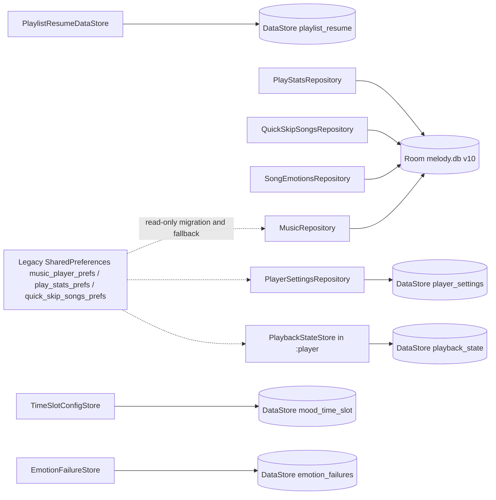
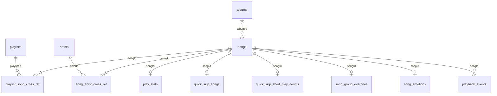
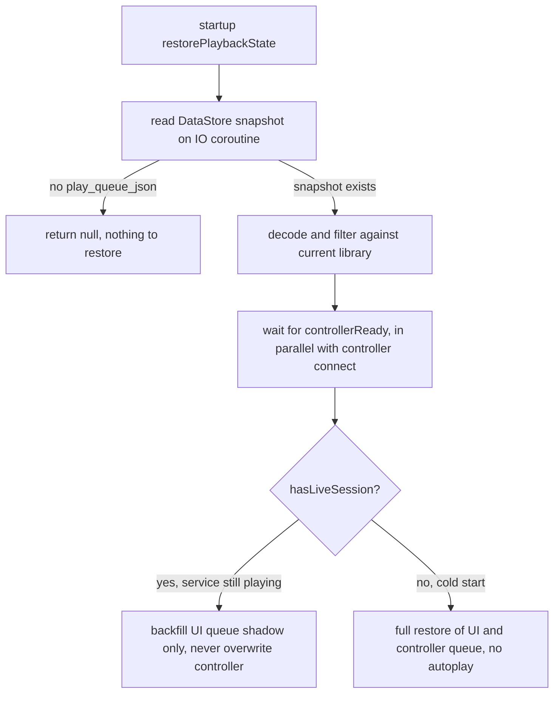

# Data Persistence: Room and DataStore

The app persists data through two complementary stacks: **Room** (`MelodyDatabase`, version 10, 13 entity tables) owns all structured data — library, playlists, stats, quick-skip, emotions; **DataStore Preferences** (5 independent files) owns small-scale settings and state snapshots (player settings, playback snapshot, playlist resume, mood time-slot config JSON, emotion failure records). There are also three **legacy read-only SharedPreferences channels**: the one-shot `SharedPreferencesLegacyJsonMigration` that moves v1 JSON into Room, and the legacy-value fallbacks inside `PlayerSettingsRepository`/`PlaybackStateStore` — every legacy key is deleted as soon as the new storage is written, so legacy SharedPreferences survive only to serve the migration path.

*Persistence map: Room is the single source of truth for structured data; the five DataStore domains are independent files; legacy SharedPreferences keeps only three read-only dashed paths (one-shot migration, settings fallback, playback snapshot fallback).*

Module ownership: Room and all DataStores except `playback_state` live in `:data` and are exposed narrowly through `:domain` repository interfaces; `PlaybackStateStore` lives in `:player` (it directly serves the Media3 session) and is wired through the `PlaybackStateStorage`/`PlaybackStateRepository` interfaces by `app/di/PlayerModule`. Dependency boundaries are covered in `/openwiki/architecture/module-graph.md`.

## Room: MelodyDatabase v10 (13 entity tables)

`MelodyDatabase` declares `version = 10, exportSchema = true` with 13 entities and a single DAO, `MelodyDao`. The database file is `melody.db`, built by `DatabaseModule` via `Room.databaseBuilder` (singleton) with all migrations v1→v10 registered.

| Table | Entity | Purpose |
| --- | --- | --- |
| `songs` | `SongEntity` | Library master table: title/artist/album/sample rate/uri/lrcUri/durationMs and other import metadata; `uri` has a unique index |
| `playlists` | `PlaylistEntity` | Playlist catalog (id, name, created/updated timestamps) |
| `playlist_song_cross_ref` | `PlaylistSongCrossRef` | Playlist↔song many-to-many; `sortOrder` preserves order |
| `play_stats` | `PlayStatsEntity` | Per-song aggregate stats: effective play count, raw play count, accumulated duration, last played |
| `playback_events` | `PlaybackEventEntity` | One row per playback session (started at, duration, effective flag); supports day/week/month aggregation |
| `quick_skip_songs` | `QuickSkipSongEntity` | Quick-skipped songs |
| `quick_skip_short_play_counts` | `QuickSkipShortPlayEntity` | Short-play counters (accumulate to trigger auto quick-skip) |
| `song_group_overrides` | `SongGroupOverrideEntity` | Title overrides for same-name song groups |
| `migration_state` | `MigrationStateEntity` | Data-migration completion markers (name primary key + completedAt); currently only `shared_preferences_json_v1` |
| `artists` | `ArtistEntity` | Atomic artist rows (`name` unique; artists split from `/`-separated tags) |
| `albums` | `AlbumEntity` | Albums (`name` unique) |
| `song_artist_cross_ref` | `SongArtistCrossRef` | Song↔atomic-artist many-to-many |
| `song_emotions` | `SongEmotionEntity` | Emotion analysis results: V/A, per-window `curveJson`, `embeddingB64`, three user-calibration fields |

Note that entities declare **no Room foreign-key constraints**; all relationships (playlist↔song, song↔artist/album, and the songId-keyed stat tables) are logical, maintained by repository code rather than enforced by the schema.

*Logical relationships among Room tables, joined on songId/albumId/artistId and maintained in code — not FK-enforced.*

### Room write path: MusicRepository and RoomMusicLibraryDataSource

`MusicRepository` holds the in-memory library (`songs`/`playlists`) and persists via **asynchronous full-table snapshots**: every change snapshots the current list into `persistScope` (a single-threaded IO scope, `Dispatchers.IO.limitedParallelism(1)`), where `RoomMusicLibraryDataSource.persistSongs`/`persistPlaylists` replace everything inside the `@Transaction` methods `replaceSongs`/`replacePlaylists`. Serializing snapshots on one thread guarantees the later snapshot always supersedes the earlier one (the final state is correct) while UI actions on the main thread never wait for disk.

`RoomMusicLibraryDataSource.restore()` rebuilds domain objects from `songs` + `song_group_overrides` + `playlists` + refs at startup and calls `MelodyDao.syncLibraryCatalog` to sync the artist/album catalogs: idempotently insert missing atomic artists and albums, rebuild all `song_artist_cross_ref` rows, batch-backfill `songs.albumId` (avoiding the early per-song N+1 query regression), then delete orphan artists/albums.

### The playback_events index design

The composite index `(startedAtMs, isEffectivePlay, songId)` on `playback_events` covers every time-range aggregation query: `totalDurationBetween` (duration), `distinctSongsBetween` (distinct songs), `dailyDurationsBetween` (per-day), and `playCountsBetween` (song TOP chart, fully index-covered). The v7→v8 migration replaced the single-column `startedAtMs` index created in v5→v6 with this composite index (the old one was a redundant prefix) and repaired the historical inconsistency of "fresh installs missing the index".

## Room schema change workflow (enforced)

Every entity/DAO change must follow this workflow (codified in `CLAUDE.md`, machine-enforced by `verifyProductArchitecture`):

1. **Change the entity/DAO** under `data/src/main/java/cn/com/dcsgo/mihx/data/local/{entity,dao}`.
2. **Bump the version**: `MelodyDatabase.VERSION` (currently 10 → next 11).
3. **Export the new schema JSON**: `:data` configures KSP with `room.schemaLocation = $projectDir/schemas` (`data/build.gradle.kts`); building generates `data/schemas/cn.com.dcsgo.mihx.data.local.MelodyDatabase/11.json` automatically.
4. **Register the migration**: add `Migration(N, N+1)` in `DatabaseModule` and include it in `addMigrations(...)`.
5. **Add a unit test** for any migration involving complex data movement.
6. **Never modify existing schema JSONs** — they are immutable historical snapshots.

`verifyProductArchitecture` (root `build.gradle.kts`) hard-checks persistence invariants: schema v1 must not contain `quick_skip_short_play_counts`, v2 must contain it and must not contain `lrcUri`, v3 must contain `lrcUri` (version history is tamper-evident); `DatabaseModule` must register `Migration(1, 2)`/`Migration(2, 3)`; both backup rule files must contain the full privacy exclude list (below). The full rule inventory lives in `/openwiki/operations/build-and-verification.md`.

### Migration history v1 → v10

| Migration | Content |
| --- | --- |
| 1→2 | Create `quick_skip_short_play_counts` |
| 2→3 | Add `lrcUri` to `songs` |
| 3→4 | Add `album` column to `songs` |
| 4→5 | Create `artists`/`albums`/`song_artist_cross_ref`; add `albumId` to `songs` |
| 5→6 | Create `playback_events` + `startedAtMs` single-column index |
| 6→7 | Add `durationMs` to `songs` |
| 7→8 | Swap `playback_events` to the composite index (drop the single-column index) |
| 8→9 | Create `song_emotions` (V/A curve table) |
| 9→10 | Add `embeddingB64`/`userValence`/`userArousal`/`userTags` to `song_emotions` (personalization loop) |

## Legacy JSON migration: v1 SharedPreferences → Room

v1 stored the library and playlists as SharedPreferences JSON; a one-shot migration now moves it into Room:

- **Sources** (`SharedPreferencesLegacyJsonMigration`): `music_player_prefs` (`songs_json`, `playlists_json`), `play_stats_prefs` (`play_count_*`/`raw_play_count_*`/`play_duration_*` keys), and `quick_skip_songs_prefs` (`quick_skip_song_ids_json`, `short_play_count_*`).
- **Parsing** (`LegacyJsonSnapshotParser`): each JSON block is parsed in its own `runCatching`; a corrupted block degrades to empty without blocking the others. Playlist refs keep only songIds that match already-parsed `availableSongIds`; songs are deduplicated by `uri`.
- **Idempotency marker**: it writes `MigrationStateEntity(LEGACY_MIGRATION_NAME, completedAt)` (name = `shared_preferences_json_v1`) into `migration_state`; on subsequent launches the marker short-circuits `migrateIfNeeded()`.
- **Trigger point**: `MusicRepository.loadPersistedSongs()` calls `migrateIfNeeded()` **before** restoring from Room — the legacy JSON is consumed read-only once, and Room remains the single source of truth.
- **Tests**: `SharedPreferencesLegacyJsonMigrationTest` locks down three behaviors — full migration plus completion marker, stats still migrated (plus marker) when JSON is corrupt, and complete skip (no rewrite) when the marker already exists.

## The five DataStore domains

Each domain is its own `preferencesDataStore` file (independent key spaces). The design rule: **only small, non-relational state goes into DataStore** — the `TimeSlotConfigStore`/`EmotionFailureStore` comments explicitly cite "no Room schema change" as the selection rationale.

### 1. `player_settings` — PlayerSettingsDataStore

`PlayerSettingsRepository` reads and writes every key in `PlayerSettingsKeys`: `theme_mode`/`theme_variant`, uniform-random toggle, Bluetooth playback monitoring, playback notification, lyric font scale, sleep timer (`sleep_timer_end_at_ms` + play-last-song), daily listening goal, emotion scan pause (`emotion_scan_paused`), the mood time-slot master switch (`mood_time_slot_enabled`), and local-music sorting (mode + direction). Reads carry a **legacy fallback**: when DataStore lacks a value, the legacy `dark_theme`-style keys are consulted; once the user explicitly writes (e.g. `setThemeMode`), the corresponding legacy key is deleted — old keys decay with use. The sleep timer's end time and play-last-song flag persist so that `PlayerSleepTimerCoordinator.restore()` resurrects unexpired countdowns after restart (expired ones reset to zero).

### 2. `playback_state` — PlaybackStateStore + PlaybackStateSnapshotSerializer

The process-death recovery data, living in `:player`:

- **Keys**: `play_queue_json` (queue JSON), `play_position_ms`, `is_infinite_play`, `infinite_played_ids`, `current_song_id`.
- **Save semantics**: an empty session (empty queue and no currentSongId) **skips the write but keeps any existing snapshot** — the UI-recreation window has a transient all-empty state, and the old clear behavior erased a valid snapshot written seconds earlier, leaving the queue permanently empty after restart (2026-09-03 regression). Explicit clearing goes through `clearPlaybackState()`. Save failures are logged and swallowed so playback control is never interrupted.
- **Serialization**: `PlaybackStateSnapshotSerializer` encodes the queue as `{songIds, currentIndex, playMode, playOrderIds}` JSON; decoding filters unavailable songs against the current library, clamps `currentIndex`, and repairs the play order; corrupt JSON returns null. Infinite-play played ids are filtered against available songs on decode too.
- **Restore decision**: `PlayerPersistenceGraph` reads the snapshot on an IO coroutine (in parallel with controller connection) and waits for `controllerReady` before deciding via `hasLiveSession()` — if the service is still playing, only the UI queue shadow is backfilled (the live session is never overwritten); on a cold start with no session, UI and controller queue are fully restored (without autoplay). The full save/restore sequence is in `/openwiki/workflows/playback-session-lifecycle.md`.
- **Safety-net writes**: `PlayerPlaybackStateAutosaver` persists every 5 seconds (`DEFAULT_INTERVAL_MS = 5_000L`) on playback position; `AppMediaSessionService` writes the final snapshot asynchronously on `onDestroy`/`onTaskRemoved` via a process-level scope (`persistCurrentPlaybackSnapshot` suspend variant) and, in the same coroutine, settles the playlist resume record (`recordCurrentSource`).

*Playback snapshot restore decision: snapshot read and controller connection run in parallel; the final decision waits for both to remove the race.*

### 3. `playlist_resume` — PlaylistResumeDataStore

Playlist resume records: one key per playlist (`resume_<id>`) holding `{"songId":N,"updatedAtMs":T}` JSON, plus a `source_playlist_id` marker for "the playlist the current queue came from". Two **transactional methods** are the core invariant:

- `switchSourcePlaylist(newSource, currentSongId)`: reading the old source and writing the new one must happen inside a single `edit` transaction — otherwise rapid playlist switching can settle a song onto the wrong playlist;
- `recordCurrentSource(songId)` (the playback service exit hook): read source, write the resume record, and clear the marker in one transaction, returning whether a record was made.

`PlaylistResumeDataStoreTest` covers the transactional semantics (settle the old playlist, same-playlist switch does not settle, switching to non-playlist source settles first then clears) and corrupt JSON tolerance (`observeResume` returns null).

### 4. `mood_time_slot` — TimeSlotConfigStore

Mood time-slot configs for contextual random playback: a single key `time_slot_configs` holds a JSONArray (`[{"id":1,"name":"深夜静谧","start":1320,"end":360,"tags":["静谧","禅"]}]`). With single-digit to low-double-digit slot counts, JSON serialization suffices and **no Room schema change is needed**.

- `save` validates through `MoodSlotResolver.validate` first (name/tags/zero-length/overlap); conflicts throw `IllegalArgumentException` with a message naming the conflicting slot; on success the whole key is rewritten sorted by start time.
- **Parse tolerance**: the outer `runCatching` returns an empty list on failure; the inner per-item `runCatching` skips a single corrupted entry (with a warning log) instead of losing the entire list.
- Runtime consumption: `PlayerRuntime` snapshots configs into `moodSlotConfigsCache` at startup (the settings page refreshes it via `refreshMoodSlots()`), and `PlayerRandomQueueFacade` evaluates the active slot on each random draw to filter the candidate pool — the decision semantics are documented in `/openwiki/concepts/mood-time-slot.md`.

### 5. `emotion_failures` — EmotionFailureStore

Emotion analysis failure records (same design as TimeSlotConfigStore): one key `emotion_failures` holds a JSONObject keyed by songId with `{reason, failedAt, attempts}`. `record` reads-modifies-writes in one transaction, accumulating `attempts` and overwriting `reason`/`failedAt` with the latest; parsing skips corrupted entries. The consumer is `EmotionScanWorker`: songs with `attempts >= MAX_ATTEMPTS(3)` stop being retried automatically (the detail page still allows manual retry via `clearForRetry`, which clears records and re-enqueues), otherwise every scan pass spins on the same broken files. A successful analysis clears the record via `clear(songId)`. The periodic scan is scheduled by `EmotionScanScheduler` in `MelodyApplication.onCreate` (charging + battery-not-low constraints, one pass every 6 hours, ≤40 songs per pass).

## The runBlocking(IO) bridge and its thread contract

Several `:data` repositories bridge Room/DataStore with `runBlocking(Dispatchers.IO)` where the domain interface demands a synchronous signature: `SongEmotionsRepository` (get/getAll/upsert/saveCorrection…), `PlayStatsRepository` (getCounts/getRawPlayCounts/increment…), `QuickSkipSongsRepository`, the `currentXxx()/setXxxBlocking()` methods of `PlayerSettingsRepository`, and `PlaybackStateStore`'s save/restore.

**This is a contract callers must honor: these blocking bridges must not be called on the main thread** — callers switch threads themselves. Reference patterns:

- `AppMediaMetadataViewModel.saveEmotionCorrection` wraps `emotionRepository.saveCorrection/clearCorrection` in `withContext(Dispatchers.Default)` (the source comment states the repositories are runBlocking(IO) bridges moved off the main thread to avoid janking the UI);
- `MoodTimeSlotViewModel.loadStats` computes tag counts in a one-shot `withContext(Dispatchers.IO)` snapshot (`songEmotionRepository.getAll` is a full-table blocking read);
- `PlayerPersistenceGraph`, the caller of `PlaybackStateStore.restore`, puts the whole restore read on a `dispatchers.io` coroutine.

For new repository methods prefer suspend/Flow APIs; add a blocking bridge only when the domain contract (or a coroutine-less path such as service teardown) requires it, and document the thread requirement in the KDoc.

## Backup and privacy exclusions (release checklist)

`app/src/main/res/xml/backup_rules.xml` (`<full-backup-content>`, pre-Android 12) and `data_extraction_rules.xml` (both `cloud-backup` and `device-transfer` scenarios) must exclude the same set of data:

- Legacy SharedPreferences: `music_player_prefs.xml`, `play_stats_prefs.xml`, `quick_skip_songs_prefs.xml`;
- The full Room family: `melody.db`, `melody.db-journal`, `melody.db-shm`, `melody.db-wal`;
- DataStore: `datastore/player_settings.preferences_pb`, `datastore/playback_state.preferences_pb`;
- Album-art caches: `album_art_cache/`, `album_art/`, `cache/album_art/`.

**This is a release checklist item**: `verifyProductArchitecture` walks a `requiredPrivacyExcludes` list against both rule files and fails on any missing entry. The restore semantics justify it — library/playback state is device-bound (SAF URIs die off-device, snapshots cannot match another device's library), so backing it up only adds restore payload and privacy surface. When adding a new persisted file (e.g. a new DataStore domain), add it to both rule files or the architecture gate will fail.

## Key tests

| Test | Locked behavior |
| --- | --- |
| `PlaybackStateStoreTest` | Snapshot round trip (queue/position/mode/order/duplicates), restore filters unavailable songs, infinite-play state kept, **empty-session save keeps existing snapshot**, currentSongId corrects the queue, legacy fallback and next-save clears legacy keys |
| `PlaybackStateSnapshotSerializerTest` | Queue JSON round trip, corrupt JSON returns null, missing currentIndex returns null, optional-field defaults, infinite-play id filtering |
| `SharedPreferencesLegacyJsonMigrationTest` | Full migration + completion marker, stats still migrated on corrupt JSON, marker skips migration |
| `PlaylistResumeDataStoreTest` | Resume record/overwrite/per-playlist clear, corrupt JSON returns null, source marker and transactional settle semantics |
| `PlayerSettingsRepositoryTest` | Theme legacy fallback → DataStore write → legacy key cleared, defaults |
| `MusicRepositoryRoomTest` / `PlayStatsRepositoryRoomTest` / `QuickSkipSongsRepositoryRoomTest` | Room repository contracts against FakeDaos |

When changing persistence behavior (especially playback snapshot save/restore and legacy migration), these tests are the regression floor; schema-migration changes additionally require the migration unit test from step 5 above.
