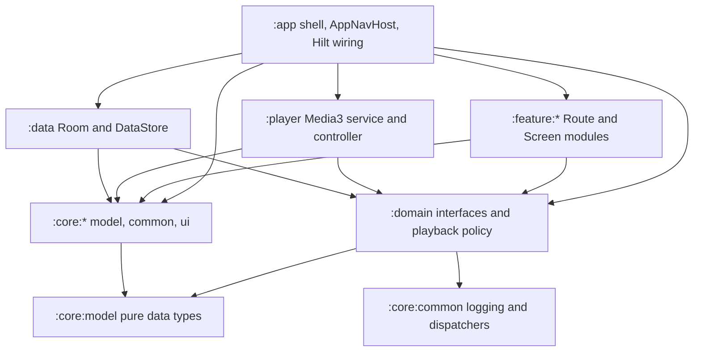
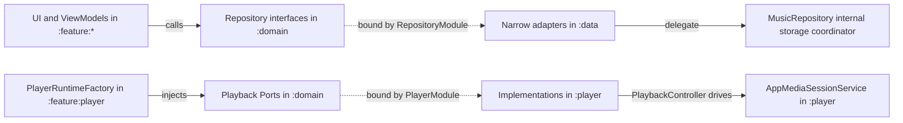

# Module Layering and Dependency Boundaries

The product is a 14-module Android Gradle project (`melody-in-heart`, applicationId `cn.com.dcsgo.mihx`). Layers are arranged so that pure logic lives at the bottom (`:core:*`, `:domain`), platform mechanics live in the middle (`:data`, `:player`), UI features live at the top (`:feature:*`), and the `:app` shell is the only module allowed to see everything. Two mechanisms keep this from eroding: Gradle dependency declarations (narrow by construction) and `verifyProductArchitecture`, a custom verification task in the root `build.gradle.kts` whose ~530-line `doLast` block re-checks the whole tree on every `check` run.

## Layer responsibilities

| Layer | Module(s) | Owns | Must not touch |
| --- | --- | --- | --- |
| App shell | `:app` | `MelodyApplication` (`@HiltAndroidApp`, logger install, Coil `ImageLoaderFactory`, uncaught-exception hook), `MainActivity` (`@AndroidEntryPoint`), `AppRoot`/`AppScaffold`/`AppNavHost`, bottom-tab destinations (`AppDestinations`: PLAYLIST / HOME / USER), `PermissionCoordinator`, app-level Hilt modules (`CoroutineModule`, `LoggerModule`, `PlayerModule`) | — (depends on every other module) |
| Feature | `:feature:home`, `:feature:playlist`, `:feature:user`, `:feature:lyrics`, `:feature:player`, `:feature:settings` | Public `XxxRoute` + internal `XxxScreen` composables, `XxxRouteState`/`XxxRouteActions` data classes, feature ViewModels; `:feature:player` additionally hosts the `PlayerRuntime` facade graph | `:data`, `:player`, and any other `:feature:*` module |
| Domain | `:domain` | Repository **interfaces** (`cn.com.dcsgo.mihx.domain.repository.*`), playback policy as pure logic (`QueueManager`, `PlaybackQueueActionPlanner`, `RandomQueuePlanner`, `ControllerQueuePlanner`, `ControllerPlaybackStateSynchronizer`, `PlaybackRestoreCoordinator`, ...), and the playback **Ports**/factories (see below) | No Android/Compose imports; only `:core:model` (as `api`) + `:core:common` |
| Data | `:data` | Room `MelodyDatabase` (v10, 13 entities) + `MelodyDao` + `MIGRATION_1_2`…`MIGRATION_9_10`, DataStore wrappers (`player_settings`, `mood_time_slot`, legacy prefs), `MusicRepository` storage coordinator, narrow repository adapters, `SharedPreferencesLegacyJsonMigration` | `:feature:*`, `:player` |
| Player | `:player` | `AppMediaSessionService` (Media3 `MediaSessionService` owning ExoPlayer), `PlaybackController` (MediaController client), windowed queue planning in `player/window/` (`WindowedControllerQueuePlanner`, `ControllerWindowSynchronizer`, `PlaybackWindowPlanner`), `PlaybackStateStore`, Bluetooth coordinators, `PlayDurationTracker`, FFmpeg/`EmotionAnalyzer` support, `di/AppCoroutineScopeModule` | `:feature:*`, `:data` |
| Core | `:core:model`, `:core:common`, `:core:ui` | `:core:model`: data types (`Song`, `Playlist`, `PlayQueue`, `PlayMode`, `AlbumEntry`, `ArtistEntry`, `LyricLine`, `SongInfo`, `SongEmotion`, `TimeSlotConfig`, `ThemeMode`/`ThemeVariant`) with zero project dependencies (only compose-runtime for `@Stable`/`@Immutable` annotations); `:core:common`: `AppLog`/`AppLogger`, `PerformanceTrace`, `CoroutineDispatchers`, time helpers; `:core:ui`: `MusicplayerTheme` and shared Compose components (song lists, toasts, dialogs, lyrics view, icons) | `:core:model` must carry no Android resources and no `R.*` ids (enforced) |

`:core:model` sits at the bottom with no project dependencies (it deliberately keeps only compose-runtime annotations, and `Song` stores an `android.net.Uri`); `:core:common` is standalone; `:core:ui` depends on `:core:model` and `:core:common`; `:domain` re-exports `:core:model` (`api(project(":core:model"))`) so every consumer gets the data types transitively.

## Dependency graph

*Allowed dependency directions. Only `:app` may depend on all layers; arrows into `:data`/`:player` from `:feature:*` and between features are forbidden and enforced.*

The direction rules are:

- **`feature → core:* + domain` only.** Every `:feature:*` build file declares exactly `implementation(project(":core:model"))`, `:core:common`, `:core:ui` and `:domain` (plus Compose/Coil/Hilt libraries). No feature declares `project(":data")` or `project(":player")`, and no feature declares another `project(":feature:…")` — cross-feature navigation goes through `:app` (`AppNavHost` composes `HomeRoute`, `LyricsRoute`, `PlaylistRoute`'s detail routes, `SettingsRoute`, and the `:feature:user` routes together).
- **`:player` and `:data` depend only on `core:* + domain`.** They reach each other's mechanics only through narrow interfaces/Ports provided by Hilt (see below), never through implementation imports.
- **`:domain` has no Android dependencies.** Despite being an `com.android.library` module, no file under `domain/src/main/java` imports `android.*`, `androidx.*`, or Compose; its entire source surface is interfaces, data classes, and pure policy functions over `:core:model` types (only `:core:common` time helpers are imported for `SongVersionComparer`).

## Hilt assembly points

Hilt is the mechanism that lets the upper layers depend on `:domain` abstractions while `:app`/`:data` decide the concrete implementations. All Hilt modules are `SingletonComponent` modules.

**Entry points (checked by the architecture gate):**

| Component | Annotation | Location |
| --- | --- | --- |
| `MelodyApplication` | `@HiltAndroidApp` | `app/src/main/java/cn/com/dcsgo/mihx/MelodyApplication.kt` |
| `MainActivity` | `@AndroidEntryPoint` | `app/src/main/java/cn/com/dcsgo/mihx/MainActivity.kt` |
| `AppMediaSessionService` | `@AndroidEntryPoint` | `player/src/main/java/cn/com/dcsgo/mihx/data/player/AppMediaSessionService.kt` |
| `PlayerViewModel` | `@HiltViewModel` | `feature/player/src/main/java/cn/com/dcsgo/mihx/feature/player/PlayerViewModel.kt` |

Note that `AppMediaSessionService` lives in `:player` but is assembled by the `:app`-rooted Hilt graph; correspondingly the gate forbids declaring it in the `:app` manifest — it must stay in the `:player` manifest, where it is declared.

**Hilt modules (all required to exist and remain `SingletonComponent`):**

- `app/di/CoroutineModule` — provides `CoroutineDispatchers`.
- `app/di/LoggerModule` — provides `AppLogger` (`AndroidAppLogger(BuildConfig.DEBUG)`).
- `app/di/PlayerModule` — binds every playback Port (table below).
- `data/di/DatabaseModule` — builds the Room `MelodyDatabase` (`melody.db`) singleton with all migrations registered, provides `MelodyDao` and `LegacyJsonMigration`.
- `data/di/DataStoreModule` — provides qualified `DataStore<Preferences>` instances (`@PlayerSettingsStore`, `@TimeSlotConfigStore`) and `@LegacyMusicPlayerPreferences`.
- `data/di/RepositoryModule` — binds `:domain` repository interfaces to `:data` implementations.
- `player/.../data/player/di/AppCoroutineScopeModule` — provides the `@ApplicationScope` process-level `CoroutineScope` used by `AppMediaSessionService` so snapshot persistence survives service destruction.

## Pattern: interfaces in :domain, narrow adapters in :data

Repository **contracts** live in `:domain` (`SongRepository`, `PlaylistRepository`, `MusicImportRepository`, `AlbumArtRepository`, `LyricsRepository`, `SongMetadataRepository`, `PlayStatsRepository`, `QuickSkipRepository`, `PlayerSettingsRepository`, `PlaybackStateRepository`, `PlaylistResumeRepository`, `SongEmotionRepository`, `EmotionFailureRepository`, `TimeSlotConfigRepository`). **Implementations** live in `:data`, but `MusicRepository` — the Room/scan/storage coordinator — deliberately does *not* implement any of them. Instead each contract gets a narrow adapter that delegates to it, and `RepositoryModule` binds interface → adapter:

- `SongRepositoryAdapter` → `SongRepository` (delegates `loadSongs`, `observeSongsSnapshot`, `updateSongTitleOverride`, `deleteSong`, library artists/albums, file validation to `MusicRepository`)
- `PlaylistRepositoryAdapter` → `PlaylistRepository`
- `MusicImportRepositoryAdapter` → `MusicImportRepository`
- `AlbumArtRepositoryAdapter` → `AlbumArtRepository`
- `MediaMetadataRepository` → both `LyricsRepository` and `SongMetadataRepository`
- `PlayerSettingsRepository`, `PlaylistResumeDataStore`, `EmotionFailureStore`, `QuickSkipSongsRepository`, `PlayStatsRepository`, `SongEmotionsRepository`, `TimeSlotConfigStore` → their respective `:domain` interfaces

The gate enforces both halves of this pattern: no file under `feature/`, `domain/` or `player/` may `import cn.com.dcsgo.mihx.data.repository.*` or `cn.com.dcsgo.mihx.data.local.*` (implementation imports cannot leak), `MusicRepository` must not declare any of the four domain repository types as a supertype, and the four `*RepositoryAdapter.kt` files must exist and implement their named interface.

*Binding flow: features and the player feature see only `:domain` contracts; `RepositoryModule` and `PlayerModule` (installed in `:app`/`:data`) attach the `:data`/`:player` implementations.*

## Playback Ports and PlayerModule

The `:feature:player` runtime must not know about Media3 service classes, Bluetooth managers, or storage files. Those capabilities are expressed as interfaces and `fun interface` factories in `cn.com.dcsgo.mihx.domain.playback`, injected into `PlayerRuntimeFactory` (which passes them into `PlayerRuntime` and its graph objects such as `PlayerMediaControllerGraph`), and given concrete `:player` implementations by `app/di/PlayerModule`:

| Port / factory (`:domain`) | Implementation provided by `PlayerModule` | Purpose |
| --- | --- | --- |
| `ControllerQueuePlannerPort` | `WindowedControllerQueuePlanner` (`:player`, `player/window/`) | Plans the windowed MediaController queue from the business `PlayQueue` via `ControllerWindowSynchronizer` |
| `PlaybackControllerPortFactory` | creates `PlaybackController(context, AppMediaSessionService::class.java, callbacks)` | Connects the UI to the Media3 session; `PlaybackController` implements `PlaybackControllerPort` with a bounded pending-action queue (FIFO cap 64) |
| `PlaybackStateStore` (`@Singleton`) + `PlaybackStateStorageFactory` + `PlaybackStateRepository` | `PlaybackStateStore` (`:player`) | Persists the playback snapshot to the `playback_state` DataStore (with legacy SharedPreferences fallback); one class serves both the `:domain` storage port and the repository interface |
| `BluetoothPlaybackMonitorFactory` | creates `BluetoothPlaybackCoordinator` composed of `BluetoothStateManager` + `BluetoothAudioQualityManager` | User-triggered Bluetooth pause/quality monitoring (must never start at app startup) |
| `PlaybackDurationMonitorFactory` | creates `PlayDurationTracker` wired to `PlayStatsRepository` + `QuickSkipRepository` | Credits effective play time and short-play counters |
| `PlayerQueueServicesFactory` | builds `PlayerQueueServices` bundle: `ImportCoordinator`, `PlaylistManager`, `SongGroupCoordinator`, `SongDeletionCoordinator`, `QuickSkipCoordinator`, `QueueManager.defaultPlayOrderBuilder`, `PlaybackQueueActionPlanner` | Supplies the library/queue side-effect bundle used by the domain queue policy |

Because `PlayerModule` is the single place where these ports meet their implementations, `:feature:player` compiles against interfaces only, and `:player` mechanics remain swappable and unit-testable (e.g. `PlayerControllerQueueFacadeTest` substitutes a fake `ControllerQueuePlannerPort`).

## verifyProductArchitecture: boundaries as build gates

`tasks.register("verifyProductArchitecture")` in the root `build.gradle.kts` (group `verification`) walks the whole tree (`kt`/`kts`/`java`/`xml`/`toml`, skipping `build`/`.gradle`/`.git`/`.idea` dirs) inside one `doLast` block and throws `GradleException` on the first violated rule. It is text- and regex-based rather than AST-based — which is why comments and string literals can trip it. Two consequences documented in the code itself: the `release` buildType block must keep nested braces minimal because the rule extracts that block with a "first closing brace" regex (`app/build.gradle.kts` keeps `signingConfig = releaseSigningConfig` as its only inner assignment for exactly this reason), and `check` aggregates `spotlessCheck` + `verifyProductArchitecture` + every subproject's `check`, so a violation fails the standard pre-commit gate.

Key enforced rules (see `/openwiki/operations/build-and-verification.md` for the operational workflow):

- **Module manifest** — `settings.gradle.kts` must include all 14 required modules (`:app`, `:core:model`, `:core:common`, `:core:ui`, `:domain`, `:data`, `:player`, the six `:feature:*`, `:benchmark`); every one of them must keep a local `.gitignore` containing `/build/`, `/.cxx/`, `/.externalNativeBuild/`, `/captures/`.
- **Hilt assembly** — the four entry points must carry their annotations, and the six required Hilt modules must exist and remain `SingletonComponent` modules (`@Module` + `@InstallIn(SingletonComponent::class)`).
- **Feature isolation** — no `feature/*/build.gradle.kts` may contain `project(":data")`, `project(":player")`, or any `project(":feature:…")`; no source under `feature/`, `domain/`, `player/` may import `cn.com.dcsgo.mihx.data.repository.*` or `cn.com.dcsgo.mihx.data.local.*`; `player/window/` may not import `cn.com.dcsgo.mihx.data.player` (window planners must depend on domain policy only).
- **Route/Screen ownership** — `:feature:lyrics`, `:feature:settings`, `:feature:home`'s play-stats/quick-skip screens and `:feature:user`'s version-management screens must own their `*Route.kt`/`*Screen.kt` files; the retired overlay routing files (`AppOverlay.kt`, `AppOverlayHost.kt`, `OverlayRoute.kt`) must not reappear; `:feature:home` must navigate to `:feature:lyrics` instead of importing `cn.com.dcsgo.mihx.ui.lyrics` directly.
- **Repository adapter binding** — `MusicRepository` must stay an internal storage coordinator (no `SongRepository`/`PlaylistRepository`/`MusicImportRepository`/`AlbumArtRepository` supertype), and the four adapter files must exist and implement the matching `:domain` interface.
- **Room schema immutability** — schema snapshots `1.json`, `2.json`, `3.json` must exist with pinned content: v1 must *not* contain `quick_skip_short_play_counts`, v2 must contain it but *not* `lrcUri`, v3 must contain `lrcUri`; `DatabaseModule` must keep `Migration(1, 2)`/`Migration(2, 3)` and `addMigrations(MIGRATION_1_2, MIGRATION_2_3)` registered. Exported history now runs to `10.json` (`MelodyDatabase` declares `version = 10` with 13 entities); the rule is: never edit an existing schema JSON — add a new snapshot and migration instead.
- **LazyColumn keys** — every `items`/`itemsIndexed`/`item {` call in `app`, `core` and `feature` sources must pass a stable `key =` (regex-scanned) so product-scale lists don't drop item state.
- **Logging** — direct `Log.d/i/w/e/v/wtf(...)` calls are banned everywhere except `AppLogger.kt`; use `AppLog`/`AppLogger` (which redact URIs/paths in release).
- **Privacy and backup excludes** — `app/src/main/res/xml/backup_rules.xml` and `data_extraction_rules.xml` must each exclude `music_player_prefs.xml`, `play_stats_prefs.xml`, `quick_skip_songs_prefs.xml`, `melody.db` (+`-journal`/`-shm`/`-wal`), `datastore/player_settings.preferences_pb`, `datastore/playback_state.preferences_pb` and `cache/album_art/`.
- **Release build shape** — the `:app` `release` block must set `isMinifyEnabled = true` and `isShrinkResources = true`; a `benchmark` build type must exist with `initWith(getByName("release"))`; the `:app` manifest must not declare `AppMediaSessionService` nor request `READ_MEDIA_AUDIO`/`READ_EXTERNAL_STORAGE` (import is SAF document-tree based).
- **Observability anchors** — `MusicRepository` must keep the `music_import_scan`/`music_import_folder` `PerformanceTrace` operations and `PlaybackController` must keep `controller_play_queue`/`controller_prepare_queue`/`controller_sync_queue`/`play_next_command`; `PlaybackWindowPerformanceShapeTest` must keep covering 100/500/1_000/71-song window sizing; `:benchmark` must remain a real Macrobenchmark module (`targetProjectPath = ":app"`) with a `StartupBenchmark` using `MacrobenchmarkRule`, `StartupTimingMetric`, `StartupMode.COLD`.
- **Privacy-sensitive startup rules** — Bluetooth playback monitoring must be user-triggered from Settings (`PlayerStartupFacade` must not mention Bluetooth; `SettingsScreen` must expose the 蓝牙播放监听/申请蓝牙权限 controls; the setting must be persisted through `PlayerSettingsRepository`/DataStore and surfaced via `PlayerUiState`), and no startup-path file (`MainActivity`, `AppRoot`, `PlayerRuntime`, `PlayerStartupFacade`) may request notification/Bluetooth permissions.
- **Misc bans** — legacy `com.dcsgo.data.model` package references, the old `PlayerViewModelComponents`/`PlayerViewModelComponentFactory` assembly hub, Android Things dependencies, and `:core:model` resources/`R.*` ids are all rejected.

Full-module list and the missing-module failure message come straight from the `requiredModules` table in the task, so adding a module is a two-file change by design (see below).

## Adding a new feature module

1. **Register it**: add `include(":feature:xxx")` to `settings.gradle.kts`.
2. **Build file**: create `feature/xxx/build.gradle.kts` with the `kotlin-android` + `kotlin-compose` library plugins (add `ksp` + `hilt` only if the module declares DI entry points — today only `:feature:player` does) and depend on `implementation(project(":core:model"))`, `:core:common`, `:core:ui`, `:domain` — never `:data`, `:player`, or another feature.
3. **`.gitignore`**: create `feature/xxx/.gitignore` containing `/build/`, `/.cxx/`, `/.externalNativeBuild/`, `/captures/` — the gate fails if any required module lacks it.
4. **Route/Screen**: add a public `XxxRoute.kt` (receives `XxxRouteState` + `XxxRouteActions` + callback lambdas) and an internal `XxxScreen.kt`; the route/state/actions types are the module's entire public API.
5. **Wire navigation**: register the destination in `app/.../AppNavHost.kt` and map it to a bottom tab in `AppDestinations` if it is a top-level page — `:app` is the only place cross-feature routing may happen.
6. **Verify**: run `./gradlew verifyProductArchitecture` (or `check`). Missing `.gitignore` patterns, leaked dependencies, absent Route/Screen files, or unkeyed `LazyColumn` items will fail the build immediately.

## Related pages

- `/openwiki/operations/build-and-verification.md` — running and tripping the verification gates, build variants, signing.
- `/openwiki/architecture/app-shell-navigation.md` — `AppRoot`/`AppNavHost` wiring and bottom-tab destinations.
- `/openwiki/architecture/data-persistence.md` — Room/DataStore internals behind the `:data` layer.
- `/openwiki/player/runtime-facades.md` — the `PlayerRuntime` facade graph consuming the ports listed above.
