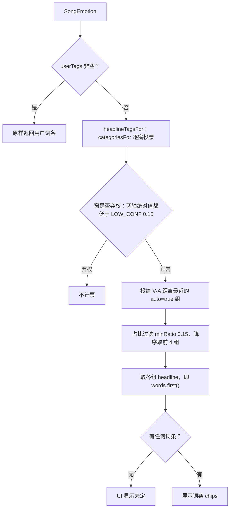
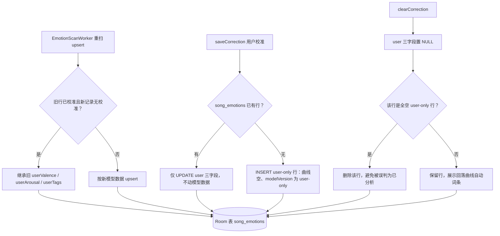

# 情绪领域模型与词表

情绪功能的核心是一个**分层双轨**的领域模型：底层是连续的 valence（愉悦度）/arousal（能量）坐标（均归一到 -1..1），可排序、可插值、可做逐窗曲线；表层是一个封闭的中文词表（10 组 V-A 锚定词），供运营展示与用户交互。两层通过固定函数互相换算：`EmotionGroup.categoriesFor` 把曲线换算成词条投票，`EmotionGroup.avgOfWords` 把用户勾选词换算回坐标。词表**只做"映射展示层"，绝不做分类训练目标**——这一点写在 `EmotionGroup` 的 KDoc 里，是整个设计的边界声明。

模型文件集中在 `core/model`（`SongEmotion` / `EmotionGroup` / `EmotionTags` / `EmotionSongUiRow`），存储落在 Room `song_emotions` 表（`SongEmotionEntity`），唯一数据源是 `:data` 的 `SongEmotionsRepository`。

## 分层双轨设计：连续坐标打底，中文词表做展示

`EmotionGroup` 枚举定义 10 个情绪组，每组锚定一个 `(anchorV, anchorA)` 坐标并携带一组中文词（名义每组 4 词；**例外是 ABYSS 组只有 3 个词**——"窒息/孤独/深渊"，全表共 39 个不重复词，`SongEmotionSectionTest` 用 `assertEquals(39, all.size)` 锁定这一事实）。组代表词 `headline = words.first()` 用于自动分析展示；用户手动标记可选组内任意词。

| 组 | 词 | anchorV | anchorA | auto |
| --- | --- | --- | --- | --- |
| BRIGHT | 元气 快乐 轻快 俏皮 | 0.6 | 0.4 | ✓ |
| RAGE | 燃 热血 战斗 力量 | 0.3 | 0.85 | ✓ |
| EPIC | 神圣 浩瀚 震撼 史诗 | 0.2 | 0.5 | ✓ |
| **WITTY** | 鬼畜 沙雕 戏谑 荒诞 | 0.2 | 0.3 | **✗（仅手动）** |
| LOVE | 治愈 心动 缱绻 深情 | 0.6 | -0.1 | ✓ |
| STILL | 静谧 空灵 禅 专注 | 0.3 | -0.55 | ✓ |
| SAD | emo 伤感 遗憾 雨季 | -0.5 | -0.4 | ✓ |
| ANXIOUS | 躁 焦虑 压迫 狂躁 | -0.4 | 0.6 | ✓ |
| CHILL | 放松 慵懒 午后 微醺 | 0.4 | -0.3 | ✓ |
| ABYSS | 窒息 孤独 深渊 | -0.7 | -0.2 | ✓（3 词） |

双轨的意义：连续坐标层服务所有需要"量"的逻辑（逐窗投票、锚点距离、换算校准值），词表层服务所有需要"名"的逻辑（展示词条、随手播配置词条、UI 文案）。`companion object` 维护一张懒加载的 `wordIndex` 反查表，`groupOf(word)` 是词 → 组的唯一入口（词表封闭且无重复词，测试有验证）。

## SongEmotion：分析结果的域模型

`SongEmotion` 是端侧分析器的输出，也是所有读侧消费的统一形态：

- `valence` / `arousal`：全曲逐窗均值；`curve`：逐窗 `(v, a)` 序列，**2.5s hop**（5s 窗 / 2.5s hop），存原始未平滑值，平滑归渲染端；
- `peakSec`：A 轴（能量）正向峰值所在秒数（高潮定位）；`windowsAnalyzed` / `durationSec`：窗口数与时长；
- `modelVersion` / `analyzedAt`：分析时的模型标识与时间戳（前者驱动重扫判定）；
- `embedding`：整曲平均 YAMNet embedding（1024 维），旧数据可为空（见下文"embedding 的现状"）；
- **用户校准三字段**：`userValence` / `userArousal`（多选词条换算的坐标）/ `userTags`（勾选词条名）。

派生属性定义了校准优先与未定带语义：

- `effectiveValence` / `effectiveArousal`：**用户校准优先的有效坐标**（`userValence ?: valence`）；
- `userCorrected`：两个校准坐标都非空才算"已校准"；
- `lowConfidence`：|有效 V| 或 |有效 A| < `LOW_CONF = 0.15`，即均值落在**未定带**——UI 不硬判象限，应显示"氛围：未定"（实际 UI 文案为"未定"，见下文 emotionTagsOf 一节）。

## EmotionGroup：逐窗投票与词↔坐标换算

`EmotionGroup.categoriesFor(curve, topN = MAX_TAGS, minRatio = 0.15f)` 是曲线 → 词条的投票算法：

1. 逐窗遍历，**近零窗弃权**：|v| 与 |a| 同时小于 `SongEmotion.LOW_CONF`(0.15) 的窗不参与投票（曲线为空或全部弃权则返回空）；
2. 每个有效窗按 `(v-anchorV)² + (a-anchorA)²` 找**最近的 `auto = true` 组**投一票；
3. 按占比降序，过滤占比 ≥ `minRatio`(0.15)，取前 `topN`(= `MAX_TAGS = 4`) 组。

`headlineTagsFor(curve)` 在此之上取各组 `headline`，是自动展示词条的直接来源。反向换算 `avgOfWords(words)` 把用户勾选词解析为组集合后取**组锚点均值坐标**（同组多个词即该组锚点；跨组词取锚点平均；非法词/空列表返回 null）——这正是手动校准写库时 `valence/arousal` 的来源。

## WITTY（鬼畜/沙雕/戏谑/荒诞）为何退出自动投票

WITTY 组是唯一的 `auto = false` 组，退出自动曲线投票、只保留手动标记链路。原因写在枚举 KDoc 与测试名 `WITTY excluded from auto voting (center-vacuum fix)` 中，共两条：

1. **文化梗声学上不可分**：鬼畜/沙雕的本质是"故意做坏/重复剪切"的文化梗，声学特征与正经的燃/快乐无法区分——自动投票不可能把它投对；
2. **锚点居中导致吸票误标**：WITTY 锚点 (0.2, 0.3) 恰在 V-A 图中心，YAMNet 输出偏暖的"中庸"窗会被整片吸到最近锚点上，造成大面积误标（测试构造 20 个 (0.2, 0.3) 窗断言投票结果不含 WITTY）。

对下游的影响集中在**随手播候选池与配置页**：

- 随心播配置弹窗 `MoodSlotEditDialog` 单独展示 `manualOnlyTags`（`AppNavHost` 硬编码传入 4 个 WITTY 词），分组标题"仅手动标记计入"，并提示"这组词条不参与自动分析，只有你手动标记过的歌曲会计入"；歌曲数为 0 的 chip 置灰；
- 由于词条歌曲数与候选池都按展示词条（`emotionTagsOf`）统计，而 WITTY 词只会出现在用户手动标记过的歌曲上——选了 WITTY 词但从未手动标记任何歌时，该词条歌曲数为 0，组合候选池为 0 时 `PlayerRandomQueueFacade` 回退全库随机（详见消费端一节）。

## emotionTagsOf：展示词条判定

`emotionTagsOf(emotion)` 是**展示词条的唯一出口**，判定顺序：

1. `userTags` 非空 → 原样返回（**用户词最高优先**，手动标记可以覆盖模型结论）；
2. 否则 → `EmotionGroup.headlineTagsFor(curve)` 逐窗投票取各组 headline；
3. 投票结果为空（近零曲线/低置信）→ 返回空列表，UI 显示**未定**：歌曲详情情绪区显示文字"未定"替代 chips，曲库情绪 Tab 行以"未定"文案与灰色样式呈现。

它的 KDoc 同时记录了 kNN 传播的下线结论（见下节）。所有词条消费方——曲库情绪 Tab、歌曲详情、随手播缓存、时段词条统计——都走这一个函数，历史上"列表与详情两套词条"的分叉正是靠统一出口修掉的。

*展示词条判定：用户词优先，否则逐窗投票；近零窗弃权，低置信曲线得到空词条即"未定"。*

## embedding 的现状：已入库，kNN 已下线

分析器在逐窗推理时累加每窗 YAMNet embedding，最后输出**整曲平均 embedding（1024 维）**随 `SongEmotion` 一起入库，以 base64(float32 小端) 存 `embeddingB64`，旧数据可空。

它曾经的消费者——kNN 锚点传播（未标记歌向相似的手动标记歌"借词"）——已于 2026-08-31 **整体下线**（方案 C）：`EmotionKnn.kt`、`EmotionPersonalizer.kt`、`LocalEmotionAnchors`/`knnAnchors` 接线、DAO 的 `correctedWithEmbedding` 查询全部删除（仓库中已无对应文件）。下线依据是 `docs/architecture/EMOTION_KNN_ANALYSIS.md` 的实测：

- 20 首用户真值留一验证的**传染对率 ~30%**，与"从 7 个组瞎蒙"的随机基线相当；
- 根因是双重结构性问题：YAMNet 表征**音色主导**（同情绪组近邻准确率 43%，随机基线 42%，零信号）+ 高维 **hubness**（全库余弦距离中位数 0.439，任何全局距离阈值都不存在有效值）；
- 这是表征问题而非阈值工程问题，mutual kNN 等止血法只降触发率、不提高准确率。

关键结论：**embedding 不是垃圾字段**。它是未来"用户标记攒够（≥50 首）后离线监督重训 VA 头"的原料，随分析入库的沉没成本为零；当前词条判定只走用户词与曲线投票两条路，不再读 embedding。

## 存储形态：song_emotions 表与 SongEmotionsRepository

`song_emotions` 是 Room `melody.db`（v10，13 实体）中的一张表，主键 `songId`、无外键。迁移轨迹：v8→v9 建表（V/A/curveJson/peakSec/windowsAnalyzed/durationSec/modelVersion/analyzedAt），v9→v10 增列 `embeddingB64` 与用户校准三字段。

`SongEmotionEntity` ↔ `SongEmotion` 的映射由 `SongEmotionsRepository` 的私有扩展函数完成：

| Entity 字段 | 领域模型 | 编解码约定 |
| --- | --- | --- |
| `curveJson` (TEXT NOT NULL) | `curve: List<Pair<Float, Float>>` | **扁平 [v,a,v,a,...] JSONArray**（零额外依赖）；解析失败降级为空曲线 |
| `embeddingB64` (TEXT?) | `embedding: FloatArray?` | base64 编码的 float32 小端字节数组（1024×4 字节） |
| `userTags` (TEXT?) | `userTags: List<String>` | 逗号拼接；读侧 split 后过滤空段 |
| `modelVersion` (TEXT NOT NULL) | `modelVersion` | 模型标识（当前 `"yamnet-va-v3"`）或 `"user-only"` |
| `valence`/`arousal`/`peakSec`/`windowsAnalyzed`/`durationSec`/`analyzedAt` | 同名字段 | 直通 |

*song_emotions 的三条写路径：重扫不吞用户校准、校准只动 user 字段或建 user-only 行、清校准附带删全空行。*

**`SongEmotionsRepository` 是该表的唯一数据源**（`:data` 单例绑定 `MelodyDao`，对外只暴露 `:domain` 的 `SongEmotionRepository` 接口；`:player` 分析器是主要写入方）。三条写路径各有不变式：

- **upsert（重扫路径）**：模型升级重扫时，若新记录不带校准数据而旧行已校准，则**继承旧 `userValence`/`userArousal`/`userTags`** 后再写——重扫不吞用户校准；
- **saveCorrection（校准路径）**：已有分析行 → 仅 UPDATE user 三字段（`updateSongEmotionCorrection`，不动模型数据）；**无分析行**（分析失败/未分析的歌也允许手动标记）→ INSERT 一条仅含 user 字段的行：`curveJson = "[]"`、`windowsAnalyzed = 0`、`durationSec = 0`、`embeddingB64 = null`、`modelVersion = "user-only"`、`analyzedAt = 当前时间`。读侧 `emotionTagsOf` 以 userTags 优先，因此 user-only 行的词条完全来自用户；
- **clearCorrection（恢复自动路径）**：user 三字段置 NULL；随后若该行是"全空 user-only 行"（`windowsAnalyzed == 0` 且无 embedding）则**直接删行**——否则全空行会被列表构建（以 emotion 非空判定"已分析"）误判。

`analyzedVersions()`（`songId → modelVersion` 轻量投影）驱动重扫：`EmotionScanWorker` 以 `analyzed[songId] != EmotionAnalyzer.MODEL_VERSION`（当前 `"yamnet-va-v3"`）判定待分析歌曲，因此换模型后旧数据会被自动重扫（并按上述规则继承校准）。

## 用户校准链路

- **入口 UI**：`EmotionCalibrateDialog` 按 10 组分行展示全部词（39 词，`FlowRow` 换行），多选上限 `MAX_TAGS = 4`（选中态必须用 `SnapshotStateList`，这是注释里记录的重组 bug 教训）；已校准歌曲提供"恢复自动"出口（空词保存即清标记）；预勾选当前展示词条，用户可点掉/增补。
- **控制器**：`:core:ui` 定义 `LocalEmotionCorrectionController`（默认 null），`AppRoot` 在 NavHost 顶层一次性提供——任何渲染歌曲详情情绪区的页面自动获得"不像？标记"能力，无需逐层透传回调。保存成功刷新 `EmotionViewModel`；保存失败（无分析行时清空词、或词表非法）弹 toast，文案仍为"这首歌还没完成分析"。
- **换算与落库**：`AppMediaMetadataViewModel.saveEmotionCorrection` 中，空词 → `clearCorrection`；非空词 → `EmotionGroup.avgOfWords` 换算为组锚点均值坐标后调 `saveCorrection(songId, v, a, words)`。仓库的 `runBlocking(IO)` 桥统一搬到 `Dispatchers.Default` 执行，避免主线程直调。
- **user-only 行的呈现**：详情区对曲线不足 2 窗的行（user-only 行典型形态）不 early-return，而是显示词条列表并标注"已由你标记（自动分析失败，词条以你的标记为准）"；情绪分析详情页的失败歌曲也通过同一个 `EmotionCalibrateDialog` 标记（tags-only 模式：originals 传空、"恢复自动"不可见）。

## 消费端：列表、详情与情境化随心播放

- **曲库「情绪」Tab**：`EmotionViewModel.buildRows` 把 `getAll()` 与曲库拍平为 `EmotionSongRow`（`tags = emotionTagsOf(e)`、`corrected = e.userCorrected`），`AppNavHost` 再二次拍平为 core-model 的 `EmotionSongUiRow`（song/tags/corrected，KDoc 注明曲库情绪 Tab 与情绪分析详情页共用）。`EmotionLibraryView` 用行 tags 提供 chips 多选过滤（`tagOptions` 由全部行 tags 去重而来）、"手动标记优先 + 有词条优先"排序，以及"已校准"角标。
- **歌曲详情**：`SongEmotionSection` 渲染平滑后的 V/A 双曲线（`smoothCurve` 窗口 5 滑动平均、边界缩窗、长度 <3 原样返回）与高潮红点——仅当 `hasSignificantPeak`（A 最大值 > A 均值 + `PEAK_MARGIN = 0.5`，20 首实测分布定标：平缓/全程高能歌 ≤0.49，真高潮歌 ≥0.52）时画，`peakSec` 按 2.5s hop 折算窗下标。
- **情绪时段随心播放**：`PlayerRuntime` 启动时把 `songEmotionRepository.getAll()` 逐首过 `emotionTagsOf` 快照进 volatile `moodEmotionTagsCache`（用户校准因此自然反哺判定）；`PlayerRandomQueueFacade` 在随机队列与无限补队列入口用 `filterByMoodTags` 把候选池过滤为"带任一命中时段词条"的歌，过滤后为空则回退全库随机。`MoodTimeSlotViewModel.tagCounts`（配置页 chip 角标）用同一函数统计每个词条的歌曲数。

## 行为契约测试

`SongEmotionSectionTest` 以纯函数单测锁定模型契约：39 词封闭词表无重复且 `headline = words.first()`；`categoriesFor` 最近组投票、近零窗全弃权返回空；WITTY 不出现在自动投票结果但 `groupOf("鬼畜")` 可达（手动链路不受限）；`headlineTagsFor` 不超过 `MAX_TAGS`；`emotionTagsOf` 用户词覆盖模型结论、低置信返回空；`avgOfWords` 同组词取组锚点、跨组词取锚点均值、非法词返回 null；外加 `smoothCurve` 保长缩噪与 `lowConfidence`/`hasSignificantPeak` 的边界语义。

## 相关页面

- `/openwiki/architecture/data-persistence.md` — Room 库与迁移全景（song_emotions 建表与增列）
- `/openwiki/concepts/mood-time-slot.md` — 情绪词条驱动时段随心播放的完整配置与判定模型
- `/openwiki/workflows/emotion-analysis-pipeline.md` — 批扫 Worker、分析器与失败处理的流程细节
