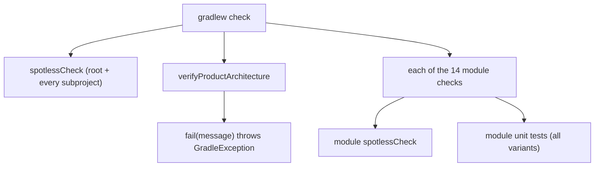
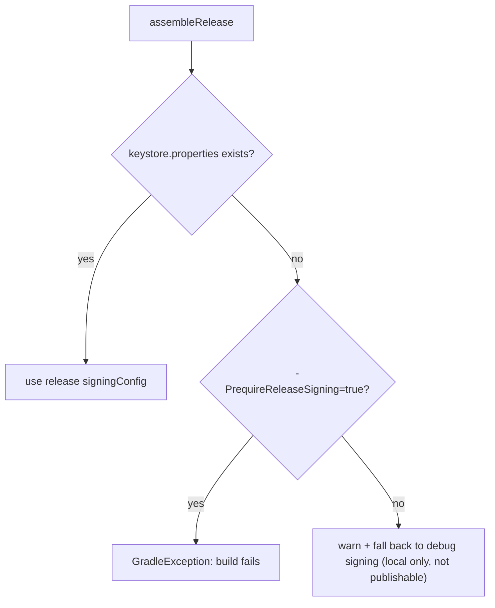

# 构建、校验与发布运维

本页是 `melody-in-heart`（applicationId `cn.com.dcsgo.mihx`）提交前与发布前的操作手册。所有质量门槛由两条机制承担：**命令矩阵**（Gradle 生命周期任务）与 **`verifyProductArchitecture`**（根 `build.gradle.kts` 中约 580 行的自定义校验任务，在每次 `check` 时对全仓库源码树做静态断言）。模块边界的设计动机见 `/openwiki/architecture/module-graph.md`，Room/DataStore 细节见 `/openwiki/architecture/data-persistence.md`。

## 1. 提交前命令矩阵

所有命令在项目根目录执行，Windows 用 `.\gradlew.bat`，macOS/Linux 用 `./gradlew`。

### 1.1 三种构建变体

| 变体 | 定义位置 | 关键差异 |
| --- | --- | --- |
| `debug`（默认） | `buildTypes { debug { ... } }` | 不做混淆/收缩；`applicationIdSuffix = ".debug"` + `versionNameSuffix = "-debug"`，可与 release 同机共存安装；保留全 ABI 以兼容模拟器 |
| `release` | `buildTypes { release { ... } }` | `isMinifyEnabled = true`（R8）+ `isShrinkResources = true` + `proguard-android-optimize.txt`；`ndk.abiFilters += "arm64-v8a"` 仅出 64 位包；`resConfigs("zh", "en")` 裁剪依赖库翻译资源 |
| `benchmark` | `create("benchmark")` | `initWith(getByName("release"))` 继承 release 全部设置，但改用 **debug 签名**、`isDebuggable = false`；在继承的 `arm64-v8a` 之上追加 `x86_64`（真机 + x86_64 模拟器都要能跑）；`matchingFallbacks += listOf("release")` |

### 1.2 常用命令

```bash
# 构建 APK
.\gradlew.bat :app:assembleDebug
.\gradlew.bat :app:assembleRelease
.\gradlew.bat :app:assembleBenchmark

# 单模块快速编译（不打包 APK，改代码后最快反馈）
.\gradlew.bat :data:compileDebugKotlin
.\gradlew.bat :player:compileDebugKotlin

# 全量 JVM 单元测试（无需设备；覆盖 debug/release/benchmark 单测变体）
.\gradlew.bat test

# 单模块 / 单测试类
.\gradlew.bat :player:test --tests "cn.com.dcsgo.mihx.player.window.ControllerQueuePlannerTest"

# 需要真机或模拟器的测试
.\gradlew.bat :app:connectedAndroidTest      # Compose instrumentation 测试
.\gradlew.bat :benchmark:connectedCheck      # Macrobenchmark（含 Baseline Profile 生成）

# 格式化与架构门槛
.\gradlew.bat spotlessCheck                  # 只查格式
.\gradlew.bat spotlessApply                  # 自动格式化
.\gradlew.bat verifyProductArchitecture      # 只查架构/隐私/发布约束
.\gradlew.bat check                          # 提交前全量门槛
```

`connectedAndroidTest` 与 `:benchmark:connectedCheck` 必须有真机/模拟器；MIUI 真机可能因 ROM 限制无法跑 macrobenchmark 的自动授权/帧确认步骤（见 `docs/refactor/PRODUCT_REFACTOR_AUDIT.md`）。

### 1.3 `check` 聚合了什么

根 `build.gradle.kts` 末尾把 `check` 挂到三组任务上：根级 `spotlessCheck`、根级 `verifyProductArchitecture`、以及全部 14 个子项目的 `check`。同时 `subprojects` 块让每个子项目自己的 `check` 依赖其 `spotlessCheck`（Kotlin/Kotlin 脚本/XML 三类格式规则）。因此 `check` 失败可能是格式、架构断言或单元测试三者之一，输出中 `GradleException` 的消息会直接指明是哪条规则。



*提交门槛的聚合关系：格式、架构断言与各模块单测都会在 `check` 中执行；`verifyProductArchitecture` 的每条规则失败都以 `GradleException` 终止构建。*

## 2. `verifyProductArchitecture` 规则清单

任务本体在根 `build.gradle.kts`（`tasks.register("verifyProductArchitecture")`，`group = "verification"`）。实现方式：`doLast` 中自根目录 `walkTopDown` 收集 `kt/kts/java/xml/toml` 文本文件（跳过 `build/`、`.gradle/`、`.git/`、`.idea/`），逐条断言，失败即 `fail(message)` 抛 `GradleException`。**没有增量与白名单机制**——任何新增文件/模块都会进入下一轮扫描。

| # | 类别 | 强制内容（摘要） |
| --- | --- | --- |
| 1 | 格式化基础设施 | Spotless 必须留在 version catalog；根构建声明 `alias(libs.plugins.spotless)`；`check` 必须依赖 `spotlessCheck` |
| 2 | 模块清单与 `.gitignore` | `settings.gradle.kts` 必须包含全部 14 个模块（`:app`、`:core:model`、`:core:common`、`:core:ui`、`:domain`、`:data`、`:player`、6 个 `:feature:*`、`:benchmark`）；每个模块目录的 `.gitignore` 必须含 `/build/`、`/.cxx/`、`/.externalNativeBuild/`、`/captures/` |
| 3 | Hilt 入口 | `MelodyApplication`=`@HiltAndroidApp`、`MainActivity`=`@AndroidEntryPoint`、`AppMediaSessionService`（`:player`）=`@AndroidEntryPoint`、`PlayerViewModel`=`@HiltViewModel`，四个文件必须存在且带注解 |
| 4 | DI 模块存在性 | `app/di/` 的 `CoroutineModule`/`LoggerModule`/`PlayerModule` 与 `data/di/` 的 `RepositoryModule`/`DatabaseModule`/`DataStoreModule` 必须存在，且都是 `@Module` + `@InstallIn(SingletonComponent::class)` 的同名模块 |
| 5 | 架构文档存在性 | `docs/architecture/PLAYBACK_STATE_MACHINE.md` 必须存在并包含 8 个状态词与 `AppMediaSessionService`/`PlaybackController`/`ControllerPlaybackStateSynchronizer`/`PlayerControllerStateFacade`/`PlayerMediaEventFacade`；`docs/refactor/PRODUCT_REFACTOR_AUDIT.md` 必须包含 `Verified`、`Still Not Fully Proven`、`.\gradlew.bat test`、`:app:assembleRelease`、`:app:assembleBenchmark`、`Macrobenchmark`、`:benchmark` |
| 6 | benchmark 模块形状 | `benchmark/build.gradle.kts` + `StartupBenchmark.kt` 必须存在；build 文件必须含 `libs.plugins.android.test`、`targetProjectPath = ":app"`、`androidx.benchmark.macro.junit4`；`StartupBenchmark` 必须含 `MacrobenchmarkRule`、`StartupTimingMetric`、`StartupMode.COLD`、`startActivityAndWait`、`packageName = "cn.com.dcsgo.mihx"` |
| 7 | PerformanceTrace 锚点 | `core/common/.../PerformanceTrace.kt` 必须存在；`MusicRepository` 必须保留 `music_import_scan`、`music_import_folder` 埋点；`PlaybackController` 必须保留 `controller_play_queue`、`controller_prepare_queue`、`controller_sync_queue`、`play_next_command` 埋点 |
| 8 | 播放窗口性能形状测试 | `player/src/test/.../PlaybackWindowPerformanceShapeTest.kt` 必须存在并覆盖 `100`、`500`、`1_000`、`71`、`WindowedControllerQueuePlanner`（100/500/1000 首歌队列下 controller 窗口 ≤ 71 项） |
| 9 | 历史遗留禁用 | 全仓库禁止 `com.dcsgo.data.model` 遗留包引用、禁止 `PlayerViewModelComponents`/`PlayerViewModelComponentFactory`（旧手工装配中枢，已拆为 `PlayerRuntime` + facade/graph）、禁止 Android Things 依赖字符串 |
| 10 | 模块依赖边界 | `feature/**/build.gradle.kts` 禁止 `project(":data")`、`project(":player")` 与任何 `project(":feature:…")`；`feature/domain/player` 的源码禁止 `import cn.com.dcsgo.mihx.data.repository.*|data.local.*`（实现层导入不得外泄）；`MusicRepository` 不得声明 `SongRepository`/`PlaylistRepository`/`MusicImportRepository`/`AlbumArtRepository` 超类型，且四个 `*RepositoryAdapter.kt` 必须存在并实现对应接口；`player/window/` 禁止 import `cn.com.dcsgo.mihx.data.player`；`:core:model` 不得有 res XML 与 `R.(drawable\|string\|color\|dimen\|raw)`/`android.R.` 引用 |
| 11 | feature Route/Screen 模式 | `:feature:lyrics`/`:feature:settings` 必须有 `XxxRoute.kt`+`XxxScreen.kt`；播放统计/秒切歌曲（`:feature:home`）与版本管理（`:feature:user`）同样必须 Route+Screen 化；`AppOverlay.kt`/`AppOverlayHost.kt`/`OverlayRoute.kt` 一旦出现即失败；`:feature:home` 禁止直接 import `cn.com.dcsgo.mihx.ui.lyrics`（歌词 UI 只能经 `:feature:lyrics` 导航） |
| 12 | 权限与设置策略 | `PlayerStartupFacade` 禁止出现 `Bluetooth`；`SettingsScreen` 必须包含「蓝牙播放监听」「申请蓝牙权限」入口；蓝牙监听/播放通知必须是 `PlayerSettingsRepository`（`bluetoothPlaybackMonitoringEnabled`/`playbackNotificationEnabled`）→ DataStore（`BLUETOOTH_PLAYBACK_MONITORING_ENABLED`/`PLAYBACK_NOTIFICATION_ENABLED`）→ `PlayerUiState` 的持久化设置；`AppNavHost`/`AppRoot` 禁止用局部 `remember { }` 持有这两类状态；`PermissionCoordinator` 必须提供带 `onGranted` 回调的通知权限请求；`MainActivity`/`AppRoot`/`PlayerRuntime`/`PlayerStartupFacade` 四个启动路径文件禁止出现 `requestNotificationPermission(`/`requestBluetoothConnectPermission(`/`POST_NOTIFICATIONS`/`BLUETOOTH_CONNECT`（权限只能由用户在设置中触发） |
| 13 | LazyColumn 稳定 key | `app/core/feature` 的 Kotlin 文件中 `items`/`itemsIndexed` 必须在 160 字符内声明 `key =`；裸 `item { }` 禁止 |
| 14 | 日志通道 | 除 `AppLogger.kt` 本体外，禁止 `Log.(d|i|w|e|v|wtf)(` 直接调用——一切日志走 `AppLog`/`AppLogger` |
| 15 | Manifest 约束 | `:app` manifest 禁止声明 `AppMediaSessionService`（必须由 `:player` manifest 声明）；禁止声明 `READ_MEDIA_AUDIO`/`READ_EXTERNAL_STORAGE`（导入只走 SAF 文档树） |
| 16 | release/benchmark 构建配置 | `app` 的 `release` 块必须含 `isMinifyEnabled = true` 与 `isShrinkResources = true`；必须存在 `create("benchmark")` 且 `initWith(getByName("release"))` |
| 17 | 隐私/备份排除 | `backup_rules.xml` 与 `data_extraction_rules.xml` 必须各自包含全部 10 项排除（见 §3.3） |
| 18 | Room schema 不可变 | `data/schemas/.../MelodyDatabase/` 的 `1.json`/`2.json`/`3.json` 必须存在；v1 禁止含 `quick_skip_short_play_counts`、v2 必须含且禁止含 `lrcUri`、v3 必须含 `lrcUri`；`DatabaseModule` 必须注册 `Migration(1, 2)`、`Migration(2, 3)` 并 `addMigrations(MIGRATION_1_2, MIGRATION_2_3)` |

**release 块的正则陷阱（改动 `app/build.gradle.kts` 前必读）**：任务用正则 `release\s*\{([\s\S]*?)\n\s*\}` 截取 release 块做规则 16 的检查，该正则在**第一个闭合花括号**处截断。因此签名决策（`releaseSigningConfig`）被刻意移到 `buildTypes` 之外、`release` 块内只保留一行 `signingConfig = releaseSigningConfig` 赋值；若在 release 块内加入嵌套花括号（如再放一个 `ndk {}` 之外的子块且把 `isMinifyEnabled` 挤到其后），检查会被截断而误报或漏检。`ndk { abiFilters += "arm64-v8a" }` 位于块尾是安全的，但新增配置应遵循「平铺赋值、不加嵌套」的约定。

## 3. release 发布约束

### 3.1 ABI 与资源裁剪

`minSdk 33` 起真实设备全部是 64 位，release 只打 `arm64-v8a`；`resConfigs("zh", "en")` 裁掉依赖库的其他语言翻译，显著缩小 `resources.arsc`。审计记录 release APK 约 6–7 MB（`docs/refactor/PRODUCT_REFACTOR_AUDIT.md`）。debug/benchmark 保留多 ABI 以兼容 x86_64 模拟器。

### 3.2 R8 与 ProGuard 规则

release 启用 R8 混淆 + 资源收缩，规则文件 `app/proguard-rules.pro` 手工保留：

- manifest/会话入口：`MelodyApplication`、`MainActivity`、`AppMediaSessionService`；
- Hilt/Room/Media3 反射所需属性（`Signature`、`RuntimeVisibleAnnotations` 等）；
- `MelodyDatabase` 与全部 entity 类（便于诊断 release 崩溃）；
- `FfmpegAudioDecoder`/`FfmpegLibrary`——`:player` 的 `FfmpegPcmDecoder` 通过反射驱动 Jellyfin FFmpeg 扩展的 package-private 解码器（`FfmpegLibraryProbe` 以 `Class.forName` 探测），R8 改名/裁剪会直接破坏解码路径。

### 3.3 签名策略与隐私排除



*release 签名决策：`keystore.properties`（已 gitignore，含 `storeFile/storePassword/keyAlias/keyPassword`）缺失时，本地构建回退 debug 签名并告警；发布/CI 必须传 `-PrequireReleaseSigning=true`，缺失密钥直接失败，避免误出 debug 签名的“正式包”。*

隐私排除是规则 17 的清单，两个规则文件（`backup_rules.xml` 的 `<full-backup-content>` 与 `data_extraction_rules.xml` 的 `cloud-backup` + `device-transfer`）必须各含全部条目：遗留 SharedPreferences（`music_player_prefs.xml`、`play_stats_prefs.xml`、`quick_skip_songs_prefs.xml`）、Room 全家（`melody.db`、`-journal`、`-shm`、`-wal`）、DataStore（`datastore/player_settings.preferences_pb`、`datastore/playback_state.preferences_pb`）、专辑封面缓存（`cache/album_art/` 等）。依据：库/播放状态绑定本机（SAF URI 出设备即失效），备份只会增加恢复负载与隐私面。**新增持久化文件时必须同步加进两个规则文件，否则架构门槛失败。**

## 4. Baseline Profile 与 `:benchmark` 模块

### 4.1 Baseline Profile 流转

- 产物：`app/src/main/baselineProfiles/baseline-prof.txt`，约 2425 条规则（由 Pixel 6 模拟器生成，见审计文档）。
- 打包：release 构建自动打包，`androidx.profileinstaller`（1.4.1，`app` 依赖）负责安装，提升冷启动与首屏滚动。
- 再生成：跑 `:app:generateBaselineProfile` 或 `:benchmark:connectedCheck`，`BaselineProfileGenerator` 覆盖启动 + 首页/播放页与歌单页滚动路径后回写同一文件。改了启动路径或首页列表实现后应重新生成。

### 4.2 `:benchmark` 模块

| 类 | 指标 / 规则 | 行为 |
| --- | --- | --- |
| `StartupBenchmark` | `StartupTimingMetric`，`StartupMode.COLD`，5 次迭代 | `pressHome()` 后 `startActivityAndWait()` 测冷启动 |
| `ScrollBenchmark` | `FrameTimingMetric`（P50/P90/P95 帧时间），冷启动 | 首页上下各滑动 3 次，覆盖 LazyColumn 项创建/复用路径 |
| `BaselineProfileGenerator` | `BaselineProfileRule.collect` | 启动 + 滚动采集，产物写回 `baseline-prof.txt` |

模块形状：`com.android.test` 插件、`targetProjectPath = ":app"`、`android.experimental.self-instrumenting = true`、仅启用 `benchmark` 变体（`androidComponents.beforeVariants` 过滤）、debug 签名、`testInstrumentationRunnerArguments["androidx.benchmark.suppressErrors"] = "EMULATOR"`（模拟器结果带警告不中断）。运行需真机/模拟器；MIUI ROM 可能阻断 macrobenchmark 的自动授权/帧确认步骤；审计记录的模拟器冷启动中位数约 810 ms（软件渲染），真机验收仍未完成。

### 4.3 PerformanceTrace 埋点策略

`core/common` 的 `PerformanceTrace` 是刻意设计的可观测性开关，不是日志副作用：

- `isEnabled` 初始值 = `BuildConfig.DEBUG`：**debug 默认全开，release 默认静默**（隐私 + 音量决策）；
- `allow(operation)`/`disallow(operation)` 提供 release 白名单，关键播放链路可在线上继续输出；
- `measure { }`/`log { }` 输出经 `AppLog.info`，metadata 会先走 `redactSensitiveValuesForLog()` 脱敏；
- `core/common` 为此显式开启 `buildFeatures { buildConfig = true }`。

锚点（被架构门槛锁定）：`MusicRepository` 的 `music_import_scan`/`music_import_folder`，`PlaybackController` 的 `play_next_command`/`controller_play_queue`/`controller_prepare_queue`/`controller_sync_queue`。删除或改名这些字符串字面量会让 `verifyProductArchitecture` 失败。配套的 `PlaybackWindowPerformanceShapeTest` 在 JVM 层锁住 100/500/1000 首歌队列的窗口形状（51–71 项）。

## 5. Room schema 流程

`:data` 通过 KSP 导出 schema：`ksp { arg("room.schemaLocation", "$projectDir/schemas") }`，`MelodyDatabase` 声明 `version = 10, exportSchema = true`，历史快照在 `data/schemas/cn.com.dcsgo.mihx.data.local.MelodyDatabase/1.json…10.json`。每次实体/DAO 变更的工作流：

1. 修改 `data/src/main/java/cn/com/dcsgo/mihx/data/local/{entity,dao}` 下的实体/DAO。
2. `MelodyDatabase` 版本号 +1（当前 10 → 11）。
3. 构建一次 `:data`，KSP 自动在 `data/schemas/.../` 生成新版本 JSON（不要手写）。
4. 在 `DatabaseModule` 增加 `Migration(N, N+1)` 并加入 `addMigrations(...)`（现有 `MIGRATION_1_2`…`MIGRATION_9_10` 全部注册）。
5. 涉及复杂搬数的迁移补一个聚焦单测。
6. **绝不修改已存在的 schema JSON**——它们是不可变快照，`verifyProductArchitecture` 规则 18 会以 v1/v2/v3 的内容差异检测篡改。

完整迁移史（1→2 建 `quick_skip_short_play_counts`，2→3 加 `lrcUri`，……9→10 加 `embeddingB64` 等情感字段）见 `/openwiki/architecture/data-persistence.md`。

## 6. 关键版本与兼容约束

| 项 | 值 | 约束 |
| --- | --- | --- |
| Kotlin | 2.0.21 | Compose 编译器已内置于 Kotlin 2.0+，模块必须应用 `org.jetbrains.kotlin.plugin.compose`（`kotlin-compose` 别名）；**禁止再写 `composeOptions { kotlinCompilerExtensionVersion }`**——旧机制在新插件下无效 |
| KSP | 2.0.21-1.0.28 | 前缀必须与 Kotlin 版本精确一致，升级 Kotlin 必须同步升级 KSP |
| AGP | 8.13.2 | `compileSdk 36`；`:benchmark` 用 `com.android.test` 同版本插件 |
| Compose BOM | 2025.09.01 | Compose 版本统一由 BOM 管理 |
| Media3 | 1.9.0 + Jellyfin FFmpeg `1.9.0+1` | FFmpeg 解码走反射（见 §3.2 的 keep 规则），升级 Media3 需验证 `FfmpegLibraryProbe` 仍能命中 |
| Room / Hilt / DataStore | 2.6.1 / 2.52 / 1.1.1 | Room schema 导出见 §5 |
| minSdk / targetSdk | 33 / 36 | Java 11 字节码（`compileOptions`/`jvmTarget` 全模块统一 `VERSION_11`） |
| versionName / versionCode | 3.7.0 / 33 | 以 `app/build.gradle.kts` 为准 |

### 6.1 Windows 确定性构建配置

`gradle.properties` 的三行配置组合是 Windows 上可复现校验的前提：

- `kotlin.compiler.execution.strategy=in-process`：Kotlin 编译在 Gradle daemon 内执行。此前 Kotlin daemon 在 Windows 上会因 client marker 文件权限失败并在构建中途回退，导致增量结果不稳定；in-process 消除了该故障源，也因此 **`org.gradle.jvmargs`（`-Xmx2048m`）就是编译实际可用的堆**（`kotlin.daemon.jvmargs=-Xmx1536m` 仅对 out-of-process daemon 生效）。
- `org.gradle.parallel=true` + `org.gradle.caching=true`：多模块并行 + 构建缓存。
- `android.nonTransitiveRClass=true`：各模块 R 类只含自己声明的资源，**跨模块不得用 R 类引用资源**（与规则 10 的 `:core:model` 纯净性检查互补）。

**文档漂移提醒**：`CLAUDE.md` 的 Key Versions 表已落后于实际配置（其写 3072 MB 堆、Compose BOM 2024.09.00、versionName 3.5.1/versionCode 29）。`gradle.properties`、`gradle/libs.versions.toml` 与 `app/build.gradle.kts` 才是权威来源；改版本时先看目录文件，并顺手修 `CLAUDE.md`。

## 7. AGENTS.md 与 OpenWiki 约定

- **优先改源码与 `docs/`，不要手改生成页**。`openwiki/` 由定时 GitHub Actions 工作流（`.github/workflows/openwiki-update.yml`，每日 08:00 UTC）用 `openwiki code --update` 重新生成并以 PR 形式提交；手改会被下次运行覆盖。架构事实应写进 `docs/architecture/*.md`（部分内容还被规则 5 锁定），再由 OpenWiki 重新收录。
- **新增日志必须走 `AppLog`/`AppLogger`**（规则 14 硬性强制）。`AndroidAppLogger` 的行为：`debug/info/warning` 仅在 `BuildConfig.DEBUG` 时输出，`error` 始终输出；所有通道的消息与堆栈都会做 `redactSensitiveValuesForLog()` 脱敏（`content://`、`file://`、蓝牙 MAC、设备名、Windows/POSIX 路径替换为占位符）。因此 **release 下实际只有 error 通道会出日志，且已脱敏**——不要为了"release 能看到日志"绕开 AppLog 直写 `android.util.Log`。`AppLog.install(AndroidAppLogger(BuildConfig.DEBUG))` 在 `MelodyApplication.onCreate` 完成装配，未安装前使用静默默认实现。
- **优先最窄的安静验证**（AGENTS.md）：改动哪个模块就跑哪个模块的 `compileDebugKotlin`/`test`，全量 `check` 留给提交前；失败输出必须完整保留，不要截断。

## 相关页面

- `/openwiki/architecture/module-graph.md` —— 模块分层与依赖边界的完整推导（本页规则 10 的设计背景）
- `/openwiki/architecture/data-persistence.md` —— Room/DataStore 持久化细节与完整迁移史（本页 §5 的展开）
- `/openwiki/quickstart.md`、`/openwiki/testing/test-map.md` —— 快速上手与测试地图
