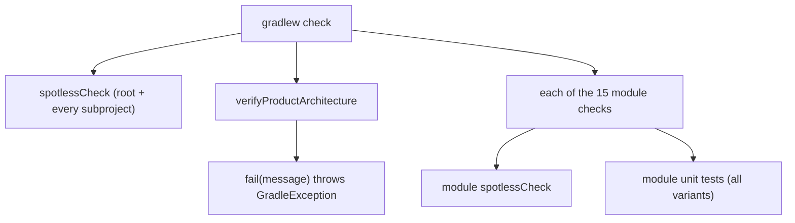
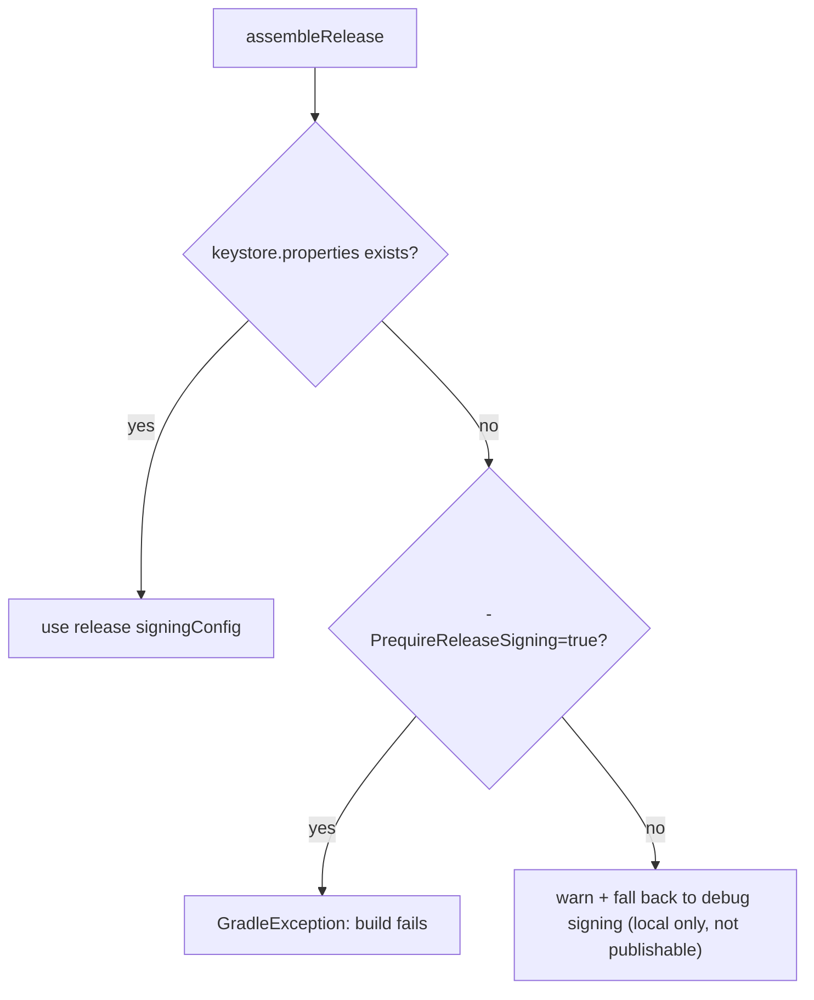

# Build, Verification & Release Operations

This page is the pre-commit and pre-release runbook for `melody-in-heart` (applicationId `cn.com.dcsgo.mihx`). Every quality gate is carried by two mechanisms: the **command matrix** (Gradle lifecycle tasks) and **`verifyProductArchitecture`** (a ~580-line custom verification task in the root `build.gradle.kts` that statically asserts the whole source tree on every `check`). The design rationale for the module boundaries lives in `/openwiki/architecture/module-graph.md`; Room/DataStore details live in `/openwiki/architecture/data-persistence.md`.

## 1. Pre-commit command matrix

All commands run from the project root; use `.\gradlew.bat` on Windows and `./gradlew` on macOS/Linux.

### 1.1 The three build variants

| Variant | Definition | Key differences |
| --- | --- | --- |
| `debug` (default) | `buildTypes { debug { ... } }` | No minification/shrinking; `applicationIdSuffix = ".debug"` + `versionNameSuffix = "-debug"` so it can be installed alongside release on the same device; keeps full ABI for emulator compatibility |
| `release` | `buildTypes { release { ... } }` | `isMinifyEnabled = true` (R8) + `isShrinkResources = true` + `proguard-android-optimize.txt`; `ndk.abiFilters += "arm64-v8a"` ships a 64-bit only package; `resConfigs("zh", "en")` trims dependency-library translation resources |
| `benchmark` | `create("benchmark")` | `initWith(getByName("release"))` inherits all release settings but uses **debug signing** and `isDebuggable = false`; appends `x86_64` on top of the inherited `arm64-v8a` (must run on both real devices and x86_64 emulators); `matchingFallbacks += listOf("release")` |

### 1.2 Common commands

```bash
# Build APK
.\gradlew.bat :app:assembleDebug
.\gradlew.bat :app:assembleRelease
.\gradlew.bat :app:assembleBenchmark

# Single-module fast compile (no APK; fastest feedback after a change)
.\gradlew.bat :data:compileDebugKotlin
.\gradlew.bat :player:compileDebugKotlin
.\gradlew.bat :core:skin:compileDebugKotlin

# Full JVM unit tests (no device; covers debug/release/benchmark test variants)
.\gradlew.bat test

# Single module / single test class
.\gradlew.bat :core:skin:test
.\gradlew.bat :player:test --tests "cn.com.dcsgo.mihx.player.window.ControllerQueuePlannerTest"

# Tests requiring a device or emulator
.\gradlew.bat :app:connectedAndroidTest   # Compose instrumentation tests
.\gradlew.bat :benchmark:connectedCheck   # Macrobenchmark (includes Baseline Profile generation)

# Formatting and architecture gates
.\gradlew.bat spotlessCheck              # format check only
.\gradlew.bat spotlessApply              # auto-format
.\gradlew.bat verifyProductArchitecture  # architecture/privacy/release constraints only
.\gradlew.bat check                      # full pre-commit gate
```

`:app:generateBaselineProfile` regenerates the Baseline Profile (see §4). `connectedAndroidTest` and `:benchmark:connectedCheck` require a real device/emulator; MIUI real devices may be unable to run Macrobenchmark's automatic authorization/frame-confirmation steps because of ROM limitations (see `docs/refactor/PRODUCT_REFACTOR_AUDIT.md`).

### 1.3 What `check` aggregates

The root `build.gradle.kts` wires `check` to three sets of tasks: the root-level `spotlessCheck`, the root-level `verifyProductArchitecture`, and `check` for all 15 subprojects. Meanwhile the `subprojects` block makes each subproject's `check` depend on its own `spotlessCheck` (three formatting rules: Kotlin, Kotlin script, XML). So a `check` failure is one of formatting, architecture assertion, or unit tests; the `GradleException` message in the output names the failing rule.


```mermaid
flowchart TD
    CHECK["gradlew check"] --> SPOT["spotlessCheck (root + every subproject)"]
    CHECK --> ARCH["verifyProductArchitecture"]
    CHECK --> SUB["each of the 15 module checks"]
    SUB --> MODSPOT["module spotlessCheck"]
    SUB --> MODTEST["module unit tests (all variants)"]
    ARCH --> FAIL["fail(message) throws GradleException"]
```

*Aggregation of the commit gate: formatting, architecture assertions, and per-module unit tests all run in `check`; every `verifyProductArchitecture` rule failure aborts the build with a `GradleException`.*

## 2. The `verifyProductArchitecture` rule checklist

The task lives in the root `build.gradle.kts` (`tasks.register("verifyProductArchitecture")`, `group = "verification"`). Implementation: inside `doLast`, `walkTopDown` from the root collects `kt/kts/java/xml/toml` text files (skipping `build/`, `.gradle/`, `.git/`, `.idea/`), asserting rule by rule, failing with `fail(message)` → `GradleException`. **There is no incremental or whitelist mechanism** — any newly added file/module enters the next scan.

| # | Category | Enforced content (summary) |
| --- | --- | --- |
| 1 | Formatting infrastructure | Spotless must stay in the version catalog; the root build declares `alias(libs.plugins.spotless)`; `check` must depend on `spotlessCheck` |
| 2 | Module inventory & `.gitignore` | `settings.gradle.kts` must contain all 15 modules (`:app`, `:core:model`, `:core:common`, `:core:ui`, `:core:skin`, `:domain`, `:data`, `:player`, six `:feature:*`, `:benchmark`); each module directory's `.gitignore` must include `/build/`, `/.cxx/`, `/.externalNativeBuild/`, `/captures/` |
| 3 | Hilt entry points | `MelodyApplication`=`@HiltAndroidApp`, `MainActivity`=`@AndroidEntryPoint`, `AppMediaSessionService` (`:player`)=`@AndroidEntryPoint`, `PlayerViewModel`=`@HiltViewModel`; the four files must exist with the annotations |
| 4 | DI module existence | `app/di/` `CoroutineModule`/`LoggerModule`/`PlayerModule` and `data/di/` `RepositoryModule`/`DatabaseModule`/`DataStoreModule` must exist, each a same-named `@Module` + `@InstallIn(SingletonComponent::class)` |
| 5 | Architecture docs presence | `docs/architecture/PLAYBACK_STATE_MACHINE.md` must exist and contain the 8 states plus `AppMediaSessionService`/`PlaybackController`/`ControllerPlaybackStateSynchronizer`/`PlayerControllerStateFacade`/`PlayerMediaEventFacade`; `docs/refactor/PRODUCT_REFACTOR_AUDIT.md` must contain `Verified`, `Still Not Fully Proven`, `.\gradlew.bat test`, `:app:assembleRelease`, `:app:assembleBenchmark`, `Macrobenchmark`, `:benchmark` |
| 6 | benchmark module shape | `benchmark/build.gradle.kts` + `StartupBenchmark.kt` must exist; the build file must contain `libs.plugins.android.test`, `targetProjectPath = ":app"`, `androidx.benchmark.macro.junit4`; `StartupBenchmark` must contain `MacrobenchmarkRule`, `StartupTimingMetric`, `StartupMode.COLD`, `startActivityAndWait`, `packageName = "cn.com.dcsgo.mihx"` |
| 7 | PerformanceTrace anchors | `core/common/.../PerformanceTrace.kt` must exist; `MusicRepository` must keep `music_import_scan`/`music_import_folder`; `PlaybackController` must keep `controller_play_queue`/`controller_prepare_queue`/`controller_sync_queue`/`play_next_command` |
| 8 | Playback window performance shape test | `player/src/test/.../PlaybackWindowPerformanceShapeTest.kt` must exist and cover `100`, `500`, `1_000`, `71`, `WindowedControllerQueuePlanner` (controller window ≤ 71 items under 100/500/1000-song queues) |
| 9 | Legacy ban | whole repo forbids the `com.dcsgo.data.model` legacy package references, `PlayerViewModelComponents`/`PlayerViewModelComponentFactory` (the old manual-assembly hub, split into `PlayerRuntime` + facade/graph), and Android Things dependency strings |
| 10 | Module dependency boundaries | `feature/**/build.gradle.kts` forbids `project(":data")`, `project(":player")`, and any `project(":feature:…")`; `feature/domain/player` sources forbid `import cn.com.dcsgo.mihx.data.repository.*|data.local.*`; `MusicRepository` must not declare `SongRepository`/`PlaylistRepository`/`MusicImportRepository`/`AlbumArtRepository` supertypes, and the four `*RepositoryAdapter.kt` must exist and implement the interfaces; `player/window/` forbids importing `cn.com.dcsgo.mihx.data.player`; `:core:model` must have no res XML and no `R.(drawable\|string\|color\|dimen\|raw)`/`android.R.` references |
| 11 | Feature Route/Screen pattern | `:feature:lyrics`/`:feature:settings` must have `XxxRoute.kt`+`XxxScreen.kt`; play statistics / quick-skip songs (`:feature:home`) and version management (`:feature:user`) likewise must be Route+Screen ized; `AppOverlay.kt`/`AppOverlayHost.kt`/`OverlayRoute.kt` fail immediately if present; `:feature:home` must not directly import `cn.com.dcsgo.mihx.ui.lyrics` |
| 12 | Permission & settings policy | `PlayerStartupFacade` must not contain `Bluetooth`; `SettingsScreen` must expose「蓝牙播放监听」「申请蓝牙权限」entries; Bluetooth playback listening / playback notification must be persisted `PlayerSettingsRepository` (`bluetoothPlaybackMonitoringEnabled`/`playbackNotificationEnabled`) → DataStore (`BLUETOOTH_PLAYBACK_MONITORING_ENABLED`/`PLAYBACK_NOTIFICATION_ENABLED`) → `PlayerUiState` settings; `AppNavHost`/`AppRoot` must not hold either state in local `remember { }`; `PermissionCoordinator` must offer a notification permission request with an `onGranted` callback; the four startup-path files (`MainActivity`/`AppRoot`/`PlayerRuntime`/`PlayerStartupFacade`) must not contain `requestNotificationPermission(`/`requestBluetoothConnectPermission(`/`POST_NOTIFICATIONS`/`BLUETOOTH_CONNECT` (permissions may only be triggered by the user in Settings) |
| 13 | LazyColumn stable keys | `app/core/feature` Kotlin files must declare `key =` within 160 chars of an `items`/`itemsIndexed` call; bare `item { }` is forbidden |
| 14 | Logging channel | apart from `AppLogger.kt` itself, direct `Log.(d|i|w|e|v|wtf)(` calls are forbidden — all logging goes through `AppLog`/`AppLogger` |
| 15 | Manifest placement | the `:app` manifest must not declare `AppMediaSessionService` (the `:player` manifest must); it must not declare `READ_EXTERNAL_STORAGE` (which is forbidden for SAF folder import); **`READ_MEDIA_AUDIO` IS permitted** — it is declared in the `:app` manifest so an already-granted device can fast-scan via `java.io.File`, with SAF document tree remaining the primary path and fallback |
| 16 | release/benchmark build config | `app`'s `release` block must contain `isMinifyEnabled = true` and `isShrinkResources = true`; `create("benchmark")` must exist with `initWith(getByName("release"))` |
| 17 | Privacy/backup exclusions | `backup_rules.xml` and `data_extraction_rules.xml` must each contain all required exclusions (see §3.3) |
| 18 | Room schema immutability | `data/schemas/.../MelodyDatabase/` `1.json`/`2.json`/`3.json` must exist; v1 must not contain `quick_skip_short_play_counts`, v2 must contain it and must not contain `lrcUri`, v3 must contain `lrcUri`; `DatabaseModule` must register `Migration(1, 2)`, `Migration(2, 3)` and `addMigrations(MIGRATION_1_2, MIGRATION_2_3)` |

**The release-block regex trap (read before touching `app/build.gradle.kts`)**: the task extracts the release block with `release\s*\{([\s\S]*?)\n\s*\}` for rule 16, which truncates at the **first closing brace**. That is why the signing decision (`releaseSigningConfig`) is deliberately kept outside `buildTypes`, leaving a single `signingConfig = releaseSigningConfig` line inside the release block; adding a nested brace block inside `release` (e.g. pushing `isMinifyEnabled` after a nested sub-block) makes the check truncate and mis-detect or miss failures. `ndk { abiFilters += "arm64-v8a" }` at the end is safe because it follows the checks; new config should follow the "flat assignments, no nesting" convention.

### 2.1 Skin and "我的" page invariants (enforced by unit tests, not the gate)

The `verifyProductArchitecture` gate does **not** scan `:core:skin` internals; the skin conventions are locked by focused unit tests instead:

- **`LibrarySegmentsMatchSourceTest`** (`:core:skin`) reads the `:feature:playlist` `LibraryTab` enum source and asserts the description's library-page segments match it word-for-word (including order) — a deliberate guard against the P1 "description proves itself" trap.
- **`UserSectionsTest`** (`:feature:user`, 10 cases) asserts `UserSections` keys/`DEFAULT_ORDER` line up with the pre-refactor hardcoded order, that `UserSections.SKIN_SWITCHER == "skinSwitcher"` equals `SkinPartCatalog.SKIN_SWITCHER` literally, and that `parse` is tolerant of unknown/blank input (filtering to known keys).
- **`SkinSwitcherCatalogConsistencyTest`** (`:app`) keeps `UserSections.SKIN_SWITCHER` and `SkinPartCatalog.SKIN_SWITCHER` from drifting apart, since `SkinShellResolver` maps both the `skinSwitcher` and legacy `customSkin` part names to the same `UserSections.SKIN_SWITCHER` partition.

## 3. Release constraints

### 3.1 ABI & resource trimming

Since `minSdk 33`, all real devices are 64-bit, so release ships only `arm64-v8a`; `resConfigs("zh", "en")` trims other languages' translated resources for the dependency libraries, shrinking `resources.arsc`. The audit records the release APK at roughly 6.2 MB (`docs/refactor/PRODUCT_REFACTOR_AUDIT.md`). debug/benchmark keep multiple ABIs to stay compatible with x86_64 emulators.

### 3.2 R8 & ProGuard rules

Release enables R8 minification + resource shrinking. `app/proguard-rules.pro` manually keeps:

- manifest/session entry points: `MelodyApplication`, `MainActivity`, `AppMediaSessionService`;
- Hilt/Room/Media3 reflection-required attributes (`Signature`, `RuntimeVisibleAnnotations`, etc.);
- `MelodyDatabase` and all entity classes (so release crashes stay diagnosable);
- `FfmpegAudioDecoder`/`FfmpegLibrary` — `:player`'s `FfmpegPcmDecoder` reflectively drives the Jellyfin FFmpeg extension's package-private decoders (`FfmpegLibraryProbe` probes with `Class.forName`); R8 renaming/trimming would break the decode path.

### 3.3 Signing strategy & privacy exclusions


```mermaid
flowchart TD
    START["assembleRelease"] --> KS{"keystore.properties exists?"}
    KS -->|"yes"| REL["use release signingConfig"]
    KS -->|"no"| REQ{"-PrequireReleaseSigning=true?"}
    REQ -->|"yes"| ERR["GradleException: build fails"]
    REQ -->|"no"| DBG["warn + fall back to debug signing (local only, not publishable)"]
```

*Release signing decision: when `keystore.properties` (gitignored; holds `storeFile/storePassword/keyAlias/keyPassword`) is missing, a local build falls back to debug signing with a warning; releases/CI must pass `-PrequireReleaseSigning=true`, which fails the build without the key so a debug-signed "official" APK can't slip out.*

The privacy exclusions are rule 17's checklist; both rule files (`backup_rules.xml`'s `<full-backup-content>` and `data_extraction_rules.xml`'s `cloud-backup` + `device-transfer`) must each contain every entry: the legacy SharedPreferences files (`music_player_prefs.xml`, `play_stats_prefs.xml`, `quick_skip_songs_prefs.xml`); the full Room family (`melody.db`, `melody.db-journal`, `melody.db-shm`, `melody.db-wal`); the DataStore files (`datastore/player_settings.preferences_pb`, `datastore/playback_state.preferences_pb`, and the newer `datastore/playlist_resume.preferences_pb`, `datastore/mood_time_slot.preferences_pb`, `datastore/emotion_failures.preferences_pb`); and the album-art caches (`album_art_cache/`, `album_art/`, `cache/album_art/`). Rationale: library/playback state is device-bound (SAF URIs become invalid off-device), so backup only adds restore load and privacy surface. **When adding a new persisted file, add it to both rule files, or the architecture gate fails** (rule 17's required subset — the three prefs, the four melody.db variants, `player_settings` + `playback_state` DataStore files, and `cache/album_art/` — is the hard gate; the other DataStore/cache paths are part of the source rule files).

## 4. Baseline Profile & the `:benchmark` module

### 4.1 Baseline Profile flow

- Artifact: `app/src/main/baselineProfiles/baseline-prof.txt` (~2425 rules, generated on a Pixel 6 emulator per the audit doc).
- Packaging: release builds package it automatically; `androidx.profileinstaller` (1.4.1, an `app` dependency) installs it to improve cold start and first-screen scrolling.
- Regeneration: run `:app:generateBaselineProfile` or `:benchmark:connectedCheck`; `BaselineProfileGenerator` covers startup + home/player and playlist-page scrolling paths and rewrites the same file. Regenerate after changing the startup path or home-list implementation.

### 4.2 The `:benchmark` module

| Class | Metric / rule | Behavior |
| --- | --- | --- |
| `StartupBenchmark` | `StartupTimingMetric`, `StartupMode.COLD`, 5 iterations per test | Two cold-start tests: `coldStartupWithoutBaselineProfile` (`CompilationMode.None()`) vs `coldStartupWithBaselineProfile` (`CompilationMode.Partial(baselineProfileMode = Requirement)`); each does `pressHome()` then `startActivityAndWait()` to measure cold start with/without baseline-profile precompilation |
| `ScrollBenchmark` | `FrameTimingMetric` (P50/P90/P95 frame times), cold start, 5 iterations | Swipes the home screen down and up 3 times each, covering LazyColumn item creation/reuse paths |
| `BaselineProfileGenerator` | `BaselineProfileRule.collect` | Startup + scroll collection; writes back to `baseline-prof.txt` |

Module shape: `com.android.test` plugin, `targetProjectPath = ":app"`, `android.experimental.self-instrumenting = true`, only the `benchmark` variant enabled (`androidComponents.beforeVariants` filter), debug signing, and `testInstrumentationRunnerArguments["androidx.benchmark.suppressErrors"] = "EMULATOR"` (emulator results are flagged as warnings, not aborted). Running requires a real device/emulator; MIUI ROMs may block Macrobenchmark's automatic authorization/frame-confirmation steps; the audit records an emulator cold-start median of ~810 ms (software-rendered) and notes real-device acceptance is still incomplete.

### 4.3 `PerformanceTrace` anchor strategy

`core/common`'s `PerformanceTrace` is a deliberate observability switch, not a logging side effect:

- `isEnabled` initial value = `BuildConfig.DEBUG`: **debug defaults to on, release stays silent** (privacy + volume decision);
- `allow(operation)`/`disallow(operation)` provide a release whitelist so key playback paths can keep emitting in production;
- `measure { }`/`log { }` output through `AppLog.info`, with metadata going through `redactSensitiveValuesForLog()` first;
- `core/common` explicitly turns on `buildFeatures { buildConfig = true }` for this.

Anchors (locked by the architecture gate): `MusicRepository`'s `music_import_scan`/`music_import_folder`, and `PlaybackController`'s `play_next_command`/`controller_play_queue`/`controller_prepare_queue`/`controller_sync_queue`. Deleting or renaming these string literals fails `verifyProductArchitecture`. The companion `PlaybackWindowPerformanceShapeTest` locks the window shape (51–71 items) of 100/500/1000-song queues at the JVM layer.

## 5. Room schema flow

`:data` exports schemas via KSP: `ksp { arg("room.schemaLocation", "$projectDir/schemas") }`, with `MelodyDatabase` declaring `version = 10, exportSchema = true`; historical snapshots live in `data/schemas/cn.com.dcsgo.mihx.data.local.MelodyDatabase/1.json…10.json`. Workflow for any entity/DAO change:

1. Modify the entity/DAO under `data/src/main/java/cn/com/dcsgo/mihx/data/local/{entity,dao}`.
2. Bump `MelodyDatabase` version by 1 (currently 10 → 11).
3. Build `:data` once — KSP auto-generates the new-version JSON in `data/schemas/.../` (don't hand-write).
4. Add `Migration(N, N+1)` in `DatabaseModule` and join it into `addMigrations(...)` (all current `MIGRATION_1_2`…`MIGRATION_9_10` are registered).
5. Add a focused unit test for complex data-migration migrations.
6. **Never modify an existing schema JSON** — they are immutable snapshots, and rule 18 detects tampering by the v1/v2/v3 content deltas.

The full migration history (1→2 adds `quick_skip_short_play_counts`, 2→3 adds `lrcUri`, …9→10 adds `embeddingB64` and other emotion fields) is in `/openwiki/architecture/data-persistence.md`.

## 6. Key versions & compatibility constraints

| Item | Value | Constraint |
| --- | --- | --- |
| Kotlin | 2.0.21 | Compose compiler is built into Kotlin 2.0+; modules must apply `org.jetbrains.kotlin.plugin.compose` (the `kotlin-compose` alias); **the old `composeOptions { kotlinCompilerExtensionVersion }` block is forbidden** — it is ineffective under the new plugin |
| KSP | 2.0.21-1.0.28 | Prefix must match the Kotlin version exactly; upgrading Kotlin requires a synchronized KSP upgrade |
| AGP | 8.13.2 | `compileSdk 36`; `:benchmark` uses `com.android.test` at the same version |
| Compose BOM | 2025.09.01 | Compose versions are centralized via the BOM |
| Media3 | 1.9.0 + Jellyfin FFmpeg `1.9.0+1` | FFmpeg decoding is reflective (see §3.2 keep rules); after a Media3 upgrade, verify `FfmpegLibraryProbe` still hits |
| Room / Hilt / DataStore | 2.6.1 / 2.52 / 1.1.1 | Room schema export per §5 |
| minSdk / targetSdk | 33 / 36 | Java 11 bytecode (`compileOptions`/`jvmTarget` set to `VERSION_11` repo-wide) |
| versionName / versionCode | 3.10.2 / 44 | Authoritative in `app/build.gradle.kts` |

### 6.1 Deterministic Windows build config

`gradle.properties`' three lines are the prerequisite for reproducible verification on Windows:

- `kotlin.compiler.execution.strategy=in-process`: Kotlin compilation runs inside the Gradle daemon. Previously the Kotlin daemon failed on Windows over client-marker file permissions and fell back mid-build, making incremental results unstable; in-process removes that failure source, which also means **`org.gradle.jvmargs` (`-Xmx2048m`) is the heap compilation actually has available** (`kotlin.daemon.jvmargs=-Xmx1536m` only affects out-of-process daemons).
- `org.gradle.parallel=true` + `org.gradle.caching=true`: multi-module parallel build + build cache.
- `android.nonTransitiveRClass=true`: each module's R class holds only its own declared resources, so **r classes must not be used to reference resources across modules** (complementing rule 10's `:core:model` purity check).

**Doc-drift note**: `CLAUDE.md`'s Key Versions table has fallen behind the real config (it still lists Compose BOM 2024.09.00 and versionName 3.5.1/versionCode 29). `gradle.properties`, `gradle/libs.versions.toml`, and `app/build.gradle.kts` are the authoritative sources; when bumping versions, read those first and fix `CLAUDE.md` while you're there.

### 6.2 Skin module boundaries

`:core:skin` deliberately carries **no UI dependency**: it depends only on `org.json` and `:core:model` (for `ThemeVariant`), and holds no routing knowledge — the description must be headlessly parseable and validate on-device without UI (also what makes it unit-testable). Only `:app` and `:feature:user` depend on it; the part → host-artifact mapping (routes, drawable ids, section order) happens in `:app`'s `SkinShellResolver`, and `:feature:user` owns both the `UserSections` partition metadata and the skin-switcher section. `:core:skin`'s `build.gradle.kts` must not add a Compose dependency or `R.*`/`AppRoutes` references, or it defeats the module layering the gate enforces.

## 7. AGENTS.md & OpenWiki conventions

- **Prefer changing source and `docs/`, don't hand-edit generated pages.** `openwiki/` is generated from source via `openwiki code --update` (see `/openwiki/.run.json`/`.last-update.json` for the current/last runs); AGENTS.md instructs treating source and tests as authoritative and letting OpenWiki regenerate. The old scheduled `.github/workflows/openwiki-update.yml` workflow is **no longer present** — the only workflow in `.github/workflows/` is `release.yml` — so OpenWiki is refreshed by manual/on-demand `openwiki code --update` runs rather than a daily 08:00 UTC job. Hand-edits to generated pages will be overwritten on the next run; architecture facts belong in `docs/architecture/*.md` (some of which rule 5 locks), then get re-ingested by OpenWiki.
- **New logging must go through `AppLog`/`AppLogger`** (hard rule 14). `AndroidAppLogger` behavior: `debug/info/warning` only emit when `BuildConfig.DEBUG`, `error` always emits; all channels redact messages and stacks through `redactSensitiveValuesForLog()` (`content://`, `file://`, Bluetooth MACs, device names, Windows/POSIX paths replaced with placeholders). So **in release only the error channel actually emits, and it is redacted** — don't bypass `AppLog` for raw `android.util.Log` just to see logs in release. `AppLog.install(AndroidAppLogger(BuildConfig.DEBUG))` is wired in `MelodyApplication.onCreate`; before install the no-op default is used.
- **Prefer the narrowest quiet validation** (AGENTS.md): compile/test only the module you changed — e.g. `:core:skin:test` — and leave the full `check` for pre-commit; preserve complete failure output without truncation.

## Related pages

- `/openwiki/architecture/module-graph.md` — full derivation of module layering and dependency boundaries (design background for rule 10 and §6.2)
- `/openwiki/architecture/data-persistence.md` — Room/DataStore persistence details and the complete migration history (§5's expansion)
- `/openwiki/quickstart.md`, `/openwiki/testing/test-map.md` — quick start and test map
