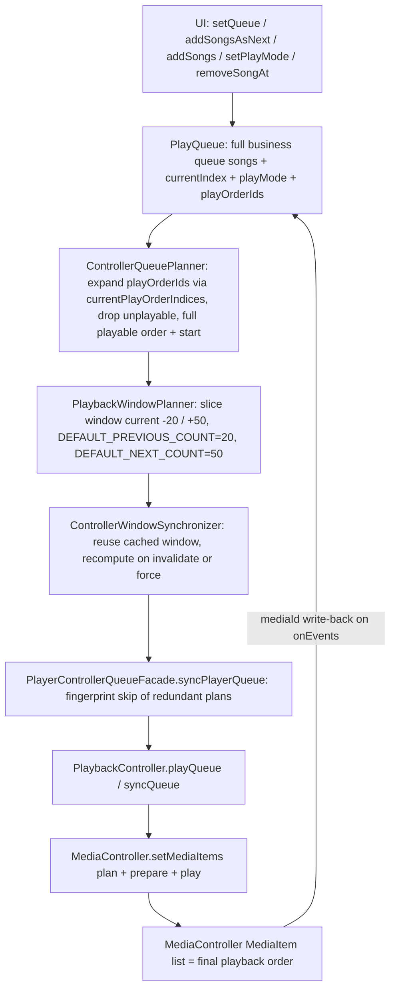

# Playback Queue and Windowed Synchronization

The player runs a **dual-queue model**. `PlayQueue` (in `core/model`) owns the complete business queue and UI state — what the user sees, highlights, and edits. The Media3 `MediaController`'s `MediaItem` list owns the *actual* playback order. A windowed planning layer in `player/window` converts the first into the second, so a 1000-song library can be played from a controller queue of ~70 lightweight items while the UI still shows the full queue.

## Two queues, one source of truth

| | `PlayQueue` (business queue) | `MediaController` queue (playback queue) |
| --- | --- | --- |
| Owner | `core/model/PlayQueue.kt`, held in `PlayerUiState` | `PlaybackController` → Media3 `MediaController` |
| Contents | full `songs` list (duplicates allowed), `currentIndex`, `playMode`, `playOrderIds` | only the planned window of `MediaItem`s (current ±20/50) |
| Purpose | UI display, queue edits, persistence, highlighting | real playback order; next/previous; notification, lock screen, and Bluetooth control |

Three invariants define the relationship:

1. **`MediaController` is the final source of truth for playback order.** In-app next/previous buttons, notification-bar buttons, lock-screen controls, and headset/Bluetooth keys all act on the same controller queue. `PlaybackController.playNext()`/`playPrevious()` call `seekToNextMediaItem()`/`seekToPreviousMediaItem()` (with safe fallbacks when no next/previous item exists).
2. **`PlayQueue` makes no next/previous navigation decisions.** The old `nextIndex()`/`previousIndex()` domain APIs were removed on purpose and must not be reintroduced. What plays next is whatever follows the current item in the controller queue.
3. **All track changes go through `seekToNextMediaItem`.** UI and system-side skips never recompute a "next song" in business code; adding to next simply reshapes the controller queue so that `seekToNextMediaItem()` lands on the right item.

## `PlayQueue`: the business queue

`PlayQueue` is an immutable data class; every operation returns a new instance:

- `songs` — the complete business queue in UI display order. Duplicates are allowed and meaningful.
- `currentIndex` — the current song's index **into `songs`**. It is never a controller-queue index; `MediaController.currentMediaItemIndex` must not be used to locate items in the business list.
- `playMode` — `SEQUENTIAL`, `REVERSE`, or `SHUFFLE` (all modes wrap around).
- `playOrderIds` — the expected playback order as a list of `Song.id`s. Empty means "derive from `playMode`".

### Duplicate queue-item semantics

`playOrderIds` must be interpreted **by occurrence count**: the same id appearing twice means two distinct queue items (a song added to the queue twice through batch append). It is a modeling error to collapse it with `distinct()` or `associateBy { id }` — doing so loses queue items from planning, removal, UI keys, and persistence. To convert the play order back into queue items, use `PlayQueue.currentPlayOrderIndices()`, which maps ids to *indices into `songs`*, resolving each occurrence to a distinct index. `ControllerQueuePlanner` builds the playable order from exactly this call, so every duplicate occurrence survives.

### The ordering seam: `QueueManager.PlayOrderBuilder`

`PlayQueue.buildPlayOrderIds(...)` keeps only the default rules — sequential, reverse, and plain shuffle with the current item first. **Random strategies that need settings or play counts must not be added to `PlayQueue`**: it is a pure model layer and cannot read repositories. Such ordering is injected from the assembly layer through `QueueManager.PlayOrderBuilder`, a `fun interface (songs, startIndex, mode) -> List<Int>` that `QueueManager.createQueue/setPlayMode/withCurrentIndex` apply on top of the queue. A builder can therefore implement uniform-random weighting (fewest-play-count buckets first) without `PlayQueue` knowing about settings — see `/openwiki/player/random-and-infinite.md`.

In today's production wiring `app/di/PlayerModule` builds `PlaybackQueueActionPlanner` with `QueueManager.defaultPlayOrderBuilder` (which delegates back to `PlayQueue.buildPlayOrderIds`, i.e. pure shuffle), while uniform-random weighting is applied by `RandomQueuePlanner`/`UniformRandomPlanner` in the random-queue and infinite-refill paths. The `PlayOrderBuilder` seam is the extension point if `SHUFFLE` mode itself should ever become settings-aware (`PlaybackQueueActionPlannerTest` locks the injection behavior).

### Shuffle stability on index changes

`PlayQueue.withCurrentIndex(index)` in `SHUFFLE` mode with a complete play order **rotates** the existing `playOrderIds` so the target song leads, instead of reshuffling. This is deliberate: reshuffling on every sync/track change generated a new random order each time, which replaced the controller list over and over (a sync feedback loop).

## The windowed planning pipeline

Windowing is layered, and the boundaries must stay inside `player/window` — window logic must not leak into UI or individual ViewModel methods.

1. **`ControllerQueuePlanner`** (`domain/playback`, pure, Media3-free). Expands the full business queue into the complete *playable* controller order via `currentPlayOrderIndices()`, filters unplayable songs (default rule: `song.uri != null`), and maps the requested business index to the start position in that ordered list. If the requested song is unplayable, it starts at the next playable item after it, falling back to the previous playable item (`playable.lastIndex`). Returns `ControllerQueuePlan(songs, startIndex)` with `remainingAfterStart` for tail-detection.
2. **`PlaybackWindowPlanner`** (`player/window`). Slices the full playable order into a window: `DEFAULT_PREVIOUS_COUNT = 20` items before the current item and `DEFAULT_NEXT_COUNT = 50` after it (clamped at queue boundaries). Produces `PlaybackWindowState(songs, controllerStartIndex, fullQueueStartIndex, fullQueueCurrentIndex)` — the bridge between window-local indices and full-queue indices.
3. **`ControllerWindowSynchronizer`** (`player/window`). Caches the most recent window. `planIfNeeded` skips replanning while the current song id is still inside the cached window; `planControllerQueue(force = true)` invalidates and recomputes. It maps the window into a `ControllerQueuePlan` whose `startIndex` points at the current song's position inside the window.
4. **`WindowedControllerQueuePlanner`** implements `ControllerQueuePlannerPort`: `plan(queue, requestedIndex)` moves the queue cursor with `queue.withCurrentIndex(requestedIndex)` and **forces** a fresh window. Hilt (`PlayerModule.provideControllerQueuePlanner`) binds it as the singleton port consumed by `PlayerRuntime` — `PlayerControllerQueueFacade.syncPlayerQueue` for resyncs and `PlaybackSessionCoordinator.startQueuePlayback/prepareQueue` for (re)starts.

*The windowed pipeline from a UI queue operation to `MediaController.setMediaItems`: the business queue stays complete, the controller only ever receives the planned window, and the controller's current item is written back to the business queue by `mediaId`.*

## Operation-by-operation synchronization

### Start playback (five steps)

1. The UI passes a context song list and a target song. `PlayerQueueFacade.setPlayQueue` runs `PlaybackQueueActionPlanner.replaceQueue` → `QueueManager.createQueue`.
2. `PlayQueue.setQueue(...)` stores the complete business queue and builds `playOrderIds` for the mode (a settings-aware random mode would rebuild the order through the injected `PlayOrderBuilder` here).
3. `WindowedControllerQueuePlanner.plan(...)` produces the windowed, playable `ControllerQueuePlan` and start index (via `PlaybackSessionCoordinator.startQueuePlayback`, which plans the window then hands it to the controller).
4. `PlaybackController.playQueue(plan)` calls `MediaController.setMediaItems(plan.toMediaItems(), plan.startIndex, 0L)` with `REPEAT_MODE_ALL`.
5. `prepare()` + `play()` start playback.

The same port is reused by restore (`prepareQueue`), which prepares to a position without autoplay and is the only path guarded against overwriting a live session.

### Switching play mode

1. `PlaybackQueueActionPlanner.setPlayMode` → `QueueManager.setPlayMode` rebuilds `playOrderIds` from the current song and the new mode, applying the injected `PlayOrderBuilder` (this is where a uniform-random builder would take effect; the default builder keeps pure shuffle).
2. The plan's action is `SyncQueue`: `syncPlayerQueue(...)` re-plans the controller queue.
3. The `MediaController.mediaItems` order becomes the new real playback order — `MediaController` is the truth, not the freshly built `playOrderIds`.

### Add to next

1. `PlayQueue.addSongAsNext / addSongsAsNext` updates the business queue and `playOrderIds`. Batch input is **deduplicated by song id**; a target already in the queue is *moved* to directly after the current song — the current item itself stays as the anchor, so repeating "add to next" always takes immediate effect. The result forces `SEQUENTIAL` mode and reports the inserted count; an empty queue makes the deduplicated input the new queue starting at index 0.
2. `syncPlayerQueue(...)` rebuilds the current window (forced replan); the target lands inside the new window as the next item (`ControllerWindowSynchronizerTest.forcedPlanAfterAddNextInvalidatesWindow` locks this).
3. What actually plays next is decided by `MediaController.seekToNextMediaItem()` — in-app, notification, and headset "next" all hit the same item. The facade also records the target as `nextPlaySongId`/`playModeBeforeNext` so the pre-next play mode is restored after the skip.

### Batch append to tail

Single-song "add to queue" stays deduplicated (`addSong` ignores an id already present). Batch "add to tail" (`addSongs`, playlist wholesale append) **allows duplicates on purpose**. After appending, `PlayQueue.songs`, `playOrderIds`, the persisted JSON, and the controller queue must all keep the duplicate items; the queue panel therefore removes a specific item **by queue index**, never "first/all occurrences of id".

### Removing by queue index

`removeSongAt(index)` deletes one occurrence: removing an item before the current one decrements `currentIndex`, removing the current one keeps the position clamped to the new bounds. `PlaybackQueueActionPlanner.removeSongAt` maps outcomes to actions: non-current removal → `SyncQueue`; removal of the current song → replay from the new `currentIndex` (`PlayQueueIndex`); queue emptied → `ClearController` (plus clearing current-song UI state). The index-based removal is what keeps duplicate queue items independently removable.

## Write-back: following the controller

System-side track changes (headset, lock screen, notification) mutate the controller queue directly:

1. `PlaybackController`'s `Player.Listener.onEvents(...)` emits a `ControllerPlaybackSnapshot` (`mediaId`, playing state, position, duration) on every event batch.
2. `ControllerPlaybackStateSynchronizer.sync` resolves the song by parsing `mediaId` back to `Song.id` and updates `currentSong` and `PlayQueue.currentIndex` so the bottom bar, playlist highlight, and queue panel follow the actually playing item.
3. Duplicate-safe: if the current business index already points at a song with the same id, the synchronizer keeps that index instead of jumping to the first occurrence — duplicate items share one `mediaId`, so naive lookup would snap back to the first entry.

Window-tail wrap detection is part of the same write-back path: under `REPEAT_MODE_ALL`, wrapping from the last window item to index 0 is detected **by index** (`isMediaItemWrap`), because Media3 reports wraps as `SEEK`/`AUTO` transitions — `MEDIA_ITEM_TRANSITION_REASON_REPEAT` only means single-item repeat. The wrap flag tells the infinite-play refill logic that the window is exhausted (see `/openwiki/player/random-and-infinite.md`).

## Duplicates across persistence

`PlaybackStateStore` + `PlaybackStateSnapshotSerializer` persist `songIds`, `currentIndex`, `playMode`, and `playOrderIds` as JSON arrays **by occurrence** — encoding calls `currentPlayOrderIds()`, and restoration filters the persisted order to ids still present and does *not* deduplicate it. Restore prefers the persisted `currentSongId` to fix `currentIndex`; if the current song is missing from the restored queue, it is kept only if the library still contains it. Save/restore of duplicate-heavy queues therefore round-trips without losing queue items.

## Invariants to keep

- `PlayQueue.currentIndex` is a business index into `PlayQueue.songs`; `MediaController.currentMediaItemIndex` is a controller-window index. Never use one as the other.
- `Song.id` ↔ `MediaItem.mediaId` are one-to-one (`SongMediaItemMapper` sets `mediaId = Song.id.toString()` and requires `song.uri`).
- `PlayQueue.songs` may contain duplicates: planning, persistence, UI keys, and removal must work per queue item/index, never assuming ids are unique.
- Unplayable songs never enter the controller queue, but stay in the full business queue for UI display and error reporting (e.g. `PlayerErrorFacade` reports the missing file).
- Any play-order change must reach `MediaController` through `WindowedControllerQueuePlanner` (or a same-layer planner) before playback reflects it; both facade and controller fingerprint plans (`songIds + startIndex`) to skip redundant `setMediaItems` rebuilds, and a real rebuild preserves position and playing state.
- Do not reintroduce `PlayQueue.nextIndex()`/`previousIndex()`, and do not move settings- or play-count-aware random ordering into `PlayQueue` — inject it via `QueueManager.PlayOrderBuilder` from the assembly layer.
- Window boundaries, cache invalidation, and window→full-queue mapping stay in `player/window`.

## Test anchors

Window semantics are locked by tests; changing the pipeline without updating these is a regression:

- `player/src/test/.../window/ControllerWindowSynchronizerTest.kt` — window contents and start index for 100-song queues, clamping at both ends, reverse and stable-shuffle ordering, non-forced reuse that moves the start to the current song, forced invalidation after add-next, `null` for empty queues.
- `player/src/test/.../window/PlaybackWindowPlannerTest.kt` — window bounds and `PlaybackWindowState` fields (`fullQueueStartIndex`, `controllerStartIndex`).
- `player/src/test/.../window/PlaybackWindowPerformanceShapeTest.kt` — the controller queue stays bounded (≤71 items, ≥51) for 100/500/1000-song libraries at start/middle/end, and a shuffled window keeps the current song first instead of expanding to the full queue.
- `player/src/test/.../data/player/MediaItemWrapDetectionTest.kt` — the index-based wrap rule (window tail → index 0), including the tiny-window and empty/single-item edge cases.

`ControllerQueuePlannerTest` (domain) additionally locks order expansion, stable shuffle, and unplayable-song skipping.

## Related pages

- `/openwiki/player/random-and-infinite.md` — uniform random, infinite-play refill, and the `PlayOrderBuilder` injection point.
- `/openwiki/player/service-and-controller.md` — `PlaybackController`, MediaSession service, and system-side control paths.
- `/openwiki/player/state-machine.md` — playback state transitions driven by controller snapshots.
