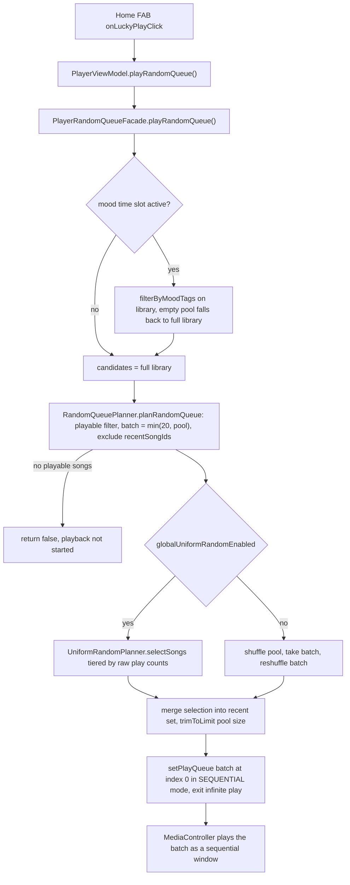
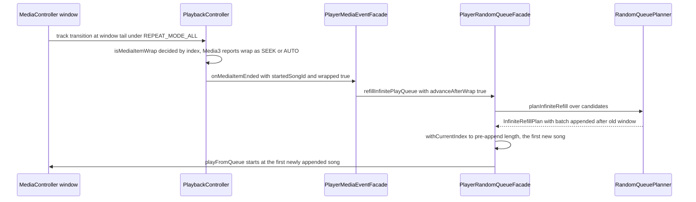

# Random Playback and Infinite Random

Lucky play (random queue) and infinite random are two planner-driven entry points over the same domain core. `RandomQueuePlanner` (in `domain/playback`) is a pure decision maker: it filters playables, batches, evicts recently played songs, and, when uniform random is on, delegates selection to `UniformRandomPlanner`. The feature layer (`PlayerRandomQueueFacade`) owns the stateful side — the in-memory recent-played set, infinite-play flags, and the calls that push a plan into `setPlayQueue` / `syncPlayerQueue` / `playFromQueue`. `PlayerMediaEventFacade` and `PlayerPlaybackFacade` are the trigger points that keep an infinite queue topped up as the window drains.

The windowed-queue plumbing the plans feed into (controller windows, `REPEAT_MODE_ALL`, fingerprinted syncs) is described in `/openwiki/player/queue-architecture.md`; the facade wiring itself is catalogued in `/openwiki/player/runtime-facades.md`.

## Key injection points

Three dependencies decide how random the chain actually is, and all of them are injected rather than hard-wired:

- **`rawPlayCounts`** — a `(List<Int>) -> Map<Int, Int>` callable on `PlayerRandomQueueFacade` (default `{ emptyMap() }`). `PlayerRuntime` wires it to `playStatsRepository::getRawPlayCounts`, the Room-backed *raw* play count (distinct from the "effective" count used for sorting). Both `playRandomQueue` and `refillInfinitePlayQueue` query it per candidate pool at call time.
- **`globalUniformRandomEnabled`** — carried on `PlayerUiState` (default `true`), persisted via `PlayerSettingsRepository` (DataStore, legacy-SharedPreferences fallback `true`), loaded at `PlayerRuntime.start()` into the UI state, and toggled from the Settings screen through `setGlobalUniformRandomEnabled`. The planners read the flag from the current state at each call, so **changing the setting never reshuffles the live queue or its `playOrderIds`** — it only influences later queue builds: the next lucky play, the next infinite refill batch, and any future rebuild.
- **`QueueManager.PlayOrderBuilder`** — the seam for play-mode ordering. Production wiring in `app/di/PlayerModule` deliberately installs `QueueManager.defaultPlayOrderBuilder`, i.e. the `SHUFFLE` play mode stays *pure* shuffle and is independent of uniform random. `UniformRandomPlanner.buildPlayOrderIds`/`orderSongs` already implement the count-tiered ordering a settings-aware builder would apply; they are exercised by tests but not wired into queue operations today.

## RandomQueuePlanner: batch selection with recent-play eviction

`planRandomQueue(songs, recentSongIds, uniformRandomEnabled, playCounts)`:

1. **Playable filter** — only songs passing `isPlayable` (default `song.uri != null`) enter the pool. If nothing is playable the plan is `null`; `PlayerRandomQueueFacade.playRandomQueue` turns that into `false` ("nothing to play"), and the UI shows the import hint instead of starting playback.
2. **Batch sizing** — `neededSize = minOf(batchSize, playableSongs.size)` with `DEFAULT_BATCH_SIZE = 20`. A library smaller than the batch simply yields everything playable.
3. **Recent-play eviction** — candidates already in `recentSongIds` are excluded. If that leaves fewer songs than the batch, the recent set is cleared, the whole playable pool is used again, and `resetHistory = true` is reported (the facade logs "reset recent history"). The eviction set is capped to the playable library size via `trimToLimit`, which drops the earliest-inserted ids first — so on huge libraries the memory of "what was played" cycles through roughly one full pass before repeats are allowed again.
4. **Selection** — with uniform random off, the pool is shuffled, the batch is taken, and the batch is shuffled *again* so queue order is not biased toward pool order. With uniform random on, selection is delegated to `UniformRandomPlanner.selectSongs` (see below); note the returned order is tier-ordered (lowest-count tier first, shuffled within tier).
5. The plan returns the selected songs plus the updated `recentSongIds` (previous set + new selections, trimmed).

The planner also carries the infinite-mode plans: `planInfiniteStart` and `planInfiniteRefill` (below) share the same playable filter and batch sizing.

## UniformRandomPlanner: play-count tiered preemption

`selectSongs(songs, neededSize, uniformRandomEnabled, playCounts)` short-circuits to plain shuffle when the flag is off. When enabled it uses **dynamic tiering** by raw play count:

- Songs are grouped by `playCounts[id] ?: 0` and the groups are sorted ascending. Tier 0 is the smallest-count group, tier 1 the next, and all remaining groups flatten into a fallback tier.
- **Quota preemption**: iterate tiers in priority order; within a tier, shuffle and take up to the remaining quota. A lower tier with enough songs is never crossed into higher tiers.
- Thresholds are *derived from the distribution*, not fixed: the lowest tier is whatever the smallest play count currently is, so tiering keeps working even when every song has been played past any fixed threshold (e.g. "prefer 0-play" would die once nothing is unplayed). If all counts are equal there is a single tier and the behavior degenerates to pure shuffle — by design.

`orderSongs` groups a whole list by count and shuffles within each group; `buildPlayOrderIds` composes that with the current song first for `PlayMode.SHUFFLE` (sequential and reverse pass through unchanged). These are the ready-made bodies for a settings-aware `PlayOrderBuilder` should `SHUFFLE` mode ever become count-aware.

## playRandomQueue: the lucky-play flow

*The lucky-play chain from UI click to a sequential 20-song controller window.*

On success the facade:

1. Exits infinite mode (`isInfinitePlay = false`, `infinitePlayedSongIds = emptySet()`).
2. Replaces its in-memory `recentPlayedSongIds` with the plan's set.
3. Calls `setPlayQueue(plan.songs, 0, PlayMode.SEQUENTIAL)` — the random batch plays as a **sequential** queue from index 0 (further skips simply walk the batch; `REPEAT_MODE_ALL` on the controller loops it). `setPlayQueue`'s default `exitInfinitePlay = true` would also end infinite mode, but the facade clears it explicitly first.

## Infinite random: start, refill, and wrap handling

### Starting: keep the queue, seed coverage

`startInfinitePlay` deliberately does **not** build a new queue. `planInfiniteStart` only records which of the queued songs are playable — that set becomes `infinitePlayedSongIds`, the coverage set refill excludes. An empty queue is legal: infinite mode starts "armed" with no coverage and waits for refills.

One proactive fix: if the controller is already near the tail when infinite play is enabled (`remainingMediaItems() <= 5` — remaining items under the cursor; the controller reports `mediaItemCount − currentMediaItemIndex − 1`, with a business-queue fallback when the controller has no items), the facade refills immediately. Otherwise the current song is still the window's last item: when it ends, or when the *system* media keys (headset / lock screen / notification) trigger "next", Media3 wraps under `REPEAT_MODE_ALL` to the old window's first song — and new songs appended after that old song would not be reached until the entire old window replayed. The in-app next button is unaffected because `playNext` refills before advancing.

### Refill triggers and planning

Three paths all funnel into `refillInfinitePlayQueue(startedSongId, advanceAfterWrap)` (through `PlayerPlaybackBridgeFacade`):

1. `PlayerMediaEventFacade.handleMediaItemEnded(startedSongId, wrapped)` — fired on every track transition (natural end, manual/seek next & previous, repeat). It refills when `wrapped` **or** remaining items ≤ `DEFAULT_REFILL_THRESHOLD = 5`, passing `advanceAfterWrap = wrapped`.
2. `PlayerPlaybackFacade.playNext` — when `PlaybackCommandPlanner.planNext` returns `RefillInfiniteQueue` (infinite mode and remaining ≤ 5). The one-shot `skipNextRefill` flag (set by "add to next") is consumed instead, so a just-inserted next song is not pushed further back by appended songs.
3. The tail check inside `startInfinitePlay` described above.

`refillInfinitePlayQueue` is a no-op outside infinite mode, and first corrects the business queue's `currentIndex` to `startedSongId` (`withCurrentSongId`) so planning and syncing are anchored to the actually-playing item. Planning (`planInfiniteRefill`) then:

- Sizes the batch the same way (`minOf(20, playable pool)`).
- Excludes everything in `playedSongIds` **and** everything already in the queue, so refills never duplicate queue items. If the unplayed remainder drops below the batch size, the coverage set is cleared (`resetHistory = true`, logged) and the whole playable pool becomes available again — the loop over the library.
- Selects **always** through `UniformRandomPlanner.selectSongs`; the uniform flag inside decides between count-tiered selection and plain shuffle (an asymmetry with `planRandomQueue`, which branches itself).
- If the filtered pool yields nothing, the plan reports an empty `addedSongs` and the queue is left untouched (this also guards `advanceAfterWrap` against jumping to a nonexistent song).
- Appends via `queue.withSongs(queue.songs + selectedSongs)`, which preserves the current item's index.

The new songs are added to `infinitePlayedSongIds`, and the updated queue reaches the controller either via `syncPlayerQueue(plan.queue)` (plain extension) or via the wrap-correction path below.

### The wrap pitfall and `advanceAfterWrap`

*Tail-wrap refill: the cursor jumps past the replayed old window to the first appended song.*

`PlaybackController` detects a wrap **by index** (`isMediaItemWrap`: new index 0, previous index was the last item) because Media3 reports a `REPEAT_MODE_ALL` tail wrap as `SEEK` (manual next) or `AUTO` (natural end) — `MEDIA_ITEM_TRANSITION_REASON_REPEAT` only means single-item repeat. All three transition reasons route to `onMediaItemEnded`, so system-side skips refill too. `MediaItemWrapDetectionTest` locks the edge cases (tiny windows treat backward-to-0 as wrap; empty/single-item windows cannot wrap).

Without correction, a wrap would leave the cursor on the old window's first song — the user hears the old window replayed instead of the new songs. With `advanceAfterWrap = true`, the facade sets the new current index to the **pre-append queue length** (i.e. the first newly appended song, since appends are at the tail) and starts playback through `playFromQueue` (which routes to the error-checked queue start), not through `syncPlayerQueue`. When no new songs were added, the current song is kept and nothing is played or synced.

## Mood-slot filtering and attribution

When the mood time-slot enhancement is active (`moodSlotEnabled` + a `TimeSlotConfig` covering the current minute), `activeMoodSlot()` resolves the slot (`MoodSlotResolver.hitSlot`) and `filterByMoodTags` narrows the candidate pool to songs whose emotion tags intersect the slot's tags. Key semantics:

- Filtering happens **at the planner entry**, not inside the planners — tiered selection and recent eviction are reused unchanged on the smaller pool (and `neededSize = minOf(20, pool)` protects it). Uniform random composes: the filtered pool is still tiered by raw play count.
- An empty filtered pool returns `null` → **fallback to full-library random** rather than a failed start (logged as "fall back to full library"). A pool below `MoodSlotPolicy.POOL_WARN_THRESHOLD = 10` logs a "will loop" warning.
- Slot configs and emotion-tag maps are `@Volatile` snapshots on `PlayerRuntime` (refreshed at startup and via `refreshMoodSlots()` after config edits); `nowMinuteOfDay` is injectable for tests.

### UI entry and attribution toasts

`AppNavHost`'s `HomeRouteActions` wire the entries:

- `onLuckyPlayClick` → `playerViewModel.playRandomQueue()`; on success it calls `playerViewModel.currentMoodSlotName()` and shows `"已按「$slotName」为你随机播放"`; on failure `"还没有可播放的音乐，请先导入歌曲吧~"`.
- `onStartInfinitePlay` → `playerViewModel.startInfinitePlay()`; on success `"已按「$slotName」开启无限随机播放"`.

`currentMoodSlotName()` delegates to the facade's `currentMoodSlot()` — the **same** `activeMoodSlot()` evaluation the random decision used, so the toast attributing "why this song" can never disagree with the actual filter. Both actions also reset the playlist-resume source. The configuration UI side (slots, tags, counts) is covered in `/openwiki/concepts/mood-time-slot.md`.

## State, lifecycle, and persistence

- `recentPlayedSongIds` lives **in memory** on the facade instance — lucky-play eviction history is not persisted; a process restart starts with a clean slate. `infinitePlayedSongIds` and `isInfinitePlay` **are persisted**: `PlayerPersistenceFacade` saves them through `PlaybackStateStore` (`INFINITE_PLAYED_IDS` alongside the queue JSON) and restore re-applies both, with saved played-ids filtered to songs still present in the library; an empty queue is allowed to persist while infinite mode is on. Infinite play therefore survives process death.
- Exit paths: `stopInfinitePlay` clears the flags; any queue replacement via `setPlayQueue` (default `exitInfinitePlay = true`) exits too; `playRandomQueue` exits explicitly as above.
- `playRelatedSongs` is the exception that keeps infinite mode alive: it replaces the queue with current + related songs (`exitInfinitePlay = false`) and re-seeds `infinitePlayedSongIds` with exactly those ids so the next refill reaches *outside* the new queue.

## Test anchors — the regression floor

Changing anything in this chain requires these suites green; they encode the planner contracts above:

- `domain/src/test/.../RandomQueuePlannerTest.kt` — recent skip + selection recording, `resetHistory` on shortage, uniform selection after the recent filter, infinite start/refill exclusions, unplayable filtering, `null` when nothing is playable.
- `domain/src/test/.../UniformRandomPlannerTest.kt` — injected shuffle when disabled, tier-0-only and fallback-to-tier-1 preemption, dynamic tiering beyond fixed thresholds, equal counts degenerating to uniform, skewed distributions, `orderSongs` grouping, SHUFFLE current-first ordering.
- `feature/player/src/test/.../PlayerRandomQueueFacadeTest.kt` — sequential start + infinite exit, uniform toggle effect, no-playable `false`, start keeping the queue, tail refill on start, refill appends + sync, `startedSongId` correction, outside-infinite no-op, `advanceAfterWrap` jump and no-new-songs guard, and the mood-filter scenarios (pool narrowing, full-library fallback, slot inactive, enhancement disabled, uniform-compatible tiering).
- `feature/player/src/test/.../PlayerMediaEventFacadeTest.kt` — refill near tail, refill on wrap even when not near tail, no refill outside infinite mode.
- `player/src/test/.../MediaItemWrapDetectionTest.kt` — the index-based wrap rule and its edge cases.

## Related pages

- `/openwiki/player/queue-architecture.md` — the windowed dual-queue pipeline these plans feed, `playOrderIds` semantics, and the `PlayOrderBuilder` injection point.
- `/openwiki/player/runtime-facades.md` — `PlayerRuntime` composition root and facade responsibilities.
- `/openwiki/concepts/mood-time-slot.md` — mood time-slot configuration, slot resolution, and the attribution design.
