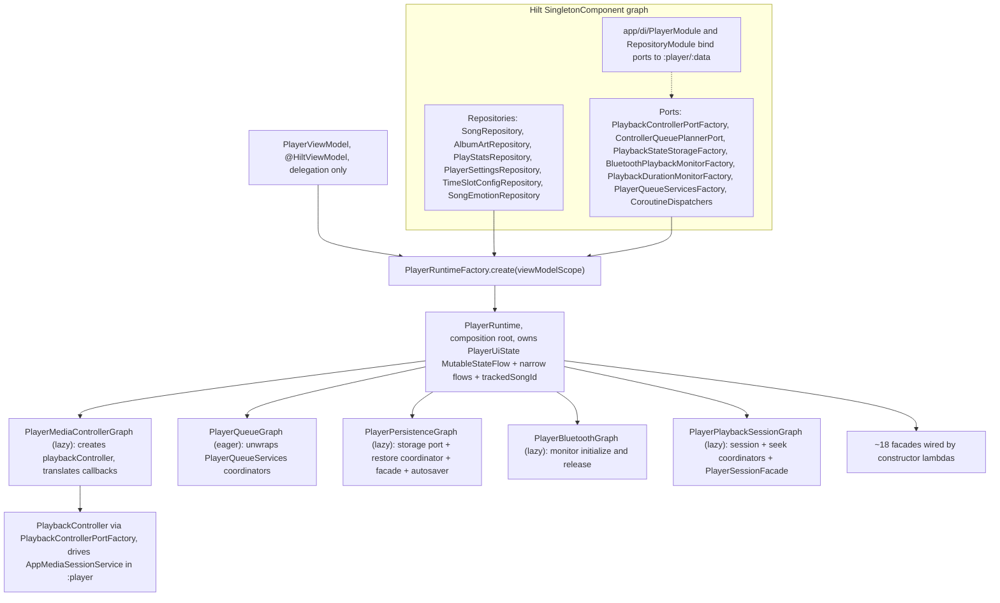
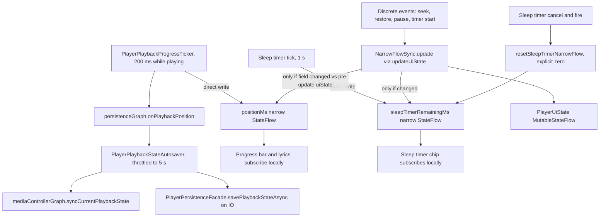

# PlayerRuntime and the Facade Catalog

The player UI never talks to Media3, repositories, or storage directly. `PlayerViewModel` (`:feature:player`) is a **delegation-only facade** whose single job is to expose state and forward calls; the real logic lives in ~18 facade objects assembled by `PlayerRuntime`, the composition root of the feature. Facades are grouped by concern and share collaborators through five graph objects. This page is the structural map to read before touching any player code; the behavior behind the facades is detailed in `/openwiki/player/queue-architecture.md` (queues/windows), `/openwiki/player/random-and-infinite.md` (random/infinite), and `/openwiki/player/state-machine.md` (state mapping/restore).

## Composition at a glance

*The composition chain: Hilt supplies repositories and Port factories to `PlayerRuntimeFactory`, which builds `PlayerRuntime`; the runtime wires five graphs and the facade set through lambda injection, and only `PlayerMediaControllerGraph` ever reaches the Media3-backed controller in `:player`.*

## PlayerViewModel: a delegator by design

`PlayerViewModel` is `@HiltViewModel` and takes exactly one constructor parameter, `PlayerRuntimeFactory`. Its constructor calls `runtimeFactory.create(viewModelScope)`, `init { runtime.start() }` boots the runtime, every public method is a one-line forward, and `onCleared()` forwards to `runtime.onCleared()`. It re-exposes `runtime.uiState`, the two narrow flows, `validationResult`/`isValidating`, and the persisted sort-mode flows. The only ViewModel-local behavior is the playback-stats snapshot cache (stale-while-revalidate over `playStatsRepository`, which the runtime re-exposes for it) — anything beyond that belongs in a facade.

Two consequences follow from the thinness:

- UI code must never hold `Repository` or Media3 controller instances; the ViewModel doc comment states this contract explicitly.
- New player capabilities must **not** be implemented as new ViewModel methods with bodies. The ViewModel gains a forwarding method (if UI needs one); the behavior lives in a facade.

## PlayerRuntimeFactory: the Hilt seam

`PlayerRuntimeFactory` is `@Inject`-constructed by Hilt and passes everything into `PlayerRuntime.create()`-style construction. Its injected set is the exact boundary of what the feature may know about the world:

- **Repositories** — `SongRepository`, `AlbumArtRepository`, `PlayStatsRepository`, `PlayerSettingsRepository`, `TimeSlotConfigRepository`, `SongEmotionRepository`.
- **Playback Ports / factories** (interfaces and `fun interface`s in `domain/playback`) — `ControllerQueuePlannerPort`, `PlaybackControllerPortFactory`, `PlaybackDurationMonitorFactory`, `PlaybackStateStorageFactory`, `BluetoothPlaybackMonitorFactory`, `PlayerQueueServicesFactory`, plus `CoroutineDispatchers`.

`app/di/PlayerModule` binds each Port to its `:player` implementation (`WindowedControllerQueuePlanner`, `PlaybackController` → `AppMediaSessionService`, `PlaybackStateStore`, `BluetoothPlaybackCoordinator`, `PlayDurationTracker`, and the `PlayerQueueServices` bundle of coordinators). The feature therefore compiles against `:domain` interfaces only — no `:data`/`:player` imports, enforced by the architecture gate (see `/openwiki/architecture/module-graph.md`).

## The five graphs

Graphs are internal classes that group related collaborators so the runtime's own constructor stays readable. Their common trait: **dependencies enter as lambdas and function references**, never as direct references to `PlayerRuntime` or other facades — `state = { _uiState.value }`, `updateState = ::updateUiState`, `pausePlayback = { playbackBridgeFacade.pausePlayback() }`, `savePlaybackState = ::savePlaybackStateAsync`, and so on. This is what makes every member JVM-unit-testable with fake lambdas.

| Graph | Construction | Assembly responsibility |
| --- | --- | --- |
| `PlayerQueueGraph` | eager | Calls `playerQueueServicesFactory.create()` once and exposes the seven domain collaborators: `importCoordinator`, `playlistManager`, `songGroupCoordinator`, `songDeletionCoordinator`, `quickSkipCoordinator`, `playOrderBuilder`, `queueActionPlanner`. The runtime reads them through `get()` delegates. |
| `PlayerMediaControllerGraph` | `by lazy` | Creates the `playbackController` via `PlaybackControllerPortFactory`, wiring `PlaybackControllerCallbacks` to `PlayerControllerStateAdapter` (`onIsPlayingChanged`, `onPlaybackSnapshot`) and to the runtime's event handlers (`handleMediaItemEnded`, `handlePlaybackEnded`, `handlePlayerSourceError`, `handleControllerUnavailable`). Owns `startService`, `connect` (syncs the first snapshot, then invokes `onConnected`), `controllerQueueInfo`, `syncCurrentPlaybackState`, `release`. |
| `PlayerPersistenceGraph` | `by lazy` | Lazily creates the `PlaybackStateStore` (via `PlaybackStateStorageFactory`), `PlaybackRestoreCoordinator`, `PlayerPersistenceFacade`, and `PlayerPlaybackStateAutosaver`; owns the `controllerReady`/`pendingRestore` handshake and routes ticker positions into the autosaver via `onPlaybackPosition`. |
| `PlayerBluetoothGraph` | `by lazy` | Wraps `BluetoothPlaybackMonitorFactory.create(isPlaying, pausePlayback)`; exposes only `initialize()`/`release()`. Initialized from `PlayerRuntime.start()` only when the user setting is enabled, never at startup unconditionally. |
| `PlayerPlaybackSessionGraph` | `by lazy` | Composes `PlaybackSessionCoordinator` (with the controller, duration tracker, and `controllerQueuePlanner::plan`), `SeekCoordinator`, and `PlayerSessionFacade`; exposes pause/resume/position, `startQueuePlayback`, `prepareQueue`, `startSinglePlayback`, and the seek trio. |

### Why the lazy declarations exist

The wiring is **cyclic at construction time**: `PlayerMediaControllerGraph` needs `mediaEventFacade`; `mediaEventFacade` calls the playback bridge; the bridge needs `errorFacade` and `playbackSessionGraph`; the session graph needs `playbackController` from the media controller graph. `PlayerMediaControllerGraph`, `PlayerPersistenceGraph`, `PlayerBluetoothGraph`, `PlayerPlaybackSessionGraph`, and `PlayerPlaybackBridgeFacade` are therefore `by lazy` — construction defers to first use, and lambdas captured earlier resolve fine by then. `PlayerQueueGraph` has no such cycle and is constructed eagerly. When editing this file, keep the lazy boundaries: eager construction here deadlocks the initializer, and the cycle is not visible from any single facade.

## The facade catalog

Eighteen facades, grouped by concern. Each row is the facade's single reason to exist.

**Queue**

- `PlayerQueueFacade` — routes every business-queue mutation (replace, add tail, add-next, remove, remove-at, clear, play-item, play-mode) through the injected `PlaybackQueueActionPlanner`; `applyPlan` copies the planned queue into state (plus `nextPlayState`, infinite-play exit, current-song/duration clearing), then executes the plan's playback action (`PlayQueueIndex` / `SyncQueue` / `ClearController` / `None`) and the persistence flags.
- `PlayerControllerQueueFacade` — converts a business queue into a controller window via `ControllerQueuePlannerPort.plan`, skips redundant syncs using a fingerprint (`songIds + startIndex`), computes `remainingMediaItems` (controller count minus current index, falling back to the planned window's `remainingAfterStart` when the controller is empty), and clears the controller playlist (resetting the fingerprint).
- `PlayerRandomQueueFacade` — the stateful side of random/infinite playback: keeps the in-memory `recentPlayedSongIds`, resolves the active mood time slot and filters the candidate pool at the planner entrance (falling back to the full library when the tag pool is empty), runs `playRandomQueue` / `startInfinitePlay` / `stopInfinitePlay`, and handles infinite refill including the `advanceAfterWrap` cursor correction.

**Playback**

- `PlayerPlaybackFacade` — plans UI commands with the pure `PlaybackCommandPlanner` (play song → queue index or single; context play → replace queue; toggle → pause/resume/play-index; next → refill infinite queue when the window is low unless `skipNextRefill` consumes one skip) and delegates execution to the bridge.
- `PlayerPlaybackBridgeFacade` — the delegation hub between facades and the session machinery: pause/resume/position, start/prepare queue, start single, play-from-queue, sync queue, clear controller, remaining items, and refill are all injected lambdas (pointing at `playbackSessionGraph`, `controllerQueueFacade`, `errorFacade`, and `randomQueueFacade`), so no facade ever references another directly.

**State sync**

- `PlayerControllerStateFacade` — the single entry point that maps `ControllerPlaybackSnapshot`s into `PlayerUiState` through `ControllerPlaybackStateSynchronizer`: applies duration updates and playback starts to the duration tracker, updates the tracked song id, writes the synced state **while deliberately preserving the discrete `currentPositionMs`** (snapshot sync must not touch the position narrow flow — see state-machine page), notifies the progress ticker only when `isPlaying` actually flipped (the snapshot callback is high-frequency, so an unconditional notify would re-run in steady state), and re-syncs the queue when a non-infinite queue's remaining controller items drop to `DEFAULT_REFILL_THRESHOLD`. Also handles `handleControllerIsPlayingChanged` with its pause/resume-tracking and save-on-pause transitions.
- `PlayerMediaEventFacade` — end-of-item side effects: stop tracking and clear the tracked song, refill the infinite queue when the window wrapped or remaining items are at/below `DEFAULT_REFILL_THRESHOLD = 5`, restore the add-next play mode (`nextPlaySongId`/`playModeBeforeNext`), and notify the sleep timer that a song ended (`播完最后一曲`).

**Persistence**

- `PlayerPersistenceFacade` (+ `PlaybackStateStorage` port, `PlaybackRestoreCoordinator`) — saves queue/position/infinite state/current song to the storage port (async path captures the position first, then moves the DataStore write to IO), clears it, reads the restore result on IO, and applies it: full restore (UI + `prepareControllerQueue`, no autoplay) when there is no live session, UI-queue-shadow-only otherwise, because controller snapshot sync never fills `songs`.
- Supporting cast assembled in `PlayerPersistenceGraph`: `PlayerPlaybackStateAutosaver` throttles periodic saves to one per `DEFAULT_INTERVAL_MS = 5_000` (crash-recovery granularity; explicit saves on pause/switch/exit remain the backstop).

**Library and import**

- `PlayerLibraryFacade` — initial load (`loadPersistedSongs` on IO, then snapshot refresh and the `afterInitialSnapshot` hook), snapshot refresh that also reloads play-stats sort maps and the artist/album catalogs in background coroutines, the songs-changed listener, and an album-art refresh deferred 2 s onto a single-threaded IO dispatcher so it never fights startup or playback.
- `PlayerImportFacade` — async SAF folder import with progress reporting; guarantees `isImporting` reset on success, failure, and cancellation (the C-1 review fix — an unhandled import error used to leave the UI stuck in "importing" forever) and writes a user-readable `errorMessage`.
- `PlayerPlaylistFacade` — playlist create/delete/rename/add/remove/reorder through `PlaylistActions`, refreshing the snapshot after each mutation.

**Other**

- `PlayerVersionFacade` — same-name version grouping (`SongVersionManager`), version switching (play-existing or insert-next, both through the windowed `playFromQueue` path — never a direct `playNext()`, which would land on the stale controller window), and song-group overrides (detach/reassign/reset).
- `PlayerQuickSkipFacade` — quick-skip list add/remove/contains/get plus the playlist-synced variant.
- `PlayerSongDeletionFacade` — applies the `SongDeletionPlan`: remove the song from the play queue when required, refresh the library/playlists when required.
- `PlayerSessionFacade` — the actual session operations built inside `PlayerPlaybackSessionGraph`: pause/resume/position, start queue/single playback, prepare, and the seek trio, applying `PlaybackSessionResult`/`SeekResult` to state, tracking, and same-name songs; seeks schedule a delayed isPlaying reconciliation.
- `PlayerStartupFacade` — ordered boot: `startService` → `connectMediaController` → `loadInitialData` (restore triggered after the initial snapshot) → `listenForSongChanges`. The order is locked by `PlayerStartupFacadeTest`.
- `PlayerLifecycleFacade` — teardown on `ViewModel.onCleared`: sync controller state, save playback state, release playback controller, release Bluetooth monitoring, release the duration tracker, stop the progress ticker — with start-of-service wrapped in try/log so a failed service start never crashes.
- `PlayerErrorFacade` — writes `errorMessage` and owns the guarded `playFromQueue`: unplayable target produces a readable error (`「title」的本地文件不存在，无法播放`) instead of a doomed session start.

Non-facade helpers in the same package: `PlayerControllerStateAdapter` (Media3 callback → facade adapter), `PlayerPlaybackProgressTicker` (200 ms position ticker), `PlayerSleepTimerCoordinator` (sleep timer with persisted end-time), `PlayerPlaybackStateAutosaver`, `NarrowFlowSync`, and the `MoodSlotState` value type.

## Startup, restore handshake, and teardown

`PlayerRuntime.start()` deliberately keeps the main thread lean: it reads the four DataStore-backed settings (`globalUniformRandomEnabled`, `bluetoothPlaybackMonitoringEnabled`, `playbackNotificationEnabled`, `dailyListeningGoalMinutes`) and restores the sleep timer **on the IO dispatcher** first, then calls `startupFacade.start()` on the main thread, refreshes the mood-slot caches, and initializes Bluetooth only when the user setting is enabled. The restore itself is two-branch by construction:

- The DataStore read runs on IO in parallel with the controller connection; whichever finishes first waits for the other.
- `persistenceGraph.onControllerReady()` (invoked from the controller's `onConnected`, or from the controller-unavailable fallback) sets `controllerReady` and applies `pendingRestore`.
- The decision uses `hasLiveSession` = "controller queue non-empty" (`liveSessionActive()` — **not** `position > 0`, which misreads to 0 before `buildAsync` connects and would overwrite a playing session). Live session → UI queue shadow only; otherwise → full restore including `prepareControllerQueue` at the snapshot position.

When the playback controller is unavailable (connection failure, or pending actions dropped by the bounded FIFO), `handleControllerUnavailable` logs, still calls `onControllerReady()` so a pending restore can never hang, and writes the reason plus the dropped-action count into `errorMessage`.

## The narrow-flow design

`PlayerUiState` is intentionally **not** the home of high-frequency values. Two values live in their own `StateFlow`s on `PlayerRuntime` (re-exposed by the ViewModel):

- `positionMs` — written directly by `PlayerPlaybackProgressTicker` every 200 ms while playing (200 ms instead of the older 500 ms: lyrics highlighting lagged half a beat at 500; at 5 fps on a locally-subscribed narrow flow the recomposition cost is negligible). The same tick feeds `persistenceGraph.onPlaybackPosition`, which the autosaver throttles to ≥5 s.
- `sleepTimerRemainingMs` — written by the sleep-timer tick once per second; only the sleep-timer chip subscribes.

`NarrowFlowSync` bridges the two worlds: `updateUiState` (the single state-write entry every facade uses) applies the transform via `MutableStateFlow.update`, then propagates `currentPositionMs`/`sleepTimerRemainingMs` into the narrow flows **only if the field changed relative to the pre-update uiState value**. The baseline subtlety is the whole point: during playback the ticker writes the narrow flow while the uiState copy deliberately keeps the old position, so comparing against the narrow flow's current value (instead of the old uiState) would clobber fresh positions with stale ones on every discrete update — the real-device regression of a progress bar snapping back every ~5 s and the countdown flashing `00:00`. Two corollaries are load-bearing:

- Snapshot sync (`applyControllerPlaybackState`) keeps `currentPositionMs` as-is, so a steady-state controller snapshot produces an equal uiState and the `StateFlow` never re-emits — no full-shell recomposition while playing.
- Because ticks never write `uiState.sleepTimerRemainingMs`, the cancel/fire paths cannot rely on value comparison; they must call `resetSleepTimerNarrowFlow()` explicitly to zero the countdown. `NarrowFlowSyncTest` locks both the baseline rule and the explicit reset.

*High-frequency ticks write only the narrow flows; discrete events flow through `NarrowFlowSync`, which propagates a field into its narrow flow only when the pre-update uiState value actually changed. Cancel/fire must zero the countdown narrow flow explicitly.*

## Extension rules

1. **Find the facade first.** A new capability goes into the existing facade for that concern, or becomes a new facade with a single responsibility. `PlayerViewModel` gains at most a forwarding method; it must never grow logic. If a facade needs state, add a `state`/`updateState` lambda parameter, not a reference to `PlayerRuntime`.
2. **Push decisions into `:domain`.** Facades orchestrate and hold only small caches (`recentPlayedSongIds`, the mood caches, the sync fingerprint). Anything that computes a plan (queue actions, playback commands, random selection, window planning, state transitions) belongs to a `:domain` planner, which keeps it pure and independently tested.
3. **Never reintroduce the `PlayerViewModelComponents` monolith.** It was deliberately dismantled into `PlayerRuntime` + facades + graphs, and `verifyProductArchitecture` fails any build whose sources contain the name `PlayerViewModelComponents` or `PlayerViewModelComponentFactory`. The refactor audit (`docs/refactor/PRODUCT_REFACTOR_AUDIT.md`) records the split as a verified productization item.
4. **Every facade has a same-named test class.** `PlayerQueueFacadeTest`, `PlayerControllerQueueFacadeTest`, `PlayerRandomQueueFacadeTest`, `PlayerPlaybackFacadeTest`, `PlayerPlaybackBridgeFacadeTest`, `PlayerControllerStateFacadeTest`, `PlayerMediaEventFacadeTest`, `PlayerPersistenceFacadeTest`, `PlayerLibraryFacadeTest`, `PlayerImportFacadeTest`, `PlayerPlaylistFacadeTest`, `PlayerVersionFacadeTest`, `PlayerQuickSkipFacadeTest`, `PlayerSongDeletionFacadeTest`, `PlayerSessionFacadeTest`, `PlayerStartupFacadeTest`, `PlayerLifecycleFacadeTest`, `PlayerErrorFacadeTest`, plus graph/helper tests (`PlayerPlaybackSessionGraphTest`, `PlayerPlaybackProgressTickerTest`, `PlayerPlaybackStateAutosaverTest`, `PlayerSleepTimerCoordinatorTest`, `PlayerControllerStateAdapterTest`, `NarrowFlowSyncTest`) — 24 classes under `feature/player/src/test`. Lambda injection is what makes them instantiable on the JVM; new logic without a focused test breaks the convention.
5. **New high-frequency UI state goes through a narrow flow.** Anything ticking faster than user-perceivable discrete events (progress, countdowns, live visualizers) gets its own `StateFlow` fed directly by its source, with a `NarrowFlowSync`-style propagation rule for discrete events, instead of a field on `PlayerUiState`. The 5-second-progress-jump incident is the cautionary tale.
6. **Respect the startup privacy gates.** `PlayerStartupFacade` must not mention Bluetooth, and `MainActivity`/`AppRoot`/`PlayerRuntime`/`PlayerStartupFacade` must not request notification/Bluetooth permissions — the gate enforces both. User-triggered setup goes through Settings (`initializeBluetoothPlayback`/`releaseBluetoothPlayback` on the runtime).
7. **Keep the lazy boundaries intact** when adding cross-facade calls in `PlayerRuntime` (see the cycle above), and prefer function references (`facade::method`) so the dependency stays a lambda, matching the established style.

## Focused tests that actually matter

- `NarrowFlowSyncTest` — reproduces the narrow-flow clobbering regression with the real ticker/autosaver rhythm and locks the fix (baseline = pre-update uiState; explicit countdown reset on cancel).
- `PlayerStartupFacadeTest` — locks the exact startup step order, including "restore after the initial library snapshot".
- `PlayerPersistenceFacadeTest` — locks "capture position before launching the IO save" and the UI-only vs full restore application.
- `PlayerPlaybackSessionGraphTest` — locks session start/seek behavior through the composed session + seek coordinators with fakes.
- `PlayerRandomQueueFacadeTest` — locks lucky-play semantics (sequential queue, infinite exit, batch selection) and the mood-slot filter/fallback behavior.
- `PlayerControllerStateFacadeTest` / `PlayerMediaEventFacadeTest` — lock snapshot→state mapping, tracking transitions, and the refill/add-next restore effects.

Run them with `.\gradlew.bat :feature:player:test` (or a `--tests` filter for a single class) before committing facade changes; `verifyProductArchitecture` runs as part of `check` for the structural rules above.
