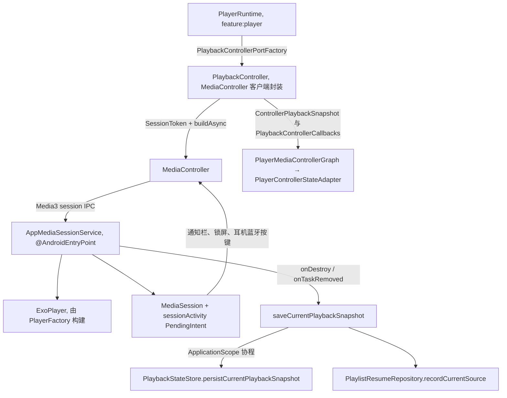
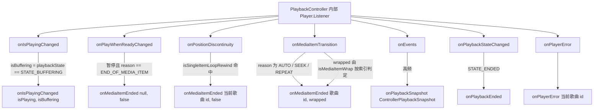

# 播放服务与 MediaController

`:player` 模块是播放链路中唯一直接接触 Android 媒体 API 的层。它内部是一套**双组件架构**：服务端 `AppMediaSessionService` 持有真正的 `ExoPlayer` 实例并通过 Media3 `MediaSession` 对外发布；客户端 `PlaybackController` 通过 `SessionToken` 异步连接 `MediaController`，把 UI 的播放命令转发给服务、把 Media3 回调翻译成 `:domain` 定义的 `PlaybackControllerCallbacks`。两层之间是进程内 IPC（Media3 session binder），因此 **MediaController 的媒体项窗口才是真实播放顺序的最终事实**——业务队列如何与之同步见 `/openwiki/player/queue-architecture.md`，facade 层如何编排这些回调见 `/openwiki/player/runtime-facades.md`。

## 双组件架构总览

*双组件架构：服务端持有 ExoPlayer 与 MediaSession，客户端 `PlaybackController` 经 `MediaController` 遥控并把回调翻译成 domain 快照；服务销毁时的快照落盘挂在进程级 `ApplicationScope` 上。*

装配发生在 `app/di/PlayerModule`（Hilt `SingletonComponent`）：

- `providePlaybackControllerPortFactory` 把 `PlaybackControllerPort` 绑定到 `PlaybackController(context, AppMediaSessionService::class.java, callbacks)`——`:feature:player` 只依赖 `:domain` 接口，从不 import `:player` 实现；
- `providePlaybackStateStore` 提供 `PlaybackStateStore`（服务注入用），`providePlaybackStateStorageFactory` 另给恢复路径一份；
- `provideBluetoothPlaybackMonitorFactory` 按调用创建 `BluetoothPlaybackCoordinator`（见下文蓝牙一节）。

## AppMediaSessionService：服务端生命周期与快照落盘

`AppMediaSessionService` 继承 Media3 `MediaSessionService`，标注 `@AndroidEntryPoint`，注入四个依赖：`AppLogger`、`PlaybackStateStore`、`PlaylistResumeRepository` 和 `@ApplicationScope` 的进程级 `CoroutineScope`。它不实现任何自定义传输控制——注释明确"lets Media3 handle standard transport commands against the playlist provided by the UI controller"，通知栏/锁屏/耳机的播放暂停切歌全部由 MediaSession 默认生命周期处理，队列由客户端推过来。

### ExoPlayer 与 MediaSession 的构建

`onCreate` → `createExoPlayer()`：

1. `PlayerFactory.create(this)` 构建 ExoPlayer：`DefaultRenderersFactory` 开启 float 音频输出与解码器 fallback，并设 `EXTENSION_RENDERER_MODE_PREFER`——这正是 ALAC 等格式在播放链路优先命中 FFmpeg 扩展解码器的原因（情绪分析管线依赖同一扩展，见下文）；`DefaultLoadControl` 缓冲 4000/10000/2000/2500ms；音频属性 `AUDIO_CONTENT_TYPE_MUSIC` + `USAGE_MEDIA` 并接管音频焦点；`handleAudioBecomingNoisy = true`（拔耳机暂停）；`setPauseAtEndOfMediaItems(false)`（队列自然续播不靠它）。
2. `createMediaSession()` 用 `MediaSession.Builder` 包住 player，并设置 `sessionActivity` 为启动 Intent 的 `PendingIntent`（`FLAG_ACTIVITY_SINGLE_TOP` + `FLAG_IMMUTABLE`，取不到时退回 `ACTION_MAIN`）——通知栏点击回 App 的入口。
3. `setupPlayerListener()` 挂一个只做 debug 日志的 `Player.Listener`（`onIsPlayingChanged`/`onMediaItemTransition`/`onPlaybackStateChanged`）；业务级事件翻译全部在客户端 `PlaybackController` 做，服务端保持哑终端。

`onGetSession` 返回该 `MediaSession`。服务在 `:player` 的 manifest 里声明（`android:exported="false"`、`foregroundServiceType="mediaPlayback"`、intent-filter `androidx.media3.session.MediaSessionService`），架构门禁要求 `:app` manifest 不得重复声明它。

### 快照落盘：同步读 + 进程级异步写

`onDestroy` 与 `onTaskRemoved` 都调用 `saveCurrentPlaybackSnapshot()`，其线程模型是刻意的两段式：

- **同步读**：`currentMediaItem.mediaId.toIntOrNull()` 解析出 songId、读 `currentPosition`。注释写明"快照（歌曲与进度）必须在调用线程同步读取——ExoPlayer 只能在其应用线程访问"。
- **异步写**：`applicationScope.launch` 里调用 `playbackStateStore.persistCurrentPlaybackSnapshot(songId, positionMs)`（挂起版，`withContext(Dispatchers.IO)`），随后 `playlistResumeRepository.recordCurrentSource(songId)`——若当前队列来自某个歌单，把"实际在播"的歌曲记为该歌单的续播点并清除来源标记。DataStore 写盘绝不阻塞主线程的 `onDestroy`。

`ApplicationScope` 由 `AppCoroutineScopeModule` 提供：`CoroutineScope(SupervisorJob() + Dispatchers.IO)` 的进程级单例。它的 KDoc 就是使用契约："用于『不应随组件（Service / ViewModel）销毁而被取消』的收尾任务……切勿把常规业务协程挂到该作用域上"——服务实例销毁后落盘协程必须还能跑完，所以不能挂服务自己的生命周期。

`PlaybackStateStore.persistCurrentPlaybackSnapshot` 的存储语义：**保留已有 `PLAY_QUEUE_JSON`**（找不到时退回 legacy SharedPreferences，再退回空队列），只覆写 `CURRENT_SONG_ID` 与 `PLAY_POSITION_MS`。恢复时这份快照用来校正 `currentIndex` 与进度——`PlaybackStateStoreTest.restoreUsesCurrentSongSnapshotToCorrectQueueIndexAndPosition` 与 `restoreCurrentSongSnapshotCreatesQueueWhenSongWasNotInSavedQueue` 锁定了"快照歌曲不在已存队列中时以单曲队列兜底"的行为。UI 侧的常规保存走阻塞版 `save`（`runBlocking(Dispatchers.IO)`），服务销毁路径必须用挂起版。

### startService 的 FGS ANR 修复

`PlaybackController.startService()` 用 `context.startService(...)` 而不是 `startForegroundService(...)`。代码注释记录了原因（2026-09-03 ANR 回归修复）：`startForegroundService` 强制服务 5 秒内调 `startForeground()`，而 `MediaSessionService` 只在 player 有媒体项/激活播放时才发通知并 `startForeground()`——冷启动空会话永不触发，系统判定 FGS 超时 ANR（真机日志 "did not then call Service.startForeground()"）。该方法唯一调用链是 UI 冷启动（Activity 在前台），`startService` 合法且无 FGS 契约；即使将来出现后台拉起路径，`connect()` 的 `SessionToken` 机制同样能绑定拉起服务。

## PlaybackController：连接、pending actions 与命令语义

`PlaybackController` 实现 `:domain` 的 `PlaybackControllerPort`（组合 `PlaybackSessionController`），构造参数 `(context, serviceClass, callbacks)`。它是 UI 与服务之间唯一的命令与事件通道。

### 连接与待执行动作队列

`connect(onConnected)` 用 `SessionToken(context, ComponentName(serviceClass))` + `MediaController.Builder.buildAsync()` 异步连接，完成回调注册在 `ContextCompat.getMainExecutor(context)`：

- **成功**：持有 controller、`addListener(listener)`、`drainPendingActions(connectedController)`（FIFO 逐个执行积压动作，单个失败仅记日志不中断）、`onConnected(snapshot)` 上报首帧快照。
- **失败**（`ExecutionException` 或其他异常）：记日志后 `abortPendingActions("播放服务连接失败")`。

`runWhenConnected(action)` 是所有命令的统一入口：已连接则立即执行；未连接则把 lambda 追加进 `pendingActions`（`ArrayDeque`）。这里有一条硬性资源约束：

- **`MAX_PENDING_ACTIONS = 64`**。连接失败或长时间未就绪时，UI 每次点击都会追加一个 pending action；lambda 捕获的歌曲列表会随队列无界增长，所以队列满时 **FIFO 丢弃最早的动作**（`removeFirst`），打 warning 日志，并回调 `callbacks.onControllerUnavailable(1, "播放服务尚未就绪")`。
- **连接失败时全部丢弃而不是留存重放**：`abortPendingActions` 清空队列并把丢弃数量上报——注释解释"若继续保留这些动作，它们会在下一次连接成功时被批量重放，产生用户早已放弃的播放/切歌行为"。

上层对 `onControllerUnavailable` 的消费在 `PlayerRuntime.handleControllerUnavailable`：写 warning 日志、仍然调用 `persistenceGraph.onControllerReady()`（启动期连接失败也必须放行 restore 决策，否则 `pendingRestore` 永久悬挂、UI 队列永不恢复），再把原因与丢弃数写进 `PlayerUiState.errorMessage` 供 UI 提示。连接成功路径上，`PlayerMediaControllerGraph.connect` 先用首帧快照同步 `controllerStateAdapter`，再触发 `onConnected` → `persistenceGraph.onControllerReady()` 的 restore 握手（详见 `/openwiki/player/runtime-facades.md`）。

### 命令通道与指纹同步

`PlaybackControllerPort` 的命令面：`pause/play/seekTo` 直接透传（位置 coerce ≥0）；`playPrevious` 无上一首时回退 `seekTo(0)`；`playNext` 无下一首且队列非空时回退 `seekToDefaultPosition(0)`，并打 `PerformanceTrace` 锚点 `play_next_command`；`clearPlaylist` 先清指纹再 `stop()` + `clearMediaItems()`。查询面：`snapshot()`/`queueInfo()`/`hasCurrentMediaItem`/`isPlaying`/`currentPositionMs(fallback)`/`durationMs(fallback)`（`C.TIME_UNSET` 映射为 fallback）——`PlayerRuntime.liveSessionActive()` 就是用 `queueInfo()?.mediaItemCount > 0` 判断服务端是否有 live session。

队列三操作的守卫规则是这套 API 最容易踩错的地方：

| 方法 | 指纹 | repeatMode | 自动播放 | live session 守卫 |
| --- | --- | --- | --- | --- |
| `playQueue(plan)` | 记录 `plan.fingerprint()` | `REPEAT_MODE_ALL` | `prepare()` + `play()` | **禁止加**（KDoc 原文："只要服务在播 mediaItemCount 就 > 0，加了会让所有用户点歌请求被静默吞掉、服务继续放旧歌"） |
| `prepareQueue(plan, positionMs)` | 记录 | `REPEAT_MODE_ALL` | 只 `prepare()`，不播 | **唯一允许守卫的地方**：`mediaItemCount > 0` 时跳过，防止覆盖正在播的会话 |
| `syncQueue(plan)` | 指纹相同直接 return | `REPEAT_MODE_ALL` | `wasPlaying` 才补 `play()` | 无（捕获当前位置/播放态后重建窗口） |

`prepareQueue` 的唯一业务调用方是 `PlayerPersistenceFacade.applyRestoreResult`（恢复路径），`positionMs.coerceAtLeast(0)` 作为起始位置灌回控制器但不自动播放。`playSingle(song)` 单独走 `REPEAT_MODE_OFF` + `setMediaItem`，mapper 返回 null（无 uri）时整体返回 false。三条路径都带 `PerformanceTrace` 锚点（`controller_play_queue`/`controller_prepare_queue`/`controller_sync_queue`），架构门禁要求这些锚点不得删除。

`release()` 按序：移除 listener、置空 controller、清空 pendingActions、`MediaController.releaseFuture(controllerFuture)`。`PlayerLifecycleFacade.onCleared` 的销毁序（先存盘再 `releasePlaybackController`）在 facade 层编排。

## 事件翻译规则：Media3 回调 → PlaybackControllerCallbacks

`PlaybackController` 内部的 `Player.Listener` 是 Media3 世界与 `:domain` 世界的边界，翻译规则逐条如下（`PlaybackControllerCallbacks` 的形状定义在 `domain/playback/PlaybackControllerPort.kt`）：

*事件翻译：play/pause 语义、两种"播完"信号（END_OF_MEDIA_ITEM 与单曲回绕）、窗口回绕标志、高频快照与终态/错误事件各自映射到 `PlaybackControllerCallbacks` 的哪个回调。*

- **`onIsPlayingChanged(isPlaying)`** → `onIsPlayingChanged(isPlaying, controller.playbackState == STATE_BUFFERING)`。**必须区分 buffering**：下游 `ControllerPlaybackStateSynchronizer.isPlayingTransition` 只在"真暂停"（非缓冲的 isPlaying false→）时暂停计时并入统计，缓冲抖动不算暂停。
- **`onPlayWhenReadyChanged`** → 仅当 `!playWhenReady && reason == PLAY_WHEN_READY_CHANGE_REASON_END_OF_MEDIA_ITEM` 时发 `onMediaItemEnded(null, false)`：这是 Media3 对"队列里没有下一首、自然播完停下"的信号。
- **`onPositionDiscontinuity`** → 单项循环回绕识别（下节详述），命中才发 `onMediaItemEnded(currentMediaItem.mediaId.toIntOrNull(), false)`。
- **`onMediaItemTransition`** → 先算 `wrapped = isMediaItemWrap(...)` 并更新 `lastCurrentMediaItemIndex`，再对 `reason ∈ {AUTO, SEEK, REPEAT}` 的切换发 `onMediaItemEnded(mediaId→songId, wrapped)`。手动切歌（耳机/锁屏/通知栏的 SEEK）也必须走这里，否则无限播放不会补队列；`PLAYLIST_CHANGED` 是应用自身重建窗口产生的，**不**触发。
- **`onEvents`** → `onPlaybackSnapshot(player.toPlaybackSnapshot())`，高频回调；快照字段为 `mediaId`、`isPlaying`、`isBuffering`、`currentPositionMs`、`durationMs`（`C.TIME_UNSET` 映射 null）。这是"跟随控制器写回业务队列"的数据源（见 queue-architecture 页）。
- **`onPlaybackStateChanged`** → `STATE_ENDED` 发 `onPlaybackEnded()`。
- **`onPlayerError`** → 记日志后发 `onPlayerError(currentMediaItem.mediaId→songId)`，供错误恢复重播。

### 单曲循环回绕检测（onPositionDiscontinuity）

`REPEAT_MODE_ALL` 下队列只剩一首歌时（秒切/歌单/专辑/歌手只剩一首），自然播完会回绕到同一项：窗口索引 0→0 不变，Media3 **不触发 `onMediaItemTransition`**，结算逻辑（有效播放 +1、移出秒切列表）永远不会执行，且计时器跨循环累计。唯一可见信号是 AUTO position discontinuity 的位置回跳。`isSingleItemLoopRewind` 用三个阈值常量识别它：

- `LOOP_REWIND_NEW_POSITION_MAX_MS = 2_000L`：新位置必须 ≤2s（回到开头）；
- `LOOP_REWIND_END_TOLERANCE_MS = 5_000L`：时长已知时，旧位置必须 ≥ `duration − 5s`（精确判定"接近结尾"）；
- `LOOP_REWIND_MIN_POSITION_MS = 30_000L`：时长未知（−1）时的保守回退阈值，远大于 seek 缓冲抖动。

外加结构性条件：`reason == DISCONTINUITY_REASON_AUTO_TRANSITION`、`mediaItemCount == 1`、`oldIndex == newIndex == 0`。注释还解释了两个排除项：**缓冲重连**从原位置继续、不产生回 0 的 AUTO 间断；**手动拖回开头**是 SEEK 原因——`SingleItemLoopRewindDetectionTest.ignoresManualSeekToStart` 明确把这条当"防刷"用例锁定（手动 seek 不得计为播完）。

### 窗口尾部回绕检测（onMediaItemTransition）

`isMediaItemWrap(previousIndex, newIndex, mediaItemCount)` = `newIndex == 0 && previousIndex != INDEX_UNSET && previousIndex >= mediaItemCount - 1 && previousIndex > newIndex`。必须**按索引**判断而非按 reason，因为 Media3 对 `REPEAT_MODE_ALL` 下 `seekToNextMediaItem()` 从尾部回绕到开头仍上报 `SEEK`，`MEDIA_ITEM_TRANSITION_REASON_REPEAT` 只表示 `REPEAT_MODE_ONE` 单曲重复。`wrapped` 标志是无限播放补队列的触发器（窗口耗尽），注释另指出"回绕后剩余数量会重新变大，仅靠剩余阈值判断会漏掉补队列，导致无限播放枯竭"。`MediaItemWrapDetectionTest` 锁定边界：2 首小窗口从索引 1 回 0 也视为回绕（补队列 planner 会自动去重，误判无害），空窗口/单项窗口不可能回绕。

## SongMediaItemMapper 契约：mediaId 即 join key

`SongMediaItemMapper.toMediaItem(song)` 的规则：

- `song.uri == null` 时返回 **null**——不可播放的歌曲在 `ControllerQueuePlan.toMediaItems()` 的 `mapNotNull` 中被静默剔除；
- **`mediaId = song.id.toString()`**。这是硬契约：Media3 状态映射回业务队列的**唯一 join key**。三处消费依赖它——`PlaybackController.toPlaybackSnapshot` 原样携带 `currentMediaItem?.mediaId`；`ControllerPlaybackStateSynchronizer.resolveControllerSong` 把 mediaId `toIntOrNull()` 后按 id 在歌曲表/队列里找 Song；服务端快照落盘同样把 mediaId 解析回 songId；
- `MediaMetadata` 填 title、artist、非空 album（albumTitle）与 albumArtUri（artworkUri）。

**重复队列项共享同一个 mediaId**（同一首歌出现两次就是两个共享 id 的 `MediaItem`）。因此写回 `currentIndex` 时必须防串位：`ControllerPlaybackStateSynchronizer.syncQueueCurrentIndex` 先查 `queue.currentSong?.id == controllerSong.id`——**当前索引已指向相同 ID 时保留当前索引直接返回**，绝不 `indexOfFirst` 重查（那会跳回第一次出现的位置，破坏重复项语义）。CLAUDE.md 的队列不变量同样把这条列为硬规则："MediaItem.mediaId must equal Song.id.toString() — this is how Media3 state maps back to business queue"。

## :player 的其他住户：情绪管线与统计协调器

`:player` 不只有播放服务/控制器，还承载两组"播放邻接"的运行时组件。它们放 `:player` 而非 `:data` 的原因一致：**它们需要 Android 媒体 API 或绑定播放事件的定时器，而 `:data` 是纯 Room/DataStore 存储层**；feature 模块禁止依赖 `:player`，所以上层全部经 `:domain` 的工厂端口（`PlaybackDurationMonitorFactory`、`BluetoothPlaybackMonitorFactory`）消费。

**情绪分析管线**（TFLite，领域模型详见 `/openwiki/concepts/emotion-model.md`）：

- `EmotionAnalyzer`（`@Singleton`，注入 `FfmpegPcmDecoder`）：整曲情绪分析器，管线为 MediaCodec 解码 → 16k mono Float PCM → 5s 窗/2.5s hop 滑窗 → YAMNet embedding（LiteRT，`assets/emotion_yamnet.tflite`）→ `emotion_va_head.tflite` 出逐窗 (valence, arousal) 曲线。KDoc 记录了真机 OOM 教训：解码 PCM 必须用原始类型数组（`ShortAccum`），装箱 `ArrayList<Short>` 曾顶穿 256MB 堆。
- `FfmpegPcmDecoder`：直驱 APK 内已有的 media3 FFmpeg 扩展（`org.jellyfin.media3:media3-ffmpeg-decoder`，package-private 类走反射）。存在原因是真机 SIGSEGV：小米高通 ROM 的厂商软解组件（如 `c2.qti.alac.sw.decoder`）在 MediaCodec 同步循环里 native 崩溃且 catch 不住；播放链路不崩正是因为 ExoPlayer 的 `EXTENSION_RENDERER_MODE_PREFER` 让 ALAC 优先命中 FFmpeg 扩展。它不建 ExoPlayer 实例（避免与"边听边分析"互踩播放器线程和音频焦点），错误全部封在可 catch 的 `DecoderException` 里。
- 消费方在 `:app`：`EmotionScanWorker`（WorkManager 批扫，经 `EmotionScanEntryPoint` 拿 `EmotionAnalyzer`）给曲库补 V/A 曲线。这条线需要 `media3.ffmpeg.decoder`、`exoplayer`、`litert` 等依赖——`:player` 的 build 脚本把它们与播放依赖放在一起，正是组件归属的证据。

**统计协调器**：

- `PlayDurationTracker` 实现 `PlaybackDurationMonitor`：独立 `SupervisorJob + Dispatchers.IO` 协程每秒（`UPDATE_INTERVAL_MS = 1000`）累计播放时长；新会话开始时 raw 播放计数 +1；有效播放判定为"累计达歌曲时长 90%（`COMPLETION_RATE_THRESHOLD = 0.9`）或超 5 分钟"；短播放（<5s）累计 2 次自动加入秒切列表，命中秒切的歌曲有效播放 +1 后自动移出。`startPlayback` 的 `initialPlayedMs` 参数把杀进程恢复点之前的已播时长计入统计，避免"被杀前已播 + 恢复后听完"却不满 90%。M-5 整改注明必须用 `SupervisorJob`——普通 Job 下一次 Room 异常会让整个计时 scope 静默死亡。
- `QuickSkipCoordinator` 实现 `QuickSkipActions`：秒切列表的增删查与 `syncToPlaylist()`（同步到名为 `秒切歌曲` 的歌单）。
- 两者由 `PlayerModule` 的 `providePlaybackDurationMonitorFactory` / `providePlayerQueueServicesFactory` 装配，`PlayDurationTracker` 由 `PlayerControllerStateFacade` 在快照同步时驱动（playbackStart/durationUpdate），属于"围绕真实播放事件的计时器"，天然不属于存储层。

## 蓝牙协同：断连自动暂停

蓝牙侧由三个类组成，全部在 `:player`：

- **`BluetoothStateManager`**：注册 `RECEIVER_NOT_EXPORTED` 广播接收器（adapter 开关、连接状态、ACL 连上/断开）并绑定 A2DP + Headset profile 代理，产出 `BtState`（`isBluetoothEnabled`、`isA2dpConnected`、`isHfpConnected`、设备名/类型、`audioQuality`、`signalStrength`）的 `StateFlow` 与 `onBluetoothStateChanged`/`onAudioQualityChanged` 回调。设备类型按 `BluetoothClass` 分 HEADPHONES/SPEAKER/CAR_KIT/WATCH；**没有 `BLUETOOTH_CONNECT` 权限时整个监控直接跳过**（initialize 与每个广播回调都先查权限），`detectAudioQuality` 目前简化为恒返 `NORMAL`（编解码器检测需厂商 API）。
- **`BluetoothAudioQualityManager`**：经 `AudioManager.registerAudioDeviceCallback` 监控音频路由，把设备归类为 `AudioRoute`（BLUETOOTH_A2DP/HFP、有线、USB、扬声器），提供 `onAudioRouteChanged`/`onAudioInterrupted`/`onAudioResumed` 回调；`handleAudioInterruption(shouldPause=true)` 暂停并在 `RECOVERY_WAIT_MS = 500` 后清除中断状态。
- **`BluetoothPlaybackCoordinator`**：实现 `:domain` 的 `BluetoothPlaybackMonitor`（`initialize`/`release` 两方法），把上面两个管理器的回调收敛成两条自动暂停规则：
  1. **蓝牙断连自动暂停**：`onBluetoothStateChanged` 里，`wasPlayingThroughBluetooth && !state.isA2dpConnected && isPlaying()` 时调用 `pausePlayback()`——"之前在蓝牙上播、A2DP 刚断、当前还在播"才暂停，避免误伤从未经蓝牙的会话；
  2. **音频中断暂停**：`onAudioInterrupted` 且 `isPlaying()` 时暂停。

  `isPlaying`/`pausePlayback` 都是构造注入的 lambda——`PlayerRuntime` 把它们接到 `_uiState.value.isPlaying` 与 `playbackBridgeFacade.pausePlayback()`，协调器因此完全不依赖运行时。

### 按设置开关初始化

初始化路径刻意收窄（架构门禁："Bluetooth playback monitoring must be user-triggered from Settings, not initialized at startup"，且 `PlayerStartupFacade` 不得提及蓝牙）：

- `PlayerModule.provideBluetoothPlaybackMonitorFactory` 每次调用 new 一对 `BluetoothStateManager`/`BluetoothAudioQualityManager` 造一个协调器；
- `:feature:player` 的 `PlayerBluetoothGraph`（internal）把它包成只有 `initialize()`/`release()` 的惰性图；
- `PlayerRuntime.start()` 在 IO 线程读出持久化的 `bluetoothPlaybackMonitoringEnabled`，**仅当为 true 时**才 `bluetoothGraph.initialize()`；用户在设置页开启时走 `AppNavHost` → 权限授予 → `playerViewModel.initializeBluetoothPlayback()`（写回设置 + 更新 uiState + 初始化图）；
- `PlayerLifecycleFacade.onCleared` 销毁序中包含 `releaseBluetoothPlayback()`（`PlayerLifecycleFacadeTest` 锁定调用顺序），协调器 `release()` 再级联释放两个管理器。

## 测试与运维锚点

- `SingleItemLoopRewindDetectionTest`（`:player`）——单曲回绕判定的全部边界：自然回绕命中、短歌按 duration 精判、中途回跳不认、多歌曲队列不归此路径、索引变化/手动 SEEK/新位置非 0 一律排除、阈值边界仍命中。
- `MediaItemWrapDetectionTest`（`:player`）——`isMediaItemWrap` 索引判据：尾→0 命中、顺序前进/单步后退/未知前索引/新索引非 0 排除、2 首小窗口视为回绕（补队列去重兜底）、空/单项窗口不可能回绕。
- `PlaybackStateStoreTest`（`:player`）——快照存储语义：`saveCurrentPlaybackSnapshot` 校正恢复的 currentIndex/position、快照歌曲不在已存队列时的单曲兜底、空会话保存不清已有快照、legacy SharedPreferences 迁移。
- `PlayerLifecycleFacadeTest`（`:feature:player`）——ViewModel 销毁序（含 `releaseBluetoothPlayback`）。

运维上须保持的锚点：`PerformanceTrace` 操作 `controller_play_queue`/`controller_prepare_queue`/`controller_sync_queue`/`play_next_command`（架构门禁清单点名 `PlaybackController` 的 queue/prepare/sync/next）；服务端日志 TAG `AppMediaSessionService`、客户端 `PlaybackController`、蓝牙侧 `BluetoothStateManager`/`BtAudioQualityManager`/`BluetoothPlaybackCoordinator`。运行本模块测试：`.\gradlew.bat :player:test`（或 `--tests` 过滤单个类）。
