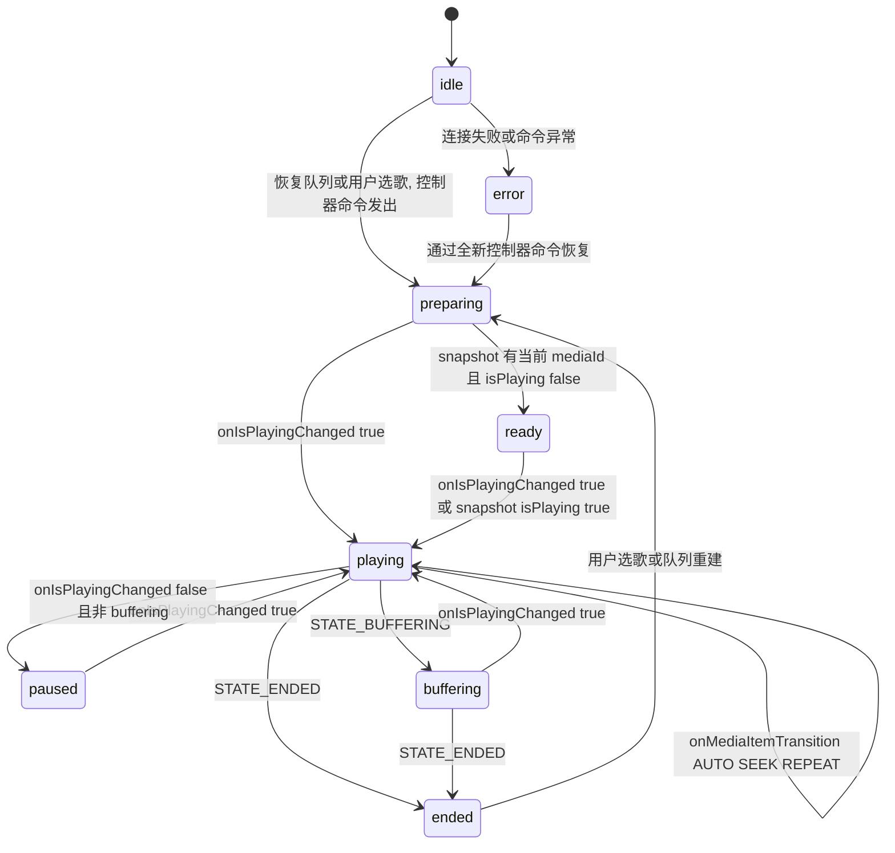
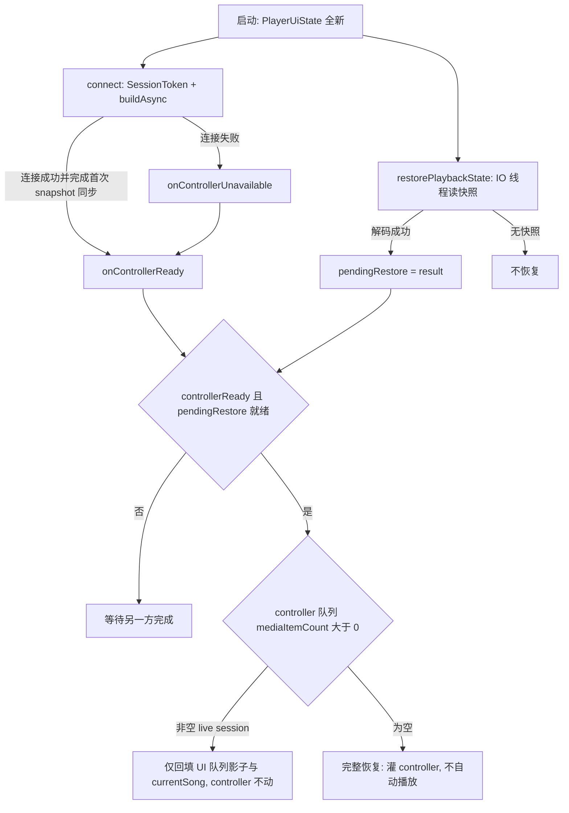

# 播放状态机与状态恢复

播放链路的状态模型刻意保持很小：**Media3 始终是传输状态的最终事实来源**，应用层状态机只回答一件事——service、controller、域同步器、feature 门面与 UI 应当如何对 Media3 事件做出反应。规范化文档见 `docs/architecture/PLAYBACK_STATE_MACHINE.md`，本文把该文档的规则与代码实现逐条对齐，并重点记录三处反直觉硬约束：进度渲染只走 `positionMs` 窄流、`isPlaying` 跃变必须补发通知、恢复决策必须收敛到 `MediaController` 连接成功之后。

队列与窗口同步的细节见 `/openwiki/player/queue-architecture.md`，服务端与 `MediaController` 的 Android 集成面见 `/openwiki/player/service-and-controller.md`，facade 编排总图见 `/openwiki/player/runtime-facades.md`，启动到恢复的完整生命周期见 `/openwiki/workflows/playback-session-lifecycle.md`。

## 职责分层与 Ownership

| 层 | Owner | 职责 |
| --- | --- | --- |
| Media session 服务 | `AppMediaSessionService` | 持有 `ExoPlayer` 与 `MediaSession`；服务销毁/任务移除时保存最后一首歌与进度快照。 |
| Controller 适配 | `PlaybackController` | 连接 `MediaController`，把 Media3 回调翻译成 `ControllerPlaybackSnapshot` 与 `PlaybackControllerCallbacks`，并执行队列/播放/暂停/seek 命令。 |
| 域同步器 | `ControllerPlaybackStateSynchronizer` | 把 controller 快照映射回应用播放状态：`mediaId -> Song` 解析、队列当前索引对齐、跟踪启停转移判定。纯函数，无 Android 依赖。 |
| Feature 门面 | `PlayerControllerStateFacade`（及 `PlayerMediaEventFacade`、`PlayerPlaybackFacade`、`PlayerSessionFacade`） | 把同步结果写入 `PlayerUiState`、驱动时长统计与进度 ticker、触发持久化、执行恢复结果应用。 |
| UI | `PlayerUiState` 消费者 | 只做渲染；**UI 不得直接推断 Media3 状态**，进度条/歌词等实时位置只能订阅 `positionMs` 窄流。 |

两条贯穿性契约：

- **mediaId 契约**：`SongMediaItemMapper` 把 `Song.id` 的十进制字符串写入 `MediaItem.mediaId`；`ControllerPlaybackStateSynchronizer.resolveControllerSong` 用 `toIntOrNull()` 解析，**非数字 id 直接忽略**（保留现有 `currentSong`），从而把系统侧注入的异常媒体项挡在业务状态之外。
- **单点映射**：`ControllerPlaybackStateSynchronizer` 是唯一把 controller 快照映射回 `PlayerUiState` 的地方。其他任何代码路径（服务日志监听器、蓝牙监听等）都不得绕过它改写播放状态字段。

## 规范状态机与主要转移

*规范播放状态机：Media3 事件（`onIsPlayingChanged`、`STATE_BUFFERING`、`STATE_ENDED`、`onMediaItemTransition`、连接失败）驱动转移；实线转移全部经由 `PlaybackController` 回调翻译后进入 `PlayerControllerStateFacade`。*

### 规范状态

| 应用状态 | Media3 来源 | 含义与主要副作用 |
| --- | --- | --- |
| `idle` | 无已连接 controller、无当前媒体项或业务队列为空 | 无可播放内容；恢复场景保留 UI 选择，不启动跟踪。 |
| `preparing` | `setMediaItems`/`setMediaItem` + `prepare()` 之后、ready 快照之前 | 队列或单曲已发往 Media3 但尚未就绪；业务侧保持请求的 `PlayQueue` 为准，等 controller 快照再更新时长/统计。 |
| `ready` | controller 有当前项且 `STATE_READY` 但 `isPlaying=false` | 媒体已就绪可续播；暂停/停止路径落盘，不计有效播放时长。 |
| `playing` | `onIsPlayingChanged(true)` 或快照 `isPlaying=true` | 启动/恢复 `PlayDurationTracker`；从快照更新当前歌曲、队列索引、时长与同名版本。 |
| `paused` | `onIsPlayingChanged(false)` 且非 buffering、非 ended | 用户/系统暂停；暂停时长跟踪并保存播放状态。 |
| `buffering` | 快照 `STATE_BUFFERING` | 媒体加载导致的暂时停滞；**不得当作用户暂停**，不因 buffering 切换 isPlaying 而落盘暂停状态。 |
| `ended` | `STATE_ENDED`、媒体项自然结束或自动切换 | 停止当前跟踪、清除跟踪歌曲、按需恢复 add-next 播放模式、临近窗口尾部补无限队列、队列尽头归零位置。 |
| `error` | controller 连接失败或 Media3 异常上抛 | 仅经 `AppLog`/`AppLogger` 记录（release 构建避免裸 URI/路径/设备信息）；UI 在影响播放时给出可恢复操作（如 `PlayerErrorFacade` 的重播提示）。 |

### 转移表

| From | 事件（Media3 来源） | To | 说明 |
| --- | --- | --- | --- |
| `idle` | App 恢复已保存队列或用户选歌 → `prepareQueue`/`playQueue`/`playSingle` | `preparing` | 恢复永远经由一次新的控制器命令。 |
| `preparing` | 快照有当前 `mediaId` 且未在播 | `ready` | 同步器解析歌曲并对齐 `PlayQueue.currentIndex`。 |
| `preparing`/`ready`/`paused` | `onIsPlayingChanged(true)` | `playing` | `isPlayingTransition` 仅在有当前歌曲时恢复跟踪。 |
| `playing` | `onIsPlayingChanged(false)` 且 `isBuffering=false` | `paused` | 落盘播放状态并暂停时长跟踪。 |
| `playing` | `STATE_BUFFERING` 或 `onIsPlayingChanged(false)` 且 `isBuffering=true` | `buffering` | 不视为有意暂停。 |
| `buffering` | `onIsPlayingChanged(true)` | `playing` | 恢复正常跟踪，不重置当前歌曲。 |
| `idle`/`ready`/`paused` | 快照 `isPlaying=true`（live session 采纳） | `playing` | UI 状态重建（息屏/后台回来、配置变更、ViewModel 重建）但服务端仍在播放时，Media3 不会为新建的 `MediaController` 补发 `onIsPlayingChanged`；该跃变由 `syncControllerPlaybackState` 检测并补发通知（见硬约束二）。 |
| `playing`/`buffering` | `onMediaItemTransition`，reason 为 `AUTO`/`SEEK`/`REPEAT` | `playing` 或 `ended` | 自然结束、手动切歌（含耳机/锁屏/通知栏）、单曲重复都进入 `handleMediaItemEnded`：停止旧曲目跟踪并以新 mediaId 开始跟踪新歌；窗口尾部回绕（`isMediaItemWrap` 按索引判定）触发补队列与 add-next 模式恢复。 |
| `playing`/`paused`/`buffering` | `STATE_ENDED` → `onPlaybackEnded` | `ended` | `handlePlaybackEnded` 置 `isPlaying=false`、位置 `0`。 |
| 任意 | controller 连接失败或命令异常 | `error` | 待执行动作保持隔离；失败只记日志，不得污染业务队列。 |
| `ended`/`error` | 用户选择有效歌曲或队列重建 | `preparing` | 恢复永远经由一次新的控制器命令。 |

## 单点映射：ControllerPlaybackStateSynchronizer

`ControllerPlaybackStateSynchronizer.sync(current, snapshot, trackedSongId)` 是纯函数，输入 `PlayerUiState` 投影出的 `ControllerPlaybackState` 与 controller 快照，输出 `ControllerPlaybackSyncResult`：

- **歌曲解析**：`resolveControllerSong` 先查 `songs` 再查 `playQueue.songs`，按 id 匹配；解析失败（非数字/未知 id）时保留原 `currentSong`。
- **队列对齐**：`syncQueueCurrentIndex` 只在当前队列项与 controller 歌曲不同 id 时才重定位 `currentIndex`——重复入队的同名歌曲共享一个 mediaId，按 id 相等短路可以避免索引跳回首次出现位置。
- **时长**：`durationMs` 只接受快照中的非负值（`coerceAtLeast(0)`，`C.TIME_UNSET` 在 `PlaybackController.toPlaybackSnapshot` 已被过滤为 null）；同时产出 `DurationUpdate` 供时长跟踪器校正 90% 完播阈值。
- **同名版本**：仅当检测到换歌（`songChanged`）时重算 `sameNameSongs`（同 `groupKey`、可播放、按采样率降序）。
- **播放开始（每首歌一次）**：仅当 `snapshot.isPlaying && controllerSong != null && trackedSongId != controllerSong.id` 时产出 `PlaybackStart`。已跟踪歌曲的稳态快照不会重复触发 `startPlayback`，这就是"播放跟踪每首歌只启动一次"的实现点。

`isPlayingTransition(previousIsPlaying, newIsPlaying, isBuffering, hasCurrentSong)` 独立给出跟踪转移判定：

- `shouldPauseTracking` = 之前在播 && 现在不在播 && **非 buffering**；
- `shouldResumeTracking` = 之前不在播 && 现在在播 && 有当前歌曲。

`PlayerControllerStateFacade` 消费这份结果：先应用 `DurationUpdate` 与 `PlaybackStart`，再写回 `trackedSongId` 与 `PlayerUiState`，最后按跃变通知 ticker。`PlaybackStart` 携带快照位置作为 `initialPlayedMs`——杀进程恢复播放时恢复点进度计入已播时长基数，避免"被杀前已播 + 恢复后听完"因计时器归零而不满足 90% 有效播放阈值；正常切歌新歌位置为 0，不受影响。

## 反直觉硬约束一：进度渲染只由 positionMs 窄流驱动

- 进度显示的唯一推进来源是 `positionMs` 窄流（`PlayerRuntime._positionMs`），由 `PlayerPlaybackProgressTicker` 周期直写：协程循环读 Media3 本地外推位置（无 IPC）后**直接写窄流**，不经过 `PlayerUiState`。当前默认间隔 200ms——代码注释记录了从 500ms 收紧到 200ms 的原因（500ms 让歌词高亮平均滞后约 250ms，"慢半拍"；200ms 下窄流只被歌词页/进度条局部订阅，5fps 局部重组成本可忽略，平均滞后降至约 100ms）。早期文档中"每 500ms 直写"的描述已过时。
- `PlayerUiState.currentPositionMs` **故意不从 controller snapshot 刷新**：`applyControllerPlaybackState` 原样保留该字段。若随快照刷新，主 `uiState` 会以快照频率（远高于 5fps）持续变化，触发整壳重组；保留原值后，播放稳态下 `ControllerPlaybackState` 其余字段不变时整个副本相等，StateFlow 不再发出新值。
- 离散事件（seek、切歌、恢复、暂停）写入 `currentPositionMs` 时，`NarrowFlowSync.update` 负责把主状态变化单向传播到窄流，保证 UI 立即反映目标位置；对比基线是 **update 前的 uiState 旧值** 而非窄流当前值——否则播放中二者节拍不同，每次离散更新都会把陈旧位置刷回窄流（表现为进度条每约 5s 回跳抽搐）。
- 推论：**snapshot 同步本身不会推进进度显示**。ticker 不转，进度就恒为 0——这正是硬约束二要解决的问题。

## 反直觉硬约束二：isPlaying 跃变必须补发 onIsPlayingChanged

进度 ticker 只在收到 `onIsPlayingChanged` 通知时启停（`PlayerRuntime` 把 `controllerStateFacade` 的通知接到 `playbackProgressTicker::updateRunningState`，内部按 `uiState.isPlaying` 启动或取消协程；启动后循环体**先写一次真实位置再 delay**，无需等首个间隔）。

由此推出硬约束：**任何把 `isPlaying` 从 false 改成 true（或反向）的路径，都必须发出该通知**，否则 ticker 不启动、进度恒为 0 而歌曲实际在播。

live session 场景（息屏/后台回来、配置变更、ViewModel 重建）下 UI 状态是全新的，而服务端 `ExoPlayer` 仍在播放：Media3 只在 isPlaying 变化时回调 `onIsPlayingChanged`，新建的 `MediaController` 注册 listener 时**不会补发**。此时 `syncControllerPlaybackState` 是唯一能把 ticker 拉起的路径——它在同步后检测 `wasPlaying != result.state.isPlaying`，发生跃变才补发通知。

跃变判断**不可省略**：`PlaybackController.listener.onEvents` 把 `onPlaybackSnapshot` 接成了高频回调（Media3 事件聚合钩子，每个事件批次都会发快照），无条件通知会让 `updateRunningState()` 在播放稳态下被反复执行。

对照地，离散回调路径 `handleControllerIsPlayingChanged` 无条件通知（它本来就是边沿触发的 `onIsPlayingChanged` 回调），并按 `isPlayingTransition` 结果暂停跟踪+落盘（真实暂停）或恢复跟踪（开播）；buffering 造成的假暂停两者都不做。

## 播放跟踪与 buffering 语义

- **每首歌只启动一次跟踪**：`PlaybackStart` 由 `trackedSongId` 去重；`handleMediaItemEnded` 停止跟踪并清除 `trackedSongId`，下一首歌的快照才会再次产出 `PlaybackStart`。
- **buffering 不是用户暂停**：`PlaybackController` 在 `onIsPlayingChanged` 回调里携带 `controller?.playbackState == Player.STATE_BUFFERING`；`isPlayingTransition` 据此忽略 buffering 期间的 isPlaying 抖动——不暂停时长跟踪、不落盘暂停状态。`ControllerPlaybackStateSynchronizerTest.isPlayingTransitionIgnoresBufferingPause` 与 `PlayerControllerStateFacadeTest.handleIsPlayingChangedDoesNotPauseTrackingWhileBuffering` 锁定该行为。
- 跟踪实现 `PlayDurationTracker`（`:player`，经 `PlaybackDurationMonitorFactory` 注入）在 IO 协程累计时长：`startPlayback(songId, durationMs, initialPlayedMs)` 结算上一首并从恢复点起算；`stopPlayback` 结算有效播放（完播率 ≥ 90% 或长歌 ≥ 5 分钟计一次有效播放、秒切歌曲达标后移除、短播 < 5 秒累计 2 次自动加入秒切列表），全部 Room 写操作放后台。

## ended 与 error 的转移效果

- `onMediaItemTransition`（`AUTO`/`SEEK`/`REPEAT`）与 `REPEAT_MODE_ALL` 下的窗口尾部回绕（`isMediaItemWrap` 按索引判定，而非 reason——`REPEAT` 只表示单曲重复）都翻译成 `onMediaItemEnded(startedSongId, wrapped)`，进入 `PlayerMediaEventFacade.handleMediaItemEnded`：停止跟踪、清 `trackedSongId`；无限播放模式且剩余 ≤ `DEFAULT_REFILL_THRESHOLD`(5) 或发生回绕时补队列；按需恢复 add-next 播放模式；最后触发定时关闭"播完最后一曲"钩子。单项队列回绕（索引 0→0，无 `onMediaItemTransition`）由 `onPositionDiscontinuity` 的 AUTO 间断 + 位置回跳识别（`isSingleItemLoopRewind`）兜底。
- `STATE_ENDED` → `handlePlaybackEnded` 只做 `isPlaying=false`、位置 `0` 的状态收尾。
- `onPlayerError` → `PlayerRuntime.handlePlayerSourceError` 把当前歌曲查出来，向 UI 写可读的 `errorMessage`（"本地文件不存在或无法播放"）；`PlayerErrorFacade.playFromQueue` 对不可播放歌曲给出同类提示。恢复（`ended`/`error` 后重新开播）永远经由一次新的控制器命令，待执行动作在连接失败时被 `abortPendingActions` 丢弃并通过 `onControllerUnavailable` 上报（未连接期间命令按 FIFO 缓存，上限 64 条，超限丢弃最早的并提示用户）。

## 持久化解耦

播放状态持久化与 UI 进度节拍完全解耦：**进度渲染不触发高频磁盘写**，落盘由三条独立路径承担。

### PlaybackStateStore 与快照序列化

- `PlaybackStateStore`（`:player`，实现 `:domain` 的 `PlaybackStateStorage` 与 `PlaybackStateRepository`）把五个键写入 DataStore `playback_state`：`play_queue_json`（队列 JSON）、`play_position_ms`、`is_infinite_play`、`infinite_played_ids`、`current_song_id`；旧版 SharedPreferences（`music_player_prefs`）作为读取回退，成功保存后即清除（迁移）。写失败只经 `AppLogger` 留痕，**绝不打断播放控制**。
- **空会话保护**：队列空且无 `isInfinitePlay` 且无 `currentSongId` 的保存会跳过写入但**保留已有快照**——UI 重建窗口存在瞬时"全空"状态，旧逻辑的 `clear()` 会把 5 秒前落盘的有效快照删掉，导致重启后播放队列恒为空（2026-09-03 真机回归）。显式清空（用户清队列/结束播放）走 `clearPlaybackState()`。
- `PlaybackStateSnapshotSerializer` 把 `songIds`/`currentIndex`/`playMode`/`playOrderIds` 按出现次数编码为 JSON 数组（重复入队语义得以保留）；解码按当前曲库过滤失效歌曲、`currentIndex` 缺失或 JSON 损坏返回 null、`allowEmpty` 仅在无限播放或有 currentSongId 时放行空队列、无限播放已播 id 过滤到仍存在的歌曲。
- `saveCurrentPlaybackSnapshot`/挂起版 `persistCurrentPlaybackSnapshot` 只覆写 `CURRENT_SONG_ID` 与 `PLAY_POSITION_MS` 并**保留队列 JSON**：用于把最后在播歌曲与进度覆盖到既有队列上（队列索引陈旧时恢复端按 `currentSongId` 校正，歌曲不在已存队列时以单曲队列兜底）。

### PlayerPlaybackStateAutosaver：定期轻量保存

`PlayerPlaybackProgressTicker` 每次直写窄流时同步调用 `PlayerPersistenceGraph.onPlaybackPosition` → `PlayerPlaybackStateAutosaver.onPlaybackPosition`：按 `SystemClock.elapsedRealtime` 节流，**默认 5 秒**（`DEFAULT_INTERVAL_MS`，崩溃恢复粒度足够；退出/切歌/暂停仍走显式保存兜底）才执行 `syncPlaybackState()`（先拉一次最新 controller 快照校正状态）+ `savePlaybackState(positionMs)`。`PlayerPersistenceFacade.savePlaybackStateAsync` 先在调用线程捕获位置再移到 IO 落盘，避免播放中主线程阻塞写盘。这样 5fps 的进度节拍完全不触碰磁盘，落盘频率固定为 5s + 离散事件。

### 服务侧退出快照

`AppMediaSessionService` 在 `onDestroy`/`onTaskRemoved` 调用 `saveCurrentPlaybackSnapshot`：songId 与位置在调用线程**同步读取**（ExoPlayer 只能在其应用线程访问），DataStore 写入交给进程级 `ApplicationScope` 协程异步执行（挂起版 `persistCurrentPlaybackSnapshot`），随后记录歌单续播点。服务实例销毁后落盘协程仍能跑完。

### PlaybackRestoreCoordinator：可播放会话恢复

`PlaybackRestoreCoordinator.restore(allSongs)` 把存储层读出的 `RestoredPlaybackState`（queue、positionMs、无限播放状态）升级为 `PlaybackRestoreResult`：当队列当前歌曲可播放（`uri != null`）时额外构造 `RestoredPlayableSession(song, positionMs, sameNameSongs)`，其中同名版本经 `SongVersionManager.sortedSameNameSongs` 按采样率降序——恢复后的"同名版本"面板与全量恢复路径共用同一数据。

## 反直觉硬约束三：恢复决策收敛到 onControllerReady

进程重建（息屏/后台回来、配置变更、ViewModel 重建）后 UI 状态全新，恢复流程必须回答：服务端是否还有正在播放的 live session？

*恢复决策握手：DataStore 读取与 controller 连接并行推进，`PlayerPersistenceGraph` 用 `controllerReady`/`pendingRestore` 两个标志在 `maybeApplyRestore` 汇合，以 controller 队列是否为空做唯一判据。*

规则与依据：

- **决策必须在 `MediaController` 连接成功之后（`onControllerReady`）做**。`PlayerStartupFacade.start` 的顺序是启动服务 → 连接 controller（`connect` 的 `onConnected` 先完成首次快照同步再触发 `onControllerReady`）→ 加载曲库 → `restorePlaybackState`；两条异步线谁先完成都等另一方，在 controller 状态确定前用 `position > 0` 或 `queueInfo == null` 猜测 live 会话必然引入竞态——`currentPlaybackPositionMs` 在 controller 未就绪时退化为 UI 状态值（重建后恒 0），会把 live session 误判成无会话，进而拿快照覆盖正在播放的会话。
- **live session 的唯一判据是 controller 队列非空**：`liveSessionActive()` = `controllerQueueInfo()?.mediaItemCount ?: 0 > 0`。非空 → 快照只回填 UI；为空（冷启动/服务端空会话）→ 快照完整恢复。
- **live session 分支**：`PlayerPersistenceFacade.applyRestoreResult(restoreController = false)` 恢复 UI 队列、`currentSong` 与 `sameNameSongs`，**绝不触碰 controller**——不重建队列、不写恢复点位置；真实位置与 isPlaying 留给连接后的 `syncControllerPlaybackState`（其跃变通知顺带把 ticker 拉起，见硬约束二）。重建队列会把正在播放的会话覆盖成快照位置、进度回退，`PlaybackController.prepareQueue` 内部还有第二道 live-session 守卫（`mediaItemCount > 0` 时直接跳过）。
- **完整恢复分支**：`prepareControllerQueue(queue, currentIndex, positionMs)` 把队列与恢复点位置灌回 controller 但**不自动播放**；UI 侧写入 `currentSong`、恢复点位置与 `isPlaying=false`。
- **UI 队列影子（`playQueue` 等）在任何情况下都从快照恢复**：controller 的 snapshot 同步只调整 `currentIndex`、**不会填充 `songs`**，恢复时跳过 UI 队列会让播放队列重建后恒为空，无限播放状态（`isInfinitePlay`/`infinitePlayedSongIds`）一并丢失。
- **启动期连接失败也放行决策**：`handleControllerUnavailable` 同样调用 `onControllerReady`——否则 `pendingRestore` 永久悬挂、UI 队列永不恢复（播放中不可用时 `pendingRestore` 早已消费，该兜底无副作用）。

## 每次同步附带的窗口回灌

`PlayerRuntime` 给 `PlayerControllerStateFacade` 的 `onControllerPlaybackSynced` 钩子接了一条补队列规则：同步后的业务队列非空、未处于无限播放、且 controller 剩余媒体项 ≤ `DEFAULT_REFILL_THRESHOLD`(5) 时，调用 `syncPlayerQueue` 把业务队列重新灌给 controller。快照同步路径因此兼任窗口尾部接近时的队列回灌触发点（无限播放模式的补队列逻辑见 `/openwiki/player/random-and-infinite.md`）。

## 测试锚点

- **`ControllerPlaybackStateSynchronizerTest`**：快照映射（歌曲解析、队列索引对齐、时长）、未知 mediaId 保留当前歌曲、已跟踪歌曲不重复 `playbackStart`、buffering 暂停被忽略/真实暂停与恢复的转移判定。
- **`PlayerControllerStateFacadeTest`**：同步更新 UI 与跟踪、快照位置**不**覆盖 `uiState.currentPositionMs`、false→true 与 true→false 跃变恰好通知 ticker 一次、稳态重复同步 0 次通知、真实暂停才暂停跟踪并落盘、buffering 暂停两者皆不。
- **`PlaybackStateStoreTest`**：队列/位置/模式/播放顺序往返、失效歌曲过滤、重复队列项保留、无限播放状态（含空队列）、currentSongId 快照校正索引与单曲队列兜底、空会话保存保留既有快照、legacy SharedPreferences 回退与迁移。
- **`PlaybackStateSnapshotSerializerTest`**：重复项/索引/模式/顺序往返、损坏 JSON 与缺失 `currentIndex` 返回 null、可选字段默认值、无限播放 id 的畸形与失效条目过滤。
- **`PlayerPersistenceFacadeTest`**：异步保存先捕获位置、恢复应用队列与可播放会话、**live session 下仅恢复 UI 队列而 controller 完全不被触动**（位置与 isPlaying 不被覆盖）、无限播放状态恢复、队列索引陈旧时仍按 currentSong 落盘。
