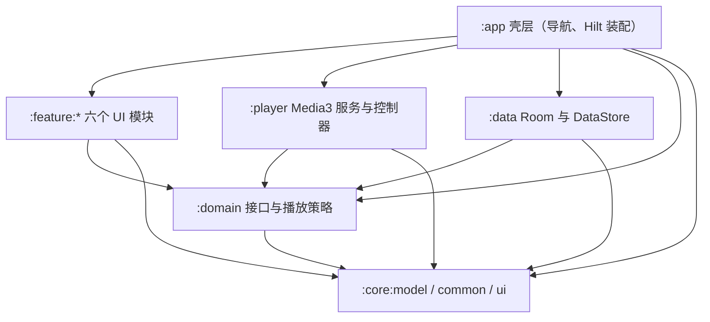

# 快速上手

本仓库是 **melody-in-heart**（applicationId `cn.com.dcsgo.mihx`）：一款纯本地、离线优先、无广告、无网络依赖的 Android 音乐播放器，当前版本 `3.7.0`（versionCode 33），`minSdk 33` / `targetSdk 36`，Java 11 字节码。技术栈为 Kotlin 2.0.21 + Jetpack Compose（BOM 2025.09.01）+ Media3 1.9.0（含 Jellyfin FFmpeg 解码扩展）+ Hilt 2.52 + Room 2.6.1（`MelodyDatabase` v10）+ DataStore 1.1.1 + WorkManager 2.9.1 + LiteRT 1.4.1（沿用 `org.tensorflow.lite.Interpreter` API 做端上情绪推理）。工程拆成 14 个 Gradle 模块（`:app`、`:core:*`、`:domain`、`:data`、`:player`、`:feature:*`、`:benchmark`），模块边界由根 `build.gradle.kts` 里约 530 行的自定义任务 `verifyProductArchitecture` 硬性把关。改动任何代码前请先读本页的路由表找到对应专题页；提交前必须跑 `./gradlew check`。

## 先读什么、信什么

- **源码与测试是唯一权威**。本 wiki 的每条结论都带 `repo://` 证据，但实现会继续演进——动手前以当前代码为准。
- `CLAUDE.md` 与 `docs/` 是高价值的历史资料（构建约定、队列/状态机设计文档），但**内容可能滞后**，需与代码核对后再信。例如 `CLAUDE.md` 版本表仍写 Compose BOM `2024.09.00`、versionName `3.5.1`，而版本目录与 `app/build.gradle.kts` 实际是 `2025.09.01` 和 `3.7.0`。
- 仓库根 `AGENTS.md` 约定：OpenWiki 页面由定时工作流刷新，除非明确要求，不要手改 `openwiki/` 下的页面。

## 模块速览



*合法依赖方向：只有 `:app` 能看到全部模块；feature 之间、feature 与 `:data`/`:player` 之间的依赖被 `verifyProductArchitecture` 禁止。*

| 层 | 模块 | 职责一句话 |
| --- | --- | --- |
| App 壳 | `:app` | `MelodyApplication` / `MainActivity` / `AppRoot` / `AppNavHost`，路由表 `AppRoutes` + 底部三 Tab `AppDestinations`，权限协调，情绪扫描 Worker，Hilt 装配 |
| Feature | `:feature:home/playlist/user/lyrics/player/settings` | 每个功能暴露 `XxxRoute` + `XxxScreen`（Route/Screen 模式被架构任务强制）；`:feature:player` 额外承载 `PlayerRuntime` 门面组合根 |
| Domain | `:domain` | 仓库接口 + 纯逻辑播放策略（planner/synchronizer/coordinator），无 Android 依赖 |
| Data | `:data` | Room `MelodyDatabase`（v10，13 张实体表）+ 迁移，DataStore 包装器，窄适配器绑定 domain 接口 |
| Player | `:player` | `AppMediaSessionService`（ExoPlayer + MediaSession）、`PlaybackController`（MediaController 客户端）、窗口化队列规划、蓝牙协同、`EmotionAnalyzer` 推理支持 |
| Core | `:core:model` / `:core:common` / `:core:ui` | 纯数据类型 / `AppLog`+`PerformanceTrace` / 主题与共享 Compose 组件 |

分层细节与 Hilt 装配点见 [/openwiki/architecture/module-graph.md](/openwiki/architecture/module-graph.md)。

**离线与隐私不变量**：应用自身清单只声明 `POST_NOTIFICATIONS`、`FOREGROUND_SERVICE(_MEDIA_PLAYBACK)`、`BLUETOOTH_CONNECT`，没有 `INTERNET` 权限；音乐导入走 SAF 文档树访问而非 `READ_MEDIA_AUDIO`（架构任务会拦截这两种存储权限）；备份/数据提取规则必须排除播放状态、Room 文件、DataStore 文件与封面缓存。通知与蓝牙权限只能由用户在设置页触发申请，禁止出现在启动路径。

## 常用命令

全部在仓库根目录执行；Windows 用 `.\gradlew.bat`，macOS/Linux 用 `./gradlew`。

```bash
# 单模块快速编译（改代码后最快反馈）
./gradlew :data:compileDebugKotlin

# 全量 JVM 单元测试（无需设备）
./gradlew test
# 单模块 / 单测试类
./gradlew :player:test --tests "cn.com.dcsgo.mihx.player.window.ControllerQueuePlannerTest"

# 需要真机/模拟器
./gradlew :app:connectedAndroidTest      # Compose instrumentation 测试
./gradlew :benchmark:connectedCheck      # Macrobenchmark（冷启动 / 滚动帧率）

# 格式与架构门槛
./gradlew spotlessCheck                  # 或 spotlessApply 自动修复
./gradlew verifyProductArchitecture

# 提交前全量门槛：根级 spotlessCheck + verifyProductArchitecture + 全部 14 个子项目的 check/test
./gradlew check
```

### `verifyProductArchitecture` 门槛速览

根 `build.gradle.kts` 中的自定义校验任务，每次 `check` 对全仓库源码树做静态断言，主要规则族：

- **模块边界**：feature 不得依赖 `:data`/`:player`/其他 feature；`player/window/` 不得 import `cn.com.dcsgo.mihx.data.player` 实现；实现层 import（`cn.com.dcsgo.mihx.data.repository/local`）不得泄漏到 feature/domain/player。
- **Hilt 装配**：4 个入口点（`MelodyApplication` `@HiltAndroidApp`、`MainActivity`/`AppMediaSessionService` `@AndroidEntryPoint`、`PlayerViewModel` `@HiltViewModel`）与 6 个 DI 模块（app 侧 `CoroutineModule`/`LoggerModule`/`PlayerModule`，data 侧 `DatabaseModule`/`RepositoryModule`/`DataStoreModule`）必须存在且保持 `SingletonComponent`。
- **Room schema 不可变**：`data/schemas/` 的历史 JSON（1~10.json）禁止修改；v1/v2/v3 的内容断言锁定迁移语义。
- **UI 与代码规范**：LazyColumn `items` 必须带稳定 `key`；禁止直接调用 `android.util.Log`（必须用 `AppLog`）。
- **发布与隐私**：release 必须 `isMinifyEnabled` + `isShrinkResources`；`:app` 清单不得声明 `AppMediaSessionService`；备份规则必须含既定隐私排除项；禁止启动路径申请权限。
- **性能锚点**：`MusicRepository` 导入/扫描与 `PlaybackController` 关键路径必须保留 `PerformanceTrace` 操作锚点；`:benchmark` 模块形态与 `StartupBenchmark` 术语受检。

失败时 `GradleException` 消息直接点名是哪条规则。完整规则清单与发布约束见 [/openwiki/operations/build-and-verification.md](/openwiki/operations/build-and-verification.md)。

### 构建变体

| 变体 | 要点 |
| --- | --- |
| `debug` | 无混淆；`applicationIdSuffix=".debug"`，可与 release 同机共存 |
| `release` | R8 混淆 + 资源收缩；仅 `arm64-v8a`；`keystore.properties` 缺失时回退 debug 签名，传 `-PrequireReleaseSigning=true` 则直接失败（防误出不可发布包） |
| `benchmark` | 继承 release 设置但用 debug 签名，追加 `x86_64` 以支持模拟器 |

### Room schema 变更流程（常踩坑）

改实体 → bump `MelodyDatabase.VERSION` → 构建导出新 schema JSON 到 `data/schemas/` → 写 `Migration(N, N+1)` 并注册进 `DatabaseModule` → 复杂迁移补窄单测。**永不修改已导出的历史 schema JSON。**

## 任务 → 应读页面路由表

| 你要改什么 | 先读 | 配套窄验证 |
| --- | --- | --- |
| 队列 / 随机播放 / 无限随机 / 播放模式 | [/openwiki/player/runtime-facades.md](/openwiki/player/runtime-facades.md) → [/openwiki/player/queue-architecture.md](/openwiki/player/queue-architecture.md)、[/openwiki/player/random-and-infinite.md](/openwiki/player/random-and-infinite.md) | `./gradlew :player:test :feature:player:test` |
| 播放状态机 / 进程恢复 / 服务与蓝牙 | [/openwiki/player/state-machine.md](/openwiki/player/state-machine.md)、[/openwiki/player/service-and-controller.md](/openwiki/player/service-and-controller.md) | `./gradlew :domain:test --tests "cn.com.dcsgo.mihx.domain.playback.ControllerPlaybackStateSynchronizerTest"` |
<!-- openwiki: broken internal link [/openwiki/concepts/mood-time-slot.md] file "/openwiki/concepts/mood-time-slot.md" does not exist. Fix the href or restore the target, then delete this comment. -->
| 情绪分析或时段随心播放 | [/openwiki/concepts/emotion-model.md](/openwiki/concepts/emotion-model.md)、[/openwiki/concepts/mood-time-slot.md](/openwiki/concepts/mood-time-slot.md)、[/openwiki/workflows/emotion-analysis-pipeline.md](/openwiki/workflows/emotion-analysis-pipeline.md) | `./gradlew :domain:test --tests "cn.com.dcsgo.mihx.domain.playback.MoodSlotResolverTest"` 加 `./gradlew :core:ui:test` |
| Room / DataStore / 迁移 / 备份排除 | [/openwiki/architecture/data-persistence.md](/openwiki/architecture/data-persistence.md)、[/openwiki/operations/build-and-verification.md](/openwiki/operations/build-and-verification.md) | `./gradlew :data:test` |
| 导航 / App 壳 / 权限 / 主题 | [/openwiki/architecture/app-shell-navigation.md](/openwiki/architecture/app-shell-navigation.md) | `./gradlew :app:connectedAndroidTest` |
| 加模块 / 改依赖边界 / 动 Hilt 装配 | [/openwiki/architecture/module-graph.md](/openwiki/architecture/module-graph.md) | `./gradlew verifyProductArchitecture` |
| 完整播放会话（开播→切歌→结算→恢复） | [/openwiki/workflows/playback-session-lifecycle.md](/openwiki/workflows/playback-session-lifecycle.md) | 播放器相关测试 |
| 提交前 / 发布前总览 | [/openwiki/operations/build-and-verification.md](/openwiki/operations/build-and-verification.md)、[/openwiki/testing/test-map.md](/openwiki/testing/test-map.md) | `./gradlew check` |

### 每类任务的三条硬约束（改前必知）

- **播放器**：`PlayQueue.songs` 是允许重复的业务全队列，`MediaController` 只持当前 ±窗口（规划后 ≤71 项：前 20 + 当前 + 后 50）；`MediaItem.mediaId` 必须等于 `Song.id.toString()`；`PlayerViewModel` 是薄门面，真实逻辑在 `PlayerRuntime` 组合的 18 个 facade / 5 个 graph 中——不要往 ViewModel 塞逻辑，也不要复活被禁用的 `PlayerViewModelComponents` 单体。
- **情绪功能**：批扫由 `MelodyApplication.onCreate` 调度的 WorkManager 周期任务驱动（充电 + 电量充足，每 6h 一轮 ≤40 首；手动触发每轮 ≤300 首并自动续排）；`EmotionAnalyzer` 用 `:player` assets 里的 YAMNet + V/A 头两个 TFLite 模型产出逐窗 V/A 曲线（模型版本 `yamnet-va-v3`），结果进 Room `song_emotions` 表，失败进 DataStore JSON；同一首累计失败 ≥3 次不再自动重试。时段随心播放按 `MoodSlotResolver` 判定 `[start, end)` 半开区间（`end <= start` 为跨午夜），词条过滤发生在 planner 入口，空池回退全库随机。
- **数据层**：Room（`melody.db`，13 张表，schema 快照不可变）+ 五个 DataStore 偏好文件（`player_settings`、`playback_state`、`playlist_resume`、`mood_time_slot`、`emotion_failures`）；v1 时代 SharedPreferences JSON 经 `SharedPreferencesLegacyJsonMigration` 在首启迁移进 Room；备份/数据提取规则必须持续排除上述文件。

## 全部 wiki 页面

- 入口与运维：本页、[构建、校验与发布运维](/openwiki/operations/build-and-verification.md)、[测试地图](/openwiki/testing/test-map.md)
- 架构：[模块分层与依赖边界](/openwiki/architecture/module-graph.md)、[App 壳、导航与跨模块接线](/openwiki/architecture/app-shell-navigation.md)、[数据持久化：Room 与 DataStore](/openwiki/architecture/data-persistence.md)
- 播放器：[PlayerRuntime 与门面清单](/openwiki/player/runtime-facades.md)、[播放队列与窗口化同步](/openwiki/player/queue-architecture.md)、[随机播放与无限随机](/openwiki/player/random-and-infinite.md)、[播放状态机与状态恢复](/openwiki/player/state-machine.md)、[播放服务与 MediaController](/openwiki/player/service-and-controller.md)
<!-- openwiki: broken internal link [/openwiki/concepts/mood-time-slot.md] file "/openwiki/concepts/mood-time-slot.md" does not exist. Fix the href or restore the target, then delete this comment. -->
- 领域概念：[情绪领域模型与词表](/openwiki/concepts/emotion-model.md)、[情境化随心播放](/openwiki/concepts/mood-time-slot.md)
- 端到端工作流：[情绪分析全链路](/openwiki/workflows/emotion-analysis-pipeline.md)、[播放会话生命周期](/openwiki/workflows/playback-session-lifecycle.md)
