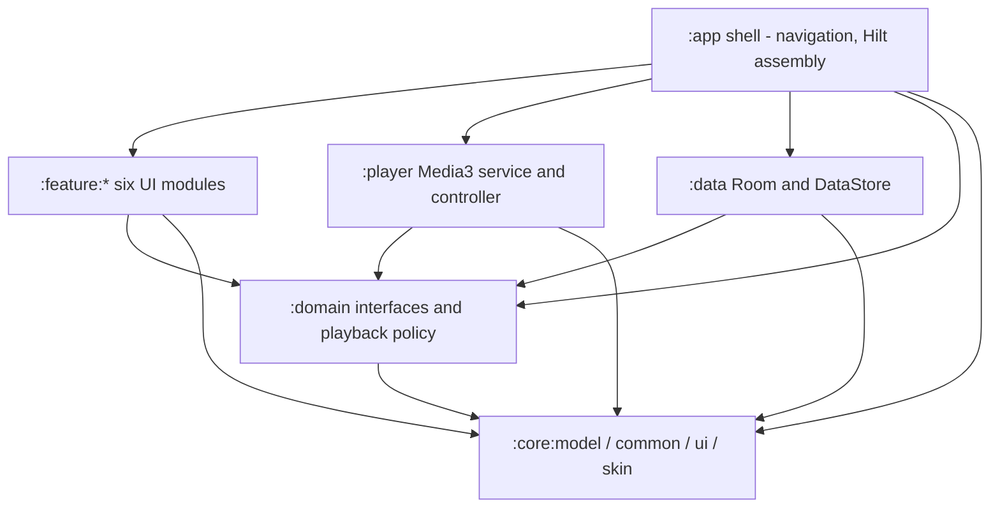

# Quick Start

This repository is **melody-in-heart** (applicationId `cn.com.dcsgo.mihx`): a fully local, offline-first, ad-free, network-free Android music player. Current version is `3.10.2` (versionCode 44), `minSdk 33` / `targetSdk 36`, Java 11 bytecode. The stack is Kotlin 2.0.21 + Jetpack Compose (BOM 2025.09.01) + Media3 1.9.0 (with the Jellyfin FFmpeg decoder extension) + Hilt 2.52 + Room 2.6.1 (`MelodyDatabase` v10, 13 entity tables) + DataStore 1.1.1 + WorkManager 2.9.1 + LiteRT 1.4.1 (via the `org.tensorflow.lite.Interpreter` API for on-device emotion inference). The project is split into **15 Gradle modules** (`:app`, five `:core:*`, `:domain`, `:data`, `:player`, six `:feature:*`, `:benchmark`), and module boundaries are enforced by the custom `verifyProductArchitecture` task in the root `build.gradle.kts`. Before editing any code read the routing table on this page to find the matching topic page; run `./gradlew check` before committing.

## What to read, what to trust

- **Source and tests are the only authority.** Every wiki conclusion carries `repo://` evidence, but implementation keeps evolving — when you act, trust the current code above any doc.
- `CLAUDE.md` and `docs/` are high-value historical references (build conventions, queue/state-machine design docs), but **they may lag the code** and must be cross-checked. For example `CLAUDE.md` still writes Compose BOM `2024.09.00` and versionName `3.5.1` (versionCode 29), while the version catalog and `app/build.gradle.kts` actually use `2025.09.01` and `3.10.2`; it also still warns against the old `composeOptions { kotlinCompilerExtensionVersion }` block, which the current Kotlin 2.0.21 `org.jetbrains.kotlin.plugin.compose` build no longer uses.
- The repository root `AGENTS.md` convention: OpenWiki pages are refreshed by scheduled workflows; do not hand-edit pages under `openwiki/` unless explicitly asked.

## Module overview


```mermaid
flowchart TD
    APP[":app shell - navigation, Hilt assembly"] --> FEAT[":feature:* six UI modules"]
    APP --> PLAYER[":player Media3 service and controller"]
    APP --> DATA[":data Room and DataStore"]
    APP --> DOMAIN[":domain interfaces and playback policy"]
    APP --> CORE[":core:model / common / ui / skin"]
    FEAT --> DOMAIN
    FEAT --> CORE
    PLAYER --> DOMAIN
    PLAYER --> CORE
    DATA --> DOMAIN
    DATA --> CORE
    DOMAIN --> CORE
```

*Legal dependency direction: only `:app` may see every module; dependencies between features, or from a feature to `:data`/`:player`, are forbidden by `verifyProductArchitecture`.*

| Layer | Module | One-line responsibility |
| --- | --- | --- |
| App shell | `:app` | `MelodyApplication` / `MainActivity` / `AppRoot` / `AppNavHost`, route table `AppRoutes`, bottom-bar shell, permission coordinator, emotion-scan worker, skin-shell resolver, Hilt assembly |
| Feature | `:feature:home/playlist/user/lyrics/player/settings` | Each feature exposes `XxxRoute` + `XxxScreen` (the Route/Screen pattern is enforced by the architecture task); `:feature:player` additionally hosts the `PlayerRuntime` facade composition root |
| Domain | `:domain` | Repository interfaces + pure playback policy (planner/synchronizer/coordinator), no Android dependencies |
| Data | `:data` | Room `MelodyDatabase` (v10, 13 entity tables) + migrations, DataStore wrappers, narrow adapters binding domain interfaces |
| Player | `:player` | `AppMediaSessionService` (ExoPlayer + MediaSession), `PlaybackController` (MediaController client), windowed queue planning, Bluetooth coordination, `EmotionAnalyzer` inference support |
| Core | `:core:model` / `:core:common` / `:core:ui` / `:core:skin` | Pure data types / `AppLog` + `PerformanceTrace` / theme and shared Compose components / skin description model, parser and fail-closed validation |

Layering detail and Hilt binding points: [/openwiki/architecture/module-graph.md](/openwiki/architecture/module-graph.md).

**Offline and privacy invariants**: the app's own manifest declares only `POST_NOTIFICATIONS`, `FOREGROUND_SERVICE`, `FOREGROUND_SERVICE_MEDIA_PLAYBACK` and `BLUETOOTH_CONNECT` — there is **no `INTERNET` permission**. Since 2026-10-06 `READ_MEDIA_AUDIO` is accepted solely to accelerate the import scan (a fast direct `java.io.File` traversal when already granted), but SAF document-tree access remains the primary and fallback path and `READ_EXTERNAL_STORAGE` is still banned by the architecture task; a denied `READ_MEDIA_AUDIO` silently falls back to SAF. Backup/data-extraction rules must keep excluding playback state, Room files, DataStore files and the album-art cache. Notification and Bluetooth permissions may only be requested from user-triggered Settings paths, never on the startup path.

## Common commands

All commands run from the repository root; use `.\gradlew.bat` on Windows and `./gradlew` on macOS/Linux.

```bash
# Fast single-module compile (quickest feedback after an edit)
./gradlew :data:compileDebugKotlin

# Full JVM unit-test run (no device needed)
./gradlew test
# Single module / single test class
./gradlew :player:test --tests "cn.com.dcsgo.mihx.player.window.ControllerQueuePlannerTest"

# Need a device/emulator
./gradlew :app:connectedAndroidTest      # Compose instrumentation tests
./gradlew :benchmark:connectedCheck      # Macrobenchmark (cold start / scrolling frame rate)

# Format and architecture gates
./gradlew spotlessCheck                  # or spotlessApply to auto-fix
./gradlew verifyProductArchitecture

# Pre-commit full gate: root spotlessCheck + verifyProductArchitecture + check/test across all 15 subprojects
./gradlew check
```

### `verifyProductArchitecture` gate at a glance

A custom validation task in the root `build.gradle.kts` that makes static assertions over the whole source tree on every `check`. Main rule families:

- **Module boundaries**: features must not depend on `:data`/`:player`/other features; `player/window/` must not import `cn.com.dcsgo.mihx.data.player` implementations; implementation-layer imports (`cn.com.dcsgo.mihx.data.repository/local`) must not leak into feature/domain/player.
- **Module graph completeness**: all 15 product modules listed in `settings.gradle.kts` (`:app`, `:core:model/common/ui/skin`, `:domain`, `:data`, `:player`, the six `:feature:*`, `:benchmark`) must exist, each with a local `.gitignore` covering generated Android/Gradle output.
- **Hilt wiring**: the entry points (`MelodyApplication` `@HiltAndroidApp`, `MainActivity`/`AppMediaSessionService` `@AndroidEntryPoint`, `PlayerViewModel` `@HiltViewModel`) and DI modules (app-side `CoroutineModule`/`LoggerModule`/`PlayerModule`, data-side `DatabaseModule`/`RepositoryModule`/`DataStoreModule`) must exist in `SingletonComponent`.
- **Room schema immutability**: historical JSON under `data/schemas/` (1–10.json) must not be modified; v1/v2/v3 content assertions lock the migration semantics.
- **UI and code conventions**: `LazyColumn` `items` must carry a stable `key`; direct `android.util.Log` calls are banned (must use `AppLog`).
- **Release and privacy**: release must have `isMinifyEnabled` + `isShrinkResources`; the `:app` manifest must not declare `AppMediaSessionService`; backup rules must contain the agreed privacy exclusions; requests for notification/Bluetooth/`READ_MEDIA_AUDIO` permissions must not appear on the startup path (startup-path requests fail); `READ_EXTERNAL_STORAGE` must never be declared.
- **Performance anchors**: `MusicRepository` import/scan and `PlaybackController` hot paths must keep `PerformanceTrace` operation anchors; the `:benchmark` module shape and `StartupBenchmark` terminology are checked.

On failure the `GradleException` message names the violated rule directly. Full rule list and release constraints: [/openwiki/operations/build-and-verification.md](/openwiki/operations/build-and-verification.md).

### Build variants

| Variant | Highlights |
| --- | --- |
| `debug` | No minification; `applicationIdSuffix=".debug"` so it can coexist with a release install |
| `release` | R8 minify + resource shrink; only `arm64-v8a`; falls back to debug signing when `keystore.properties` is missing, and passes `-PrequireReleaseSigning=true` to fail the build instead (prevents accidentally shipping a debug-signed package) |
| `benchmark` | inherits release settings but uses debug signing, non-debuggable, adds `x86_64` for emulators |

### Room schema change flow (common pitfall)

Change an entity → bump `MelodyDatabase.VERSION` → build to export the new schema JSON to `data/schemas/` → write `Migration(N, N+1)` and register it in `DatabaseModule` → add a narrow unit test for complex migrations. **Never modify already-exported historical schema JSON.**

## Task → page-to-read routing table

| What you are changing | Read first | Companion narrow verification |
| --- | --- | --- |
| Queue / random / infinite-random / play modes | [/openwiki/player/runtime-facades.md](/openwiki/player/runtime-facades.md) → [/openwiki/player/queue-architecture.md](/openwiki/player/queue-architecture.md), [/openwiki/player/random-and-infinite.md](/openwiki/player/random-and-infinite.md) | `./gradlew :player:test :feature:player:test` |
| Playback state machine / process restore / service and Bluetooth | [/openwiki/player/state-machine.md](/openwiki/player/state-machine.md), [/openwiki/player/service-and-controller.md](/openwiki/player/service-and-controller.md) | `./gradlew :domain:test --tests "cn.com.dcsgo.mihx.domain.playback.ControllerPlaybackStateSynchronizerTest"` |
| Emotion analysis or mood time-slot anything-play | [/openwiki/concepts/emotion-model.md](/openwiki/concepts/emotion-model.md), [/openwiki/workflows/emotion-analysis-pipeline.md](/openwiki/workflows/emotion-analysis-pipeline.md) | `./gradlew :domain:test --tests "cn.com.dcsgo.mihx.domain.playback.MoodSlotResolverTest"` plus `./gradlew :core:ui:test` |
| Style switching / multi-theme-color update (skin shell, `ThemeVariant`, tab/menu layout) | [/openwiki/architecture/app-shell-navigation.md](/openwiki/architecture/app-shell-navigation.md), [/openwiki/architecture/module-graph.md](/openwiki/architecture/module-graph.md) | `./gradlew :core:skin:test :app:test --tests "cn.com.dcsgo.mihx.app.shell.*"` |
| Sorting the local-music list / screen orientation / duplicate-song cleanup | [/openwiki/architecture/data-persistence.md](/openwiki/architecture/data-persistence.md) | `./gradlew :data:test :domain:test` |
| Room / DataStore / migration / backup exclusions | [/openwiki/architecture/data-persistence.md](/openwiki/architecture/data-persistence.md), [/openwiki/operations/build-and-verification.md](/openwiki/operations/build-and-verification.md) | `./gradlew :data:test` |
| Navigation / app shell / permissions / theme | [/openwiki/architecture/app-shell-navigation.md](/openwiki/architecture/app-shell-navigation.md) | `./gradlew :app:connectedAndroidTest` |
| Add a module / change dependency boundaries / touch Hilt wiring | [/openwiki/architecture/module-graph.md](/openwiki/architecture/module-graph.md) | `./gradlew verifyProductArchitecture` |
| Full playback session (start → track change → settle → restore) | [/openwiki/workflows/playback-session-lifecycle.md](/openwiki/workflows/playback-session-lifecycle.md) | player-related tests |
| Pre-commit / pre-release overview | [/openwiki/operations/build-and-verification.md](/openwiki/operations/build-and-verification.md), [/openwiki/testing/test-map.md](/openwiki/testing/test-map.md) | `./gradlew check` |

### Three hard constraints per task area (know before editing)

- **Player**: `PlayQueue.songs` is the business queue that may contain duplicates; `MediaController` only holds the current ± window (≤71 items after planning: 20 before + current + 50 after); `MediaItem.mediaId` must equal `Song.id.toString()`; `PlayerViewModel` is a thin facade — real logic lives in the `PlayerRuntime`-composed facade graph, so do not stuff logic into the ViewModel.
- **Emotion feature**: batch scans are driven by a WorkManager periodic task scheduled from `MelodyApplication.onCreate` (while charging with sufficient battery, ~6h cycles of ≤40 songs; manual triggers process ≤300 per round and auto-requeue); `EmotionAnalyzer` uses the YAMNet + V/A head in `:player` assets to produce per-window V/A curves (model version `yamnet-va-v3`), results go to the Room `song_emotions` table, failures go to DataStore JSON; songs accumulating `MAX_ATTEMPTS` (=3) failures stop being auto-retried. Mood time-slot anything-play is decided by `MoodSlotResolver` over the half-open `[start, end)` interval (`end <= start` wraps midnight); tag filtering happens at the planner entry, and an empty pool falls back to full-library random.
- **Data layer**: Room (`melody.db`, 13 tables, immutable schema snapshots) + five DataStore preference files (`player_settings`, `playback_state`, `playlist_resume`, `mood_time_slot`, `emotion_failures`); v1-era SharedPreferences JSON is migrated into Room on first launch via `SharedPreferencesLegacyMigration`. Sorting is persisted orthogonally as a `SongSortMode` (IMPORT_ORDER / TITLE / ARTIST / ALBUM / DURATION / SAMPLE_RATE / PLAY_COUNT / LAST_PLAYED) plus an ascending flag in `player_settings`. Dedup scans (real-path fingerprint) happen in `PlayerRuntime.scanDuplicateSongs`/`deduplicateAll`, which call `MusicRepository.deduplicateSongs` to remove duplicate song references from playlists and clean up orphaned associations without deleting physical files. Screen orientation (SENSOR_AUTO / LANDSCAPE / PORTRAIT) is applied to the Activity via `requestedOrientation` from `AppRoot`.

## New in v3.10.2 (versionCode 44)

- **15th module: `:core:skin`.** A pure data-model module (Android library with `org.json` + `:core:model` only — deliberately no Compose, so descriptions can be parsed and validated device-side without UI and easily unit-tested). It defines `Skin` / `SkinTokens` / `SkinShell` / `SkinParser` (fail-closed, `SUPPORTED_SCHEMA_VERSION = 1`), the `SkinPartCatalog` part whitelist, and `DefaultSkin`.
- **Style switcher now only flips between bundled skeletons**, not arbitrary JSON imports. The importer path (`onImportUserSkin` / `UserSkinStore` / `SkinIdDeriver`) was removed; `SkinSwitcherStore` persists the active id plus per-skinId playback-panel cover size/corner overrides and a global grid-layout switch in a single `skin_switcher` SharedPreferences file. The two bundled skeletons are the **default 3-tab** (`PLAYLIST`/`HOME`/`USER`, `playerEntry=tab`) and the **minimal 2-tab sheet** skeleton (`PLAYLIST`/`USER` with player as a global drawer, `playerEntry=sheet`). `SkinShellResolver.resolveById` maps the active id to an `AppShell`; an unknown id falls back to the default (fail-safe) so the app always starts. Resolution and route mapping live in `:app` (not `:core:skin`) because `AppRoutes`/drawables are app-layer knowledge.
- **Multi-theme-color variants.** `ThemeVariant` in `:core:model` grew to 8 entries — `MONO`, `VERMILION`, `INDIGO`, `SAGE`, `AMBER`, `SKY`, `FRESH`, `SUNRISE` — each swatch rendered automatically by the settings 「theme-color」 card on top of light/dark mode.
- **Sort, screen orientation, and dedup** capabilities summarized in the data-layer hard constraints above.

## All wiki pages

- Entry and operations: this page, [build / verify / release operations](/openwiki/operations/build-and-verification.md), [test map](/openwiki/testing/test-map.md)
- Architecture: [module layering and dependency boundaries](/openwiki/architecture/module-graph.md), [app shell, navigation and cross-module wiring](/openwiki/architecture/app-shell-navigation.md), [data persistence: Room and DataStore](/openwiki/architecture/data-persistence.md)
- Player: [PlayerRuntime and the facade list](/openwiki/player/runtime-facades.md), [queue and windowed sync](/openwiki/player/queue-architecture.md), [random & infinite play](/openwiki/player/random-and-infinite.md), [playback state machine and restore](/openwiki/player/state-machine.md), [playback service and MediaController](/openwiki/player/service-and-controller.md)
- Domain concepts: [emotion domain model and vocabulary](/openwiki/concepts/emotion-model.md)
- End-to-end workflows: [emotion analysis pipeline](/openwiki/workflows/emotion-analysis-pipeline.md), [playback session lifecycle](/openwiki/workflows/playback-session-lifecycle.md)
