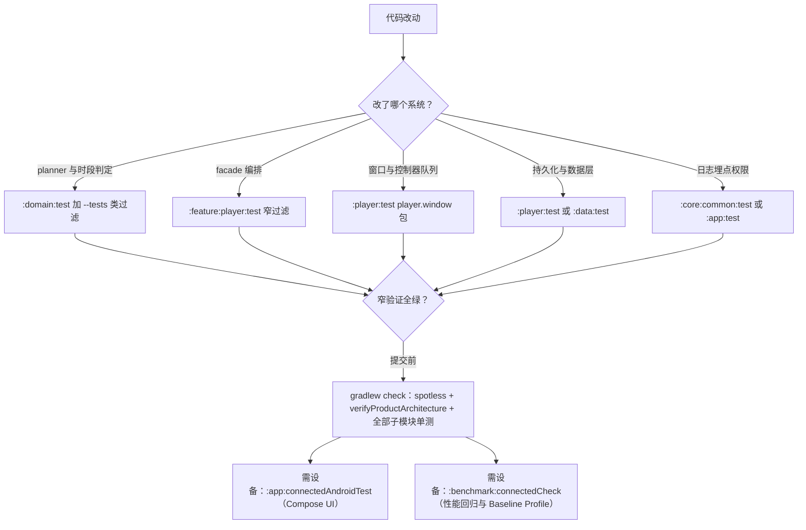

# 测试地图：行为锁定与验证路径

本页回答两个问题：**哪个不变量被哪个测试类锁定**，以及**改某系统前应该先跑哪些窄验证**。仓库测试以 JVM 单元测试为主体（纯 JUnit4 + 手写 fake，无 mocking 框架），planner 与 resolver 全部把 shuffle / `isPlayable` / 时钟等做成注入参数，因此核心业务决策不需要设备即可验证。提交门槛由 `check` 聚合（格式 + `verifyProductArchitecture` + 全部子模块单测），完整命令矩阵见 `/openwiki/operations/build-and-verification.md`；被测试锁定的各系统行为详解见 `/openwiki/player/random-and-infinite.md`、`/openwiki/player/queue-architecture.md`、`/openwiki/architecture/data-persistence.md`。

## 1. 三层验证分工

| 层 | 命令 | 设备 | 职责 |
| --- | --- | --- | --- |
| **JVM 单测** | `.\gradlew.bat :domain:test`、`:player:test`、`:data:test`、`:feature:player:test`、`:core:common:test`、`:app:test`（Windows；macOS/Linux 用 `./gradlew`） | 不需要 | 改逻辑的第一道闸。覆盖全部 planner/resolver/协调器/facade 编排/仓库持久化语义/快照序列化。**绝大多数行为回归都应在这一层被抓住** |
| **Instrumented 测试** | `.\gradlew.bat :app:connectedAndroidTest` | 需要真机/模拟器 | Compose UI 层（`HomeScreenComposeTest` / `PlaylistScreenComposeTest` / `SettingsScreenComposeTest`），验证空态、播放控制、文案与 contentDescription 真实渲染 |
| **Macrobenchmark** | `.\gradlew.bat :benchmark:connectedCheck` | 需要真机/模拟器 | 性能回归与 Baseline Profile 生成：`StartupBenchmark`（冷启动 5 次迭代）、`ScrollBenchmark`、`BaselineProfileGenerator`（产物写回 `app/src/main/baselineProfiles/baseline-prof.txt`，release 自动打包） |



*三层验证路径：JVM 单测做日常窄验证，`check` 是提交前全量门槛，设备层只在 UI 与性能断言时进入。*

`check` 在根 `build.gradle.kts` 末尾聚合根级 `spotlessCheck`、根级 `verifyProductArchitecture` 与全部 14 个子项目的 `check`（各子项目 `check` 又跑自己的全部单测），所以它失败可能是格式、架构断言或单测三者之一——先看 `GradleException` 消息定位。

## 2. 回归底线：随机与情绪时段的 planner 测试

情境化随心播放（时段 × 情绪词条）的设计文档 §7 实施清单第 7 条是明确的回归底线：**关闭开关后随心播放行为必须与增强前逐位一致，`RandomQueuePlanner` 既有测试全部不动且必须全绿**。这意味着：

- `RandomQueuePlannerTest`、`UniformRandomPlannerTest` 的每一条断言都是「现状」的定义，不是可以顺手重构的实现细节；增强只能发生在候选池入口（`PlayerRandomQueueFacade` 侧过滤），不能改变 planner 的筛选/分层/淘汰语义。
- `PlayerRandomQueueFacadeTest` 中非 mood 前缀的用例（`playRandomQueueStartsSequentialQueueAndLeavesInfiniteMode` 等）承担同样的「关闭增强 = 现状」回归职责；`moodFilterDisabledKeepsOriginalBehavior` 与 `moodFilterInactiveOutsideSlotTime` 则把「开关关 / 时段未命中 ⇒ 行为与现状一致」直接写成断言。
- 改这三个测试文件（或让它们变红）的 PR 默认是行为变更，必须在 PR 描述里显式声明并给出理由。

## 3. 按系统分组的测试锚点表

### 3.1 随机（RandomQueuePlanner / UniformRandomPlanner）

| 测试类 | 锁定的行为 |
| --- | --- |
| `domain/.../RandomQueuePlannerTest` | 随机队列计划语义：`recentSongIds` 淘汰（被淘汰歌不入批次、入选歌并入 recent 集合）；候选不足时清空历史重来并置 `resetHistory = true`；均匀随机开启时经近期过滤后仍取低播放次数歌；`planInfiniteStart` 只把**队列内可播**的歌记入覆盖集；`planInfiniteRefill` 排除已在队列的歌、保持既有排除集；无可播歌返回 `null` |
| `domain/.../UniformRandomPlannerTest` | 分层抢占：开关关时退化为注入的 shuffle；开启时按原始播放次数动态分层、低层优先，低层足够名额绝不越层，不足则全取低层后由高层补齐；全部次数超过任何固定阈值时分层依然有效（阈值来自分布而非常量）；全体次数相同退化为纯随机；`orderSongs` 按次数分组、组内 shuffle；`buildPlayOrderIds` 在 `SHUFFLE` 模式下当前歌置顶、其余分层 |

均匀随机的兼容性是设计要求：情绪过滤后的候选池直接喂给 `selectSongs`，分层抢占逻辑不改一行即可生效——上述测试就是这条兼容性的证明。

### 3.2 情绪时段（MoodSlotResolver / facade 过滤与降级）

| 测试类 | 锁定的行为 |
| --- | --- |
| `domain/.../MoodSlotResolverTest` | 全边角时段判定：普通区间左闭右开（start 整点命中、end 整点不命中）；跨午夜（`end <= start`，22:00–06:00 在 23:41/00:00/05:59 命中、06:00 与 21:59 不命中）；合法配置下全天逐分钟扫描至多一命中、非法数据多命中时确定性地取开始最早者；开关关 / 空配置恒不生效；校验错误分类（空名、名字超长 `NAME_MAX_LENGTH=20`、无词条、零长度、与既有时段重叠返回 `Conflict` 且点名冲突方、端点相接不重叠、同 id 编辑不算自我冲突）；`overlaps` 环形时间轴语义（跨午夜×清晨相交、两个跨午夜必相交、全天段与非零段必相交） |
| `feature/player/.../PlayerRandomQueueFacadeTest`（mood 组） | facade 侧过滤与降级：命中时段时随机池收窄到带词条的歌；词条组合 0 首时**回退全库随机**并记录 "fall back to full library" 日志（不因空池启动失败）；未命中时段与开关关闭时行为与现状一致；与均匀随机叠加时过滤后仍走分层抢占（0 次歌排在 10 次歌前） |

时段判定与校验是 `:domain` 纯函数（`MoodSlotResolver` + `MoodSlotPolicy` 常量），配置编辑页 UI 与持久化两侧复用同一份 `validate`/`overlaps`，测试即契约——UI 不允许另写一份重叠判断。

### 3.3 队列与窗口（domain 与 player 两个 planner、同步器、性能形状、回绕检测）

| 测试类 | 锁定的行为 |
| --- | --- |
| `domain/.../ControllerQueuePlannerTest` | 可播顺序展开：空队列返回 `null`；`SEQUENTIAL` 保序且 `startIndex` 指向请求歌；`REVERSE` 倒序；`SHUFFLE` 按 `playOrderIds` 稳定展开；请求歌不可播时跳到下一个可播项 |
| `player/.../ControllerQueuePlannerTest`（`:player` 侧同名类） | 控制器计划语义：`remainingAfterStart` 尾批检测；**重复歌曲完整保留**（`1,2,2,3` 不去重，重复 id 的 startIndex 按请求的出现次数解析）；「添加到下一首」后控制器顺序为 `1,2,5,3`；播放模式变更重建控制器顺序；全不可播返回 `null` |
| `player/window/PlaybackWindowPlannerTest` | 窗口切片：`DEFAULT_PREVIOUS_COUNT=20` / `DEFAULT_NEXT_COUNT=50`，在队列首尾钳制；窗口内索引 ↔ 全队列索引的映射（`controllerStartIndex` / `fullQueueStartIndex`）；`REVERSE` 模式窗口按倒放顺序 |
| `player/window/ControllerWindowSynchronizerTest` | 窗口缓存：非强制计划复用窗口但把 `startIndex` 重锚到当前歌；强制计划（如 `addSongAsNext` 后）使缓存失效并重算；空队列返回 `null`；稳定 shuffle / 反向播放顺序进入窗口 |
| `player/window/PlaybackWindowPerformanceShapeTest` | 产品级性能形状：100 / 500 / 1000 首歌队列下控制器窗口恒 **≤ 71 项且 ≥ 51 项**（队列头/中/尾三点验证，含 1000 首稳定 shuffle 窗口不膨胀为全队列）。**这个测试文件本身被 `verifyProductArchitecture` 锁定存在性与关键词**（`100`、`500`、`1_000`、`71`、`WindowedControllerQueuePlanner`），删文件或改关键词会直接挂架构门槛 |
| `player/.../MediaItemWrapDetectionTest` | 回绕判定：窗口尾（索引 70）→ 0 算回绕；正常前进、`previous` 一步、首切（`C.INDEX_UNSET`）、新索引非 0 都不算；**2 首小窗口的倒退视为回绕**（无害：补队列 planner 自动去重）；空/单项窗口不可能回绕。判定必须用索引而非 transition reason——Media3 在 `REPEAT_MODE_ALL` 下尾部回绕以 `SEEK` 原因上报 |
| `player/.../SingleItemLoopRewindDetectionTest` | 单项队列循环回绕（`REPEAT_MODE_ALL` 下 0→0 不触发 `onMediaItemTransition`，只能靠 AUTO discontinuity + 位置回跳识别）：duration 已知时按「旧位置接近结尾」精确判定；未知时回退保守阈值（旧位置 < 30s 视为缓冲抖动不计）；`SEEK` 原因（手动拖回开头）不得计为播完（防刷）；多首队列、索引变化、新位置非 0 都不算；阈值边界值仍判定 |

### 3.4 状态机与持久化（状态同步、恢复协调、快照存储与序列化、facade 同名测试）

| 测试类 | 锁定的行为 |
| --- | --- |
| `domain/.../ControllerPlaybackStateSynchronizerTest` | Media3 快照 → UI 状态映射：`mediaId`（= `Song.id.toString()`）映射回业务队列并更新 `currentIndex`，同时产出 duration 更新与播放开始事件；未知 `mediaId` 保持当前歌不动；已跟踪歌不重复发播放开始；buffering 中的暂停不计为真实暂停（`isPlayingTransition` 三态）；`QueueManager.restorePlayModeAfterNextSong` 只对相关歌恢复「下一首前」的播放模式，且播放顺序构建器可注入 |
| `domain/.../PlaybackRestoreCoordinatorTest` | 启动恢复：存储无状态 → `null`；当前歌缺失或不可播 → 恢复队列但无可播会话；正常路径产出携带恢复位置与同名歌组（按采样率降序）的可播会话；**无限播放标记与覆盖集原样穿越恢复** |
| `player/.../PlaybackStateStoreTest` | DataStore 快照存储：save/restore 往返保留队列、`currentIndex`、模式、`playOrderIds`、重复项与无限播放状态；恢复时过滤已不存在的歌；`saveCurrentPlaybackSnapshot` 用当前歌快照纠正索引/位置，甚至能为不在已存队列中的歌新建队列；**空会话保存（UI 重建窗口的瞬时全空状态）不得清掉已有快照**（2026-09-03 回归，注释点名）；无既有快照时空保存不写任何东西；恢复回退 legacy SharedPreferences，且下一次成功保存清掉 legacy 键 |
| `player/.../PlaybackStateSnapshotSerializerTest` | 快照 JSON 健壮性：往返保留重复项/索引/模式/播放顺序；损坏 JSON 与缺必需 `currentIndex` 解码为 `null`（不抛异常）；缺可选字段取默认值；`infinitePlayedIds` 中畸形与不可用条目被静默丢弃 |
| `:feature:player` 各 facade 同名测试 | 18 个 facade 每个都有同名 JVM 测试，用 fake 可调用对象记录副作用、验证纯 planner 之上的编排语义。代表锚点：`PlayerQueueFacadeTest`（setPlayQueue 更新状态 + 触发持久化）；`PlayerControllerQueueFacadeTest`（`remainingMediaItems` 优先控制器信息、无 items 时回退计划队列）；`PlayerMediaEventFacadeTest`（尾部/回绕触发补队列、非无限模式不补、「添加到下一首」后恢复播放模式并消费一次性标记）；`PlayerPersistenceFacadeTest`（异步保存前**先**捕获当前位置；live session 恢复跳过控制器但 UI 队列照常恢复）；`PlayerPlaybackStateAutosaverTest`（保存节流：立即一次后按间隔节流，`reset` 放行下一次） |
| `feature/player/.../NarrowFlowSyncTest`、`PlayerSleepTimerCoordinatorTest` | 窄流回归基线（2026-09-03 进度条回跳修复）：离散 `uiState` 更新不得把陈旧位置/归零倒计时刷回窄流（对比基线必须是 update 前的 uiState 旧值）；真实位置变化（seek）、恢复路径、定时器启动必须传播到窄流；cancel 归零必须走显式复位入口 `resetSleepTimerNarrowFlow` |

### 3.5 数据层（Room 仓库、设置仓库、legacy 迁移、歌词解析）

数据层单测**不启动 Android**：Room 仓库测试对每个测试文件内手写的 `FakeMelodyDao`（逐字段内存表）运行，设置/快照测试用 `PreferenceDataStoreFactory` + 临时文件跑真 DataStore；`:data` 显式引入真实 `org.json` 测试依赖（`testImplementation(libs.org.json)`），因为 Android SDK 的 org.json 在 JVM 上是抛异常的桩。

| 测试类 | 锁定的行为 |
| --- | --- |
| `data/repository/MusicRepositoryRoomTest` | 曲库仓库：启动从 Room 重建歌单交叉引用（按 `sortOrder`）并过滤孤儿引用；加歌入单持久化交叉引用且拒绝重复；无上下文时本地文件校验全保留；标题分组覆盖（`titleOverride`）写库/清库往返，恢复时驱动 `groupKey` |
| `data/repository/PlayStatsRepositoryRoomTest` | 播放统计：`increment`/`incrementRawPlayCount`/`updatePlayDuration` 增量持久化并盖 `lastPlayedAt`；批量读缺失歌默认 0；`getRankedCounts` 确定性排序（同次数按 id 升序），`useRawCounts` 切换口径 |
| `data/repository/QuickSkipSongsRepositoryRoomTest`、`PlaylistResumeDataStoreTest` | 秒切歌集合的成员判定/去重/短播计数重置；歌单续播 DataStore 的记录/覆盖/单歌单清除语义 |
| `data/repository/PlayerSettingsRepositoryTest` | 设置持久化语义：无存储时取默认（主题 `SYSTEM`、变体 `MONO`、字体缩放 1）；legacy SharedPreferences 回退只发生一次——首次 DataStore 写入后 legacy 键被删除（dark theme、全局均匀随机两条路径各有断言） |
| `data/local/migration/LegacyJsonSnapshotParserTest` | v1 JSON 快照解析：歌曲/歌单/分组覆盖/播放统计前缀键（`play_count_*`、`raw_play_count_*`、`play_duration_*`）/秒切歌与短播计数解析；可选字段缺失取中文默认值；损坏 JSON 逐段恢复不整体失败；重复 URI 去重但保留无 URI 歌；歌单引用只指向迁移后的歌并重排 `sortOrder` |
| `data/local/migration/SharedPreferencesLegacyJsonMigrationTest` | 一次性迁移编排：全部数据写入 `FakeMelodyDao` 并写 `MigrationStateEntity` 完成标记；JSON 损坏时统计仍迁移、标记仍写（不重试）；**已有完成标记则完全跳过**（零写入） |
| `data/util/LrcParserOffsetTest` | LRC `[offset:]` 标签回归（2026-09-03 歌词实时性优化——此前 offset 被直接丢弃）：正值整体提前（`timeMs += offset`）、负值延后、缺失/非法保持原时间戳、对多时间戳行的每个时间戳生效、空白内容返回 `null` |

### 3.6 权限与通用（`core:common`、`core:ui`、`app`）

| 测试类 | 锁定的行为 |
| --- | --- |
| `app/.../RuntimePermissionPolicyTest` | 版本门槛：通知权限只在 API 33+（`TIRAMISU`）返回 `POST_NOTIFICATIONS` 规格；`BLUETOOTH_CONNECT` 只在 API 31+（`S`）返回规格，低版本返回 `null`（各带中文拒批文案） |
| `core/common/.../AppLoggerTest` | 日志脱敏：`content://`、`file://` URI、POSIX/Windows 路径、蓝牙地址与设备名/`bluetoothName` 字段替换为占位符；`Throwable` 的消息与堆栈同样脱敏。这是规则 14（禁直写 `android.util.Log`）的行为背书 |
| `core/common/.../PerformanceTraceTest` | 埋点：`measure` 透传块返回值；`log` 输出经 `AppLog` 且 metadata 先脱敏（`uri=content://<redacted>`）；release 静默由 `isEnabled` 控制，`allow`/`disallow` 白名单让关键操作在线上继续输出 |
| `core/ui/.../SongEmotionSectionTest` | 情绪纯函数层：`smoothCurve` 保长降噪、短列表直通；`lowConfidence` 未定带（任一轴 \|值\| < 0.15）；`hasSignificantPeak` 峰值显著性；**词表封闭性**（10 组共 39 个不重复词，ABYSS 组 3 词，headline 为组首词）；逐窗投票近零弃权、按占比取前 `MAX_TAGS` 组；WITTY（鬼畜）组被排除在自动投票外（V-A 中心真空修复）但手动标记链路 `groupOf` 不受限 |

另有 `core/model` 的 `LyricsHighlightLeadTest`（歌词行高亮提前量 `HIGHLIGHT_LEAD_MS` 的预滚动补偿语义）与 `app` 的 `ResolveResumeSongTest`（歌单续播歌解析：可播性/存在性/空 resume 三个 `null` 分支）——同属「行为即契约」的小型回归锁。

## 4. 窄验证命令示例

原则（AGENTS.md）：**优先最窄的安静验证**——改哪个模块就跑哪个模块的测试，用 `--tests` 类过滤收敛到具体行为；全量 `check` 留给提交前。**失败输出必须完整保留**（不要截断、不要只贴 summary），`verifyProductArchitecture` 的失败消息会直接点名违规文件，单测失败会给出完整断言差异。

```bash
# ① 改 planner / 时段判定（随机与情绪时段的回归底线）
.\gradlew.bat :domain:test --tests "cn.com.dcsgo.mihx.domain.playback.RandomQueuePlannerTest" --tests "cn.com.dcsgo.mihx.domain.playback.UniformRandomPlannerTest" --tests "cn.com.dcsgo.mihx.domain.playback.MoodSlotResolverTest"

# ② 改 facade 编排（含 mood 过滤/降级、无限播放 refill）
.\gradlew.bat :feature:player:test --tests "cn.com.dcsgo.mihx.feature.player.PlayerRandomQueueFacadeTest"

# ③ 改控制器窗口 / 同步
.\gradlew.bat :player:test --tests "cn.com.dcsgo.mihx.player.window.*"
.\gradlew.bat :domain:test --tests "cn.com.dcsgo.mihx.domain.playback.ControllerQueuePlannerTest"

# ④ 改播放状态持久化（快照存储、序列化、恢复）
.\gradlew.bat :player:test --tests "cn.com.dcsgo.mihx.data.player.PlaybackStateStoreTest" --tests "cn.com.dcsgo.mihx.data.player.PlaybackStateSnapshotSerializerTest"
.\gradlew.bat :domain:test --tests "cn.com.dcsgo.mihx.domain.playback.PlaybackRestoreCoordinatorTest"

# ⑤ 改数据层 / 迁移
.\gradlew.bat :data:test

# ⑥ 改日志 / 埋点 / 权限
.\gradlew.bat :core:common:test
.\gradlew.bat :app:test

# ⑦ 提交前全量门槛（格式 + 架构断言 + 全部模块单测）
.\gradlew.bat check

# ⑧ 设备层（需要真机/模拟器；UI 断言与性能回归）
.\gradlew.bat :app:connectedAndroidTest
.\gradlew.bat :benchmark:connectedCheck
```

操作提醒：

- 一次 Gradle 调用可以带多个 `--tests` 过滤；通配 `--tests "cn.com.dcsgo.mihx.player.window.*"` 覆盖整个包。
- 改 `MusicRepository` 导入/扫描或 `PlaybackController` 队列路径时，除了单测还要确认 `PerformanceTrace` 锚点字符串未被改名（`music_import_scan` 等）——`verifyProductArchitecture` 会直接失败。
- 改了启动路径或首页列表实现后，跑一次 `:benchmark:connectedCheck` 重新生成 Baseline Profile；macrobenchmark 在 MIUI 真机上可能因 ROM 限制无法完成自动授权/帧确认步骤。
- 快速编译反馈（不跑测试）可用 `.\gradlew.bat :player:compileDebugKotlin` 一类单模块编译任务。

## 相关页面

- `/openwiki/operations/build-and-verification.md` —— 命令矩阵、`verifyProductArchitecture` 全部规则、benchmark 与 Baseline Profile 运维
- `/openwiki/player/random-and-infinite.md` —— 随机链路被锁行为的完整推导
- `/openwiki/player/queue-architecture.md` —— 双队列模型与窗口管线的被锁不变量
- `/openwiki/architecture/data-persistence.md` —— Room/DataStore 持久化与迁移史（§3.5 测试锚点的背景）
- `/openwiki/player/state-machine.md` —— 播放状态机（§3.4 同步器测试的背景）
- `/openwiki/concepts/emotion-model.md` —— 情绪词表与投票算法（§3.6 `SongEmotionSectionTest` 的背景）
