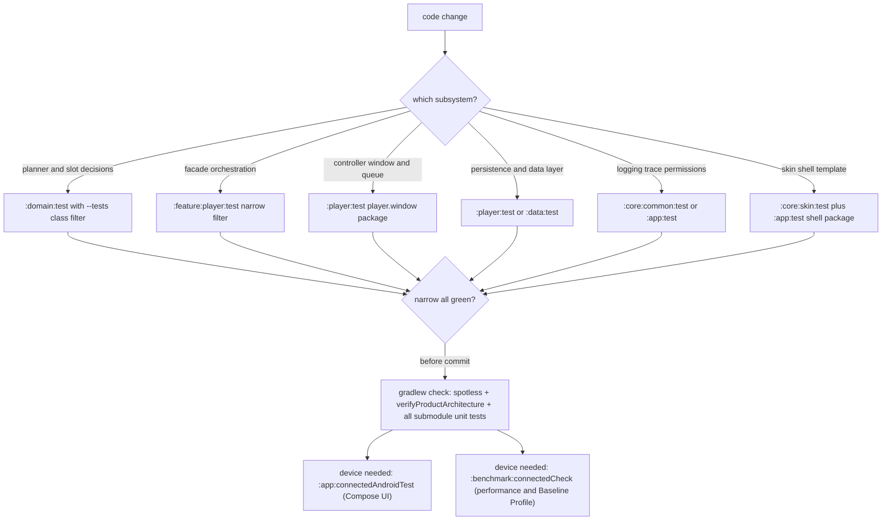

# Test Map: Behavior Locks and Verification Paths

This page answers two questions: **which invariant is locked by which test class**, and **which narrow verification to run before changing a subsystem**. The repository's tests are predominantly JVM unit tests (pure JUnit 4 + hand-written fakes, no mocking framework); every planner and resolver takes shuffle / `isPlayable` / clock as injected parameters, so the core business decisions are verified without a device. The pre-commit gate is aggregated by `check` (formatting + `verifyProductArchitecture` + all submodule unit tests); the full command matrix lives on `/openwiki/operations/build-and-verification.md`, and the behavior each test locks is elaborated on `/openwiki/player/random-and-infinite.md`, `/openwiki/player/queue-architecture.md`, and `/openwiki/architecture/data-persistence.md`.

## 1. Three-layer verification split

| Layer | Command | Device | Responsibility |
| --- | --- | --- | --- |
| **JVM unit tests** | `.\gradlew.bat :domain:test`, `:player:test`, `:data:test`, `:feature:player:test`, `:core:common:test`, `:core:skin:test`, `:feature:playlist:test`, `:feature:user:test`, `:app:test` (Windows; `./gradlew` on macOS/Linux) | Not needed | First gate for logic changes. Covers all planner/resolver/coordinator/facade orchestration/repository persistence semantics/snapshot serialization plus the skin-description, shell-equivalence, and playlist-template suites. **Almost every behavior regression should be caught here** |
| **Instrumented tests** | `.\gradlew.bat :app:connectedAndroidTest` | Needs device/emulator | Compose UI layer (`HomeScreenComposeTest` / `PlaylistScreenComposeTest` / `SettingsScreenComposeTest`), verifying empty-state, playback controls, copy, and contentDescription actually render |
| **Macrobenchmarks** | `.\gradlew.bat :benchmark:connectedCheck` | Needs device/emulator | Performance regression and Baseline Profile generation. `StartupBenchmark` (cold-start, 5 iterations) and `ScrollBenchmark` are **device-run macrobenchmarks, not JVM unit tests**; `BaselineProfileGenerator` writes `app/src/main/baselineProfiles/baseline-prof.txt`, which release builds bundle via `profileinstaller` |


```mermaid
flowchart TD
    CHANGE["code change"] --> KIND{"which subsystem?"}
    KIND -->|"planner and slot decisions"| R1[":domain:test with --tests class filter"]
    KIND -->|"facade orchestration"| R2[":feature:player:test narrow filter"]
    KIND -->|"controller window and queue"| R3[":player:test player.window package"]
    KIND -->|"persistence and data layer"| R4[":player:test or :data:test"]
    KIND -->|"logging trace permissions"| R5[":core:common:test or :app:test"]
    KIND -->|"skin shell template"| R6[":core:skin:test plus :app:test shell package"]
    R1 --> GREEN{"narrow all green?"}
    R2 --> GREEN
    R3 --> GREEN
    R4 --> GREEN
    R5 --> GREEN
    R6 --> GREEN
    GREEN -->|"before commit"| CHECK["gradlew check: spotless + verifyProductArchitecture + all submodule unit tests"]
    CHECK --> DEVICE["device needed: :app:connectedAndroidTest (Compose UI)"]
    CHECK --> BENCH["device needed: :benchmark:connectedCheck (performance and Baseline Profile)"]
```

*Three verification paths: JVM unit tests are the daily narrow gate, `check` is the full pre-commit gate, and the device layer only enters for UI and performance assertions.*

`check` aggregates the root-level `spotlessCheck`, the root-level `verifyProductArchitecture`, and every subproject's own `check` (each of which runs that subproject's unit tests) at the end of root `build.gradle.kts`; a failure can therefore be formatting, an architecture assertion, or a unit test — read the `GradleException` message first.

## 2. Regression baseline: random and mood-slot planner tests

The contextual shuffle (slot × mood words) design's §7 checklist item 7 is an explicit regression floor: **with the switch off, shuffle behavior must be bit-identical to the pre-enhancement build, and all existing `RandomQueuePlanner` tests must stay untouched and green**. This means:

- Every assertion in `RandomQueuePlannerTest` and `UniformRandomPlannerTest` defines "current behavior", not refactorable implementation detail; the enhancement may only occur at the candidate-pool entry (`PlayerRandomQueueFacade`-side filtering), never change the planner's filtering/layering/elimination semantics.
- The non-mood-prefixed cases of `PlayerRandomQueueFacadeTest` (e.g. `playRandomQueueStartsSequentialQueueAndLeavesInfiniteMode`) carry the same "switch off = current behavior" regression duty; `moodFilterDisabledKeepsOriginalBehavior` and `moodFilterInactiveOutsideSlotTime` directly assert "switch off / slot time missed ⇒ behavior identical to current".
- A PR that edits these three test files (or turns them red) is by default a behavior change and must declare it explicitly in the PR description.

## 3. Test anchors grouped by subsystem

### 3.1 Random (`RandomQueuePlanner` / `UniformRandomPlanner`)

| Test class | Locked behavior |
| --- | --- |
| `domain/.../RandomQueuePlannerTest` | Random-queue planning semantics: `recentSongIds` elimination (eliminated songs never enter a batch, picked songs join the recent set); when candidates are exhausted the history is cleared and re-drawn with `resetHistory = true`; with uniform random on, low-play-count songs are still preferred after recent-filtering; `planInfiniteStart` only records **queue-playable** songs into the coverage set; `planInfiniteRefill` excludes songs already in queue and keeps the existing exclusion set; returns `null` when no song is playable |
| `domain/.../UniformRandomPlannerTest` | Layered preemption: switch off degrades to the injected shuffle; on, layers are built dynamically from raw play counts with the low layer preferred, low layer never exceeded when it has enough slots, and the high layer filling shortfall only; extra-tier layering stays effective even when all counts exceed any fixed threshold (the threshold comes from the distribution, not a constant); equal counts degrade to pure random; `orderSongs` groups by count and shuffles within a group; `buildPlayOrderIds` puts the current song first in `SHUFFLE` mode and layers the rest |

Uniform-random compatibility is a design requirement: the emotion-filtered candidate pool feeds straight into `selectSongs` with zero changes to the layering logic, and the above tests are the proof of that compatibility.

### 3.2 Mood slots (`MoodSlotResolver` / facade filtering and degradation)

| Test class | Locked behavior |
| --- | --- |
| `domain/.../MoodSlotResolverTest` | Full-corner slot decisions: normal ranges are left-closed/right-open (start on-the-hour hits, end on-the-hour does not); across-midnight (`end <= start`, 22:00–06:00 hits at 23:41/00:00/05:59, not at 06:00 or 21:59); a legal config hits at most one slot in an all-day per-minute scan, illegal multi-hit data deterministically picks the earliest start; switch off / empty config never applies; validation error taxonomy (empty name, overlong name `NAME_MAX_LENGTH=20`, no words, zero length, overlapping an existing slot returns `Conflict` naming the conflicting party, abutting endpoints are not overlaps, same-id edit is not self-conflict); `overlaps` circular-timeline semantics (across-midnight × morning intersects, two across-midnight slots always intersect, an all-day slot intersects any non-zero slot) |
| `feature/player/.../PlayerRandomQueueFacadeTest` (mood group) | Facade-side filtering and degradation: when a slot hits, the random pool narrows to word-tagged songs; a 0-song word combination **falls back to full-library random** and logs "fall back to full library" (never fails to start on an empty pool); when the slot is missed or the switch is off the behavior is identical to current; stacked with uniform random, filtering still goes through layered preemption (a 0-count song ranks before a 10-count one) |

Slot decisions and validation are pure `:domain` functions (`MoodSlotResolver` + `MoodSlotPolicy` constants); the config-edit UI and persistence share the same `validate`/`overlaps` — the tests are the contract, and the UI must not write a second overlap implementation.

### 3.3 Queue and window (the domain and player planners, synchronizer, performance shape, wrap detection)

| Test class | Locked behavior |
| --- | --- |
| `domain/.../ControllerQueuePlannerTest` | Playable-order expansion: empty queue returns `null`; `SEQUENTIAL` keeps order with `startIndex` pointing at the requested song; `REVERSE` reverses; `SHUFFLE` expands stably by `playOrderIds`; when the requested song is unplayable it jumps to the next playable item |
| `player/.../ControllerQueuePlannerTest` (`:player`-side same-name class) | Controller planning semantics: `remainingAfterStart` tail-batch detection; **duplicate songs fully preserved** (`1,2,2,3` is not deduplicated, and a duplicate id's startIndex resolves to the requested occurrence); after "add as next", controller order is `1,2,5,3`; a play-mode change rebuilds controller order; all-unplayable returns `null` |
| `player/window/PlaybackWindowPlannerTest` | Window slicing: `DEFAULT_PREVIOUS_COUNT=20` / `DEFAULT_NEXT_COUNT=50` clamped at queue boundaries; window-index ↔ full-queue-index mapping (`controllerStartIndex` / `fullQueueStartIndex`); in `REVERSE` mode the window follows reverse-play order |
| `player/window/ControllerWindowSynchronizerTest` | Window caching: a non-forced plan reuses the window but re-anchors `startIndex` to the current song; a forced plan (like after `addSongAsNext`) invalidates the cache and recomputes; empty queue returns `null`; stable shuffle / reverse-play order enters the window |
| `player/window/PlaybackWindowPerformanceShapeTest` | Product-level performance shape: for 100 / 500 / 1000-song queues the controller window always stays **≤ 71 and ≥ 51 items** (checked at queue head/middle/tail, including that a 1000-song stable shuffle window does not balloon to the whole queue). **`verifyProductArchitecture` locks this file's existence and keywords** (`100`, `500`, `1_000`, `71`, `WindowedControllerQueuePlanner`), so deleting the file or renaming keywords fails the architecture gate |
| `player/.../MediaItemWrapDetectionTest` | Wrap decisions: window tail (index 70) → 0 counts as wrap; normal forward, one `previous` step, first switch (`C.INDEX_UNSET`), and a new non-zero index do not; **a backward step in a 2-song small window counts as wrap** (harmless: the refill planner dedups); empty/single-item windows cannot wrap. The decision must use indices, not the transition reason, because Media3 reports tail wraps under `REPEAT_MODE_ALL` as `SEEK` |
| `player/.../SingleItemLoopRewindDetectionTest` | Single-item loop wrap (0→0 under `REPEAT_MODE_ALL` fires no `onMediaItemTransition`, so it is recognized only via AUTO discontinuity + position rewind-back): with known duration, "old position near the end" decides precisely; unknown duration falls back to a conservative threshold (old position < 30s treated as buffering jitter, not completion); a `SEEK` reason (manual drag to start) must not count as finished (anti-gaming); multi-song queues, index changes, and a non-zero new position never count; threshold boundary values still decide |

### 3.4 State machine and persistence (state sync, restore coordination, snapshot store and serialization, same-name facade tests)

| Test class | Locked behavior |
| --- | --- |
| `domain/.../ControllerPlaybackStateSynchronizerTest` | Media3 snapshot → UI state mapping: `mediaId` (`= Song.id.toString()`) maps back to the business queue and updates `currentIndex`, producing a duration update and a playback-start event; an unknown `mediaId` leaves the current song alone; a tracked song does not emit playback-start twice; a buffering pause is not a real pause (`isPlayingTransition` three-state); `QueueManager.restorePlayModeAfterNextSong` restores the pre-next-song play mode only for the relevant song, and the play-order builder is injectable |
| `domain/.../PlaybackRestoreCoordinatorTest` | Startup restore: storage with no state → `null`; the current song missing or unplayable → restored queue but no playable session; the happy path yields a playable session carrying the restore position and the same-name song group (sorted by sample rate descending); **the infinite-play flag and coverage set traverse restore untouched** |
| `player/.../PlaybackStateStoreTest` | DataStore snapshot store: save/restore round-trips keep queue, `currentIndex`, mode, `playOrderIds`, duplicate items, and infinite-play state; restore filters songs that no longer exist; `saveCurrentPlaybackSnapshot` corrects index/position from the live current song and can even create a queue for a song that was not in the saved queue; **an empty-session save (transient all-empty state during UI rebuild) must not erase an existing snapshot** (2026-09-03 regression, named in the test); an empty save with no prior snapshot writes nothing; an empty save carrying only a `currentSongId` keeps the existing queue but updates position (2026-10-06 live-session regression), or restores a single-song queue when no queue existed; restore falls back to legacy SharedPreferences and the next successful save clears the legacy keys |
| `player/.../PlaybackStateSnapshotSerializerTest` | Snapshot JSON robustness: round-trip preserves duplicates/index/mode/play order; corrupt JSON and a missing required `currentIndex` decode to `null` (no exception); absent optional fields take defaults; malformed/unusable entries in `infinitePlayedIds` are silently dropped |
| `:feature:player` same-name facade tests | 18 facades, each with a same-named JVM test that records side effects via a fake callable object to verify pure-planner orchestration above. Representative anchors: `PlayerQueueFacadeTest` (setPlayQueue updates state and triggers persistence); `PlayerControllerQueueFacadeTest` (`remainingMediaItems` prefers controller info, falls back to the planned queue when there are no items); `PlayerMediaEventFacadeTest` (tail/wrap triggers refill, non-infinite mode does not, and "add as next" restores play mode and consumes a one-shot marker); `PlayerPersistenceFacadeTest` (captures the current position **before** the async save; live-session restore skips the controller but restores the UI queue); `PlayerPlaybackStateAutosaverTest` (save throttling: one immediate save then throttled by interval, `reset` releases the next save) |
| `feature/player/.../PlayerPersistenceFacadeTest` + `PlayerPersistenceGraphTest` | Persistence handshake regression: the `controllerReady` and `pendingRestore` flags converge in either order; a live session only refills the UI queue while an empty session fully restores; a connection failure fallback releases; no snapshot means no restore. This logic is the site of four past regressions (4fdb2ae/0cce0de/53af2cc/2026-10-06); the graph test uses `Dispatchers.Unconfined` so its internal `launch(io)/withContext(main)` runs synchronously without a coroutines-test dependency |
| `feature/player/.../NarrowFlowSyncTest` + `PlayerSleepTimerCoordinatorTest` | Narrow-flow regression baselines (2026-09-03 progress-bar rewind fix): discrete `uiState` updates must not write stale position/reset countdown back into the narrow flow (the comparison baseline must be the pre-update `uiState` old value); real position changes (seek), the restore path, and timer start must propagate to the narrow flow; a cancel reset must go through the explicit reset entry `resetSleepTimerNarrowFlow` / `resetRemainingMs` rather than relying on a `uiState` value diff |

### 3.5 Data layer (Room repositories, settings repository, legacy migration, lyrics parsing)

The data-layer unit tests **do not start Android**: Room-repository tests run against a hand-written in-memory `FakeMelodyDao` per test file, and settings/snapshot tests run a real DataStore via `PreferenceDataStoreFactory` + a temp file; `:data` explicitly pulls in the real `org.json` test dependency (`testImplementation(libs.org.json)`) because the Android SDK's org.json is a stub that throws on the JVM.

| Test class | Locked behavior |
| --- | --- |
| `data/repository/MusicRepositoryRoomTest` | Library repository: startup rebuilds playlist cross-references from Room (by `sortOrder`) and filters orphan references; adding a song to a playlist persists the cross-reference and rejects duplicates; local file verification is fully preserved without a context; `titleOverride` group-override write/clear round-trips and drives `groupKey` on restore |
| `data/repository/PlayStatsRepositoryRoomTest` | Play stats: `increment` / `incrementRawPlayCount` / `updatePlayDuration` persist incrementally and stamp `lastPlayedAt`; batch reads default missing songs to 0; `getRankedCounts` sorts deterministically (tie-break by id ascending) and `useRawCounts` switches the metric |
| `data/repository/QuickSkipSongsRepositoryRoomTest` + `PlaylistResumeDataStoreTest` | Quick-skip member decisions/dedup/short-play-count reset; playlist-resume DataStore record/overwrite/single-song single-clear semantics |
| `data/repository/PlayerSettingsRepositoryTest` | Settings persistence: defaults when nothing is stored (theme `SYSTEM`, variant `MONO`, lyric font scale 1, global uniform random on, Bluetooth monitoring off, playback notification off, daily listening goal 120 minutes); per-key legacy SharedPreferences fallback happens exactly once — after the first DataStore write the legacy key is deleted (with separate assertions for the dark-theme, global-uniform-random, Bluetooth-monitoring, and notification paths); non-legacy keys like `lyricFontScale` and `dailyListeningGoalMinutes` persist directly to DataStore. (The `themeVariant` and `screenOrientationMode` settings exist on `PlayerSettingsRepository`, but only `themeVariant` is exercised here; orientation is not covered by this file's current cases.) |
| `data/local/migration/LegacyJsonSnapshotParserTest` | v1 JSON snapshot parsing: song/playlist/group-override/play-stat prefix keys (`play_count_*`, `raw_play_count_*`, `play_duration_*`)/quick-skip songs and short-play counts; optional-field absence takes Chinese defaults; corrupt JSON recovers per-segment instead of failing wholesale; duplicate URIs dedup while URI-less songs are kept; playlist references point only at migrated songs and `sortOrder` is re-ordered |
| `data/local/migration/SharedPreferencesLegacyJsonMigrationTest` | One-shot migration orchestration: all data writes to `FakeMelodyDao` and writes the `MigrationStateEntity` completion marker; corrupt JSON still migrates stats and still writes the marker (no retry); **an existing completion marker means a full skip** (zero writes) |
| `data/util/LrcParserOffsetTest` | LRC `[offset:]` tag regression (2026-09-03 lyrics-live optimization, previously the offset was dropped): a positive value advances everything (`timeMs += offset`), a negative delays it, a missing/invalid value keeps the original timestamp, it applies to every timestamp of a multi-timestamp line, and blank content returns `null` |

### 3.6 `:core:skin` description lock (v3.10.2)

The skin-description suite locks the "description-driven shell == the current app structure, and the contract can express radically different shells" invariant. Several of these tests deliberately read source files rather than self-proving against the description, because the P1 lesson was that a self-proving test can lock in a wrong description (the library was once asserted to have 5 segments including a spurious 「歌曲」 that only exists on the artist/album detail pages).

| Test class | Locked behavior |
| --- | --- |
| `core/skin/.../DefaultSkinTest` | The built-in skin JSON == today's app structure: 3 bottom tabs (曲库/播放/我的) matching `AppDestinations`; player is a normal tab, not a sheet; library page has exactly 4 segments (`LibraryTab`: 歌单/歌手/专辑/情绪) with a default of 歌单 and a search entry; every library segment has sections so none renders blank; the me page is fixed to one screen; surface token is `0` ("zero solid blocks" style); art size is `44dp` matching the delivered `VisTokens`; `startPage` is the player page because the app launches there. This is the P1 groundwork locked before P2 |
| `core/skin/.../SkinParserValidationTest` | Fail-closed validation with precise reasons: every bad input must give a typed `SkinIssue.Code` plus the offending field — rejects non-JSON (`MALFORMED_JSON`), missing schema version, unsupported schema version (states which version is supported, currently `1`), **unknown part is rejected and fails closed** (never silently degraded; even a real androidx widget like `AndroidView` not in the catalog is rejected), unknown icon, tab targeting a missing page, duplicate tab ids, a single-entry bottom bar, missing start page, invalid player entry, invalid cover shape, invalid row template, invalid song-list source, negative song count, and a segment without sections so the page cannot render blank |
| `core/skin/.../SkinExpressivenessTest` | The contract can express shells radically different from current: a NetEase-style skin (3 tabs 我的/发现/正在播放, card wall with surface=1, vinyl player page) and a minimal two-page skin (2 tabs + player as a global sheet with a persistent mini bar). Also locks the **scope boundary at L5/L6**: all three skins use only L1–L5 `SkinPartCatalog` parts and need no L6 presentation parts, and the catalog itself contains no L6/L7 entries. `songList` with `template: grid` proves one part renders differently per template |
| `core/skin/.../NeteaseSkinJsonTest` | The shipped NetEase user-skin JSON (`dcsgo.skin.netease.json` under `/tmp/skinpack/`) parses cleanly through `SkinParser` (no bad-prop/bad-page/bad-section), and its parsed fields match design intent: `playerEntry = sheet`, 3 tabs labeled 我的/发现/云村, `surface = 1` (card wall, complementary to mihx default 0), and grid template on the artist/album song-list segments |
| `core/skin/.../LibrarySegmentsMatchSourceTest` | Metadata-level lock: the description's library segments must match the `LibraryTab` enum **exactly** (including order) by parsing `feature/playlist`'s `PlaylistComponents.kt` directly; the `SkinPartCatalog.LIBRARY_SEGMENTS` whitelist must equal the `LibraryTab` labels; the source really has 4 segments and no 「歌曲」; and every described segment has `sectionsBySegment` defined. This catches the self-proving-test bug class the P4 correction exposed |

### 3.7 `:app` shell and navigation (built-in skeleton/template/section catalogs locked against the app structure)

These live in `:app` because cross-module consistency — `:core:skin` vs a feature module — cannot be tested in either module (architecture gates forbid core→feature back-deps, and a feature cannot see `:core:skin`); `:app` sees both and acts as the assembly layer.

| Test class | Locked behavior |
| --- | --- |
| `app/shell/AppShellEquivalenceTest` | Runtime-shell equivalence with the pre-refactor app: the built-in `DefaultShell.shell` keeps the three original tabs in the original order (曲库/播放/我的) mapped to `AppRoutes.PLAYLIST/HOME/USER`; tab ids are stable and unique (a duplicate id caused a dirty-tab rendering-key collision in the prototype); the start route is `AppRoutes.HOME` matching `AppNavHost`'s original `startDestination`; the mini player shows on the library page when a song is loaded and hides on the player page itself. Each assertion names the pre-refactor source it cross-checks |
| `app/shell/DefaultShellConsistencyTest` | The two shells must agree: `DefaultShell.shell` (the startup Kotlin constants) and `SkinShellResolver.resolve(DefaultSkin.JSON)` (the description-driven path user skins will take) produce the same tabs, start route, mini-player, and player-entry settings; the built-in JSON still parses cleanly with zero warnings; and the start route is the player page, not the library (locks the P1 fidelity bug where `startPage` was wrongly written as library) |
| `app/shell/SheetSkeletonTest` | The drawer-type skeleton is actually expressible and assemblable: the minimal sheet sample skin (2 tabs 曲库/我的, no player tab, `playerEntry = SHEET`, mini player as the drawer handle, start on the library page) passes validation with zero warnings — proving the description layer and shell layer genuinely support the user-requested "2 pages + global drawer" shape, not just an interface field |
| `app/shell/LibrarySongListTemplateTest` | L3 template resolution: the default skeleton resolves to `SongListTemplate.DEFAULT` (zero visual change vs pre-refactor), the grid sample resolves to `SongListTemplate.GRID` (for device A/B acceptance), a skeleton with no songList part falls back to `DEFAULT`, and an unknown template value is rejected by the validator (fail-closed: a template is not silently ignored at runtime but strictly rejected at import) |
| `app/shell/GridLayoutSwitchTest` | The global "artist/album grid layout" switch → shell mapping: switch on forces `GRID` regardless of skin across every `SkinShellResolver.knownSkins`; switch off keeps the skin's own template (must not overwrite the style's `songList.template`); and both builtin skins are list rows by default when the switch is off. Guards against the switch being mistaken for "per-style keyed" and against closing the switch overwriting the style's own parsed template |
| `app/shell/LuckyPlayEntryPolicyTest` | The 「随心播放」 entry-bar display policy `shouldShowLuckyPlayEntry`: shows on the sheet shell when no song is drawn, never shows while a song is playing (and is mutually exclusive with `shouldShowMiniPlayer`), and never shows on the tab shell (default three pages) because the player page already has the FAB. Guards against an inverted condition, a missing `SHEET` limitation (default three pages showing it would duplicate the FAB), and non-mutual-exclusion with the mini player |
| `app/shell/SongListTemplateCatalogTest` | L3 whitelist ↔ enum consistency: `SkinPartCatalog.SONG_LIST_TEMPLATES` must match the `SongListTemplate` enum's ids exactly (adding a template requires changing both sides), the whitelist contains `default` and `grid`, and has no duplicates. Prevents the "description legal but assembly breaks" / "assembly supports but validation rejects" mismatch between the `:core:skin` whitelist and the `:feature:playlist` enum |
| `app/shell/SkinSwitcherCatalogConsistencyTest` | Cross-module section key: `UserSections.SKIN_SWITCHER` must equal `SkinPartCatalog.SKIN_SWITCHER` literally, so the user-page skin-switcher key and the description part catalog cannot drift apart (the same trap class as the L3 template-whitelist drift) |

### 3.8 Playlist template and selection controller (`:feature:playlist`)

| Test class | Locked behavior |
| --- | --- |
| `feature/playlist/.../SongListTemplateTest` | The L3 row-template enum contracts: `DEFAULT`/`GRID` ids equal the catalog whitelist strings (`default`/`grid`); `fromId` returns `DEFAULT` for unknown values in a fail-safe manner (null, empty, unknown, and case-sensitive `"GRID"` all degrade to `DEFAULT`); `fromId("grid")` returns `GRID`; all template ids are distinct and non-blank. Pure Kotlin, no Android/Compose dependency |
| `feature/playlist/.../SongSelectionControllerTest` | Song-selection controller state logic: `filterSongs` returns all songs on a blank query and matches title or artist case-insensitively otherwise; `toggleSearch` closes and clears the query; `enterSelectMode`/`exitSelectMode` manage the multi-select selection set (toggle add/remove, exit clears selection) |

### 3.9 Permissions and common (`core:common`, `core:ui`, `core:model`, `app`)

| Test class | Locked behavior |
| --- | --- |
| `app/.../RuntimePermissionPolicyTest` | Version gates: the notification permission returns the `POST_NOTIFICATIONS` spec only on API 33+ (`TIRAMISU`); `BLUETOOTH_CONNECT` only on API 31+ (`S`); lower versions return `null` (each with its Chinese rejection copy) |
| `core/common/.../AppLoggerTest` | Log redaction: `content://`, `file://` URIs, POSIX/Windows paths, Bluetooth addresses, and device names/`bluetoothName` fields replaced with placeholders; a `Throwable`'s message and stack are redacted too. This is the behavioral backing for rule 14 (no direct `android.util.Log`) |
| `core/common/.../PerformanceTraceTest` | Tracing: `measure` passes through the block's return value; `log` writes via `AppLog` with metadata redacted first (`uri=content://<redacted>`); release silence is controlled by `isEnabled`, and `allow`/`disallow` whitelisting keeps critical operations logging in production |
| `core/ui/.../SongEmotionSectionTest` | Emotion pure-function layer: `smoothCurve` preserves length and noise-reduces, short lists pass through; the `lowConfidence` indeterminate band (\|value\| < 0.15 on either axis); `hasSignificantPeak` significance; **vocabulary closure** (10 groups, 39 distinct words, the ABYSS group has 3, headline is the group's first word); per-window voting with near-zero abstention, taking the top `MAX_TAGS` groups by proportion; the WITTY group is excluded from automatic voting (V-A-center vacuum fix) but the manual-tag `groupOf` chain is unaffected |

`core/model`'s `LyricsHighlightLeadTest` (the lyric-line highlight lead `HIGHLIGHT_LEAD_MS` pre-scroll compensation) and `app`'s `ResolveResumeSongTest` (playlist-resume song resolution: playability/existence/empty-resume `null` branches) belong to the same "behavior is the contract" family of small regression locks. `feature/user`'s `UserSectionsTest` locks the me-page section keys against history and the fallback order (5 hardcoded items then an optional `skinSwitcher`).

## 4. Narrow verification command examples

Principle (AGENTS.md): **prefer the narrowest quiet verification** — change one module, run that module's tests, and use `--tests` class filters to converge on the specific behavior; leave the full `check` for pre-commit. **Preserve failure output in full** (do not truncate, do not paste only a summary): `verifyProductArchitecture` failures name the offending file, and unit-test failures give the full assertion diff.

```bash
# ① changing a planner / slot decision (the random-and-mood-slot regression floor)
.\gradlew.bat :domain:test --tests "cn.com.dcsgo.mihx.domain.playback.RandomQueuePlannerTest" --tests "cn.com.dcsgo.mihx.domain.playback.UniformRandomPlannerTest" --tests "cn.com.dcsgo.mihx.domain.playback.MoodSlotResolverTest"

# ② changing facade orchestration (incl. mood filter/degrade, infinite-play refill)
.\gradlew.bat :feature:player:test --tests "cn.com.dcsgo.mihx.feature.player.PlayerRandomQueueFacadeTest"
.\gradlew.bat :feature:player:test --tests "cn.com.dcsgo.mihx.feature.player.PlayerPersistenceGraphTest" --tests "cn.com.dcsgo.mihx.feature.player.PlayerSleepTimerCoordinatorTest"

# ③ changing the controller window / sync
.\gradlew.bat :player:test --tests "cn.com.dcsgo.mihx.player.window.*"
.\gradlew.bat :domain:test --tests "cn.com.dcsgo.mihx.domain.playback.ControllerQueuePlannerTest"

# ④ changing playback-state persistence (snapshot store, serializer, restore)
.\gradlew.bat :player:test --tests "cn.com.dcsgo.mihx.data.player.PlaybackStateStoreTest" --tests "cn.com.dcsgo.mihx.data.player.PlaybackStateSnapshotSerializerTest"
.\gradlew.bat :domain:test --tests "cn.com.dcsgo.mihx.domain.playback.PlaybackRestoreCoordinatorTest"

# ⑤ changing the data layer / migration
.\gradlew.bat :data:test

# ⑥ changing logging / tracing / permissions
.\gradlew.bat :core:common:test
.\gradlew.bat :app:test

# ⑦ changing the skin description / shell / template catalogs (v3.10.2)
.\gradlew.bat :core:skin:test
.\gradlew.bat :app:test --tests "cn.com.dcsgo.mihx.app.shell.*"
.\gradlew.bat :feature:playlist:test --tests "cn.com.dcsgo.mihx.feature.playlist.*"

# ⑧ pre-commit full gate (formatting + architecture assertion + all module unit tests)
.\gradlew.bat check

# ⑨ device layer (needs real device/emulator; UI assertions and performance regressions)
.\gradlew.bat :app:connectedAndroidTest
.\gradlew.bat :benchmark:connectedCheck
```

Operational notes:

- One Gradle invocation accepts several `--tests` filters; the wildcard `--tests "cn.com.dcsgo.mihx.player.window.*"` covers a whole package.
- When changing `MusicRepository` import/scans or a `PlaybackController` queue path, besides unit tests confirm the `PerformanceTrace` anchors were not renamed (e.g. `music_import_scan`) — `verifyProductArchitecture` fails directly on that.
- After changing the startup path or home-list implementation, run `:benchmark:connectedCheck` once to regenerate the Baseline Profile; macrobenchmarks on MIUI device hardware can fail to complete auto-authorization/frame confirmation because of ROM limits.
- For fast compile feedback (no tests) use a single-module compile task like `.\gradlew.bat :player:compileDebugKotlin`.

## Related pages

- `/openwiki/operations/build-and-verification.md` — command matrix, every `verifyProductArchitecture` rule, benchmark and Baseline Profile operations
- `/openwiki/architecture/app-shell-navigation.md` — the shell/navigation structure the `:app` shell-equivalence tests verify
- `/openwiki/architecture/data-persistence.md` — Room/DataStore persistence and migration history (the §3.5 anchor background)
- `/openwiki/architecture/module-graph.md` — module boundaries that force the cross-module consistency tests into `:app`
- `/openwiki/player/random-and-infinite.md` — full derivation of the locked random-chain behavior
- `/openwiki/player/queue-architecture.md` — dual-queue model and the window pipeline's locked invariants
- `/openwiki/player/runtime-facades.md` — the facade runtime side of the same-name facade tests
