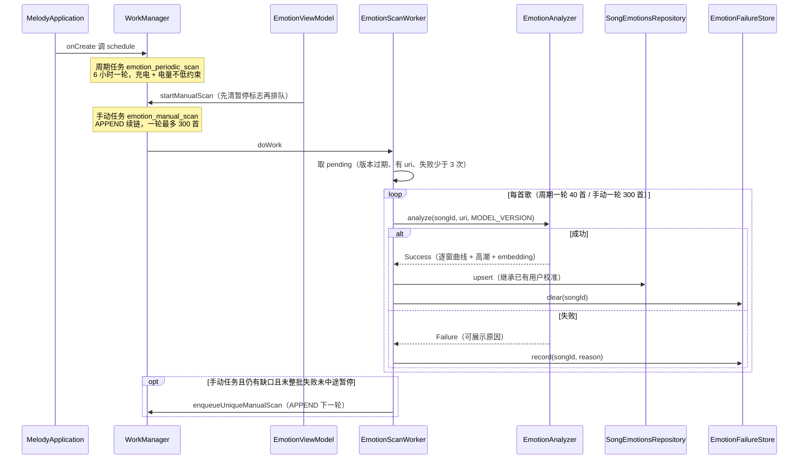
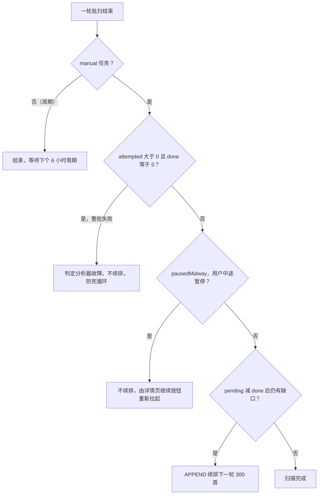

# 工作流：情绪分析全链路

情绪功能的数据生命周期是一条端侧闭环：**调度**（周期充电扫 + 手动立即扫）→ **批扫 Worker**（筛选待分析歌曲）→ **推理管线**（`EmotionAnalyzer`：解码 + YAMNet + VA 头）→ **落库**（Room `song_emotions` upsert / 失败记录 DataStore）→ **展示与校准**（详情曲线区、曲库情绪 Tab、校准回写）→ **消费反哺**（情绪时段随心播放的词条过滤）。

本页聚焦流程与失败语义；领域模型与词表见 `/openwiki/concepts/emotion-model.md`，存储 schema 见 `/openwiki/architecture/data-persistence.md`，播放侧判定见 `/openwiki/concepts/mood-time-slot.md`。

## 全链路总览

*情绪批扫全链路：两条触发链汇入同一 Worker，成功走 upsert + 清失败记录，失败走失败记录累计；手动链按 APPEND 续排直到收敛。*

## 批扫调度：周期与手动两条触发链

**周期链**在应用启动时布防：`MelodyApplication.onCreate` 调 `EmotionScanScheduler.schedule(this)`。调度器以 `enqueueUniquePeriodicWork` 排入唯一名 `emotion_periodic_scan` 的 `PeriodicWorkRequestBuilder<EmotionScanWorker>`，周期 6 小时，约束为 `setRequiresCharging(true)` + `setRequiresBatteryNotLow(true)` + 网络不要求，初始延迟 30 分钟。策略是 `ExistingPeriodicWorkPolicy.KEEP`（重复调用不替换已有任务），整个 enqueue 包在 `runCatching` 里——WorkManager 异常只记日志，绝不阻断启动。

**手动链**由「我的」页入口卡触发：`AppNavHost` 的 `onEmotionScanNow` 调 `EmotionViewModel.startManualScan()` 并 toast「已开始扫描，可离开本页，后台继续」。`startManualScan` 的顺序有讲究：**先 `setEmotionScanPaused(false)` 清暂停标志，再 enqueue**——防止 Worker 启动时读到旧暂停值直接跳过。手动任务是 `enqueueUniqueManualScan()`（`EmotionScanWorker.kt` 的扩展函数）：一次性任务、input `KEY_MANUAL=true`、唯一名 `emotion_manual_scan`、默认 `ExistingWorkPolicy.KEEP`（已在跑/已排队则不重复排），**不受充电约束**。

两条链的批量大不同：周期每轮 `BATCH_SONGS = 40` 首增量收敛，手动每轮 `MANUAL_BATCH_SONGS = 300` 首一轮扫完大库（WorkManager 单任务 10 分钟上限由续排兜底，见下）。

## EmotionScanWorker：批处理循环与续排规则

Worker 是 `CoroutineWorker`，经 `EntryPointAccessors.fromApplication(applicationContext, EmotionScanEntryPoint)` 取依赖——`EmotionScanEntryPoint` 是 WorkManager（非 Hilt 管理）访问单例的桥，暴露 music/emotion/failure 三个仓库、分析器与设置仓库。

**pending 筛选**（`doWork` 开头）对曲库全量做三重过滤：

1. `analyzed[songId] != EmotionAnalyzer.MODEL_VERSION`——未按当前模型版本分析过（模型升级后旧数据自动进入重扫）；
2. `it.uri != null`——有本地可读文件；
3. 失败记录 `attempts >= MAX_ATTEMPTS(3)` 的歌**剔除**——否则每轮扫描都在同一批坏文件上空转，用户看到的永远是「差几首没分析」却永远扫不完。

pending 为空时直接 `Result.success()`（日志注明曲库已最新、因反复失败跳过几首）。

**单首循环**对 `pending.take(batch)` 逐首执行：先查 `isStopped`（系统停止/超时截断）与 `isPaused()`（用户暂停，协作式），再 `setProgress(workDataOf(KEY_PROGRESS_CURRENT to song.title))` 推当前歌名给 UI，然后 `runCatching { analyzer.analyze(...) }`——连抛异常也兜底成 `Failure(INFERENCE_ERROR)`。成功走 `emotionRepository().upsert(result.emotion)` + `failureRepo.clear(song.id)`；失败走 `failureRepo.record(song.id, result.reason)`。**单首失败只记不抛，不阻断整批**。

**续排规则**是防死循环的核心（仅手动任务续排）：

*手动批扫的续排判定：整批失败不续排、中途暂停不续排，其余缺口场景用 APPEND 链式补扫。*

APPEND 语义：同一唯一名的任务链，新批次排在**当前正在跑的这轮之后**；`cancelUniqueWork(emotion_manual_scan)` 会取消整条链——暂停机制正依赖这一点。`isStopped` 截断（10 分钟上限）的情况也走续排补齐。

## 推理管线：EmotionAnalyzer

`EmotionAnalyzer`（`@Singleton`，`:player` 模块）把任意音频 Uri 转成逐窗 `(valence, arousal)` 曲线。管线与服务器训练/评测逐位一致（探针实测 maxDiff=6e-6）：

1. **解码**：`MediaExtractor` 选音轨 → 优先 `FfmpegPcmDecoder`（与播放链路同款 FFmpeg 扩展），失败按 mime 白名单回退厂商 `MediaCodec` → 下混 mono s16 → 线性重采样 16k → `FloatArray` PCM；
2. **滑窗**：5s 窗（`WINDOW_SEC = 5.0`，80000 样本）/ 2.5s hop（`HOP_SAMPLES = 40000`）；
3. **窗内推理**：切 16384 样本帧（`FRAME`，对应 YAMNet 0.975s@16k）喂 `emotion_yamnet.tflite`，对窗内所有帧的 1024 维 embedding 取均值；
4. **VA 头**：均值向量喂 `emotion_va_head.tflite`，输出 `(V, A)` 落进曲线；
5. **汇总**：全曲均值 V/A、高潮 `peakSec = argmax(arousal) * HOP_SEC`（**高潮 = A 正向峰值**）、`windowsAnalyzed`、`durationSec`、整曲平均 embedding（1024 维，未来监督重训 VA 头的原料）。

曲线存**原始逐窗值**，平滑归渲染端。模型文件在 `player/src/main/assets/emotion_yamnet.tflite` 与 `player/src/main/assets/emotion_va_head.tflite`；`MODEL_VERSION = "yamnet-va-v3"` 是重扫判定的版本戳。

**输出索引动态定位**：`embIdx` 取 `yam.outputTensorCount` 中第一个 `shape().last() == 1024` 的输出——不硬编码索引，换 YAMNet 导出版本或 TF 运行时输出顺序变化时无需改代码。

**推理全程持单锁**：解码在锁外（纯 CPU、无共享状态），滑窗推理整体在 `synchronized(lock)` 内。原因写在注释里：周期/手动是两个不同 unique 任务，WorkManager 可能并发跑两个 Worker；TFLite `Interpreter` 非线程安全，并发 `invoke` 会 native 崩溃——推理与 `close()` 用同一把 `lock` 串行化。

### 解码细节：FFmpeg 优先、熔断与看门狗

- **FFmpeg 优先**：部分 ROM 的厂商软解组件 native 崩溃/死循环（2026-08-31 真机 SIGSEGV：小米高通 c2.qti.alac.sw.decoder 竞态自杀），播放链路因 ExoPlayer 优先 FFmpeg 扩展解码器而不经厂商软解；分析链路同样直驱 FFmpeg。`FfmpegPcmDecoder.handles(mime)` 命中则先走 FFmpeg。
- **禁回退白名单**：FFmpeg 失败后，`mediaCodecFallbackSafe(mime)` 只放行 aac/flac/opus/vorbis 回退 MediaCodec；alac/mp3/g711 这类只有厂商软解可走的 mime（恰是 SIGSEGV/死循环发源地）直接 `DECODE_UNSUPPORTED_FORMAT`，**不回退**。回退前 `extractor.seekTo(0)` rewind（FFmpeg 路径已消费过部分样本）。
- **audio/raw 兜底轨**：无对应解码器的 raw 轨（部分容器把真音频嗅成 raw/封面轨坑）走 `readRawPcm` 直读 s16。
- **超长熔断（解码前置）**：轨道 `KEY_DURATION` 超过 `MAX_DURATION_US`（20 分钟）直接 `TOO_LONG`，不启动解码；`durationUs <= 0`（未知）不拦，交给事后熔断。
- **事后熔断（按实际采样率）**：`maxSamplesForSrc(srcSr) = MAX_SECONDS * srcSr`——旧静态常量按 192kHz 最坏情况设定，44.1kHz 立体声下 36 分钟合集远未触线就先 OOM（2026-09-04 真机日志），改为按实际源采样率换算后 `ShortAccum` 超限即弃曲。
- **看门狗**：解码循环 60s（`MAX_DECODE_MS`）墙钟超时 → `DECODE_TIMEOUT`，强制放弃该曲。

### OOM 按 Error 捕获

`analyze` 的最外层 `catch (oom: OutOfMemoryError)` 必须独立于 `catch (e: Exception)`——OOM 是 `Error` 不走 Exception 分支。2026-09-04 真机日志：超长合集解码 `ShortAccum` 扩容 245MB 失败，曾被 Worker 的兜底误标为 `INFERENCE_ERROR`；现在正确归类 `TOO_LONG`（走到这里通常是时长未知的极端文件）。

## 内存纪律（真机 OOM 2026-08-30，硬约束）

> **PCM 一律原始类型数组，禁用装箱集合。这是改解码路径时的硬约束。**

教训原文记录在 `EmotionAnalyzer` 与 `ShortAccum` 的 KDoc：曾用 `ArrayList<Short>`（初始容量 srcSr×200）逐样本装箱，4min@44.1k 立体声 = 1058 万个 Short 对象（约 16B/个）+ 70MB 引用数组 ≈ 240MB，叠加推理输出数组顶穿 256MB 堆上限，GC 回收 0 后连 ExoPlayer 线程分配 2.5KB 都 OOM 崩进程。

现在的实现：解码侧统一用 `ShortAccum`——原始 `ShortArray` 倍增扩容、构造时传 `maxCapacity`（按 `maxSamplesForSrc` 换算）、顶到上限后静默丢弃样本由调用方按 `size` 超限弃曲。推理侧同样纪律：输出数组（`embArr`/`scoreArr`）整曲复用一份（原逐帧 new 每首歌多分配约 6MB 短命对象，堆紧时放大 GC 停顿），整曲 embedding 累加器用 `DoubleArray`。重采样输出 `FloatArray` 换算用 Long 防溢出。新增解码路径时若引入任何装箱集合，就是把这条 OOM 回归重新埋回去。

## 失败处理：EmotionFailureStore 与「无法分析」分区

失败原因枚举 `EmotionFailureReason` 与设计文档「歌曲分析被跳过」清单一一对应，每条带用户可读文案：

| 原因 | 语义 |
| --- | --- |
| `EXTRACT_FAILED` | SAF 权限被回收 / 文件被移动删除 / 容器损坏 |
| `NO_AUDIO_TRACK` | 容器内无音频轨 |
| `TOO_SHORT` | 解码后 PCM 不足一个分析窗（约 <5 秒） |
| `TOO_LONG` | 超长熔断（>20 分钟，防解码烧内存） |
| `DECODE_TIMEOUT` | 单曲解码看门狗 60s 超时 |
| `DECODE_UNSUPPORTED_FORMAT` | FFmpeg-only mime 禁回退 / 无对应解码器（可转码 AAC/FLAC 后重新导入） |
| `INFERENCE_ERROR` | TFLite 推理异常 |

**存储**：`:data` 的 `EmotionFailureStore`（DataStore preferences，单键 JSON：`{"<songId>":{"reason":..,"failedAt":..,"attempts":..}}`，单条损坏跳过解析）。`record` 把 `attempts+1` 并覆盖 reason/failedAt；`clear` 在分析成功后移除；`clearForRetry` 清记录让 attempts 从零重新累计。选择 DataStore 而非 Room 是因为量级只是个别歌曲，不引入 schema 变更。

**重试策略**：同一首歌累计失败 `MAX_ATTEMPTS = 3` 次后不再自动重试（pending 过滤剔除），但**详情页仍可手动重试**——`EmotionViewModel.retryFailedSongs()` 清全部失败记录 + 清暂停标志 + `enqueueUniqueManualScan(APPEND)` 重新入队，Worker 的 pending 过滤自然重新纳入这批歌。

**UI**：情绪分析详情页的「无法分析」分区列出失败歌曲：原因文案 + 失败次数、已手动标记的对勾角标与标记词条、每首「标记/修改」入口（复用 `EmotionCalibrateDialog` 的词条-only 模式）、以及「添加到歌单」与「重试失败歌曲」两个并列按钮。

**联动 R1 风险**：分析覆盖率低会直接压缩情绪时段随心播放的候选池（见下文消费端），失败 songs 永久退出候选池直至修复或手动标记——这是覆盖率信号的另一面。

## 状态机与展示：EmotionViewModel

`EmotionViewModel`（`@HiltViewModel`，我的页情绪卡 + 分析详情页共享同一实例）是**全 Flow 状态机**，不依赖「进页面才查询」：

- **信号源**：`combine(tick, 手动任务 WorkInfo 流, 周期任务 WorkInfo 流, emotionScanPaused DataStore 流)`。手动任务 `RUNNING` **或 `ENQUEUED` 都算扫描中**——点击即有反馈（仅 RUNNING 会让按钮「点了没反应」）；杀进程重启后 WorkManager 恢复排队/运行态同样会自动推到这里，这就是**杀进程自动恢复推送**的实现基础。当前歌名取自最后一个 RUNNING 任务的 `progress[KEY_PROGRESS_CURRENT]`。
- **节奏**：`scanSignal.flatMapLatest`——扫描中每 2s 轮询重建 status（workInfo/progress 推送也会即时触发）；空闲时只构建一次。
- **仓库读全在 `Dispatchers.Default`**：`SongEmotionsRepository` 等是 `runBlocking(IO)` 桥，主线程直调会卡 UI。读取项：曲库总数、`analyzedVersions()`、`analyzedTimeline()`（逐首成功时间戳）、`correctionCount()`、`currentFailures()`。
- **耗时统计**：相邻成功时间差即单首耗时近似，间隔 >10 分钟视为批次间空闲剔除；产出 `lastSongMs`/`avgSongMs`。
- **rows 重建判据指纹**：`total|versions.size|correctedCount|paused|tick|内容指纹`（versions/timeline/failures 三个 hash），指纹不变不重建拍平列表（已分析歌 + 展示词条 + 校准标记）；构建失败保留旧 key，下一个 tick 自动重试。
- **操作**：`pauseScan`（置暂停标志 + `cancelUniqueWork(emotion_manual_scan)` 取消整条链）、`resumeScan`（即 `startManualScan`）、`retryFailedSongs`、`refresh()`（校准保存等数据变化后的手动刷新触发器）。

**暂停语义（协作式）**：`emotionScanPaused` 设置流被 Worker 每首歌前检查——暂停后**当前歌曲跑完即停**（UI 提示「将在当前歌曲分析完后暂停」），排队中的续扫链被直接清掉；恢复由详情页「继续分析」按钮拉起 `startManualScan`。

## 消费端

### 曲库「情绪」Tab

`EmotionViewModel.rows`（拍平的歌 + 情绪 + 展示词条 + 校准标记）经 `AppNavHost` 二次拍平为 `EmotionSongUiRow` 传入 `PlaylistScreen` 的 `LibraryTab.EMOTIONS` → `EmotionLibraryView`：词条 chips 多选过滤（选项由全部行词条去重排序）、已分析/手动标记分段计数、多选批量加歌单、按「已校准优先 → 有词条优先 → 标题」排序；空态引导「去我的 → 歌曲情绪分析点立即扫描」。

### 歌曲详情：SongEmotionSection

`SongEmotionSection` 渲染 V/A 双曲线（蓝=冷暖、橙=能量）：

- **平滑**：`smoothCurve` 滑动平均窗口 5、边界缩窗、长度 <3 原样返回——消除单窗噪声；
- **高潮红点**：仅当 `hasSignificantPeak`（A 最大值 > A 均值 + `PEAK_MARGIN = 0.5`；阈值按 20 首实测分布定标：平缓/全程高能歌 ≤0.49，真高潮歌 ≥0.52）才画，位置按 `peakSec/durationSec` 折算 x、`peakSec/2.5` 折算窗下标取平滑值；不显著则显示「高潮：不明显」；
- **user-only 行**（分析失败歌曲的手动标记：曲线空但有 userTags）**不 early-return**——显示词条列表 + 标注「已由你标记（自动分析失败，词条以你的标记为准）」，仅曲线图以词条替代；
- **无分析行**显示「情绪分析：尚未完成（充电时自动分析曲库）」。

### 用户校准回写链路

全站统一的「不像？标记」入口走 `CompositionLocal`：`AppRoot` 在 NavHost 顶层 `CompositionLocalProvider` 提供 `LocalEmotionCorrectionController`，任何渲染歌曲详情对话框的页面（曲库/歌手/专辑/本地音乐/播放页/详情页）自动获得能力。实现对象把保存委托给 `AppMediaMetadataViewModel.saveEmotionCorrection(songId, words)`：

1. **空词 = 清标记**：要求已有分析行（无行返回 false），走 `clearCorrection`（user 三字段置 NULL，全空 user-only 行直接删行防误判已分析）；
2. **非空词**：`EmotionGroup.avgOfWords` 把勾选词换算为组锚点均值坐标（非法词返回 false），调 `saveCorrection`——仓库对已有分析行仅 UPDATE user 三字段（不动模型数据），**无分析行则 INSERT 仅含 user 字段的行**（`curveJson = "[]"`、`windowsAnalyzed = 0`、`modelVersion = "user-only"`）——分析失败的歌曲也能手动标记。

保存成功回调里 `emotionViewModel.refresh()` 触发 Flow 刷新；失败弹「这首歌还没完成分析」。`SongEmotionSection` 内部还做本地覆盖（保存后对话框立即可见新词条）。

**重扫不吞校准**：`SongEmotionsRepository.upsert` 发现新记录无校准数据而旧行已校准时，继承旧 `userValence/userArousal/userTags` 再写——模型升级重扫不会抹掉用户结论。

### 反哺情绪时段随心播放

校准与分析结果最终汇入情绪时段随心播放的判定数据：

- `PlayerRuntime` 启动时（及配置页变更后 `refreshMoodSlots`）把 `songEmotionRepository.getAll()` 逐首过 `emotionTagsOf` 快照进 volatile `moodEmotionTagsCache`——**用户校准因此自然反哺**（`emotionTagsOf` 用户词优先）；
- `PlayerRandomQueueFacade` 在随机队列入口用 `filterByMoodTags` 把候选池过滤为「带任一命中时段词条」的歌；过滤后为 0 首返回 null → 回退全库随机（§4.3 降级）；池子 < `MoodSlotPolicy.POOL_WARN_THRESHOLD(10)` 记日志预警「将循环播放」；
- `MoodTimeSlotViewModel.loadStats`（进入配置页时一次性算）用同一 `emotionTagsOf` 统计每个词条的歌曲数（chip 角标）——**这就是配置页的覆盖率信号**：分析覆盖率低直接压缩候选池，对应设计文档风险 R1（配置页展示词条歌曲数 + 小池子兜底 + 引导用户先跑情绪分析）。

## 常量与运维速查

| 项 | 值 | 位置 |
| --- | --- | --- |
| 周期任务唯一名 | `emotion_periodic_scan`（6h，KEEP） | `EmotionScanScheduler` |
| 手动任务唯一名 | `emotion_manual_scan`（one-time，KEEP/APPEND） | `EmotionScanWorker` |
| 周期/手动批量 | 40 / 300 首每轮 | `EmotionScanWorker` |
| 自动重试上限 | `MAX_ATTEMPTS = 3`（详情页仍可手动重试） | `EmotionScanWorker` |
| 模型版本 | `yamnet-va-v3`（重扫判定戳） | `EmotionAnalyzer` |
| 采样参数 | 16k mono、帧 16384、窗 5s、hop 2.5s | `EmotionAnalyzer` |
| 超长熔断 | 20 分钟（前置 durationUs + 事后按实际采样率） | `EmotionAnalyzer` |
| 解码看门狗 | 60s（`MAX_DECODE_MS`） | `EmotionAnalyzer` |
| 高潮判定 | A 峰 > A 均值 + `PEAK_MARGIN = 0.5` | `SongEmotionSection` |
| 校准上限 | `EmotionGroup.MAX_TAGS = 4` 词 | `EmotionGroup` |
| 小池预警 | `POOL_WARN_THRESHOLD = 10` | `MoodSlotPolicy` |

推理耗时实测约 120ms/窗，`analyze` 是 CPU 密集调用，调用方必须放后台线程（Worker 的 `CoroutineWorker` 上下文满足）。

## 测试

- `core/ui` 的 `SongEmotionSectionTest` 锁定展示层纯函数契约：`smoothCurve` 保长缩噪与短表直通、`hasSignificantPeak` 显著性边界、`EmotionGroup` 投票/锚点换算/WITTY 退出自动投票、`emotionTagsOf` 用户词覆盖模型；
- `feature/player` 的 `PlayerRandomQueueFacadeTest` 锁定消费端词条过滤：命中时段只从带词条歌曲选、词条组合 0 首回退全库（日志含 "fall back to full library"）、时段不生效时行为与现状一致；
- 批扫 Worker、`EmotionAnalyzer` 与 `EmotionFailureStore` 本身没有专门单测——其行为契约由上述两端测试间接包夹，变更解码/调度逻辑时需真机回归（尤其 OOM/长合集场景，历史上两次真机回归均由日志复盘发现）。

## 相关页面

- `/openwiki/concepts/emotion-model.md` — SongEmotion 域模型、词表投票与校准写语义
- `/openwiki/architecture/data-persistence.md` — Room 库与迁移全景（song_emotions 表）
- `/openwiki/concepts/mood-time-slot.md` — 情绪时段随心播放的配置与判定
- `/openwiki/player/service-and-controller.md` — 播放链路（FFmpeg 扩展解码器同源）
