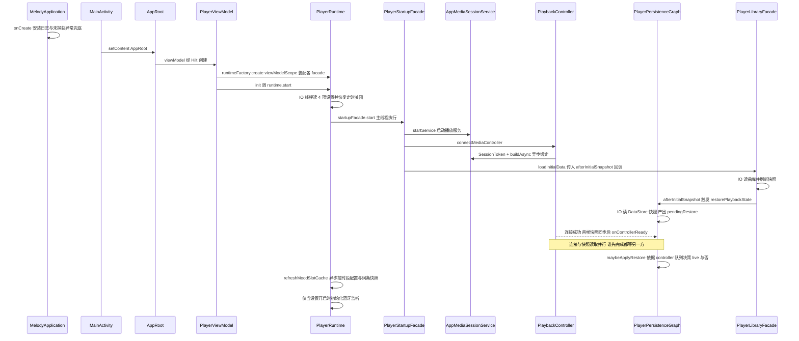
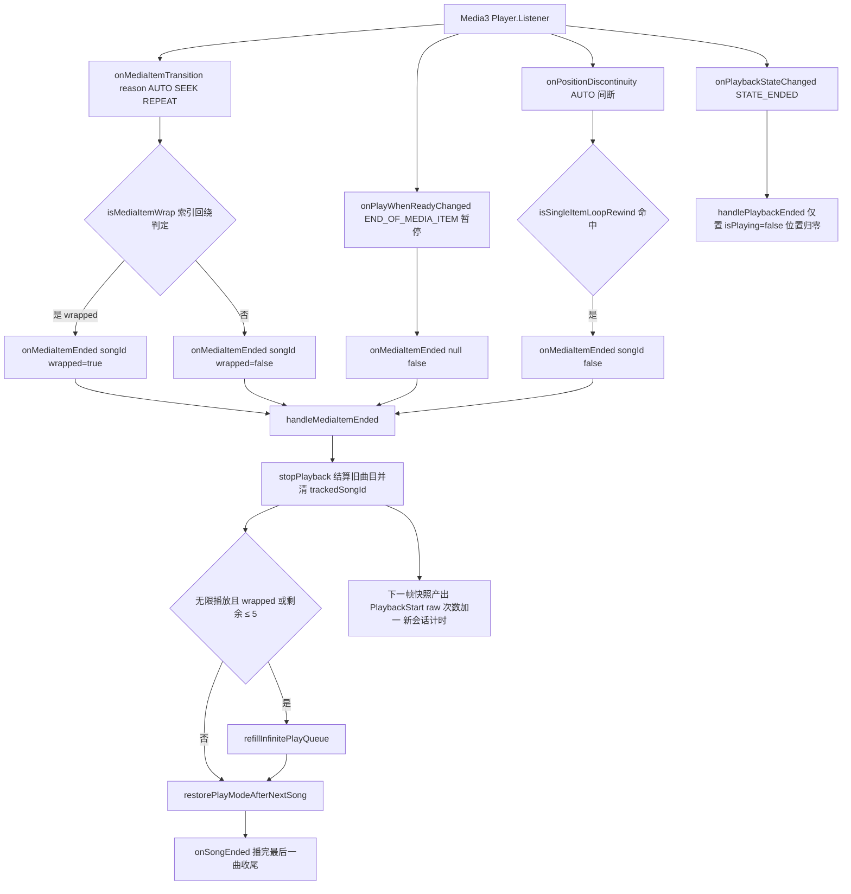

# 工作流：播放会话生命周期

本页把一次完整播放会话从头到尾串起来：**应用启动 → facade 初始化与 MediaController 连接 → 播放状态快照恢复决策 → 设置队列与开播 → 切歌/结算/自动补队列 → 时长统计与秒切 → 进程被杀后的恢复闭环**。单点细节不在此展开：队列与窗口同步见 `/openwiki/player/queue-architecture.md`，随机与无限补队列见 `/openwiki/player/random-and-infinite.md`，facade 编排目录见 `/openwiki/player/runtime-facades.md`，状态机不变量与恢复决策规则见 `/openwiki/player/state-machine.md`，服务端/控制器集成面见 `/openwiki/player/service-and-controller.md`。

## 冷启动到开播：时序总览

*冷启动到开播：UI 链逐层装配后，`startupFacade.start` 依次启动服务、连接 controller、加载曲库（首快照后触发恢复读取），恢复决策等「连接」与「快照读取」两条异步线在 `PlayerPersistenceGraph` 汇合后才做；情境化随心播放的时段/词条快照在启动后异步拉取，不阻塞任何一步。*

## 阶段 0：进程装配与主线程纪律

- **进程入口**：`MelodyApplication`（`@HiltAndroidApp`）在 `onCreate` 安装 `AppLog`（`BuildConfig.DEBUG` 控制级别）、全局未捕获异常兜底（先记脱敏日志再交系统处理器），并调度情绪批扫 `EmotionScanScheduler.schedule`。图片栈（Coil `ImageLoaderFactory`）延迟到首次加载，缩短冷启动路径。
- **UI 装配**：`MainActivity`（`@AndroidEntryPoint`）只做 `setContent { AppRoot() }`；`AppRoot` 在 Activity 作用域经 `viewModel()` 创建 `PlayerViewModel` 等 Hilt ViewModel。
- **运行时装配**：`PlayerViewModel` 是**纯委托门面**——唯一构造参数是 `PlayerRuntimeFactory`，构造体里 `runtimeFactory.create(viewModelScope)` 构建 `PlayerRuntime`（feature 的组合根），`init { runtime.start() }` 点火；所有公开方法都是一行转发。
- **主线程纪律**：`PlayerRuntime.start()` 把启动路径的阻塞源全部移出主帧——4 项 DataStore 设置（全局均匀随机、蓝牙监听、播放通知、每日听歌目标）与定时关闭恢复（2 读 + 可能 1 写）都在 `dispatchers.io` 上完成，然后才在主线程执行 `startupFacade.start()`；最后异步 `refreshMoodSlotCache()` 拉取时段配置与情绪词条快照（`@Volatile` 缓存，配置页保存后经 `refreshMoodSlots()` 主动刷新），并**仅当**持久化的 `bluetoothPlaybackMonitoringEnabled` 为 true 时 `bluetoothGraph.initialize()`。

`PlayerStartupFacade` 把开机步骤固化为**固定顺序**：`startService` → `connectMediaController` → `loadInitialData`（把 `restorePlaybackState` 作为 `afterInitialSnapshot` 回调传入，恢复读取刻意排在曲库首快照之后，因为快照解码要用刚加载的曲库过滤失效歌曲）→ `listenForSongChanges`。该顺序由 `PlayerStartupFacadeTest` 逐条锁定。

## 阶段 1：服务启动与 MediaController 连接

- **startService 不用 FGS**：`PlaybackController.startService` 用 `context.startService(...)` 而非 `startForegroundService(...)`。原因记录在注释里（2026-09-03 ANR 回归修复）：`startForegroundService` 强制 5 秒内 `startForeground()`，而 `MediaSessionService` 只在有媒体项/激活播放时才发通知——冷启动空会话永不触发，系统判定 FGS 超时。该方法唯一调用链是 UI 冷启动（Activity 前台），`startService` 合法；即使将来有后台拉起，`connect()` 的 SessionToken 机制也能绑定服务。
- **connect**：`SessionToken` + `MediaController.Builder.buildAsync()` 异步绑定，成功后先 `addListener`、`drainPendingActions`（重放连接前积压的 UI 命令，上限 64 条 FIFO），再回调 `onConnected(snapshot)`。`PlayerMediaControllerGraph.connect` 用首帧快照同步 `controllerStateAdapter` 之后才触发 `onConnected` → `persistenceGraph.onControllerReady()`——**恢复决策由此才有可信的 controller 状态**。
- **连接失败的兜底**：连接失败会 `abortPendingActions` 并回调 `onControllerUnavailable`；`PlayerRuntime.handleControllerUnavailable` 写日志、把原因与丢弃数写进 `errorMessage`，但**仍然调用 `persistenceGraph.onControllerReady()`** 放行恢复决策——否则 `pendingRestore` 永久悬挂、UI 队列永不恢复。

## 阶段 2：快照恢复决策（live session 判据）

恢复要回答的问题是：**服务端是否还有正在播放的 live session？** 回答错就会拿 DataStore 快照覆盖正在播放的会话（进度回退）或把可恢复的会话丢掉。实现收敛在 `PlayerPersistenceGraph`：

1. **两条异步线并行**：`restorePlaybackState()` 在 `dispatchers.io` 读 DataStore 并解码（`PlaybackRestoreCoordinator.restore(state().songs)` 产出 `PlaybackRestoreResult`），回到主线程写 `pendingRestore`；controller 连接成功（或失败兜底）置 `controllerReady`。**谁先完成都等另一方**，`maybeApplyRestore()` 在两个标志都就绪前不做任何决策。
2. **live session 唯一判据**：`liveSessionActive()` = `controllerQueueInfo()?.mediaItemCount ?: 0 > 0`。刻意不用「播放位置 > 0」猜——restore 的 IO 读取可能先于 MediaController 连接完成（`buildAsync` 异步跨进程绑定），此时 `currentPlaybackPositionMs` 退化成 UI 状态值（重建后恒 0），会把 live session 误判成无会话。
3. **双分支应用**（`PlayerPersistenceFacade.applyRestoreResult`）：

| controller 队列 | 分支 | UI 侧 | controller 侧 |
| --- | --- | --- | --- |
| 空（冷启动/服务端空会话） | **完整恢复** `restoreController=true` | 恢复 `playQueue`、无限播放状态、`currentSong`、恢复点位置、`isPlaying=false` | `prepareControllerQueue(queue, currentIndex, positionMs)` 灌队列与恢复点位置，**不自动播放** |
| 非空（live session） | **仅 UI 队列影子** `restoreController=false` | 照常恢复队列影子 + `currentSong`/`sameNameSongs`；位置与播放状态留给连接后的 `syncControllerPlaybackState` | **绝不触碰**——不重建队列、不写位置 |

两条不变量（详见 `/openwiki/player/state-machine.md`「反直觉硬约束三」）：

- **UI 队列影子在任何分支都必须恢复**：controller 的快照同步只调整 `currentIndex`、不会填充 `songs`，跳过 UI 侧会让播放队列重建后恒为空，无限播放状态一并丢失。
- **重建队列的守卫有两道**：决策层只在无 live session 时调 `prepareControllerQueue`；`PlaybackController.prepareQueue` 内部还有第二道守卫（`mediaItemCount > 0` 直接跳过）。它是 `playQueue/prepareQueue/syncQueue` 三个队列命令中唯一允许带 live-session 守卫的地方，`playQueue` 明确禁止加（否则用户点歌请求会被静默吞掉）。

完整恢复分支的可播会话由 `PlaybackRestoreCoordinator` 升级产出：队列当前歌曲可播放时构造 `RestoredPlayableSession(song, positionMs, sameNameSongs)`，同名版本按采样率降序，与全量恢复路径共用同一数据。

## 阶段 3：设置队列与开播

以用户点歌/「随心播放」/歌单整播为代表的队列替换链：

1. UI → `PlayerRuntime.setPlayQueue` → `PlayerQueueFacade.setPlayQueue`：`PlaybackQueueActionPlanner.replaceQueue` 生成新 `PlayQueue`（经 `QueueManager.createQueue` 构建 `playOrderIds`）+ `PlayQueueIndex(startIndex)` 动作 + `exitInfinitePlay` 标志。
2. `applyPlan` 把计划写进 `PlayerUiState`（含退出无限播放、`nextPlayState` 等），随后执行播放动作 `playFromQueue(queue, index)`。
3. `playFromQueue` 先过 `PlayerErrorFacade` 的**可播守卫**：目标歌无 uri 不开播，写「「标题」的本地文件不存在，无法播放」；可播才进 `playbackSessionGraph.startQueuePlayback`。
4. `PlaybackSessionCoordinator.startQueuePlayback` 经 `controllerQueuePlanner::plan` 规划窗口化 controller 队列（业务队列 → 播放窗口，见 queue-architecture 页），`PlaybackController.playQueue` 以 `REPEAT_MODE_ALL` + `setMediaItems` + `prepare()` + `play()` 开播；同时 `durationTracker.startPlayback(song.id, duration)` 启动计时并返回 `trackedSongId`/`sameNameSong`。
5. 单曲播放（如库外单点）走 `playSingle`：`REPEAT_MODE_OFF` + `setMediaItem`，同样启动跟踪。

controller 的真实状态此后经高频 `onEvents` 快照回流：`PlayerControllerStateFacade.syncControllerPlaybackState` 把快照映射回 `PlayerUiState`（mediaId → Song 解析、队列索引对齐、时长校正），并在「快照在播、解析出歌曲且 `trackedSongId != controllerSong.id`」时产出 `PlaybackStart`（每首歌只启动一次跟踪）。`isPlaying` 跃变必须补发 ticker 通知、进度渲染只走 `positionMs` 窄流等约束见 state-machine 页硬约束一/二。

## 阶段 4：切歌与结算路径

### Media3 事件翻译

*切歌与结算：四类 Media3 信号全部汇入 `handleMediaItemEnded`（或终态收尾），该入口按固定顺序完成「结算旧曲目 → 无限补队列 → 恢复 add-next 模式 → 定时关闭钩子」，随后下一帧快照以新会话重新开始跟踪。*

翻译规则要点：

- **回绕按索引判定而非 reason**：`isMediaItemWrap`（新索引 0、旧索引是窗口最后一首）——Media3 对 `REPEAT_MODE_ALL` 尾部回绕上报 `SEEK`（手动下一首）或 `AUTO`（自然结束），`REPEAT` 只表示单曲重复。`wrapped` 标志是无限补队列的触发器（回绕后剩余数量重新变大，仅靠剩余阈值会漏补）。
- **手动切歌也走同一入口**：耳机/锁屏/通知栏的 SEEK 切歌若不进 `onMediaItemEnded`，无限播放不会补队列；`PLAYLIST_CHANGED` 是应用自身重建窗口产生的，不触发。
- **`STATE_ENDED`（队列尽头自然停下）只做 UI 收尾**：`handlePlaybackEnded` 置 `isPlaying=false`、位置 0，不参与结算。

### `handleMediaItemEnded` 的固定副作用序列

`PlayerMediaEventFacade.handleMediaItemEnded(startedSongId, wrapped)` 依次：

1. **停止旧曲目跟踪**：`stopPlaybackTracking()`（触发 `PlayDurationTracker.stopPlayback` → 结算，见下节）+ `clearTrackedSong()`。清 `trackedSongId` 是「每首歌只启动一次跟踪」的另一半：下一首歌的快照才能再次产出 `PlaybackStart`。
2. **无限补队列**：处于无限播放且（`wrapped` 或 `remainingMediaItems() <= DEFAULT_REFILL_THRESHOLD = 5`）时 `refillInfinitePlayQueue(startedSongId, advanceAfterWrap = wrapped)`。`advanceAfterWrap` 把当前项跳到第一首新补充的歌并从 0 开始播，避免回绕后重播旧窗口；普通扩展则 `syncPlayerQueue` 同步窗口。细节见 `/openwiki/player/random-and-infinite.md`。
3. **恢复 add-next 播放模式**：`QueueManager.restorePlayModeAfterNextSong` 仅当「当前歌 == `nextPlaySongId`」时把队列模式恢复为 `playModeBeforeNext`、用 `startedSongId` 校正业务队列当前项、清空临时标志，并 `syncPlayerQueue` 重排窗口。
4. **定时关闭钩子**：`onSleepTimerSongEnded()` 处理「播完最后一曲」的到点暂停（见阶段 6）。

### 非无限队列的窗口回灌

快照同步本身兼任回灌触发点：`PlayerRuntime` 给 `onControllerPlaybackSynced` 接的钩子在「业务队列非空、未处于无限播放、controller 剩余媒体项 ≤ 5」时调用 `syncPlayerQueue` 把业务队列重新灌给 controller，保证顺序播放模式下接近窗口尾时窗口自动续上。

## 阶段 5：时长统计与秒切闭环

`PlayDurationTracker`（`:player`，经 `PlaybackDurationMonitorFactory` 注入）是结算的执行者，全部 Room 写操作走独立 `SupervisorJob + Dispatchers.IO` scope（普通 Job 下一次 Room 异常会杀死整个 scope，「播放不计次」且无日志——M-5 整改）：

- **计时粒度**：1s tick（`UPDATE_INTERVAL_MS = 1000`）只在 `isPlaying && !isSeeking` 时累计；seek 期间不计入、结束后重置时间戳。
- **新会话**：`startPlayback(songId, durationMs, initialPlayedMs)` 先结算上一首，再对新歌 `incrementRawPlayCount(+1)`（原始播放次数）；`initialPlayedMs` 把杀进程恢复点之前已播的时长计入基数，避免「被杀前已播 + 恢复后听完」却因计时器归零不满足完播阈值。
- **有效播放判定**（`stopPlayback` → `settlePlayback`，IO 协程）：累计达歌曲时长 **90%**（`COMPLETION_RATE_THRESHOLD = 0.9`）**或超 5 分钟**（长歌兜底）计一次有效播放 `increment(songId)`。
- **秒切联动**：
  - 秒切列表中的歌**达标（有效播放）后自动移出列表**并重置短播计数——用户听过整首就不再被视为「想跳过」；
  - **< 5 秒**（`SHORT_PLAY_THRESHOLD_MS = 5000`）的短播累计 2 次（`SHORT_PLAY_COUNT_THRESHOLD = 2`）自动加入秒切列表——反复点开即跳过的歌被系统归入秒切。
- **会话记录**：有正向时长的播放都 `recordPlaybackSession`（startedAt 由时长反推），供今日/本周/本月统计聚合。

**单项队列循环回绕是秒切场景的结算差异所在**：`REPEAT_MODE_ALL` 下队列只剩一首歌（秒切/歌单/专辑/歌手只剩一首）时，自然播完回绕到同一项，窗口索引 0→0 不变，Media3 **不触发 `onMediaItemTransition`**——结算逻辑（有效播放 +1、达标移出秒切列表）永远不会执行，且计时器跨循环累计。`PlaybackController` 用 `isSingleItemLoopRewind` 从 `onPositionDiscontinuity` 兜底识别：`AUTO` 间断 + 单项窗口 + 0→0 + 新位置 ≤ 2s + 旧位置接近结尾（时长已知按 `duration − 5s` 精判，未知回退 30s 保守阈值，缓冲重连不产生回 0 的 AUTO 间断，手动拖回开头是 SEEK 原因不误判）。识别后主动按一次播完结算，之后以新会话继续循环计时。

## 阶段 6：会话内旁路

### 定时关闭（SleepTimerCoordinator）

- **设置**：`start(minutes, playLastSong)` 把结束时间戳与「播完最后一曲」标志持久化（DataStore），写离散 UI 状态并启动每秒 ticker。
- **窄流纪律（M-6）**：倒计时每秒 tick **只写 `sleepTimerRemainingMs` 窄流**（仅定时关闭 Chip 局部订阅），不再写主 UiState——否则倒计时激活期间整壳每秒重组。离散事件（启动/取消/到期）才走 `updateState`。
- **播完最后一曲模式**：到点时若 `playLastSong` 且正在播放，`fire()` 只置 `sleepTimerPausePending` 并**显式复位窄流**，等当前歌曲自然结束——该结束信号正是阶段 4 `handleMediaItemEnded` 末尾的 `onSleepTimerSongEnded()`：pending 时暂停并取消。
- **取消/到点必须显式复位窄流**：tick 值不在 uiState，`NarrowFlowSync` 的值对比感知不到归零，cancel 与 fire 都要调 `resetSleepTimerNarrowFlow`，否则 Chip 上残留倒计时（2026-09-03 回归修复）。
- **跨重启恢复**：`restore()` 在启动时读持久化的 `endAtMs`——已过期直接清零，未过期则恢复激活状态与 ticker。这就是 `PlayerRuntime.start()` 在 IO 线程做的「定时器恢复」。

### 蓝牙断连暂停

`BluetoothPlaybackCoordinator`（`:player`，实现 `:domain` 的 `BluetoothPlaybackMonitor`）收敛两条自动暂停规则：

1. **蓝牙断连暂停**：`wasPlayingThroughBluetooth && !state.isA2dpConnected && isPlaying()` 才调 `pausePlayback()`——「之前经蓝牙在播、A2DP 刚断、还在播」三个条件同时满足，避免误伤从未经蓝牙的会话；
2. **音频中断暂停**：`onAudioInterrupted` 且在播时暂停。

`isPlaying`/`pausePlayback` 都是构造注入的 lambda（`PlayerRuntime` 接到 `_uiState.value.isPlaying` 与 `playbackBridgeFacade.pausePlayback()`），协调器不依赖运行时。**初始化是用户设置门控的**：启动时仅当持久化开关为 true 才 `bluetoothGraph.initialize()`；用户在设置页开启时走 `initializeBluetoothPlayback()`（写设置 + 更新 uiState + 初始化图）。架构门禁要求 `PlayerStartupFacade` 不得提及蓝牙、启动路径不得请求蓝牙权限。

### 会话收尾（ViewModel 销毁）

`PlayerRuntime.onCleared` → `PlayerLifecycleFacade.onCleared` 按固定顺序收尾：同步一次 controller 快照 → 保存播放状态 → 释放 playback controller → 释放蓝牙监听 → 释放时长跟踪器（内部结算在播曲目）→ 停止进度 ticker。服务启动侧则包在 try/log 里，失败不崩溃。

## 阶段 7：进程被杀后的恢复闭环

崩溃/杀进程前的落盘由**三条独立路径**承担（进度渲染的 200ms 节拍本身不触碰磁盘）：

1. **周期兜底**：`PlayerPlaybackProgressTicker`（200ms，只写 `positionMs` 窄流）每次直写同时喂 `persistenceGraph.onPlaybackPosition` → `PlayerPlaybackStateAutosaver` 按 `SystemClock.elapsedRealtime` 节流到**每 5 秒**（`DEFAULT_INTERVAL_MS`，崩溃恢复粒度）执行 `syncPlaybackState()`（拉一次最新 controller 快照校正状态）+ `savePlaybackStateAsync`。
2. **离散事件保存**：暂停（真实暂停才落盘，buffering 抖动不算）、队列操作、切歌等显式触发 `savePlaybackStateAsync`——先在调用线程捕获位置，再把 DataStore 写移到 IO。
3. **服务端退出快照**：`AppMediaSessionService` 在 `onDestroy`/`onTaskRemoved` 调 `saveCurrentPlaybackSnapshot`：songId 与位置在调用线程**同步读取**（ExoPlayer 只能在其应用线程访问），DataStore 写入挂到进程级 `ApplicationScope` 协程（挂起版 `persistCurrentPlaybackSnapshot`）——只覆写 `CURRENT_SONG_ID` 与 `PLAY_POSITION_MS` 并**保留队列 JSON**，服务实例销毁后落盘协程仍能跑完。

`PlaybackStateStore` 还有一条**空会话保护**：队列空、无无限播放、无 currentSongId 的保存跳过写入但**保留已有快照**——UI 重建窗口存在瞬时「全空」状态，若按旧逻辑 clear 会把 5 秒前落盘的有效快照删掉，导致重启后播放队列恒为空。显式清空（用户清队列）走 `clearPlaybackState()`。

重启后的闭环回到阶段 2 的双分支：

- **进程死了、服务也死了**：controller 队列为空 → 完整恢复分支，队列与恢复点位置灌回 controller 但不自动播放（等用户按播放），`isPlaying=false`。
- **服务还活着**（息屏/后台回来、ViewModel 重建）：非空 live session → 只回填 UI 队列影子，真实位置与播放状态由首帧快照同步带回，ticker 由 `syncControllerPlaybackState` 的 isPlaying 跃变通知拉起。
- **统计不断档**：恢复后首个 `PlaybackStart` 把快照位置作为 `initialPlayedMs` 传入 `PlayDurationTracker`，被杀前的收听时长计入结算基数。
- **定时器不断档**：未过期的定时关闭由 `restore()` 恢复倒计时。

## 测试锚点

改本页覆盖的任一环节前，先跑对应窄验证（命令见 `/openwiki/testing/test-map.md`）：

- **`PlayerStartupFacadeTest`**——锁定开机步骤的精确顺序，含「恢复读取在曲库首快照之后触发」。
- **`PlayerPersistenceFacadeTest`**——锁定「异步保存先捕获位置再移 IO」、完整恢复应用队列与可播会话、**live session 下仅恢复 UI 队列而 controller 完全不被触动**（位置与 isPlaying 不被覆盖）、无限播放状态恢复、队列索引陈旧时仍按 currentSong 落盘。
- **`PlayerMediaEventFacadeTest`**——锁定 `handleMediaItemEnded` 副作用序列：停止跟踪/清 trackedSongId、尾部与回绕触发补队列（含回绕即使在剩余充足时也补）、非无限模式不补、add-next 模式恢复并同步队列。
- **`PlayerPlaybackStateAutosaverTest`**——锁定保存节流：首次立即、之后按间隔节流、`reset` 放行下一次。
- **`PlayerSleepTimerCoordinatorTest`**——锁定窄流交互回归：cancel 归零必须走显式复位入口、start 写离散状态并持久化 endAt、播完最后一曲只置 pending 不立即取消、`onSongEnded` 才暂停收尾。
- **`MediaItemWrapDetectionTest`**（`:player`）——锁定索引回绕判定的全部边界：尾→0 命中、顺序前进/单步后退/未知前索引/新索引非 0 排除、2 首小窗口倒退视为回绕（补队列 planner 自动去重，误判无害）、空/单项窗口不可能回绕。
- 配套：`SingleItemLoopRewindDetectionTest`（`:player`）锁定单项循环回绕判定的阈值边界与「手动 seek 不得计为播完」防刷用例。

## 相关页面

- `/openwiki/player/state-machine.md` —— 播放状态机、快照映射与恢复决策的规范不变量。
- `/openwiki/player/queue-architecture.md` —— 业务队列与 controller 窗口的双队列模型与逐操作同步流程。
- `/openwiki/player/random-and-infinite.md` —— 随机/无限补队列的 planner 语义与 `advanceAfterWrap`。
- `/openwiki/player/runtime-facades.md` —— `PlayerRuntime` 组合根与 18 个 facade 的职责目录。
- `/openwiki/player/service-and-controller.md` —— 服务端生命周期、pending actions、事件翻译与蓝牙组件。
